# IM 消息进入系统后的联动流程梳理

基于当前代码实现（`ImController` → `ConversationTaskCoordinator` 等），IM 消息进入系统后触发的主要联动包含：
- 会话创建/复用与消息落库（Conversation + Message）。
- 领域事件记录（`domain_events`）与 Outbox 事件持久化（`outbox_events`）。
- 需求识别 → 需求创建 → 高优先级任务创建。
- AI 情绪分析（两处：Coordinator 内部生成回复时一次；Controller 组装响应时一次）。
- 知识库检索与推荐（Controller 侧）。
- 任务关联查询（Controller 侧）。
- 自动回复建议生成与人工复核触发（通过 WebSocket + 事件推送联动前端）。
- 问题解决事件触发异步质检（当问题判定已解决时）。

以下为完整的时序图与服务调用链路图（Mermaid）。

## 时序图（IM 入站处理）

**中文备注**
- 入口：外部 IM 消息通过 `/api/im/incoming-message` 入站。
- 核心编排：`ImController` 调用 `ConversationTaskCoordinator` 完成会话创建/复用、需求识别、任务创建与回复建议生成。
- 数据落库：对话与消息落在 `conversations/messages`，事件溯源写入 `domain_events`，同时写入 `outbox_events` 保障最终一致性。
- AI 联动：情绪分析在 Coordinator 内部（生成回复）与 Controller 组装响应各执行一次。
- 结果返回：包含情绪、需求、知识推荐、工单关联与回复建议。

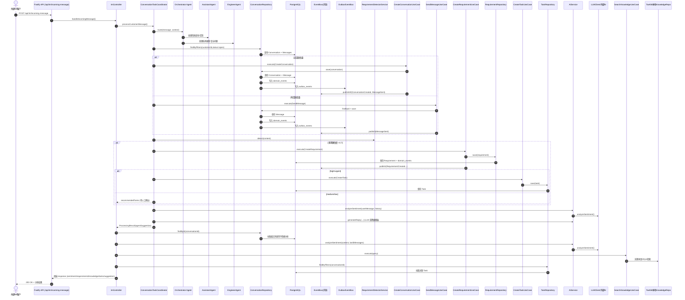

## 服务调用链路图（含事件与异步链路）

**中文备注**
- 展示 IM 入站后的核心服务编排与事件链路（同步 + 异步）。
- 主链路：IM → API → Controller → Coordinator → UseCase → Repository → DB。
- 事件链路：领域事件进入 `domain_events`，同时进入 `outbox_events`，由 `OutboxProcessor` 异步投递。
- 异步链路用于触发质检/告警等非阻塞流程；与会话是否关闭无关，可由“问题解决事件”驱动。

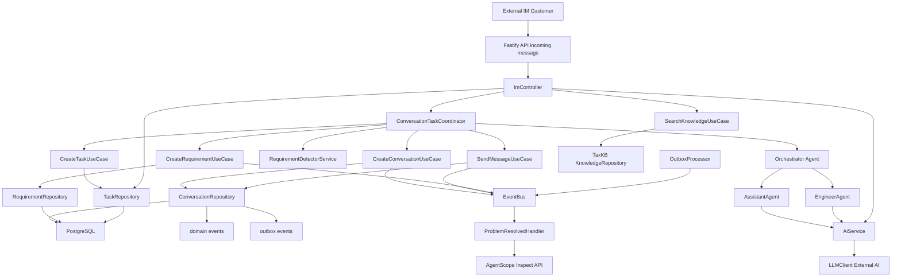

## 关键联动点说明（与代码对应）

1. **消息入站与对话复用/创建**
   - `ImController.handleIncomingMessage` → `ConversationTaskCoordinator.processCustomerMessage`。
   - `CreateConversationUseCase` / `SendMessageUseCase` 会调用 `ConversationRepository.save`，同步写入：
     - `conversations` + `messages`（对话与消息）  
     - `domain_events`（事件溯源）
     - `outbox_events`（Outbox 最终一致性）

2. **需求识别与任务联动**
   - `RequirementDetectorService.detect` → `CreateRequirementUseCase.execute` → `RequirementRepository.save`
   - 高优先级需求触发 `CreateTaskUseCase.execute` → `TaskRepository.save`

3. **AI 联动（情绪 + 回复建议）**
   - `ConversationTaskCoordinator.generateAgentReply` 内部调用 `AiService.analyzeSentiment` 与 LLM 生成回复建议。
   - `ImController` 在返回前再次调用 `AiService.analyzeSentiment` 生成响应里的情绪字段。

4. **知识库与任务关联**
   - `SearchKnowledgeUseCase` 组合 TaxKB + 本地知识库检索。
   - `TaskRepository.findByFilters` 关联当前对话的任务列表。

5. **事件与异步链路**
   - “问题解决事件”触发质检（由大模型判定已解决后产生）。
   - 处理器通过 `AgentScope /api/agents/inspect` 触发质检（异步，不阻塞主流程）。

---

## Agent 支持能力补充（来自 PRD）

**说明**
- 下述能力为 Agent PRD 中“当前实现/已接入工具”的摘要，用于补齐 IM 入站链路的 Agent 支持面。
- 规划能力不纳入当前链路，避免与现状不一致。

**能力对照表（中文）**

| Agent | 已实现能力（当前可用） | 规划能力（待补齐） |
|---|---|---|
| Orchestrator Agent | 规则/启发式路由决策；执行模式选择；人工介入触发；`analyzeConversation` / `getCustomerProfile` / `searchKnowledge` | 意图识别、路由决策、紧急情况检测、会话上下文获取、升级到人工（`classifyIntent` / `routeToAgent` / `detectEmergency` / `getConversationContext` / `escalateToHuman`） |
| AssistantAgent | 情绪/意图分析；知识推荐；回复建议；`analyzeConversation` / `getCustomerProfile` / `searchKnowledge` | 生成回复、提取需求、风险评估、推荐下一步动作（`generateReply` / `extractRequirement` / `assessRisk` / `recommendNextAction`） |
| EngineerAgent | 技术知识检索；工单创建；`searchKnowledge` / `createTask` | 故障诊断、问题分类、日志分析、方案推荐、解决时长评估、技术工单创建、历史工单检索、系统状态查询（`diagnoseFault` / `classifyIssue` / `analyzeLogs` / `recommendSolution` / `estimateResolutionTime` / `createTechnicalTicket` / `searchTickets` / `getSystemStatus`） |
| InspectorAgent | 对话质检评分与改进建议输出（基于文本） | 会话质检、合规检查、违规检测、质检报告生成、团队对比分析（`inspectConversation` / `checkCompliance` / `detectViolations` / `generateQualityReport` / `compareTeamPerformance`） |

1. **Orchestrator Agent（路由编排）**
   - 当前实现位置：`agentscope-service/src/router/orchestrator_agent.py`
   - 作用：基于规则/启发式进行执行模式与路由决策（`simple/parallel/agent_supervised/human_first`）。
   - 已接入工具：`analyzeConversation` / `getCustomerProfile` / `searchKnowledge`。
   - 与本链路关系：负责“意图/场景 → 路由到 Assistant/Engineer”的编排入口。
   - 规划能力备注（中文说明）：意图识别、路由决策、紧急情况检测、会话上下文获取、升级到人工（`classifyIntent` / `routeToAgent` / `detectEmergency` / `getConversationContext` / `escalateToHuman`）。

2. **AssistantAgent（对话辅助）**
   - 当前实现位置：`agentscope-service/src/agents/assistant_agent.py`
   - 已接入工具：`analyzeConversation` / `getCustomerProfile` / `searchKnowledge`。
   - 与本链路关系：提供情绪/意图分析、知识推荐与回复建议（人机协同）。
   - 规划能力备注（中文说明）：生成回复、提取需求、风险评估、推荐下一步动作（`generateReply` / `extractRequirement` / `assessRisk` / `recommendNextAction`）。

3. **EngineerAgent（故障诊断）**
   - 当前实现位置：`agentscope-service/src/agents/engineer_agent.py`
   - 已接入工具：`searchKnowledge` / `createTask`。
   - 与本链路关系：技术故障场景生成诊断建议，并辅助创建工单。
   - 规划能力备注（中文说明）：故障诊断、问题分类、日志分析、方案推荐、解决时长评估、技术工单创建、历史工单检索、系统状态查询（`diagnoseFault` / `classifyIssue` / `analyzeLogs` / `recommendSolution` / `estimateResolutionTime` / `createTechnicalTicket` / `searchTickets` / `getSystemStatus`）。

4. **InspectorAgent（质检评分）**
   - 当前实现位置：`agentscope-service/src/agents/inspector_agent.py`
   - 已实现能力：基于对话文本输出质检评分与改进建议（当前无持久化报表链路）。
   - 与本链路关系：由“问题解决事件”异步触发质检，不依赖会话关闭。
   - 规划能力备注（中文说明）：会话质检、合规检查、违规检测、质检报告生成、团队对比分析（`inspectConversation` / `checkCompliance` / `detectViolations` / `generateQualityReport` / `compareTeamPerformance`）。

---

如需把这两张图拆分为“业务时序图 / 技术时序图”，或补充 WebSocket/IM 回执链路，我可以继续细化。

---

# 业务时序图（面向产品/流程，IM 方式）

**说明**
- 以 IM 对话为载体，不存在“关闭会话”的业务逻辑。
- 采用人机协同：Agent 辅助售后工程师服务客户，不涉及传统坐席/转接逻辑。
- 以“问题发现 → 工单驱动 → 工单结束视为问题解决”的方式闭环。
- 一个 IM 对话内可并行处理多个问题（多个工单），并支持各自状态流转。

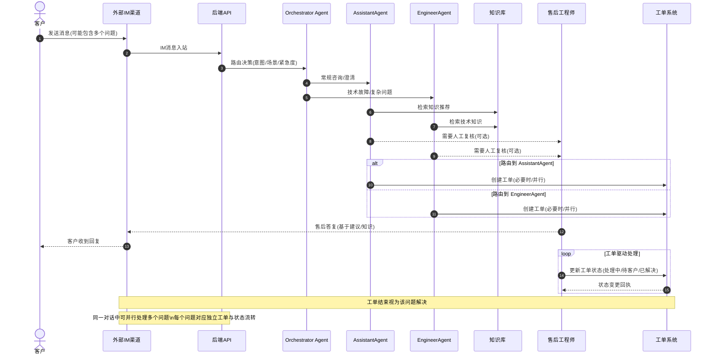

# 技术时序图（系统实现细节）

**说明**
- 关注真实代码路径：Controller → Coordinator → UseCase → Repository。
- 体现事件溯源与 Outbox 的“双写”机制，便于排查一致性问题。
- 展示 AI/知识库/任务等外部/内部依赖的调用顺序。

## 技术时序图 A：消息入站核心链路

**中文备注**
- 该链路展示“入站消息 → 会话创建/复用 → Orchestrator 路由 → 专业 Agent 处理 → 响应返回”。
- `ConversationRepository.save` 同步写入 `domain_events` 与 `outbox_events`，确保事件可追溯与最终一致性。
- AI 情绪分析与回复建议由 AssistantAgent / EngineerAgent 生成，Controller 侧仅负责补充响应字段。

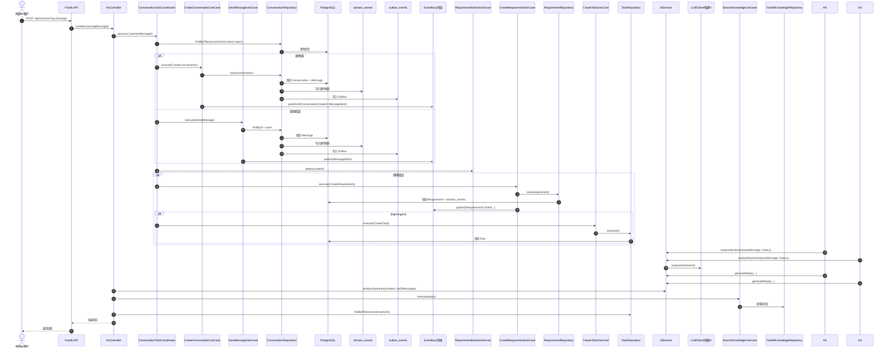

**说明**
- 覆盖“消息入站到响应”的主链路，重点在：对话创建/复用、消息持久化、事件发布、AI/知识库/任务联动。
- 适合定位 IM 入站问题（如消息未落库、任务未创建、知识未推荐等）。

## 技术时序图 B：IM 对话内“问题生命周期 + 质检”链路（异步）

**中文备注**
- 不存在“关闭会话”，所有问题在同一 IM 对话内流转。
- 大模型判断“问题提出/已解决”，驱动问题状态管理与质检触发。
- 质检为异步，不阻塞问题处理或工单流转。

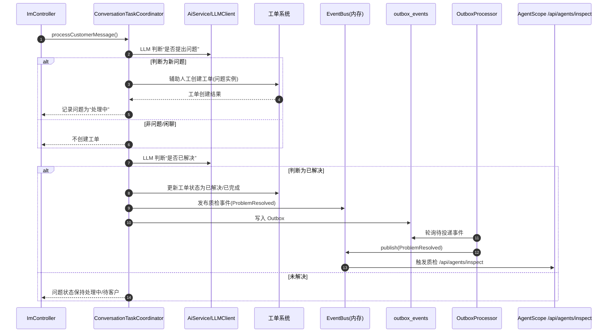

**说明**
- IM 对话内“问题状态”与“工单状态”保持一致，用于并行问题管理。
- LLM 负责判定“新问题/已解决”，售后工程师可辅助确认与修正。
- 质检在问题解决后触发，避免影响 IM 对话的实时响应。

---

# 问题状态机（IM 对话内）

**状态说明**
- `new`: 大模型识别到新问题，待确认/待创建工单
- `in_progress`: 已创建工单，处理中
- `waiting_customer`: 等待客户补充信息
- `resolved`: 大模型判定已解决，待质检
- `reopened`: 客户反馈未解决或新问题复开

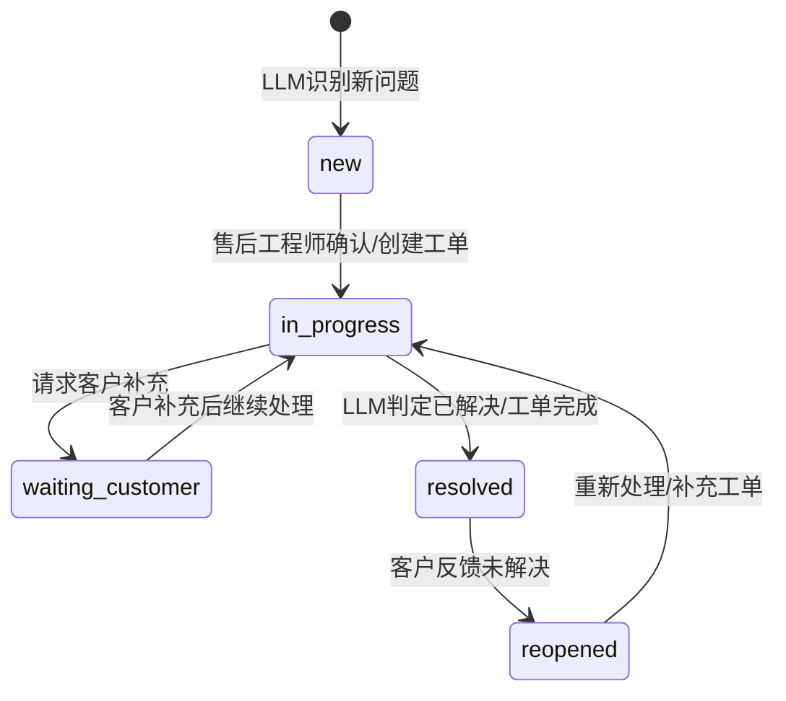

**中文备注**
- 状态与工单保持一致，便于在同一 IM 对话中并行管理多个问题。
- “已解决”并不关闭会话，仅用于标记问题生命周期结束。

---

# 问题并行管理示意图（同一 IM 对话）

**说明**
- 同一对话内可同时存在多个问题实例，每个问题独立状态流转。
- IM 对话是“承载容器”，问题与工单是“并行单元”。

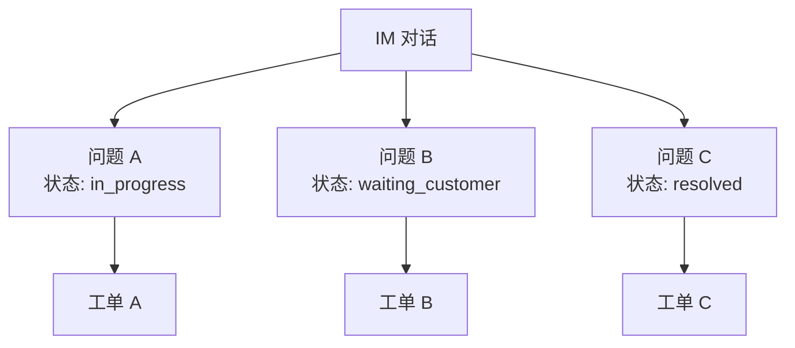

**中文备注**
- 每个问题与工单一一对应，状态同步；问题解决不影响对话持续。
- LLM 负责判定“新问题/已解决”，售后工程师可修正与复开。

# IM 回执 / WebSocket 联动（已实现）

**说明**
- 已支持 IM 回执状态更新与 WebSocket 实时通知。
- 复核请求通过 Outbox + EventBridge 推送到 AgentScope，再由 WebSocket 下发到前端。

**中文备注**
- 该链路已作为“人机协同关键路径”落地。
- 复核审核结果回写后可触发工单创建与状态刷新。

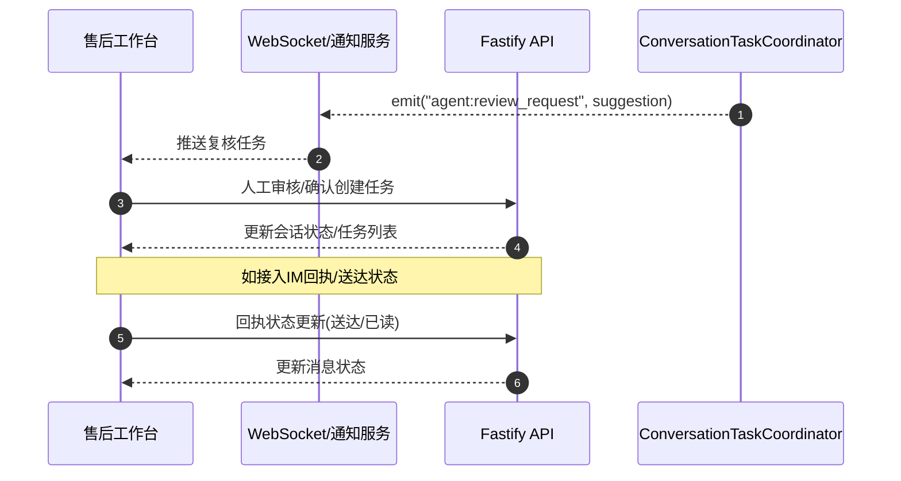

# 外部依赖与配置开关标注

1. **LLM/AI 能力**
   - 入口：`AiService` -> `LLMClient`
   - 开关：`LLMClient.isEnabled()`；外部 AI 服务通过 `config.ai.serviceUrl`。
   - 影响路径：情绪分析、回复建议生成、对话总结。

2. **知识库检索**
   - 入口：`SearchKnowledgeUseCase`
   - 开关：`TaxKBAdapter.isEnabled()`（默认 true）
   - 影响路径：IM 入站后的知识推荐。

3. **AgentScope 质检**
   - 入口：问题解决事件处理器（ProblemResolvedEventHandler）
   - 配置：`config.agentscope.serviceUrl` + `config.agentscope.timeout`
   - 触发：问题判定已解决后异步调用 `/api/agents/inspect`

4. **Outbox 异步投递**
   - 入口：`ConversationRepository.save` -> `OutboxEventBus.publishInTransaction`
   - 处理器：`OutboxProcessor`（定时轮询 outbox_events）
   - 触发链路：EventBus -> 订阅者（用于“问题解决事件”触发质检）

---

# 需求识别子链路（技术细分）

**说明**
- 聚焦“文本 → 需求 → 任务”的联动，适合排查需求识别与自动建单问题。
- 低置信度或非紧急需求只会推荐，不会自动创建任务。

**中文备注**
- 需求识别为“并行问题管理”的入口，建议在此处打点统计识别准确率与误报率。
- 高优先级任务自动创建；中低优先级建议由售后工程师确认。

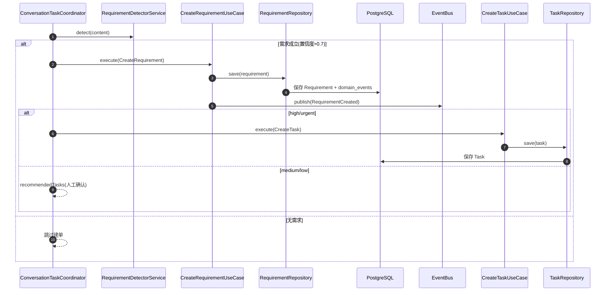

# 知识库检索子链路（技术细分）

**说明**
- 聚焦“关键词/意图 → 知识检索 → 推荐列表”。
- TaxKB 可关闭；本地知识库会作为兜底。

**中文备注**
- 若未启用 TaxKB，返回结果来自本地知识库。
- 推荐列表会做相关性筛选与排序，避免低相关内容干扰回复。

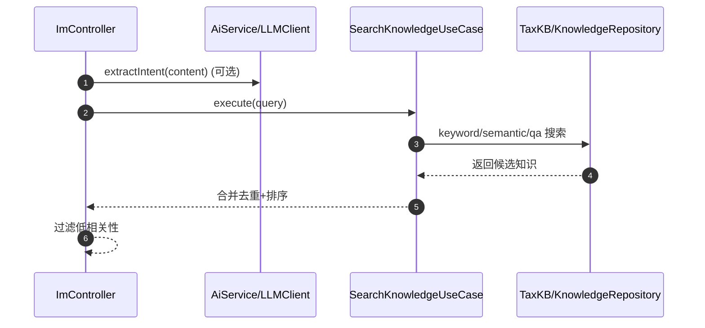

# 人工复核子链路（技术细分，已实现）

**说明**
- 已通过 ReviewRequest + Outbox + WebSocket 完成实时推送。
- 复核提交后可自动创建任务并回写状态。

**中文备注**
- 该链路为“人机协同关键点”，已在 WebSocket/事件层统一治理与监控。
- 复核动作会回写任务状态与建议处理结果。

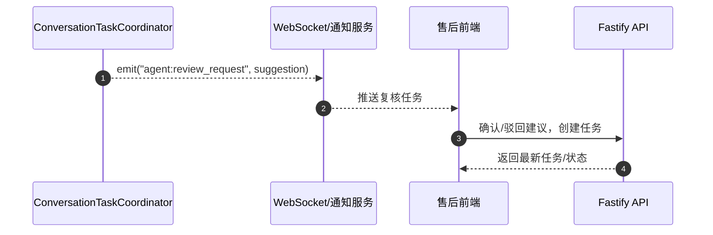
