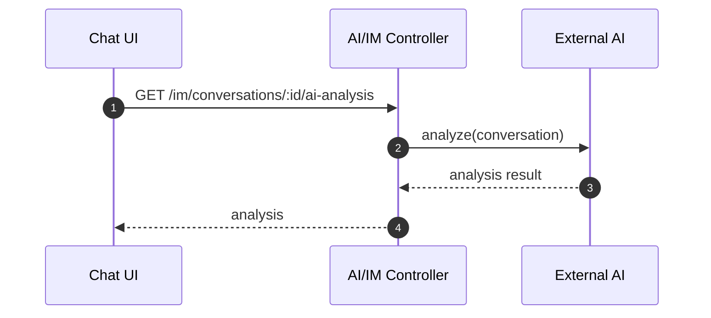
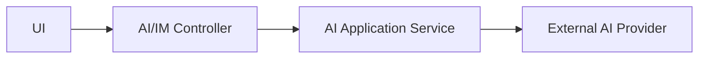

# AI 分析域（AI Analysis）设计

## 领域边界
- 负责情绪分析、意图识别、摘要与建议生成等 AI 能力的封装与调用。
- 主要作为通用能力域，为对话、质检、需求等提供能力，不承担业务持久化。

## 当前实现现状
- 后端通过 `AiController` 暴露通用 AI 调用接口：
  - `POST /ai/analyze`
  - `POST /ai/solutions`
- IM 路由提供对话级 AI 结果：
  - `GET /im/conversations/:id/ai-analysis`
  - `GET /im/conversations/:id/sentiment`
- 领域模型/事件层未显式建模（偏应用服务/集成层）。
- 前端直接调用 API，无独立 AI 领域模型。

## 建议的领域模型
- 服务: `SentimentAnalysisService`, `IntentRecognitionService`, `SuggestionService`
- 事件: `AIAnalysisCompleted`（可选）
- 结果模型: `AnalysisResult`（值对象/DTO）

## 主要时序图

## 主要架构图

## 完整性检查与缺口
- AI 领域缺乏稳定的结果模型与统一的能力接口，存在控制器直连外部服务的风险。
- 前端无法区分 AI 结果的版本/置信度等标准字段，建议统一 DTO。 
