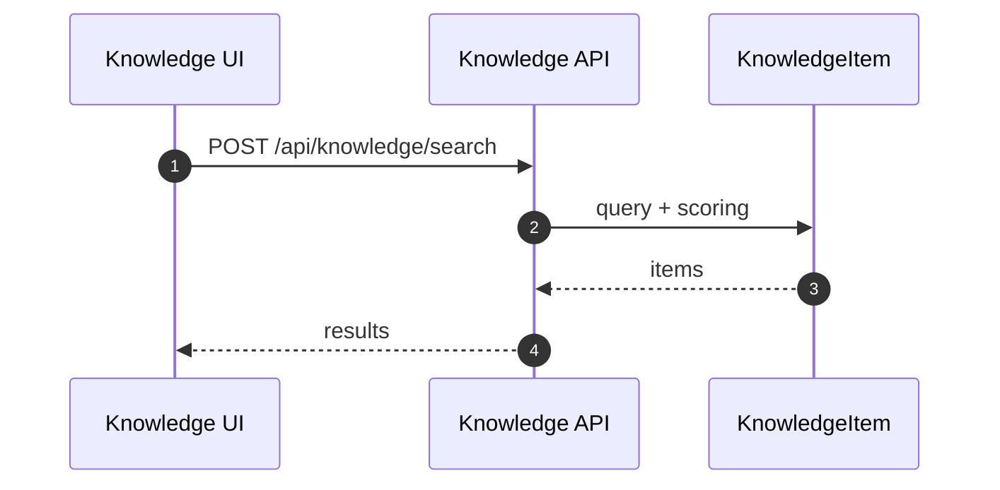
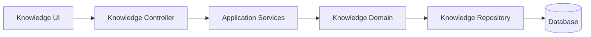

# Knowledge（Backend）

## 领域边界
- 负责知识条目生命周期（创建/更新/删除）、分类标签、检索与推荐。
- 不负责对话消息与需求任务流转（通过检索/推荐提供支持）。

## 后端管理范围
- 知识条目持久化、索引、检索、同步与导入。
- 知识推荐算法与外部知识库集成。

## 后端设计概览
- 聚合根: `KnowledgeItem`
- 值对象: `KnowledgeCategory`
- 领域服务: `KnowledgeRecommender`
- 领域事件: `KnowledgeItemCreated`, `KnowledgeItemUpdated`, `KnowledgeItemDeleted`
- 仓储接口: `IKnowledgeRepository`

## 核心字段
- KnowledgeItem: `id`, `title`, `content`, `category`, `tags`, `source`, `status`, `createdAt`, `updatedAt`
- 约束:
  - `category` 与标签需保持一致性
  - `status` 建议枚举化（draft/published/archived）

## 后端接口设计
- `POST /api/knowledge/search` 搜索
- `POST /api/knowledge/upload` 上传/导入
- `GET /api/knowledge/:id/progress` 导入进度
- `POST /api/knowledge/:id/sync` 同步
- `POST /api/knowledge/:id/retry` 重试
- `POST /api/knowledge` 创建
- `GET /api/knowledge/:id` 详情
- `GET /api/knowledge` 列表
- `PATCH /api/knowledge/:id` 更新
- `DELETE /api/knowledge/:id` 删除

## 主要时序图

## 主要架构图

## 完整性检查与缺口
- 前后端接口契约一致性较好，主要差异在上传/同步的状态展示策略（前端偏 UI 轮询）。
