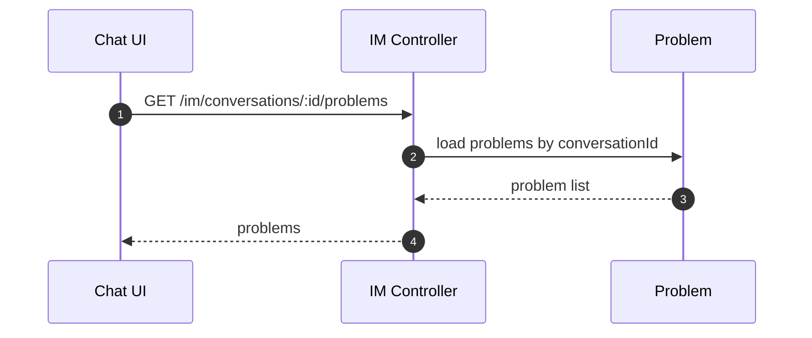
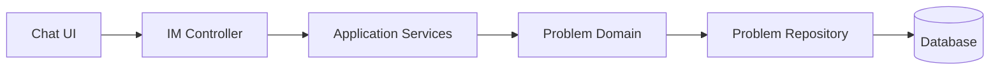

# Problem（Backend）

## 领域边界
- 负责“问题”实体的生命周期管理（新建、流转、解决、重开）。
- 由对话/AI 识别触发创建，与需求/任务协作但不替代其职责。

## 后端管理范围
- 问题识别结果落库与状态流转。
- 与质检触发的事件联动。

## 后端设计概览
- 聚合根: `Problem`
- 领域事件: `ProblemCreated`, `ProblemStatusChanged`, `ProblemResolved`, `ProblemReopened`
- 仓储接口: `IProblemRepository`

## 核心字段
- Problem: `id`, `customerId`, `conversationId`, `title`, `description`, `status`, `intent`, `confidence`, `metadata`, `createdAt`, `updatedAt`, `resolvedAt`
- 约束:
  - `status` 仅允许: `new|in_progress|waiting_customer|resolved|reopened`
  - `intent/confidence` 由 AI 识别结果产出

## 后端接口设计
- 标准 API:
  - `POST /api/problems` 创建问题
  - `GET /api/problems` 查询问题列表
  - `GET /api/problems/:id` 获取问题详情
  - `PATCH /api/problems/:id/status` 更新状态
- IM 路由:
  - `GET /im/conversations/:id/problems` 获取会话问题列表

## 主要时序图

## 主要架构图

## 完整性检查与缺口
- 已补齐前端 `Problem` 模型与仓储，并提供标准问题管理 API。
