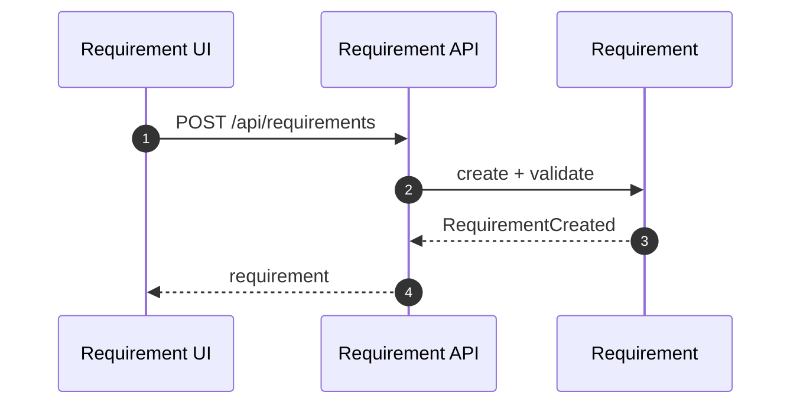
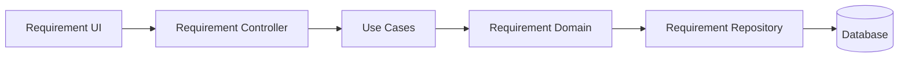

# Requirement（Backend）

## 领域边界
- 负责需求的识别、优先级、状态流转、与对话/客户关联。
- 不负责任务执行、对话消息存储（通过事件/应用服务协作）。

## 后端管理范围
- 需求聚合与状态机。
- AI 识别后需求落库与任务触发规则。

## 后端设计概览
- 聚合根: `Requirement`
- 值对象: `Priority`, `RequirementSource`
- 领域事件: `RequirementCreated`, `RequirementStatusChanged`, `RequirementPriorityChanged`
- 领域服务: `RequirementAutoTaskService`（若存在自动任务策略）
- 仓储接口: `IRequirementRepository`
- 规格模式: `RequirementSpecifications`（用于复杂查询）

## 核心字段
- Requirement: `id`, `customerId`, `conversationId`, `title`, `description`, `category`, `priority`, `status`, `source`, `createdBy`, `metadata`, `createdAt`, `updatedAt`
- 约束:
  - `status` 仅允许: `pending|approved|resolved|ignored|cancelled`
  - `priority` 使用值对象，避免裸字符串

## 后端接口设计
- `POST /api/requirements` 创建需求
- `GET /api/requirements/:id` 需求详情
- `GET /api/requirements` 需求列表
- `GET /api/requirements/statistics` 统计
- `PATCH /api/requirements/:id/status` 更新状态
- `PATCH /api/requirements/:id` 兼容旧客户端（内部转发至 status 更新）
- `POST /api/requirements/:id/ignore` 忽略需求
- `DELETE /api/requirements/:id` 删除需求

## 主要时序图

## 主要架构图

## 完整性检查与缺口
- 前端 `RequirementRepository.updateStatus()` 已调整为 `PATCH /api/requirements/:id/status`；后端保留 `PATCH /api/requirements/:id` 兼容旧客户端。
- 前端 `RequirementRepository.update()` 使用 `PUT /api/requirements/:id`，后端未提供该接口。
