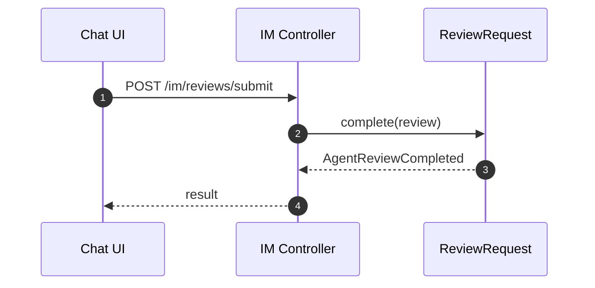
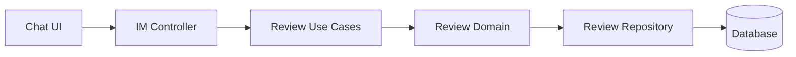

# Review（Backend）

## 领域边界
- 负责 AI 建议的人工审核流程，包括审核请求创建、通过/驳回、审核意见记录。
- 不负责对话消息持久化与 AI 生成逻辑（由对话/AI 服务承担）。

## 后端管理范围
- 审核请求创建/完成与事件发布。
- 审核流（pending/stream）供 IM 侧使用。

## 后端设计概览
- 聚合根: `ReviewRequest`
- 领域事件: `AgentReviewRequested`, `AgentReviewCompleted`
- 仓储接口: `IReviewRequestRepository`

## 核心字段
- ReviewRequest: `id`, `conversationId`, `status`, `suggestion`, `confidence`, `reviewerId`, `reviewerNote`, `createdAt`, `updatedAt`, `resolvedAt`
- 约束:
  - `status` 仅允许: `pending|approved|rejected`
  - `suggestion` 为 AI 建议快照，不应被修改

## 后端接口设计
- 标准 API:
  - `POST /api/reviews` 创建审核请求
  - `GET /api/reviews` 查询审核列表
  - `GET /api/reviews/:id` 获取审核详情
  - `POST /api/reviews/:id/complete` 完成审核
- IM 路由:
  - `POST /im/reviews/submit` 提交审核
  - `GET /im/reviews/pending` 拉取待审列表
  - `GET /im/reviews/stream` 审核流（长连接/流式）

## 主要时序图

## 主要架构图

## 完整性检查与缺口
- 已补齐前端领域模型与标准 `/api/reviews` 接口。
