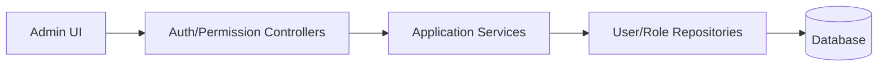

# System（Backend）

## 领域边界
- 负责认证、会话、RBAC 权限、成员管理、审计与监控。
- 不进入业务领域逻辑，仅提供基础平台能力。

## 后端管理范围
- 认证/授权/权限校验与审计日志。
- 监控、指标与告警。

## 主要架构图

## 完整性检查与缺口
- 缺少显式 System 领域模型（User/Role/Permission/Session/Audit 的聚合与事件）。
- 权限能力与业务域的访问控制由中间件实现，但缺乏统一策略文档与领域事件。
