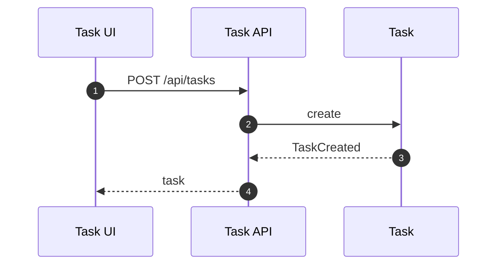
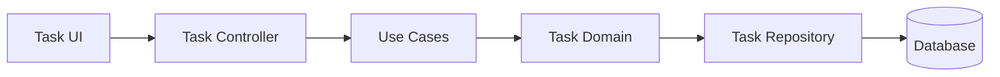

# Task（Backend）

## 领域边界
- 负责任务生命周期、指派、状态流转、质量评分（若需要）。
- 可关联需求/对话，但不负责需求识别或对话消息管理。

## 后端管理范围
- 任务状态机与指派逻辑。
- 任务完成后的评分/事件发布。

## 后端设计概览
- 聚合根: `Task`
- 值对象: `TaskPriority`, `QualityScore`
- 领域事件: `TaskCreated`, `TaskStarted`, `TaskCompleted`, `TaskCancelled`, `TaskReassigned`
- 仓储接口: `ITaskRepository`

## 核心字段
- Task: `id`, `title`, `type`, `assigneeId`, `conversationId`, `requirementId`, `status`, `priority`, `dueDate`, `qualityScore`, `createdAt`, `updatedAt`, `startedAt`, `completedAt`, `metadata`
- 约束:
  - `status` 仅允许: `pending|in_progress|completed|cancelled`
  - `qualityScore` 仅在完成后产生

## 后端接口设计
- `POST /api/tasks` 创建任务
- `GET /api/tasks/:id` 任务详情
- `GET /api/tasks` 任务列表
- `POST /api/tasks/:id/assign` 指派
- `PATCH /api/tasks/:id/status` 更新状态
- `POST /api/tasks/:id/complete` 完成任务
- `POST /api/tasks/:id/actions` 通用动作入口

## 主要时序图

## 主要架构图

## 完整性检查与缺口
- 前后端接口契约基本一致。
- 若前端需要 `actions` 统一入口，应补充动作类型与约束的文档化说明。
