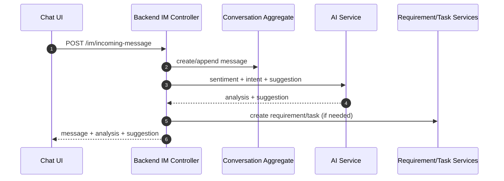
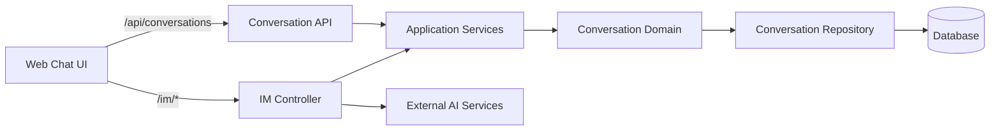

# 对话管理域（Conversation）设计

## 领域边界
- 负责对话生命周期、消息集合、会话分配、SLA/等级计算、会话关闭与事件发布。
- 不负责客户画像、需求/任务流转、质检与AI分析结果持久化（通过事件/应用服务协作）。

## 后端设计概览
- 聚合根: `Conversation`, `Message`
- 值对象: `Channel`, `MessageSummary`
- 领域服务: `ConversationAssignmentPolicyService`, `CustomerLevelCalculatorService`
- 领域事件: `ConversationCreated`, `ConversationAssigned`, `MessageSent`, `ConversationReadyToClose`, `ConversationClosed`, `CustomerLevelViolated`
- 仓储接口: `IConversationRepository`, `IMessageRepository`

## 后端接口设计
- `POST /api/conversations` 创建对话
- `GET /api/conversations` 查询对话列表
- `POST /api/conversations/:id/assign` 分配客服
- `POST /api/conversations/:id/messages` 发送消息
- `GET /im/conversations` IM 会话列表
- `GET /im/conversations/:id/messages` IM 会话消息
- `POST /im/conversations/:id/messages` IM 发送消息
- `PATCH /im/conversations/:id/status` 更新会话状态
- `PATCH /im/conversations/:id/mode` 设置 Agent 模式
- `GET /im/conversations/:id/sentiment` 情绪分析（AI）
- `GET /im/conversations/:id/ai-analysis` AI 分析结果

## 前端设计概览
- 领域模型: `Conversation`, `Message`, `Channel`, `Participant`
- 仓储接口: `IConversationRepository`
- 基础设施仓储: `ConversationRepository`（对接 `/api/conversations`）
- 应用/呈现层: `UnifiedChatController` 使用 `/im/*` 接口驱动实时会话

## 主要协作关系
- 与客户画像域协作: 客户等级计算影响 SLA 与分配策略
- 与需求域/任务域协作: 消息分析触发需求或任务创建
- 与审核域/问题域协作: 人工审核与问题识别

## 主要时序图

## 主要架构图

## 完整性检查与缺口
- 前端 `ConversationRepository.close()` 调用 `POST /api/conversations/:id/close`，后端未暴露该接口。
- 前端 `ConversationRepository.update()` 使用 `PUT /api/conversations/:id`，后端未暴露该接口。
- IM 渠道与标准 Conversation API 并存，职责边界需要在文档层明确：IM 用于实时消息链路；/api/conversations 用于业务管理。
