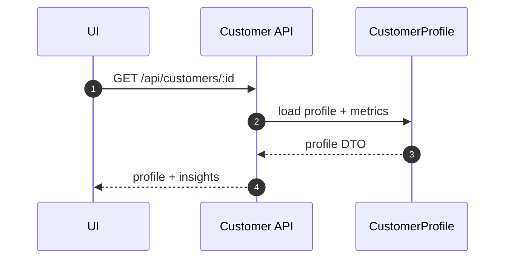
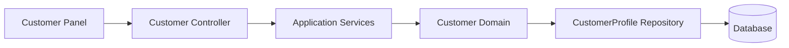

# 客户画像域（Customer）设计

## 领域边界
- 负责客户画像、交互记录、风险评估、健康度评分、VIP 标记与服务承诺跟踪。
- 不负责对话消息存储与工单流转（通过事件/应用服务协作）。

## 后端设计概览
- 聚合根: `CustomerProfile`
- 值对象: `ContactInfo`, `CustomerLevelInfo`, `Metrics`, `Insight`, `Interaction`, `ServiceRecord`
- 领域服务: `HealthScoreCalculator`, `RiskEvaluator`
- 领域事件: `ProfileRefreshed`, `InteractionAdded`, `ServiceRecordAdded`, `CommitmentProgressUpdated`, `RiskLevelChanged`, `CustomerMarkedAsVIP`
- 仓储接口: `ICustomerProfileRepository`

## 后端接口设计
- `GET /api/customers/:id` 获取客户画像
- `POST /api/customers/:id/refresh` 刷新画像
- `GET /api/customers/:id/interactions` 查询互动记录
- `POST /api/customers/:id/service-records` 添加服务记录
- `PATCH /api/customers/:id/commitments/:commitmentId` 更新承诺进度
- `POST /api/customers/:id/interactions` 添加互动记录
- `POST /api/customers/:id/mark-vip` 标记 VIP
- `GET /profiles/:customerId` IM 侧画像查询
- `GET /profiles/:customerId/interactions` IM 侧互动记录

## 前端设计概览
- 领域模型: `CustomerProfile`（含 SLA、指标、洞察、互动、服务记录等）
- 仓储接口: `IProfileRepository`
- 基础设施仓储: `CustomerProfileRepository`（对接 `/api/customers/*`）
- 表现层依赖: Chat 面板与客户信息侧边栏

## 主要时序图

## 主要架构图

## 完整性检查与缺口
- 前端 `CustomerProfileRepository` 以 `conversationId` 作为缓存键，后端接口按 `customerId` 设计，概念需统一（conversationId vs customerId）。
- IM 路由 `/profiles/*` 与标准 `/api/customers/*` 并存，建议明确哪一套为稳定接口契约。
