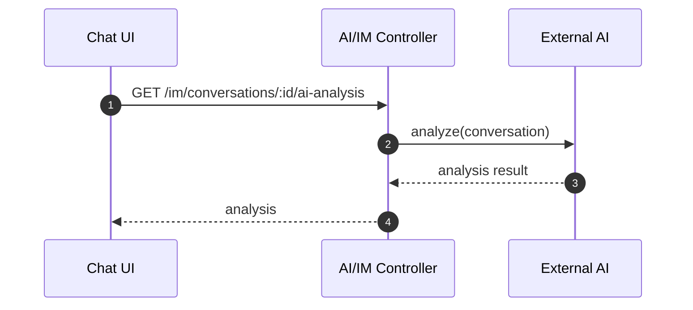
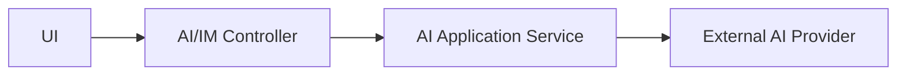

# AI Analysis（Frontend）

## 领域边界
- 负责情绪分析、意图识别、摘要与建议生成等 AI 能力的封装与调用。
- 主要作为通用能力域，为对话、质检、需求等提供能力，不承担业务持久化。

## 前端管理范围
- AI 结果展示与交互（建议、置信度、审核提示）。
- AI 能力开关与 UI 级降级策略。
- 不直接依赖供应商返回结构，统一使用后端 DTO。

## 主要时序图

## 主要架构图

## 完整性检查与缺口
- AI 领域缺乏稳定的结果模型与统一的能力接口，存在控制器直连外部服务的风险。
- 前端无法区分 AI 结果的版本/置信度等标准字段，建议统一 DTO。
