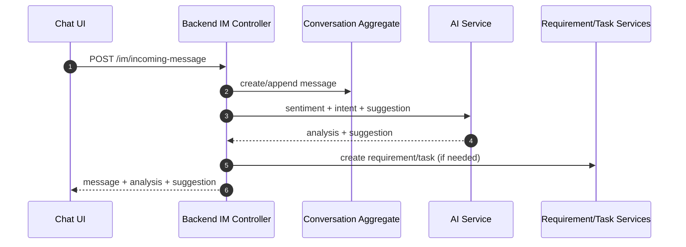
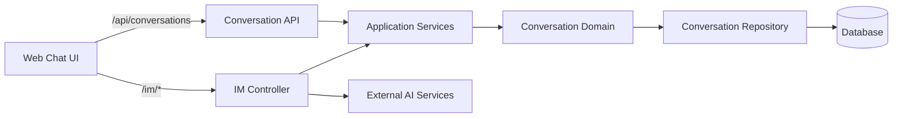

# Conversation（Frontend）

## 领域边界
- 负责对话生命周期、消息集合、会话分配、SLA/等级计算、会话关闭与事件发布。
- 不负责客户画像、需求/任务流转、质检与AI分析结果持久化（通过事件/应用服务协作）。

## 前端管理范围
- 对话 UI/列表/详情渲染与交互态管理。
- IM 实时消息展示、AI 建议与审核 UI。
- 只依赖稳定 DTO，避免直接拼接领域规则。

## 前端设计概览
- 领域模型: `Conversation`, `Message`, `Channel`, `Participant`
- 仓储接口: `IConversationRepository`
- 基础设施仓储: `ConversationRepository`（对接 `/api/conversations`）
- 应用/呈现层: `UnifiedChatController` 使用 `/im/*` 接口驱动实时会话

## 核心字段
- Conversation: `id`, `customerId`, `agentId`, `channel`, `status`, `priority`, `slaStatus`, `slaDeadline`, `mode`, `metadata`, `createdAt`, `updatedAt`, `closedAt`
- Message: `id`, `conversationId`, `senderId`, `senderType`, `content`, `contentType`, `metadata`, `sentAt`
- 约束:
  - `status=closed` 后禁止发送消息
  - `mode` 仅允许: `agent_auto|agent_supervised|human_first`
  - `channel` 取值受限于枚举

## 主要时序图

## 主要架构图

## 完整性检查与缺口
- 已补齐 `POST /api/conversations/:id/close` 与 `PUT /api/conversations/:id`。
- IM 渠道与标准 Conversation API 并存，职责边界需要在文档层明确：IM 用于实时消息链路；/api/conversations 用于业务管理。
