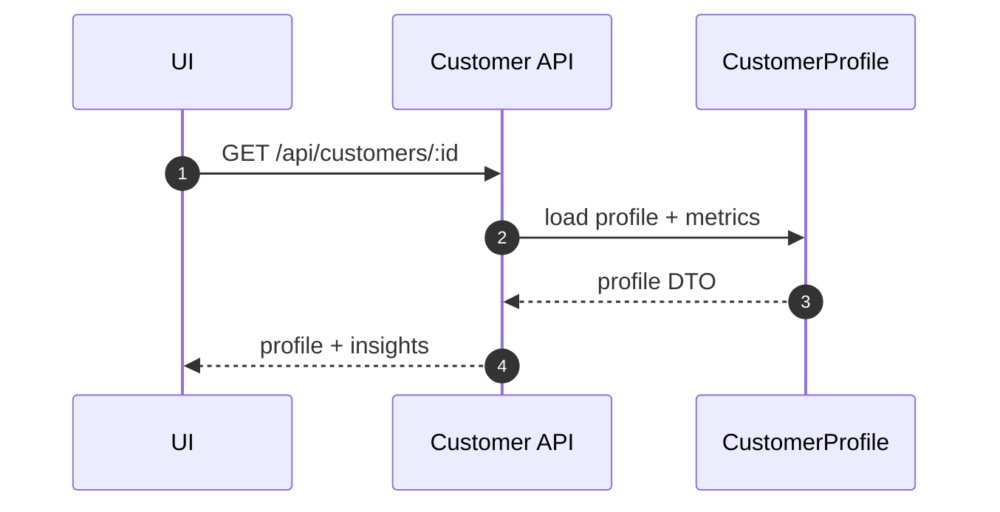
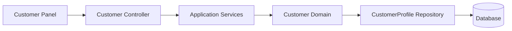

# Customer（Frontend）

## 领域边界
- 负责客户画像、交互记录、风险评估、健康度评分、VIP 标记与服务承诺跟踪。
- 不负责对话消息存储与工单流转（通过事件/应用服务协作）。

## 前端管理范围
- 画像卡片展示与筛选，触发刷新/标记操作。
- 只读指标展示，不直接修改风险/等级。

## 前端设计概览
- 领域模型: `CustomerProfile`（含 SLA、指标、洞察、互动、服务记录等）
- 仓储接口: `IProfileRepository`
- 基础设施仓储: `CustomerProfileRepository`（对接 `/api/customers/*`）
- 表现层依赖: Chat 面板与客户信息侧边栏

## 核心字段
- CustomerProfile: `id`, `name`, `contacts`, `levelInfo`, `metrics`, `insights`, `interactions`, `serviceRecords`, `commitments`, `createdAt`, `updatedAt`
- 约束:
  - `serviceLevel` 仅允许 `gold|silver|bronze`
  - `riskLevel` 由领域服务计算，前端不应直接改写

## 主要时序图

## 主要架构图

## 完整性检查与缺口
- 前端 `CustomerProfileRepository` 以 `conversationId` 作为缓存键，后端接口按 `customerId` 设计，概念需统一（conversationId vs customerId）。
- IM 路由 `/profiles/*` 与标准 `/api/customers/*` 并存，建议明确哪一套为稳定接口契约。
