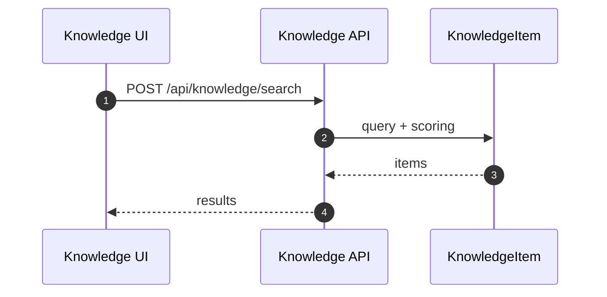
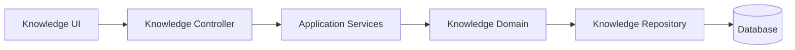

# Knowledge（Frontend）

## 领域边界
- 负责知识条目生命周期（创建/更新/删除）、分类标签、检索与推荐。
- 不负责对话消息与需求任务流转（通过检索/推荐提供支持）。

## 前端管理范围
- 知识列表、预览与检索 UI。
- 上传/同步进度与错误展示。

## 前端设计概览
- 领域模型: `KnowledgeItem`
- 基础设施仓储: `KnowledgeRepository`（对接 `/api/knowledge/*`）
- 表现层: Knowledge 列表 + 预览面板

## 核心字段
- KnowledgeItem: `id`, `title`, `content`, `category`, `tags`, `source`, `status`, `createdAt`, `updatedAt`
- 约束:
  - `category` 与标签需保持一致性
  - `status` 建议枚举化（draft/published/archived）

## 主要时序图

## 主要架构图

## 完整性检查与缺口
- 前后端接口契约一致性较好，主要差异在上传/同步的状态展示策略（前端偏 UI 轮询）。
