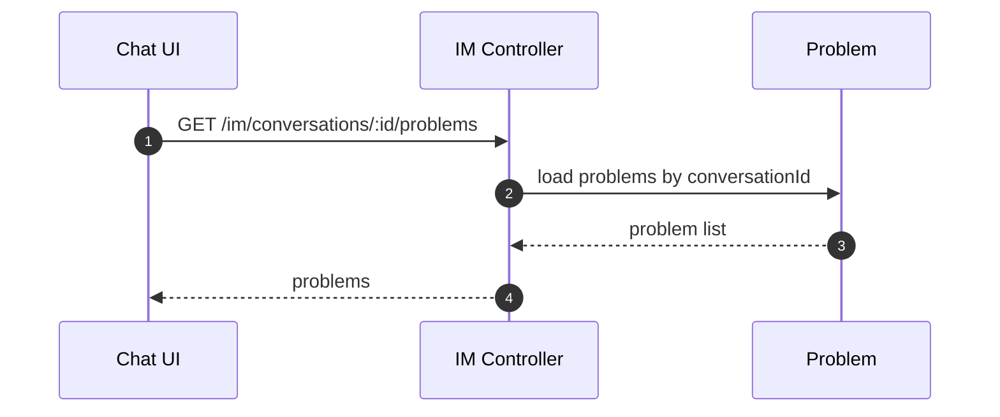
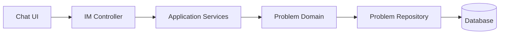

# Problem（Frontend）

## 领域边界
- 负责“问题”实体的生命周期管理（新建、流转、解决、重开）。
- 由对话/AI 识别触发创建，与需求/任务协作但不替代其职责。

## 前端管理范围
- 问题列表/状态展示。
- 问题状态变更操作入口。

## 前端设计概览
- 前端建立 `Problem` 领域模型与 `ProblemRepository`。
- Chat 视图可继续使用 `/im/*`，后台管理/列表使用 `/api/problems`。

## 核心字段
- Problem: `id`, `customerId`, `conversationId`, `title`, `description`, `status`, `intent`, `confidence`, `metadata`, `createdAt`, `updatedAt`, `resolvedAt`
- 约束:
  - `status` 仅允许: `new|in_progress|waiting_customer|resolved|reopened`
  - `intent/confidence` 由 AI 识别结果产出

## 主要时序图

## 主要架构图

## 完整性检查与缺口
- 已补齐前端 `Problem` 模型与仓储，并提供标准问题管理 API。
