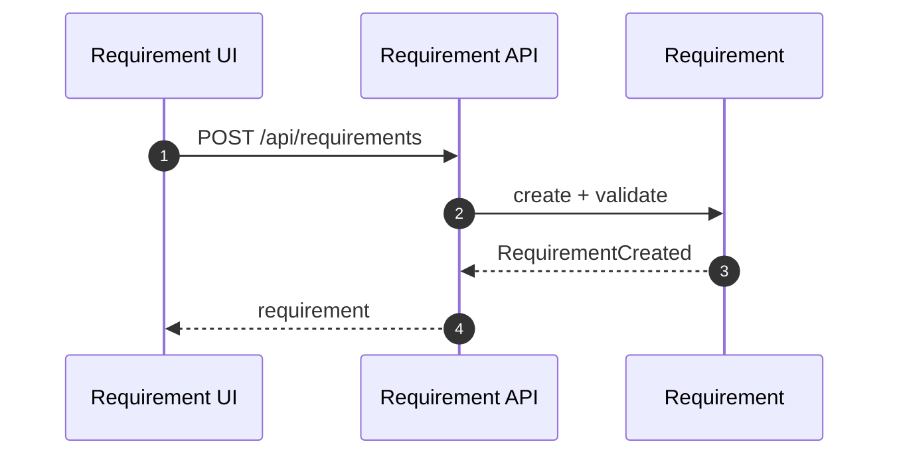
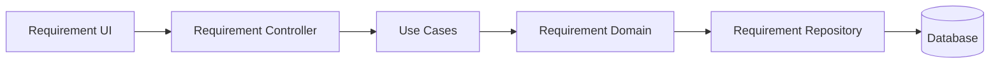

# Requirement（Frontend）

## 领域边界
- 负责需求的识别、优先级、状态流转、与对话/客户关联。
- 不负责任务执行、对话消息存储（通过事件/应用服务协作）。

## 前端管理范围
- 需求列表/筛选/详情展示。
- 状态更新与忽略操作的交互。

## 前端设计概览
- 领域模型: `Requirement`
- 领域服务: `RequirementService`（如存在，用于业务校验/策略）
- 基础设施仓储: `RequirementRepository`
- API 调用: `/api/requirements` + `/api/requirements/:id/ignore`

## 核心字段
- Requirement: `id`, `customerId`, `conversationId`, `title`, `description`, `category`, `priority`, `status`, `source`, `createdBy`, `metadata`, `createdAt`, `updatedAt`
- 约束:
  - `status` 仅允许: `pending|approved|resolved|ignored|cancelled`
  - `priority` 使用值对象，避免裸字符串

## 主要时序图

## 主要架构图

## 完整性检查与缺口
- 前端 `RequirementRepository.updateStatus()` 已调整为 `PATCH /api/requirements/:id/status`；后端保留 `PATCH /api/requirements/:id` 兼容旧客户端。
- 前端 `RequirementRepository.update()` 使用 `PUT /api/requirements/:id`，后端未提供该接口。
