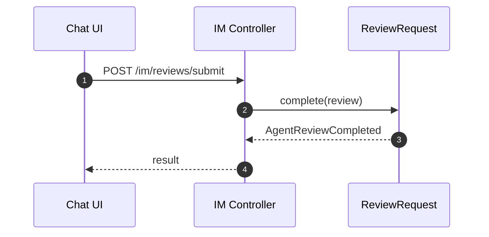
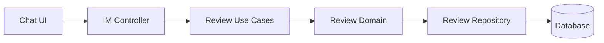

# Review（Frontend）

## 领域边界
- 负责 AI 建议的人工审核流程，包括审核请求创建、通过/驳回、审核意见记录。
- 不负责对话消息持久化与 AI 生成逻辑（由对话/AI 服务承担）。

## 前端管理范围
- 审核 UI 渲染与审批交互。
- 审核结果回写与状态提示。

## 前端设计概览
- 前端新增 `ReviewRequest` 领域模型与 `ReviewRepository`。
- Chat 侧继续使用 `/im/reviews/*`；后台管理走 `/api/reviews`。

## 核心字段
- ReviewRequest: `id`, `conversationId`, `status`, `suggestion`, `confidence`, `reviewerId`, `reviewerNote`, `createdAt`, `updatedAt`, `resolvedAt`
- 约束:
  - `status` 仅允许: `pending|approved|rejected`
  - `suggestion` 为 AI 建议快照，不应被修改

## 主要时序图

## 主要架构图

## 完整性检查与缺口
- 已补齐前端领域模型与标准 `/api/reviews` 接口。
