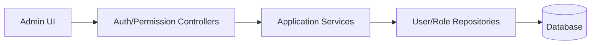

# System（Frontend）

## 领域边界
- 负责认证、会话、RBAC 权限、成员管理、审计与监控。
- 不进入业务领域逻辑，仅提供基础平台能力。

## 前端管理范围
- 管理台权限配置、成员管理与审计查看。
- 权限驱动的 UI 状态控制。

## 前端设计概览
- 前端存在 `permissions`/`roles`/`members` 相关模块，但未形成统一系统域模型。
- 基于 API 响应直接驱动 UI。

## 主要架构图

## 完整性检查与缺口
- 缺少显式 System 领域模型（User/Role/Permission/Session/Audit 的聚合与事件）。
- 权限能力与业务域的访问控制由中间件实现，但缺乏统一策略文档与领域事件。
