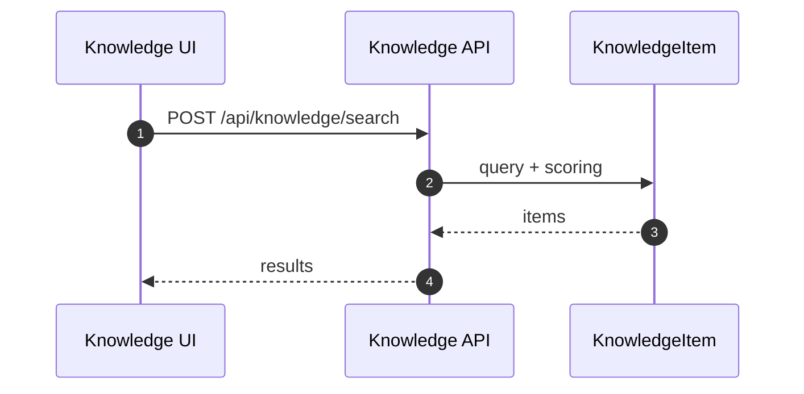
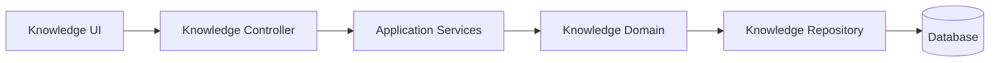

# 知识库域（Knowledge）设计

## 领域边界
- 负责知识条目生命周期（创建/更新/删除）、分类标签、检索与推荐。
- 不负责对话消息与需求任务流转（通过检索/推荐提供支持）。

## 后端设计概览
- 聚合根: `KnowledgeItem`
- 值对象: `KnowledgeCategory`
- 领域服务: `KnowledgeRecommender`
- 领域事件: `KnowledgeItemCreated`, `KnowledgeItemUpdated`, `KnowledgeItemDeleted`
- 仓储接口: `IKnowledgeRepository`

## 后端接口设计
- `POST /api/knowledge/search` 搜索
- `POST /api/knowledge/upload` 上传/导入
- `GET /api/knowledge/:id/progress` 导入进度
- `POST /api/knowledge/:id/sync` 同步
- `POST /api/knowledge/:id/retry` 重试
- `POST /api/knowledge` 创建
- `GET /api/knowledge/:id` 详情
- `GET /api/knowledge` 列表
- `PATCH /api/knowledge/:id` 更新
- `DELETE /api/knowledge/:id` 删除

## 前端设计概览
- 领域模型: `KnowledgeItem`
- 基础设施仓储: `KnowledgeRepository`（对接 `/api/knowledge/*`）
- 表现层: Knowledge 列表 + 预览面板

## 主要时序图

## 主要架构图

## 完整性检查与缺口
- 前后端接口契约一致性较好，主要差异在上传/同步的状态展示策略（前端偏 UI 轮询）。
