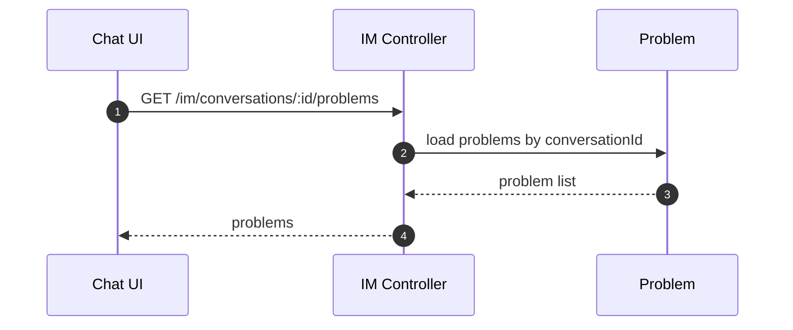
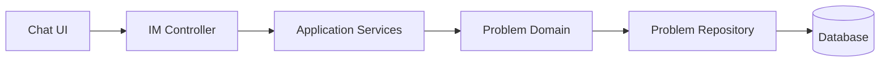

# 问题识别域（Problem）设计

## 领域边界
- 负责“问题”实体的生命周期管理（新建、流转、解决、重开）。
- 由对话/AI 识别触发创建，与需求/任务协作但不替代其职责。

## 后端设计概览
- 聚合根: `Problem`
- 领域事件: `ProblemCreated`, `ProblemStatusChanged`, `ProblemResolved`, `ProblemReopened`
- 仓储接口: `IProblemRepository`

## 后端接口设计
- 目前通过 IM 路由暴露读取：
  - `GET /im/conversations/:id/problems` 获取会话问题列表
- 问题创建与状态更新主要由后台分析链路/应用服务触发（未公开标准 CRUD API）。

## 前端设计概览
- 前端暂未建立独立 Problem 领域模型与仓储。
- 通过 `/im/*` 接口在 Chat 视图侧展示问题识别结果。

## 主要时序图

## 主要架构图

## 完整性检查与缺口
- 前端缺少 `Problem` 领域模型与仓储层，问题数据直接由 IM 接口返回，导致领域一致性弱。
- 后端未提供标准问题管理 API（仅 IM 读接口），若需要运维/工单侧操作，建议补齐。 
