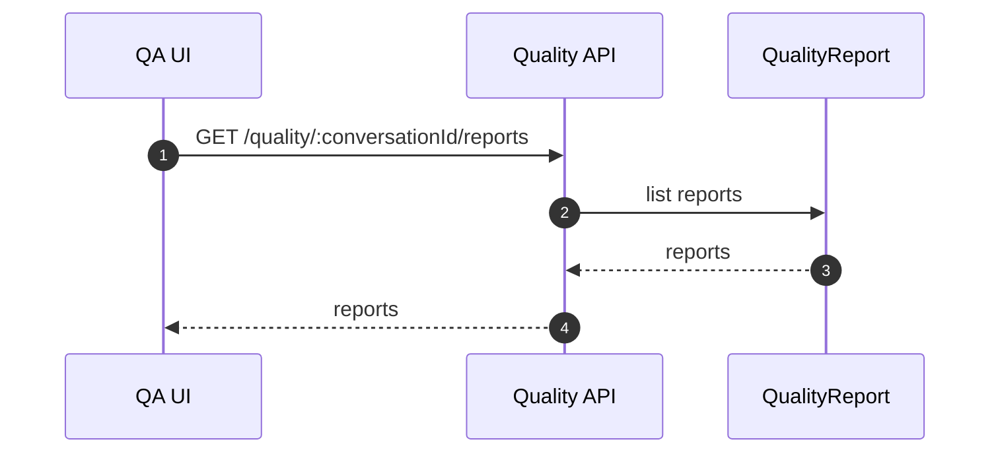
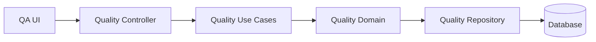

# 质检域（Quality）设计

## 领域边界
- 负责对话质检评分、质检报告与改进建议的生命周期。
- 不负责对话消息与审核流程（与对话/审核域协作）。

## 当前实现现状
- 后端存在 `QualityReportRepository` 与相关实体，但未形成独立领域模型与事件。
- IM 路由提供质检查询接口：
  - `GET /quality/:conversationId`
  - `GET /quality/:conversationId/reports`
  - `GET /quality/reports`
- 前端暂无独立质检域模型与仓储。

## 建议的领域模型
- 聚合根: `QualityReport`
- 值对象: `QualityScore`, `Violation`, `Suggestion`
- 领域事件: `QualityReportGenerated`, `QualityScoreUpdated`
- 仓储接口: `IQualityReportRepository`

## 主要时序图（建议目标态）

## 主要架构图（建议目标态）

## 完整性检查与缺口
- 后端缺失显式的 Quality 领域模型与事件，仅仓储层存在。
- 前端缺失质检域模型与仓储层，完全依赖 IM 接口。
