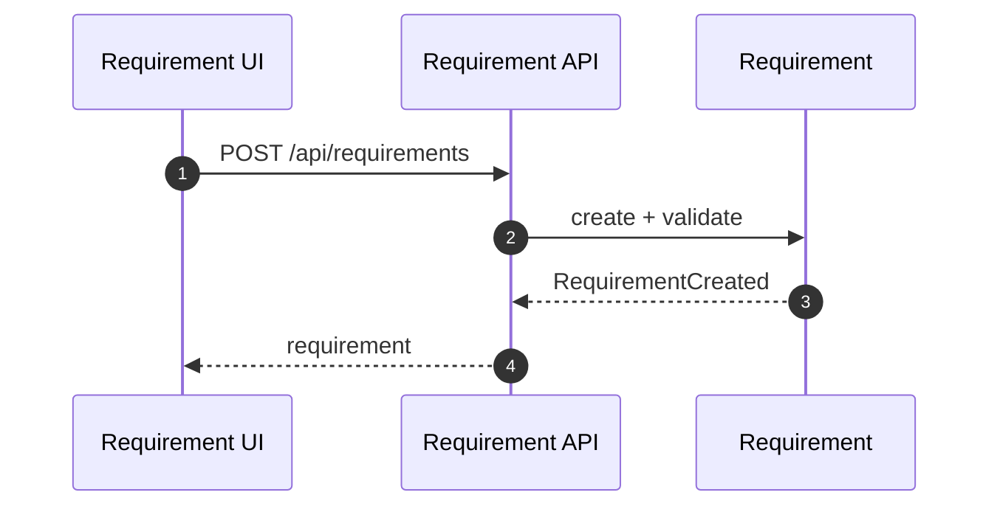
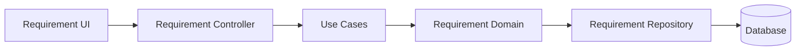

# 需求管理域（Requirement）设计

## 领域边界
- 负责需求的识别、优先级、状态流转、与对话/客户关联。
- 不负责任务执行、对话消息存储（通过事件/应用服务协作）。

## 后端设计概览
- 聚合根: `Requirement`
- 值对象: `Priority`, `RequirementSource`
- 领域事件: `RequirementCreated`, `RequirementStatusChanged`, `RequirementPriorityChanged`
- 领域服务: `RequirementAutoTaskService`（若存在自动任务策略）
- 仓储接口: `IRequirementRepository`
- 规格模式: `RequirementSpecifications`（用于复杂查询）

## 后端接口设计
- `POST /api/requirements` 创建需求
- `GET /api/requirements/:id` 需求详情
- `GET /api/requirements` 需求列表
- `GET /api/requirements/statistics` 统计
- `PATCH /api/requirements/:id/status` 更新状态
- `POST /api/requirements/:id/ignore` 忽略需求
- `DELETE /api/requirements/:id` 删除需求

## 前端设计概览
- 领域模型: `Requirement`
- 领域服务: `RequirementService`（如存在，用于业务校验/策略）
- 基础设施仓储: `RequirementRepository`
- API 调用: `/api/requirements` + `/api/requirements/:id/ignore`

## 主要时序图

## 主要架构图

## 完整性检查与缺口
- 前端 `RequirementRepository.updateStatus()` 使用 `PATCH /api/requirements/:id`，后端实际为 `PATCH /api/requirements/:id/status`，存在契约不一致。
- 前端 `RequirementRepository.update()` 使用 `PUT /api/requirements/:id`，后端未提供该接口。
