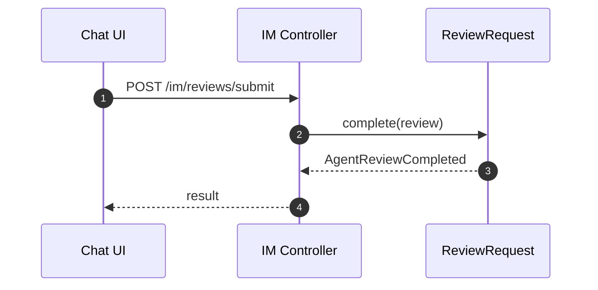
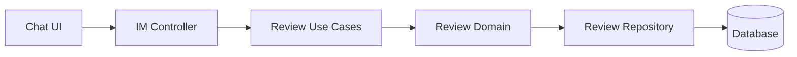

# 审核域（Review）设计

## 领域边界
- 负责 AI 建议的人工审核流程，包括审核请求创建、通过/驳回、审核意见记录。
- 不负责对话消息持久化与 AI 生成逻辑（由对话/AI 服务承担）。

## 后端设计概览
- 聚合根: `ReviewRequest`
- 领域事件: `AgentReviewRequested`, `AgentReviewCompleted`
- 仓储接口: `IReviewRequestRepository`

## 后端接口设计
- IM 路由提供审核相关接口：
  - `POST /im/reviews/submit` 提交审核
  - `GET /im/reviews/pending` 拉取待审列表
  - `GET /im/reviews/stream` 审核流（长连接/流式）

## 前端设计概览
- 前端没有独立审核领域模型与仓储。
- `UnifiedChatController` 直接调用 `/im/reviews/*` 并渲染审核 UI。

## 主要时序图

## 主要架构图

## 完整性检查与缺口
- 前端缺少 Review 领域模型，审核行为直接绑定 UI 逻辑，难以测试与复用。
- 后端未提供标准 `/api/reviews` 资源接口，全部在 IM 路由中完成。若需后台审核系统，建议补齐标准 API。 
