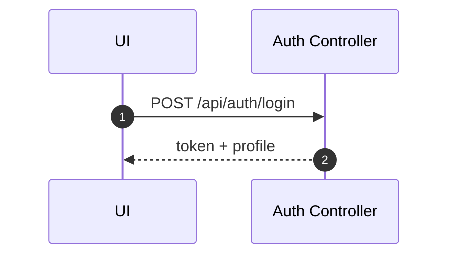
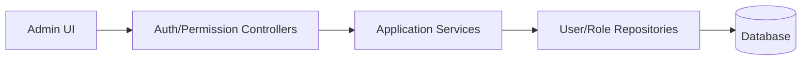

# 系统管理域（System）设计

## 领域边界
- 负责认证、会话、RBAC 权限、成员管理、审计与监控。
- 不进入业务领域逻辑，仅提供基础平台能力。

## 当前实现现状
- 接口层清晰，但领域模型层缺失（多数逻辑位于应用层/控制器）。
- 关键路由：
  - 认证: `POST /api/auth/login`, `POST /api/auth/register`, `GET /api/auth/me`
  - 权限/成员: `/api/roles`, `/api/members`
  - 审计: `/api/audit/*`
  - 会话: `/api/session/*`（若存在）
  - 监控/指标: `/api/monitoring/*`, `/api/metrics/*`

## 前端设计概览
- 前端存在 `permissions`/`roles`/`members` 相关模块，但未形成统一系统域模型。
- 基于 API 响应直接驱动 UI。

## 主要时序图（示例: 登录）

## 主要架构图

## 完整性检查与缺口
- 缺少显式 System 领域模型（User/Role/Permission/Session/Audit 的聚合与事件）。
- 权限能力与业务域的访问控制由中间件实现，但缺乏统一策略文档与领域事件。
