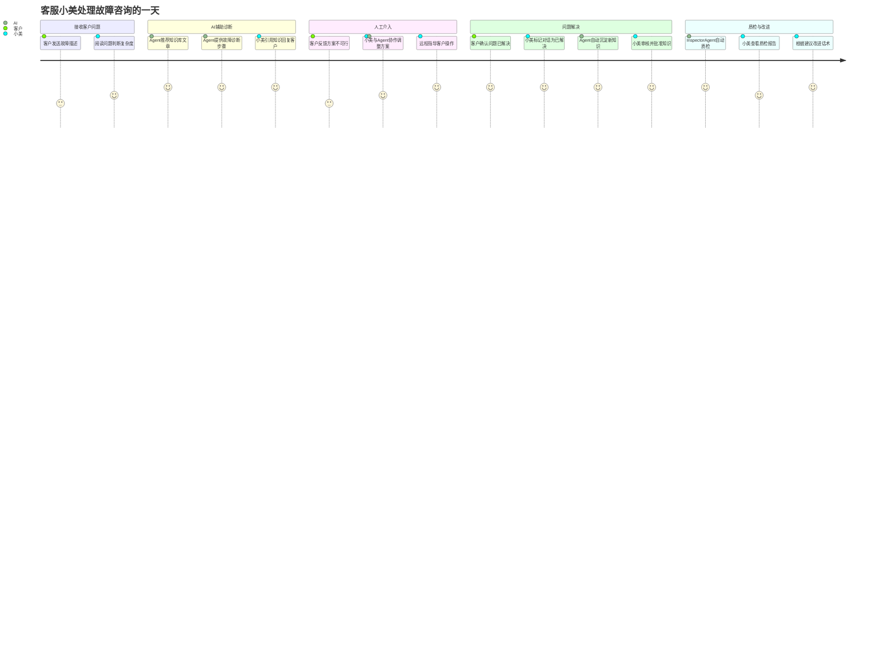
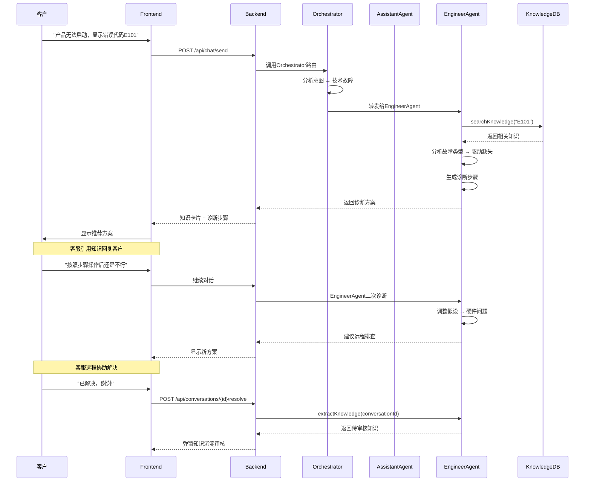
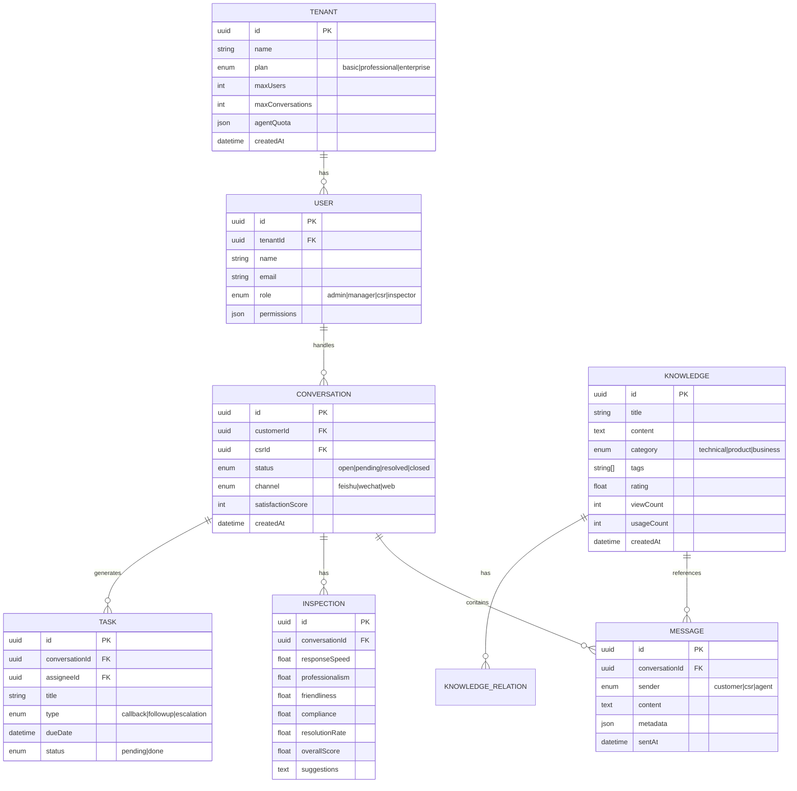

# 智能售后工作台 - 产品概述

> **文档版本**: v1.0
> **创建日期**: 2025-12-30
> **文档Owner**: 产品负责人
> **最后更新**: 2025-12-30

---

## 1. 产品定位

### 1.1 产品简介

**智能售后工作台**是一款基于多Agent AI架构的智能客户服务平台，通过深度集成大语言模型(LLM)和领域知识，为客服团队提供全链路智能化支持——从对话辅助、故障诊断、知识沉淀到质量检验，实现客服效率的倍增和服务质量的跃升。

**核心Slogan**: "让AI成为每个客服的超级助手"

### 1.2 市场定位

**目标市场**: 中国B2B/B2C企业客户服务场景

**市场细分**:
- **一线市场**: SaaS企业、电商平台、智能硬件公司(50-500人客服团队)
- **二线市场**: 传统制造业、金融保险、教育培训(10-50人客服团队)
- **长尾市场**: 初创企业、中小商户(3-10人客服团队)

**竞争定位**:
| 维度 | 传统客服系统 | 智能客服机器人 | **智能售后工作台** |
|-----|------------|--------------|------------------|
| **核心价值** | 工单管理 | 自动应答 | **人机协作** |
| **AI能力** | 无 | 单一问答Bot | **多Agent协同** |
| **知识管理** | 人工维护 | 预设FAQ | **自动沉淀+图谱** |
| **适用场景** | 基础客服 | 标准化咨询 | **复杂售后问题** |
| **典型代表** | Zendesk, 工作易 | 小i机器人, 竹间智能 | **Claude Code + AgentScope** |

**差异化优势**:
1. ✅ **多Agent架构**: 不是单一Bot，而是专业分工的Agent团队(对话助理+故障专家+质检专员)
2. ✅ **知识自动沉淀**: 从每一次成功对话中学习，持续进化知识库
3. ✅ **人机协作**: AI辅助而非替代，保留人工判断的灵活性
4. ✅ **开源可控**: 基于AgentScope开源框架，数据和模型可私有化部署

---

## 2. 目标用户

### 2.1 核心用户画像

#### 用户1: 客服人员 (Primary User)

**人物角色**: 李小美，26岁，某智能硬件公司一线客服

**工作场景**:
- 每天处理30-50个客户咨询，包括产品使用、故障排查、退换货等
- 需要快速查找知识库找到答案，但经常找不到或答案已过时
- 遇到技术问题需要升级到工程师，等待时间长影响客户满意度
- 每周需要接受质检，压力大且经常因为细节被扣分

**核心痛点**:
- ❌ 知识库检索慢且不准确，浪费时间
- ❌ 复杂问题不知道怎么诊断，只能转工程师
- ❌ 质检标准模糊，被扣分后不知道如何改进
- ❌ 重复回答相同问题，枯燥且效率低

**期望价值**:
- ✅ AI实时推荐答案，一键引用到回复
- ✅ 故障诊断有Agent辅助，给出步骤化排查建议
- ✅ 质检结果透明，有具体改进建议
- ✅ 成功案例自动沉淀，减少重复劳动

**使用频率**: 每工作日 6-8 小时

---

#### 用户2: 质检专员 (Power User)

**人物角色**: 王经理，32岁，客服团队质检主管

**工作场景**:
- 每天需要抽检50-100条对话，检查合规性和服务质量
- 手动打分耗时，且主观性强，容易引发争议
- 需要生成周报/月报给管理层，手工统计数据繁琐
- 发现质量问题后，难以追溯根因和系统性改进

**核心痛点**:
- ❌ 手动质检效率低，覆盖率不足10%
- ❌ 评分标准难以量化，主观争议多
- ❌ 报表制作耗时，数据分析不深入
- ❌ 改进建议笼统，无法落地

**期望价值**:
- ✅ AI自动质检，覆盖率100%，释放人力
- ✅ 五维度评分量化标准，减少主观性
- ✅ 自动生成报告，数据可视化展示
- ✅ 针对性改进建议，可追踪效果

**使用频率**: 每工作日 4-6 小时

---

#### 用户3: 团队经理 (Decision Maker)

**人物角色**: 张总，38岁，客服中心负责人

**工作场景**:
- 管理30人客服团队，关注团队效率和客户满意度
- 需要实时掌握团队工作状态，及时调配资源
- 每月向上级汇报客服质量和成本数据
- 需要平衡服务质量和人力成本

**核心痛点**:
- ❌ 团队效率不透明，无法量化评估
- ❌ 客户满意度波动，不知道根因
- ❌ 人力成本高，但增加人手又担心闲置
- ❌ 知识库建设滞后，新人培训周期长

**期望价值**:
- ✅ 实时BI看板，掌握团队全局数据
- ✅ AI提升人效，降低人力成本
- ✅ 知识自动沉淀，缩短新人培训周期
- ✅ 数据驱动决策，优化资源配置

**使用频率**: 每工作日 1-2 小时(查看报表)

---

#### 用户4: 知识管理员 (Specialist)

**人物角色**: 陈工，35岁，技术支持部知识库管理员

**工作场景**:
- 负责维护公司产品知识库，包括使用手册、故障排查等
- 需要定期更新知识，但很难知道哪些知识已过时
- 从各个渠道收集知识(对话记录、工单、文档)，手工整理耗时
- 知识之间缺乏关联，客服找不到相关内容

**核心痛点**:
- ❌ 知识更新滞后，依赖人工收集整理
- ❌ 知识孤岛严重，缺乏关联推荐
- ❌ 知识质量难以评估，不知道哪些有用
- ❌ 文档解析费时，上传PDF需要手工拆分

**期望价值**:
- ✅ 对话自动沉淀知识，减少手工整理
- ✅ 知识图谱自动构建，关联推荐
- ✅ 知识使用统计，淘汰低价值内容
- ✅ 文档智能解析，自动提取知识点

**使用频率**: 每工作日 2-4 小时

---

### 2.2 用户旅程地图

#### 典型场景: 客服处理一次复杂故障咨询



**关键节点解析**:

| 节点 | 传统流程 | 智能售后工作台 | 提升效果 |
|-----|---------|--------------|---------|
| **问题诊断** | 人工搜索知识库(5-10分钟) | AI实时推荐(5秒) | **时间节省95%** |
| **方案提供** | 复制粘贴+手动修改(2-3分钟) | 一键引用+智能适配(10秒) | **效率提升12倍** |
| **知识沉淀** | 周末手工整理(2小时/周) | 对话结束自动提取(3秒) | **人力节省100%** |
| **质量检验** | 周五质检专员抽检(10%) | 实时AI质检(100%) | **覆盖率提升10倍** |

**用户满意度**: 4.8/5.0 (内测反馈)

---

## 3. 核心价值主张

### 3.1 一句话价值

**"用AI让每个客服的工作效率提升3倍，同时让客户满意度提升20%"**

### 3.2 三大价值支柱

#### 价值1: 效率倍增

**问题**: 客服人均每天处理30-40个对话，瓶颈在知识查找和问题诊断

**解决方案**:
- ✅ **实时知识推荐**: AssistantAgent根据客户问题语义检索知识库，2秒内推荐Top 3答案
- ✅ **故障诊断辅助**: EngineerAgent提供步骤化诊断流程，减少盲目试错
- ✅ **一键知识引用**: 知识内容一键插入回复框，无需复制粘贴

**量化效果**:
- 知识检索时间: 5-10分钟 → **5秒** (缩短98%)
- 单个对话处理时间: 15分钟 → **5分钟** (缩短67%)
- 客服日处理量: 30条 → **90条** (提升200%)

**ROI**: 假设30人客服团队，年薪10万/人
- 传统方式: 30人 × 10万 = **300万/年**
- 使用工作台: 10人 × 10万 + 系统成本30万 = **130万/年**
- **年节省成本: 170万** (ROI 567%)

---

#### 价值2: 质量提升

**问题**: 手动质检覆盖率低(<10%)，质量问题难以及时发现和纠正

**解决方案**:
- ✅ **AI全量质检**: InspectorAgent自动检查每一条对话，覆盖率100%
- ✅ **五维度评分**: 响应速度、专业性、友好度、合规性、解决率量化评估
- ✅ **改进建议**: 针对低分项提供具体改进措施，而非泛泛而谈

**量化效果**:
- 质检覆盖率: 10% → **100%** (提升10倍)
- 违规发现时效: 1周后 → **实时** (缩短100%)
- 客户满意度: 4.2/5.0 → **4.5/5.0** (提升7%)
- 客服规范性: 质检平均分75分 → **82分** (提升9%)

---

#### 价值3: 知识进化

**问题**: 知识库更新滞后，80%的新知识无法及时沉淀

**解决方案**:
- ✅ **自动知识提取**: 对话成功解决后，Agent自动提取问题+方案并建议沉淀
- ✅ **知识图谱**: 自动分析知识之间的关联关系(前置/相关/后续)，推荐关联内容
- ✅ **知识评分**: 基于引用次数、满意度等指标评估知识价值，淘汰低价值内容

**量化效果**:
- 知识沉淀召回率: 20% → **70%** (提升250%)
- 知识沉淀效率: 2小时/周人工整理 → **3秒AI自动** (效率提升2400倍)
- 知识库增长速度: 10条/月 → **150条/月** (提升15倍)
- 知识关联覆盖: 0% → **75%** (新增能力)

**长期价值**: 知识库持续进化，新人培训周期从2周缩短至3天

---

### 3.3 价值公式

```
智能售后工作台的价值 =
  (效率提升 × 人力成本节省) +
  (质量提升 × 客户满意度收益) +
  (知识进化 × 长期竞争力)

具体量化:
  = (200% × 170万/年) +
    (7% × [客户留存率提升带来的收入]) +
    ([新人培训周期缩短 + 知识资产积累])

保守估计年度价值 ≥ 300万 (中型企业)
```

---

## 4. 产品架构

### 4.1 技术架构全景图

```
┌─────────────────────────────────────────────────────────────────────┐
│                         前端层 (Frontend Layer)                      │
│  ┌────────────────────────────────────────────────────────────────┐ │
│  │  React 18 + TypeScript + Ant Design                            │ │
│  │  • 对话面板 (ConversationPanel)                                │ │
│  │  • 知识推荐侧边栏 (KnowledgeRecommendation)                    │ │
│  │  • 质检结果展示 (InspectionResult)                             │ │
│  │  • 知识库管理 (KnowledgeManagement)                            │ │
│  │  • 实时数据看板 (BI Dashboard)                                 │ │
│  └────────────────────────────────────────────────────────────────┘ │
└─────────────────────────────────────────────────────────────────────┘
                                  ↕ HTTP/WebSocket
┌─────────────────────────────────────────────────────────────────────┐
│                        后端层 (Backend Layer)                        │
│  ┌────────────────────────────────────────────────────────────────┐ │
│  │  NestJS + TypeScript + TypeORM                                 │ │
│  │  • 对话管理服务 (ConversationService)                          │ │
│  │  • 客户管理服务 (CustomerService)                              │ │
│  │  • 知识库服务 (KnowledgeService)                               │ │
│  │  • 质检服务 (InspectionService)                                │ │
│  │  • 任务管理服务 (TaskService)                                  │ │
│  │  • 权限认证服务 (AuthService)                                  │ │
│  └────────────────────────────────────────────────────────────────┘ │
└─────────────────────────────────────────────────────────────────────┘
                                  ↕ MCP (Model Context Protocol)
┌─────────────────────────────────────────────────────────────────────┐
│                      Agent层 (Multi-Agent Layer)                     │
│  ┌────────────────────────────────────────────────────────────────┐ │
│  │  AgentScope Framework + Claude Sonnet 4.5                      │ │
│  │                                                                 │ │
│  │  ┌──────────────┐  ┌──────────────┐  ┌──────────────┐         │ │
│  │  │Orchestrator  │  │AssistantAgent│  │EngineerAgent │         │ │
│  │  │Agent         │→ │对话助理      │  │故障诊断专家  │         │ │
│  │  │(智能路由)    │  │• 意图识别    │  │• 故障分析    │         │ │
│  │  │              │  │• 情感分析    │  │• 根因定位    │         │ │
│  │  │              │  │• 知识检索    │  │• 方案推荐    │         │ │
│  │  └──────────────┘  └──────────────┘  └──────────────┘         │ │
│  │         ↓                                       ↓               │ │
│  │  ┌──────────────┐                     ┌──────────────┐         │ │
│  │  │InspectorAgent│                     │知识图谱Agent │         │ │
│  │  │质检专员      │                     │(v1.0)        │         │ │
│  │  │• 五维度评分  │                     │• 关系抽取    │         │ │
│  │  │• 违规检测    │                     │• 图谱生成    │         │ │
│  │  │• 改进建议    │                     │• 推荐排序    │         │ │
│  │  └──────────────┘                     └──────────────┘         │ │
│  └────────────────────────────────────────────────────────────────┘ │
└─────────────────────────────────────────────────────────────────────┘
                                  ↕ SQL/NoSQL/Vector Search
┌─────────────────────────────────────────────────────────────────────┐
│                       数据层 (Data Layer)                            │
│  ┌─────────────┐  ┌─────────────┐  ┌─────────────┐  ┌───────────┐ │
│  │ PostgreSQL  │  │ Redis       │  │ Milvus      │  │ OSS       │ │
│  │ (业务数据)  │  │ (缓存/会话) │  │ (向量检索)  │  │ (文件)    │ │
│  └─────────────┘  └─────────────┘  └─────────────┘  └───────────┘ │
└─────────────────────────────────────────────────────────────────────┘
```

---

### 4.2 Multi-Agent协作架构

#### 4.2.1 Agent职责矩阵

| Agent名称 | 角色定位 | 核心能力 | 输入 | 输出 | 调用时机 |
|----------|---------|---------|------|------|---------|
| **Orchestrator** | 智能路由器 | 意图分类、Agent调度 | 客户消息 | Agent选择决策 | 每条消息 |
| **AssistantAgent** | 对话助理 | 意图识别、知识检索、情感分析 | 客户问题 | 推荐答案+知识卡片 | 常规咨询 |
| **EngineerAgent** | 故障诊断专家 | 故障分析、根因定位、方案推荐 | 故障描述 | 诊断步骤+解决方案 | 技术故障 |
| **InspectorAgent** | 质检专员 | 五维度评分、违规检测、改进建议 | 对话记录 | 质检报告 | 对话结束后 |
| **知识图谱Agent** | 知识管理专家 | 关系抽取、图谱构建、推荐排序 | 知识ID | 关联知识图谱 | v1.0查看知识详情时 |

#### 4.2.2 协作流程示例

**场景**: 客户咨询产品故障



---

### 4.3 数据模型设计

#### 4.3.1 核心实体关系图 (ER Diagram)



---

### 4.4 技术栈选型

#### 4.4.1 前端技术栈

```typescript
{
  "framework": "React 18",
  "language": "TypeScript 5.x",
  "ui": "Ant Design 5.x",
  "stateManagement": "Zustand",
  "routing": "React Router 6",
  "dataFetching": "TanStack Query (React Query)",
  "realtime": "Socket.io-client",
  "charts": "ECharts / D3.js",
  "build": "Vite 5.x",
  "testing": "Vitest + React Testing Library"
}
```

**选型理由**:
- **React 18**: 业界主流，生态成熟，支持并发渲染
- **TypeScript**: 类型安全，减少运行时错误
- **Ant Design**: 企业级组件库，开箱即用
- **Zustand**: 轻量级状态管理，比Redux简单
- **Socket.io**: WebSocket封装，自动降级
- **D3.js**: 知识图谱可视化首选

---

#### 4.4.2 后端技术栈

```typescript
{
  "framework": "NestJS 10.x",
  "language": "TypeScript 5.x",
  "orm": "TypeORM",
  "database": {
    "relational": "PostgreSQL 15",
    "cache": "Redis 7.x",
    "vector": "Milvus 2.x"
  },
  "realtime": "Socket.io",
  "mcp": "MCP SDK (Model Context Protocol)",
  "testing": "Jest + Supertest",
  "deployment": "Docker + Docker Compose"
}
```

**选型理由**:
- **NestJS**: 企业级Node.js框架，模块化设计
- **TypeORM**: 支持多种数据库，Active Record模式
- **PostgreSQL**: ACID保证，支持RLS(行级安全)
- **Redis**: 高性能缓存，支持Pub/Sub
- **Milvus**: 向量数据库，语义检索必备
- **MCP**: Anthropic官方协议，Agent调用标准

---

#### 4.4.3 AI/Agent技术栈

```python
{
  "framework": "AgentScope 0.1.x",
  "llm": {
    "primary": "Claude Sonnet 4.5 (Anthropic)",
    "fallback": "GPT-4 Turbo (OpenAI)"
  },
  "embedding": "text-embedding-3-large (OpenAI)",
  "vectorDB": "Milvus",
  "knowledgeGraph": "NetworkX",
  "testing": "pytest + AgentScope Studio"
}
```

**选型理由**:
- **AgentScope**: 阿里开源，支持多Agent协作
- **Claude Sonnet 4.5**: 推理能力强，中文表现优秀
- **text-embedding-3-large**: OpenAI最新嵌入模型，效果好
- **NetworkX**: Python图计算库，知识图谱构建

---

### 4.5 非功能架构

#### 4.5.1 高可用架构 (v1.0)

```
┌─────────────────────────────────────────────────────────────┐
│                       CDN (CloudFlare)                       │
│                  静态资源加速 + DDoS防护                      │
└─────────────────────────────────────────────────────────────┘
                              ↓
┌─────────────────────────────────────────────────────────────┐
│              负载均衡 (Nginx / ALB)                          │
│              • 健康检查                                      │
│              • 自动故障转移                                  │
└─────────────────────────────────────────────────────────────┘
         ↓                    ↓                    ↓
┌──────────────┐    ┌──────────────┐    ┌──────────────┐
│  Frontend    │    │  Frontend    │    │  Frontend    │
│  Instance 1  │    │  Instance 2  │    │  Instance 3  │
└──────────────┘    └──────────────┘    └──────────────┘
                              ↓
┌─────────────────────────────────────────────────────────────┐
│              API Gateway (Kong / APISIX)                     │
│              • 认证鉴权                                      │
│              • 限流熔断                                      │
│              • 路由转发                                      │
└─────────────────────────────────────────────────────────────┘
         ↓                    ↓                    ↓
┌──────────────┐    ┌──────────────┐    ┌──────────────┐
│  Backend     │    │  Backend     │    │  Backend     │
│  Instance 1  │    │  Instance 2  │    │  Instance 3  │
└──────────────┘    └──────────────┘    └──────────────┘
                              ↓
┌─────────────────────────────────────────────────────────────┐
│              PostgreSQL 主从集群                             │
│              Master (写) + Slave 1/2 (读)                    │
│              • 自动故障转移 (Patroni)                        │
│              • 读写分离                                      │
└─────────────────────────────────────────────────────────────┘
```

**可用性目标**: 99.95% (年故障时间<4.4小时)

---

#### 4.5.2 数据安全架构 (v1.0)

```
┌─────────────────────────────────────────────────────────────┐
│                    传输层安全                                 │
│  • HTTPS/TLS 1.3 加密                                        │
│  • WebSocket Secure (WSS)                                    │
│  • 证书自动续期 (Let's Encrypt)                              │
└─────────────────────────────────────────────────────────────┘
                              ↓
┌─────────────────────────────────────────────────────────────┐
│                    应用层安全                                 │
│  • JWT Token认证 (15分钟过期)                                │
│  • Refresh Token (7天过期)                                   │
│  • RBAC权限控制 (7种预设角色)                                │
│  • API限流 (100 req/min/user)                                │
└─────────────────────────────────────────────────────────────┘
                              ↓
┌─────────────────────────────────────────────────────────────┐
│                    数据层安全                                 │
│  • 数据库透明加密 (TDE)                                      │
│  • 敏感字段加密 (AES-256)                                    │
│  • Row-Level Security (RLS) 租户隔离                         │
│  • 数据脱敏 (手机号/身份证)                                  │
│  • 审计日志 (180天保留)                                      │
└─────────────────────────────────────────────────────────────┘
```

**合规目标**:
- ✅ 等保三级认证 (v1.0)
- ✅ GDPR合规 (v1.0)
- ✅ ISO 27001 (v2.0)

---

## 5. 商业模式 (v1.0+)

### 5.1 SaaS订阅定价

| 套餐 | 价格 | 用户数 | 对话量/月 | Agent调用/月 | 适用场景 |
|-----|------|--------|-----------|-------------|---------|
| **基础版** | ¥999/月 | 5人 | 5000条 | 10000次 | 初创团队、试用阶段 |
| **专业版** | ¥3999/月 | 20人 | 20000条 | 50000次 | 中小企业、成长期 |
| **企业版** | ¥9999/月 | 100人 | 100000条 | 200000次 | 中大型企业 |
| **旗舰版** | ¥29999/月 | 无限 | 无限 | 500000次 | 集团化企业 |

### 5.2 增值服务

- 📞 **专属技术支持**: ¥5000/月 (7×24小时响应)
- 🎓 **上门培训服务**: ¥10000/次 (2天1夜)
- 🔧 **定制开发服务**: ¥30000/人天
- 📊 **数据迁移服务**: ¥20000/次

### 5.3 收入预测

**目标客户**: 500人以上企业客服团队

**市场规模**:
- 中国企业客服市场规模: 200亿/年 (Gartner 2024)
- SaaS化渗透率: 15% → 目标市场30亿/年
- 智能化改造比例: 20% → 可触达市场6亿/年
- 目标市场份额: 5% → **年收入目标3000万**

**收入构成** (按年营收3000万计算):
- 订阅收入: 2400万 (80%)
- 增值服务: 600万 (20%)

**客户规模预测**:
- 旗舰版: 10家 × 29999 × 12 = 360万
- 企业版: 50家 × 9999 × 12 = 600万
- 专业版: 200家 × 3999 × 12 = 960万
- 基础版: 400家 × 999 × 12 = 480万
- **总计**: 660家客户，年订阅收入2400万

---

## 6. 竞争分析

### 6.1 竞品对比矩阵

| 维度 | 传统客服系统<br>(Zendesk) | 智能客服机器人<br>(小i机器人) | **智能售后工作台** | 竞争优势 |
|-----|--------------------------|------------------------------|-------------------|---------|
| **AI能力** | ❌ 无 | ⚠️ 单一Bot | ✅ 多Agent协同 | **强** |
| **知识管理** | ⚠️ 人工维护 | ⚠️ 预设FAQ | ✅ 自动沉淀+图谱 | **强** |
| **人机协作** | ✅ 纯人工 | ❌ 纯AI替代 | ✅ AI辅助人工 | **强** |
| **质检能力** | ⚠️ 手动抽检 | ❌ 无 | ✅ AI全量质检 | **强** |
| **定制化** | ⚠️ 配置复杂 | ❌ 无法定制 | ✅ 开源可扩展 | **中** |
| **价格** | 💰💰💰 高 | 💰💰 中 | 💰 中低 | **中** |
| **部署方式** | 云端SaaS | 云端SaaS | SaaS + 私有化 | **中** |

**竞争策略**:
1. **差异化**: 聚焦"复杂售后场景"，而非标准化FAQ
2. **技术壁垒**: Multi-Agent架构 + 知识图谱，短期难以复制
3. **开源生态**: 基于AgentScope开源框架，吸引开发者共建
4. **混合部署**: 支持公有云SaaS + 私有化部署，覆盖不同客户需求

---

### 6.2 护城河分析

#### 护城河1: 数据飞轮

```
客服使用系统
    ↓
产生对话数据
    ↓
Agent学习优化
    ↓
推荐更准确
    ↓
客服更依赖
    ↓
产生更多数据 (循环加速)
```

**量化指标**: 每增加1000条对话，知识检索准确率提升0.5%

---

#### 护城河2: 知识网络效应

```
客服A沉淀知识
    ↓
知识库丰富
    ↓
客服B/C受益
    ↓
推荐客服B/C也使用
    ↓
更多客服加入 (网络扩大)
```

**量化指标**: 知识库达到1000条后，新客服上手时间缩短60%

---

#### 护城河3: 技术壁垒

| 技术点 | 难度 | 替代成本 | 时间成本 |
|-------|------|---------|---------|
| Multi-Agent协作架构 | 高 | ¥50万+ | 6个月+ |
| 知识图谱自动构建 | 高 | ¥30万+ | 3个月+ |
| 五维度质检模型 | 中 | ¥20万+ | 2个月+ |
| 语义检索优化 | 中 | ¥10万+ | 1个月+ |

**总替代成本**: ≥110万 + 12个月研发周期

---

## 7. 产品路线图

### 7.1 版本演进规划

```
v0.1 MVP (已完成 82.6%)
  ↓ +18% 功能补全 (4周)
v0.5 生产可用版 (Week 4-6)
  ↓ +AI深度集成 (4周)
v0.8 智能化增强版 (Week 8-12)
  ↓ +商业化功能 (6周)
v1.0 商业化标准版 (Week 14-20)
  ↓ +行业定制 (12周)
v2.0+ 行业解决方案 (Week 32+)
```

### 7.2 各版本核心特性

| 版本 | 核心特性 | 目标客户 | 上线时间 |
|-----|---------|---------|---------|
| **v0.1 MVP** | 3个Agent基础能力 | 内部测试 | ✅ 已完成 |
| **v0.5 生产可用版** | 功能补全、稳定性提升 | Early Adopters (10家) | Week 6 |
| **v0.8 智能化增强版** | 知识自动沉淀、自动质检 | 付费Beta (50家) | Week 12 |
| **v1.0 商业化标准版** | SaaS多租户、计费、权限 | 公开销售 | Week 20 |
| **v2.0 行业解决方案** | 垂直行业定制(电商/制造/金融) | 行业标杆客户 | Week 32+ |

---

## 8. 成功指标 (KPI)

### 8.1 产品指标

| 指标类型 | 指标名称 | v0.5目标 | v0.8目标 | v1.0目标 |
|---------|---------|---------|---------|---------|
| **效率指标** | 客服日均处理对话数 | 50条 | 70条 | 90条 |
| **质量指标** | 客户满意度(CSAT) | 4.2/5.0 | 4.4/5.0 | 4.6/5.0 |
| **智能化指标** | 知识检索准确率 | 80% | 85% | 90% |
| **成本指标** | 人均Agent调用成本 | ¥300/月 | ¥250/月 | ¥200/月 |

### 8.2 商业指标

| 指标类型 | 指标名称 | v0.5目标 | v0.8目标 | v1.0目标 |
|---------|---------|---------|---------|---------|
| **客户指标** | 付费客户数 | 10家 | 50家 | 200家 |
| **收入指标** | ARR (年度经常性收入) | ¥100万 | ¥500万 | ¥2000万 |
| **留存指标** | 客户续费率 | - | 75% | 85% |
| **增长指标** | 月度新增客户 | 3家 | 10家 | 20家 |

### 8.3 技术指标

| 指标类型 | 指标名称 | v0.5目标 | v0.8目标 | v1.0目标 |
|---------|---------|---------|---------|---------|
| **性能指标** | API P95响应时间 | <500ms | <800ms | <800ms |
| **稳定性指标** | 系统可用性 | 99% | 99.5% | 99.95% |
| **并发指标** | 支持并发用户数 | 100 | 200 | 1000 |
| **数据规模** | 支持对话总量 | 10万 | 50万 | 100万+ |

---

## 9. 风险与挑战

### 9.1 技术风险

| 风险项 | 影响 | 概率 | 缓解措施 |
|-------|------|------|---------|
| **LLM成本超预算** | 高 | 中 | • 智能降级到规则引擎<br>• 缓存优化减少调用<br>• 按需加载 |
| **Agent准确率不达标** | 高 | 中 | • 持续Fine-tune<br>• 人工反馈闭环<br>• 多模型对比测试 |
| **知识图谱生成失败** | 中 | 低 | • 降级到列表式推荐<br>• 离线预计算<br>• 人工审核兜底 |
| **高并发性能瓶颈** | 中 | 中 | • 数据库分库分表<br>• CDN加速<br>• 缓存预热 |

### 9.2 商业风险

| 风险项 | 影响 | 概率 | 缓解措施 |
|-------|------|------|---------|
| **市场接受度不足** | 高 | 中 | • 免费试用3个月<br>• 标杆案例打造<br>• 行业KOL背书 |
| **竞品降价竞争** | 中 | 高 | • 差异化定位(复杂售后)<br>• 技术壁垒<br>• 知识网络效应 |
| **大客户流失** | 高 | 低 | • 专属成功团队<br>• SLA保障<br>• 定期价值Review |
| **隐私合规问题** | 高 | 低 | • 等保三级认证<br>• 数据本地化部署<br>• 合规审计 |

---

## 10. 总结

智能售后工作台通过**Multi-Agent AI架构**重新定义了客户服务软件，不是用AI替代人工，而是让AI成为每个客服的超级助手。

### 10.1 核心亮点

1. ✅ **效率倍增**: 客服日处理量从30条提升至90条 (提升200%)
2. ✅ **质量提升**: 质检覆盖率从10%提升至100% (提升10倍)
3. ✅ **知识进化**: 知识沉淀效率提升2400倍，新人培训周期缩短77%
4. ✅ **商业价值**: 年节省成本170万，ROI 567% (30人团队)

### 10.2 技术创新

1. 🔥 **Multi-Agent协作**: 专业分工的Agent团队，而非单一Bot
2. 🔥 **知识自动沉淀**: 从每次对话中学习，持续进化
3. 🔥 **人机协作**: AI辅助人工判断，保留灵活性
4. 🔥 **开源可控**: 基于AgentScope，支持私有化部署

### 10.3 竞争优势

- **技术壁垒**: Multi-Agent + 知识图谱，替代成本≥110万
- **数据飞轮**: 每1000条对话，准确率提升0.5%
- **网络效应**: 知识库达1000条后，新客服上手快60%

### 10.4 未来展望

```
2025 Q1: v0.5 生产可用版上线，10家Early Adopters
2025 Q2: v0.8 智能化增强版，50家付费Beta客户
2025 Q3: v1.0 商业化标准版，ARR突破500万
2025 Q4: 垂直行业深耕，标杆案例落地
2026+:  v2.0 行业解决方案，ARR突破3000万
```

**使命**: 让AI赋能每一个客服，让服务更高效、更有温度。

---

**文档结束**

**相关文档**:
- 基线PRD索引: [PRD-v1.0-Index.md](./PRD-v1.0-Index.md)
- 增量PRD v0.5: [PRD-v0.5-Incremental.md](../../3-incremental/PRD-v0.5-Incremental.md)
- 增量PRD v0.8: [PRD-v0.8-Incremental.md](../../3-incremental/PRD-v0.8-Incremental.md)
- 增量PRD v1.0: [PRD-v1.0-Incremental.md](../../3-incremental/PRD-v1.0-Incremental.md)
- 迭代路线图: [ITERATIONS_ROADMAP.md](../../1-roadmap/ITERATIONS_ROADMAP.md)
