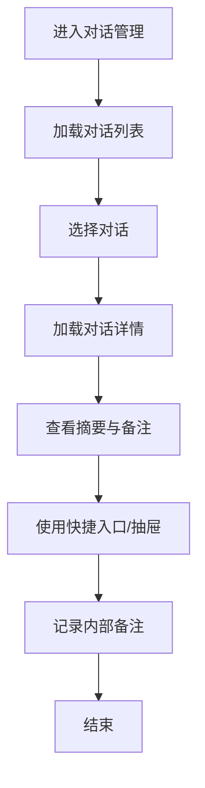
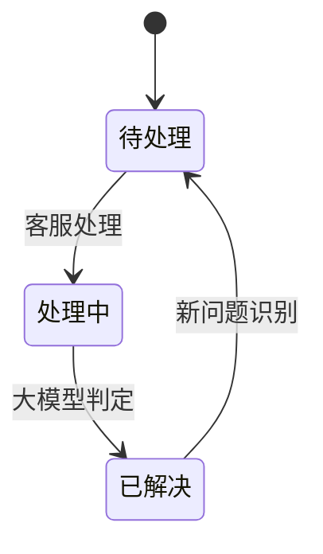
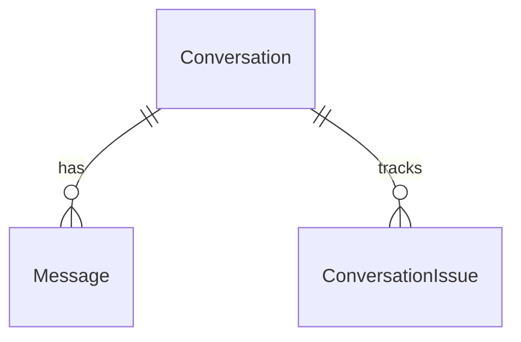

# 功能PRD：对话管理

## 文档信息

| 字段 | 说明 |
|------|------|
| **文档编号** | PRD-FEATURE-Conversation-Management-v1.0 |
| **功能名称** | 对话管理 |
| **核心价值** | 聚合多渠道对话与协作入口，提升处理效率与一致性 |
| **迭代目标** | 支持多渠道会话、快速筛选与AI辅助协作的对话处理 |
| **关联需求** | US-2.1-01, US-2.1-02, US-2.1-03 |
| **状态** | 草稿 |
| **创建日期** | 2026-01-14 |
| **更新日期** | 2026-01-14 |
| **文档Owner** | 产品负责人 |

---

## 1. 功能概述

### 1.1 功能定位

对话管理聚合多渠道群聊与客户对话，提供“多渠道会话 + 内部协作 + AI辅助”的处理入口，作为售后工作台的核心工作区。

### 1.2 目标用户

- **主要用户**: 一线客服
- **次要用户**: 质检专员、主管/经理

### 1.3 核心价值

**对用户的价值**:
- 减少跨系统切换，集中查看多渠道对话与摘要
- 通过快捷入口与AI建议提升处理效率

**对业务的价值**:
- 提升响应速度与一致性
- 增强协同与可追溯能力

### 1.4 优先级

- **优先级**: P0
- **RICE分数**: 88
  - Reach（影响用户数）: 120+客服
  - Impact（对用户价值）: 高
  - Confidence（成功把握）: 85%
  - Effort（开发成本）: 3周

---

## 2. 功能需求

### 2.1 用户故事

**US-01**: 作为一线客服，我希望在一个列表中查看所有对话，以便快速定位待处理问题。

**US-02**: 作为客服，我希望能通过筛选与搜索缩小范围，以便更快处理紧急对话。

**US-03**: 作为客服，我希望能看到对话摘要与客户等级，以便判断优先级。

**US-04**: 作为主管，我希望查看对话处理状态与内部备注，以便复盘处理质量。

**US-05**: 作为质检专员，我希望快速进入质检面板查看会话节选，以便完成质检复盘。

### 2.2 功能列表

| 功能项 | 描述 | 优先级 | 依赖 | 工作量 |
|-------|------|--------|------|--------|
| 对话列表 | 多渠道对话聚合、摘要与状态展示 | P0 | 消息接入 | 4天 |
| 搜索与筛选 | 状态/渠道/紧急度/等级/关键字 | P0 | 对话列表 | 3天 |
| 对话详情 | 消息流、摘要与内部备注 | P0 | 消息接入 | 4天 |
| 快捷入口 | 工单/回复建议/澄清/方案等入口 | P1 | 右侧抽屉 | 2天 |
| 右侧抽屉 | 经典分析与AI辅助面板 | P0 | 客户信息 | 4天 |
| 问题状态 | 问题级状态与会话关联 | P1 | 大模型判定 | 3天 |
| 未读与提醒 | 未读数与紧急度提示 | P1 | 消息接入 | 2天 |
| 外部依赖展示 | 渠道/客户/情绪等依赖数据的降级展示 | P1 | IM/CRM/AI/工单 | 2天 |

### 2.3 详细规格说明

#### 功能1：对话列表

**功能描述**: 展示对话名称、渠道、摘要、更新时间、客户等级、紧急度与未读数，支持滚动加载与高亮当前会话。

**外部依赖与降级展示**:
- **消息接入（IM渠道）**: 提供会话标题、最新消息、渠道标识。若接入失败，列表显示“数据同步中”，禁用进入详情入口，并提供重试。
- **客户画像（CRM）**: 提供客户等级、名称。若获取失败，客户等级显示“-”。
- **情绪分析（情绪服务）**: 提供情绪标签与图标。若缺失，隐藏情绪图标，不影响排序。
- **紧急度（大模型判定）**: 基于关键词与语义判定紧急度。若缺失，默认“普通”。

**字段定义**:
| 字段名 | 类型 | 必填 | 说明 | 示例 | 约束 |
|-------|------|------|------|------|------|
| conversationId | string | 是 | 对话ID | "c_123" | 唯一 |
| title | string | 是 | 对话名称 | "飞书群-售后" | 1-50 |
| channel | enum | 是 | 渠道 | "feishu" | feishu/qq/wechat |
| summary | string | 否 | 最近摘要 | "无法登录" | 0-200 |
| urgency | enum | 否 | 紧急度 | "high" | high/normal/low |
| slaLevel | enum | 否 | 客户等级 | "VIP" | VIP/KA0/KA1 |
| unreadCount | number | 否 | 未读数量 | 3 | >=0 |
| updatedAt | string | 是 | 最近更新时间 | "2026-01-14T10:00:00Z" | ISO8601 |
| sentiment | string | 否 | 情绪标签 | "负面" | 预置标签 |

**交互行为**:
1. 点击列表项 → 主内容区加载对话详情并高亮
2. 滚动列表 → 触发分页加载
3. 点击未读徽标 → 展开并滚动到第一条未读消息

**边界条件**:
- 无结果 → 展示空状态
- 列表加载失败 → 展示重试入口
- 未读数为0 → 隐藏未读徽标
- 渠道数据缺失 → 显示“未知渠道”，不影响点击

**权限要求**: 详见[权限与入口管理说明](2.10-Permission-Management-PRD.md)

---

#### 功能2：搜索与筛选

**功能描述**: 支持按关键字、状态、渠道、紧急度、客户等级筛选对话列表。

**外部依赖与降级展示**:
- **渠道列表**: 来源于IM接入配置。若加载失败，筛选项仅显示“全部”。
- **客户等级字典**: 来源于CRM或配置服务。若加载失败，隐藏等级筛选。
- **紧急度字典**: 来源于大模型判定策略配置。若加载失败，默认仅“普通”。

**字段定义**:
| 字段名 | 类型 | 必填 | 说明 | 示例 | 约束 |
|-------|------|------|------|------|------|
| keyword | string | 否 | 客户名/摘要关键词 | "登录" | 0-50 |
| status | enum | 否 | 状态 | "pending" | pending/in_progress/resolved |
| channel | enum | 否 | 渠道 | "wechat" | feishu/qq/wechat |
| urgency | enum | 否 | 紧急度 | "high" | high/normal/low |
| slaLevel | enum | 否 | 等级 | "VIP" | VIP/KA0/KA1 |

**交互行为**:
1. 输入关键词 → 触发搜索
2. 选择筛选项 → 列表实时刷新
3. 点击“清空筛选” → 恢复默认列表

**边界条件**:
- 组合筛选为空 → 展示空状态
- 搜索为空 → 不触发请求
- 筛选项缺失 → 自动回退到“全部”

**权限要求**: 详见[权限与入口管理说明](2.10-Permission-Management-PRD.md)

---

#### 功能3：对话详情

**功能描述**: 展示消息流、智能摘要、内部备注输入区与Agent模式切换，支持持续对话。

**外部依赖与降级展示**:
- **消息流（IM接入）**: 若获取失败，展示错误提示与重试按钮。
- **智能摘要（AI摘要服务）**: 若不可用，展示“暂无摘要”，不阻塞消息显示。
- **客户画像（CRM）**: 若不可用，隐藏客户等级与合同信息。

**字段定义**:
| 字段名 | 类型 | 必填 | 说明 | 示例 | 约束 |
|-------|------|------|------|------|------|
| messageId | string | 是 | 消息ID | "m_1" | 唯一 |
| senderRole | enum | 是 | 发送角色 | "customer" | customer/agent/internal |
| content | string | 是 | 内容 | "无法登录" | 1-2000 |
| sentiment | string | 否 | 情绪标签 | "负面" | 预置标签 |
| createdAt | string | 是 | 时间 | "2026-01-14T10:00:00Z" | ISO8601 |
| noteId | string | 否 | 备注ID | "n_1" | - |
| noteContent | string | 否 | 内部备注 | "已确认" | 0-1000 |

**交互行为**:
1. 滚动消息流 → 懒加载更多历史消息
2. 输入内部备注 → 保存为内部记录
3. 切换Agent模式 → 更新AI建议策略
4. 点击“定位对话” → 定位到指定消息

**对话输入框能力**:
1. 文本输入与发送：支持1-2000字符，Enter发送，Shift+Enter换行。
2. 表情与快捷符号：支持基础表情面板与表情插入，常用表情置顶。
3. @提及：支持@客服/内部成员（不支持@客户），发送后在消息中标注提及对象。
4. 附件发送：支持图片/文件上传并随消息发送，单条消息最多3个附件。
5. 话术优化：输入后可一键优化用语，生成替换内容供确认发送。
6. 草稿保存：按会话保存草稿，切换会话自动恢复未发送内容。
7. 发送状态反馈：发送中/失败提示，失败支持重试。

**对话输入框规格**:
- **附件类型**: 图片（png/jpg/jpeg/gif），文件（pdf/doc/docx/xls/xlsx/ppt/pptx/txt/zip）。
- **大小限制**: 单附件<=20MB，单条消息总大小<=50MB。
- **@范围**: 仅内部成员与客服角色，禁止@客户与外部联系人。
- **表情库**: 预置基础表情50个，支持最近使用记录（最多20个）。
- **话术优化模式**: 支持“礼貌化/简洁化/同理心”三种风格，默认“礼貌化”。
- **优化流程**: 点击入口→生成候选文本→用户确认替换→发送；不自动发送。
- **快捷键**: Ctrl+Enter发送（可配置开关，默认关闭）。

**边界条件**:
- IM接入不可用 → 提示“消息暂不可用”，保留内部备注
- 备注为空 → 不创建记录
- 摘要生成失败 → 展示“待生成”，允许手动刷新
- 输入为空或仅空白 → 不发送并提示
- 超出字数限制 → 阻止发送并提示
- IM发送失败 → 标记失败并提供重试入口
- @对象不存在或无权限 → 阻止发送并提示
- 附件上传失败 → 提示重试并保留草稿
- 话术优化不可用 → 隐藏入口或提示“服务不可用”
- 附件类型或大小不符合 → 阻止上传并提示限制
- 同时有文本与附件 → 作为一条消息发送

**权限要求**: 详见[权限与入口管理说明](2.10-Permission-Management-PRD.md)

---

#### 功能4：快捷入口与右侧抽屉

**功能描述**: 提供工单管理、回复建议、问题澄清、需求检测、解决方案、辅助排查、创建工单、生成故障报告等入口，并在右侧抽屉展示分析与AI辅助内容。

**文档关系说明**:
- **需求检测**存在独立PRD，面板详细规则与字段规范详见[需求检测PRD](2.5-Requirement-Detection-PRD.md)。
- 其他面板当前在本节集中说明，后续如面板复杂度提升可拆分独立PRD。

**面板清单**:
| 面板 | 类型 | 核心功能 | 数据来源 | 主要输出 |
|------|------|----------|----------|----------|
| 工单管理/创建工单 | 经典分析 | 查看/创建/关联工单 | 工单系统、对话上下文 | 工单记录与关联关系 |
| 回复建议 | AI辅助 | 生成可发送的回复候选 | AI服务、知识库 | 建议文本 |
| 问题澄清 | AI辅助 | 生成澄清问题列表 | AI服务、最近消息 | 澄清问题 |
| 需求检测 | AI辅助 | 生成需求卡片候选 | 需求检测服务 | 需求卡片 |
| 解决方案 | 经典分析 | 推荐解决方案/知识文档 | 知识库/FAQ | 方案链接与摘要 |
| 辅助排查 | 经典分析 | 故障排查清单与步骤 | 排查库、系统状态 | 排查记录 |
| 故障报告 | 经典分析 | 一键生成故障报告草稿 | 对话/工单/排查记录 | 报告草稿 |

**数据流程**:
1. 选择对话 → 传入conversationId、customerId、最近消息上下文
2. 点击入口 → 抽屉打开并按面板类型拉取数据
3. 面板操作（创建/发送/保存）→ 写入对应服务并回写状态
4. 抽屉关闭 → 保留面板与筛选状态，切换会话刷新上下文

**面板详细规格说明**:

##### 面板1：工单管理/创建工单

**功能描述**: 展示关联工单列表、状态与SLA；支持创建/关联工单。

**外部依赖与降级展示**:
- **工单系统**: 不可用时入口置灰，面板提示“工单系统维护中”。

**字段定义**:
| 字段名 | 类型 | 必填 | 说明 | 示例 | 约束 |
|-------|------|------|------|------|------|
| ticketId | string | 是 | 工单ID | "t_1001" | 唯一 |
| title | string | 是 | 工单标题 | "无法登录" | 1-100 |
| status | enum | 是 | 工单状态 | "open" | open/in_progress/closed |
| priority | enum | 否 | 优先级 | "P1" | P0-P3 |
| assignee | string | 否 | 负责人 | "张三" | 1-50 |
| sla | string | 否 | SLA | "24h" | - |
| sourceConversationId | string | 是 | 来源会话 | "c_1" | - |
| createdAt | string | 是 | 创建时间 | "2026-01-14T10:00:00Z" | ISO8601 |

**交互行为**:
1. 进入面板 → 拉取关联工单列表
2. 点击工单 → 跳转工单详情
3. 点击“创建工单” → 自动带入摘要/客户信息并允许编辑后提交
4. 点击“关联工单” → 选择已有工单并绑定

**边界条件**:
- 同一会话可关联多个工单
- 重复创建时提示“已有相似工单”

**权限要求**: 详见[权限与入口管理说明](2.10-Permission-Management-PRD.md)

##### 面板2：回复建议

**功能描述**: 基于对话上下文生成3-5条回复建议，不同类型便于客服选择，支持采纳写入输入框并编辑确认发送。

**外部依赖与降级展示**:
- **AI服务**: 不可用时提示“AI服务暂不可用”，隐藏回复建议卡片。

**字段定义**:
| 字段名 | 类型 | 必填 | 说明 | 示例 | 约束 |
|-------|------|------|------|------|------|
| suggestions | array | 是 | 回复建议列表 | - | 3-5条 |
| suggestionId | string | 是 | 建议ID | "s_1" | 唯一 |
| type | enum | 是 | 建议类型 | "empathy" | empathy/clarify/scope/temporary/followup |
| tag | string | 是 | 展示标签 | "稳定情绪" | 1-20 |
| content | string | 是 | 建议内容 | "建议您先尝试..." | 1-2000 |
| confidence | number | 否 | 置信度 | 0.78 | 0-1 |
| clarifyRequired | boolean | 否 | 是否需要澄清 | true | - |
| clarifyReason | string | 否 | 澄清原因 | "缺少错误信息" | 0-200 |
| clarifyQuestions | array | 否 | 需澄清的问题 | ["报错截图?"] | 1-5 |

**交互行为**:
1. 进入面板 → 展示3-5条回复建议，按类型分组或标签展示
2. 点击“采纳” → 写入输入框，不自动发送
3. 若需要澄清 → 展示“信息获取不清晰，需要做问题澄清”提示与入口
4. 点击“问题澄清” → 跳转到“问题澄清”面板并带入上下文生成澄清问题

**类型枚举与规则**:
- **empathy（稳定情绪）**: 客户情绪为negative/urgent/anxious/angry时必出1条，模板包含道歉+承诺跟进。
- **clarify（询问关键信息）**: 缺少关键字段时生成（见澄清触发规则），并触发澄清提示。
- **scope（影响范围确认）**: 出现“多个/批量/大面积/多人”时生成，询问影响范围与业务影响。
- **temporary（临时建议）**: 技术问题类且无明确禁用项时生成1条临时处置建议。
- **followup（跟进承诺）**: 任意问题类对话生成1条，用于时间承诺与同步机制。

**澄清触发规则**:
- 缺少错误信息（无“报错/错误码/截图/日志”等关键词）
- 缺少时间范围（无“何时/开始/持续多久”）
- 缺少影响范围（无“多少用户/范围/业务影响”）
- 缺少环境信息（无“版本/系统/网络/设备”）
- 若命中≥2条，显示“信息获取不清晰，需要做问题澄清”提示并展示入口

**边界条件**:
- 仅基于最近N条客户消息（默认N=4）
- 建议需人工确认后发送
- 低上下文信息 → 至少输出3条模板化建议
- 澄清入口不可用 → 提示“澄清服务不可用”
- 不需要澄清时 → 不显示澄清入口

**权限要求**: 详见[权限与入口管理说明](2.10-Permission-Management-PRD.md)

##### 面板3：问题澄清

**功能描述**: 生成澄清问题列表，帮助补全关键信息。

**外部依赖与降级展示**:
- **AI服务**: 不可用时提示“澄清建议不可用”。

**字段定义**:
| 字段名 | 类型 | 必填 | 说明 | 示例 | 约束 |
|-------|------|------|------|------|------|
| clarificationId | string | 是 | 澄清ID | "q_1" | 唯一 |
| content | string | 是 | 澄清问题 | "请问报错截图有吗？" | 1-200 |
| category | enum | 否 | 类型 | "info" | info/log/steps/environment |

**交互行为**:
1. 面板打开 → 自动基于上下文生成澄清结果
2. 若无需澄清 → 展示提示话术，可一键插入输入框
3. 若需要澄清 → 展示问题清单，可勾选合并后插入输入框
4. 提示文案展示 → “建议先补齐关键信息，再进行内部问题定位”

**澄清问题生成规则**:
- **error_info**: 询问错误码/报错截图/日志
- **time_range**: 询问开始时间/持续时长/是否间歇
- **impact_scope**: 询问受影响用户数/业务范围/损失
- **environment**: 询问版本/系统/网络/设备
- **steps**: 询问复现步骤/操作路径
- 默认输出3条，最多5条；若缺失项≤1，仅输出2条

**澄清问题示例**:
- “方便提供具体的报错截图或错误码吗？”
- “问题是从什么时候开始的，是否一直持续？”
- “受影响用户大概有多少，是否影响核心业务？”

**边界条件**:
- 澄清问题不超过5条
- 无明确问题时提示“当前信息已足够，可继续问题定位”

**权限要求**: 详见[权限与入口管理说明](2.10-Permission-Management-PRD.md)

##### 面板4：需求检测

**功能描述**: 识别需求并生成候选卡片，支持创建/忽略与状态流转。

**外部依赖与降级展示**:
- **需求检测服务**: 不可用时提示“识别服务异常，可手动创建”。

**字段定义**: 详见[需求检测PRD](2.5-Requirement-Detection-PRD.md)中的字段规范。

**交互行为**:
1. 系统识别 → 生成候选卡片
2. 客服确认 → 创建或忽略
3. 低置信度 → 提示补充字段后再创建

**边界条件**:
- 去重阈值与识别范围详见[需求检测PRD](2.5-Requirement-Detection-PRD.md)

**权限要求**: 详见[权限与入口管理说明](2.10-Permission-Management-PRD.md)

##### 面板5：解决方案

**功能描述**: 基于当前会话上下文提供排查步骤与参考资料卡片，帮助客服快速定位问题。

**外部依赖与降级展示**:
- **本地规则模板**: 当前实现使用前端模板生成，不依赖外部服务。

**字段定义**:
| 字段名 | 类型 | 必填 | 说明 | 示例 | 约束 |
|-------|------|------|------|------|------|
| steps | array | 是 | 排查步骤列表 | ["确认影响范围","检查日志"] | 3-6条 |
| referenceTag | string | 是 | 资料标签 | "KB" | KB/DOC/REF |
| referenceTitle | string | 是 | 资料标题 | "登录异常排查手册" | 1-100 |
| referenceMeta | string | 否 | 资料摘要 | "适用场景：登录失败" | 0-100 |

**交互行为**:
1. 进入面板 → 基于最近客户消息自动生成排查步骤
2. 同步展示参考资料卡片列表
3. 点击“查看” → 打开资料预览弹窗（显示参考全文）
4. 参考资料为空 → 隐藏资料区块

**生成规则**:
- 默认生成通用排查步骤5条
- 命中“登录/认证/账号/密码”关键词 → 使用登录异常排查步骤与资料
- 命中“无法访问/连接失败/超时/502/503”关键词 → 使用连接异常排查步骤与资料

**边界条件**:
- 未命中关键词 → 使用通用步骤与资料
- 参考资料为空 → 隐藏资料区，不展示占位文案
- 参考资料弹窗 → “显示参考全文”

**权限要求**: 详见[权限与入口管理说明](2.10-Permission-Management-PRD.md)

##### 面板6：辅助排查

**功能描述**: 基于当前对话生成排查优先级清单、工具建议与协作同步模板，支持一键发起手动排查与复制协作口径。

**外部依赖与降级展示**:
- **工具接入现状**: 当前面板仅展示工具入口与状态占位，实际未与监控告警中心/网关日志检索/变更审计台/缓存监控/客户影响面板打通。
- **平台接入**: 接入后支持自动拉取工具状态与结果摘要，未接入时保持“自动调用中”占位并支持手动跳转。

**字段定义**:
| 字段名 | 类型 | 必填 | 说明 | 示例 | 约束 |
|-------|------|------|------|------|------|
| summary | string | 否 | 问题概述 | "客户反馈出现异常" | 0-200 |
| checklist | array | 是 | 排查优先级清单 | - | 3-6条 |
| toolName | string | 是 | 工具名称 | "监控告警中心" | 1-50 |
| toolStatus | string | 否 | 工具状态 | "自动调用中" | 0-20 |
| collabChecklist | array | 是 | 协作补齐清单 | - | 3-5条 |
| collabTemplate | string | 是 | 协作同步模板 | "【故障同步】..." | 1-1000 |
| bannerText | string | 否 | 提示文案 | "建议优先完成1-3项" | 0-200 |

**交互行为**:
1. 进入面板 → 展示问题概述与排查优先级清单
2. 每条清单显示工具名称与状态，提供“手动排查”入口
3. 展示“需要同步给协作方的信息”清单与可复制模板
4. 点击“复制” → 复制协作模板到剪贴板并提示成功

**边界条件**:
- 工具不可用 → 仍显示“手动排查”按钮与默认工具名
- 复制失败 → 提示“复制失败，请手动选择文本”

**权限要求**: 详见[权限与入口管理说明](2.10-Permission-Management-PRD.md)

##### 面板7：故障报告

**功能描述**: 依赖模板输入，根据模版生成故障报告（只读），用于快速同步与回顾。

**外部依赖与降级展示**:
- **模板来源**: 线下提供模板并写入系统，不依赖在线模板服务。

**字段定义**:
| 字段名 | 类型 | 必填 | 说明 | 示例 | 约束 |
|-------|------|------|------|------|------|
| reportId | string | 否 | 报告编号 | "INC-2024-0815-001" | - |
| customerId | string | 否 | 客户ID | "CUST-102984" | - |
| customerName | string | 否 | 客户名称 | "ABC科技有限公司" | 1-100 |
| timeline | array | 否 | 时间线 | ["09:12异常告警","09:18客户反馈"] | 0-10 |
| impactScope | string | 否 | 影响范围 | "VIP客户 · 3个群组" | 0-200 |
| impactDuration | string | 否 | 影响时长 | "28分钟" | 0-50 |
| severity | enum | 否 | 故障级别 | "P1" | P0-P3 |
| status | string | 否 | 修复状态 | "处理中" | 0-50 |
| actions | string | 否 | 处置动作 | "重启认证服务..." | 0-500 |
| owner | string | 否 | 负责人 | "王工程师" | 0-50 |

**交互行为**:
1. 进入面板 → 渲染故障报告摘要
2. 模板仅替换占位字段，不支持编辑/导出，仅用于查看与同步参考

**边界条件**:
- 无可用数据 → 不展示报告摘要区块
- 数据获取异常 → 字段显示“--”

**权限要求**: 详见[权限与入口管理说明](2.10-Permission-Management-PRD.md)

---

#### 功能5：问题状态

**功能描述**: 基于大模型判定会话问题状态，仅用于对话列表筛选与展示标签，不涉及会话内交互或状态流转操作。

**外部依赖与降级展示**:
- **大模型判定**: 若不可用，列表不展示问题状态标签，状态筛选降级为“全部”。

**边界条件**:
- 连续对话出现新问题 → 重新判定状态并更新列表标签

**权限要求**: 详见[权限与入口管理说明](2.10-Permission-Management-PRD.md)

---

## 3. UI设计

### 3.1 页面布局

#### 布局方案1：四栏主工作区

**页面结构**:
```
┌────────────────────────────────────────────────────────┐
│ 顶部导航                                                 │
├──────┬───────────────────┬─────────────────┬──────────┤
│ Dock │ 左侧对话列表       │ 主对话区        │ 右侧抽屉 │
│      │                   │                 │          │
└──────┴───────────────────┴─────────────────┴──────────┘
```

**布局说明**:
- **左侧栏**: 280px，列表与筛选
- **主内容区**: 自适应宽度，消息流与输入区
- **右侧抽屉**: 360px，可收起

### 3.2 组件说明

#### 组件1：对话列表

**组件类型**: 列表/卡片

**位置**: 左侧栏

**样式规范**:
| 属性 | 值 |
|-----|---|
| 宽度 | 100% |
| 高度 | auto |
| 背景色 | #ffffff |
| 边框 | 1px solid #e5e5e5 |
| 圆角 | 6px |
| 内边距 | 12px |

**状态设计**:
| 状态 | 样式变化 | 触发条件 |
|-----|---------|---------|
| 默认 | 标题黑色，摘要灰色 | - |
| hover | 背景 #f5f5f5 | 鼠标悬停 |
| active | 左侧高亮条 | 当前对话 |
| disabled | 降低透明度 | 无权限 |

**交互行为**:
- 点击列表项加载详情
- 滚动加载更多

---

#### 组件2：右侧抽屉

**组件类型**: 抽屉/Tab

**位置**: 右侧

**样式规范**:
| 属性 | 值 |
|-----|---|
| 宽度 | 360px |
| 高度 | 100% |
| 背景色 | #ffffff |
| 边框 | 1px solid #e5e5e5 |
| 圆角 | 0 |
| 内边距 | 16px |

**交互行为**:
- Tab切换内容
- 关闭后保持状态

---

### 3.3 样式规范

#### 颜色规范

| 用途 | 颜色值 | 示例 |
|-----|--------|------|
| 主色调 | #1890ff | 主按钮、链接 |
| 成功色 | #52c41a | 成功提示 |
| 警告色 | #faad14 | 紧急度提示 |
| 错误色 | #f5222d | 异常提示 |
| 文字主色 | #1a1a1a | 标题、正文 |
| 文字次色 | #666666 | 辅助文字 |
| 边框色 | #e5e5e5 | 分割线 |
| 背景色 | #f5f5f5 | 页面背景 |

#### 字体规范

| 类型 | 字体 | 大小 | 行高 | 粗细 |
|-----|------|------|------|------|
| 页面标题 | PingFang SC | 20px | 28px | 600 |
| 模块标题 | PingFang SC | 16px | 24px | 500 |
| 正文 | PingFang SC | 14px | 22px | 400 |
| 辅助文字 | PingFang SC | 12px | 20px | 400 |

#### 间距规范

| 类型 | 值 |
|-----|------|
| 列表间距 | 12px |
| 组件间距 | 12px |
| 内边距（中） | 12px |
| 内边距（大） | 16px |

### 3.4 响应式设计

| 断点 | 宽度范围 | 布局调整 |
|-----|---------|---------|
| Desktop | >1200px | 四栏布局 |
| Tablet | 768-1199px | 抽屉折叠为覆盖层 |
| Mobile | <768px | 单栏列表+详情切换 |

---

## 4. 交互流程

### 4.1 主流程



**流程说明**:
1. 用户进入对话管理后加载列表
2. 选择对话并加载消息流与摘要
3. 通过快捷入口调用协作或AI辅助

### 4.2 异常分支

#### 异常1：对话加载失败

- **触发条件**: 网络或权限异常
- **处理方式**: 展示重试按钮并记录日志
- **用户提示**: “加载失败，请重试”
- **恢复方式**: 点击重试重新请求

---

### 4.3 状态机



**状态说明**: 状态由大模型后台判定，仅用于对话列表筛选。
| 状态 | 描述 | 触发条件 | 下一状态 |
|-----|------|---------|---------|
| 待处理 | 未处理问题 | 识别到新问题 | 处理中 |
| 处理中 | 正在处理 | 判定进入处理阶段 | 已解决 |
| 已解决 | 问题解决 | 识别到新问题 | 待处理 |

---

## 5. 接口定义

### 5.1 获取对话列表

**接口路径**: `/api/conversations`

**请求方法**: GET

**权限要求**: 详见[权限与入口管理说明](2.10-Permission-Management-PRD.md)

**查询参数**:
| 参数名 | 类型 | 必填 | 说明 | 默认值 |
|-------|------|------|------|------|
| status | string | 否 | 待处理/处理中/已解决 | all |
| channel | string | 否 | 渠道过滤 | all |
| keyword | string | 否 | 关键词 | - |
| page | number | 否 | 页码 | 1 |
| pageSize | number | 否 | 每页数量 | 20 |

**响应体**（成功）:
```json
{
  "success": true,
  "data": {
    "items": [
      {
        "conversationId": "c_1",
        "title": "飞书群-售后",
        "summary": "无法登录",
        "channel": "feishu",
        "urgency": "high",
        "slaLevel": "VIP",
        "unreadCount": 3,
        "updatedAt": "2026-01-14T10:00:00Z"
      }
    ],
    "total": 120
  }
}
```

---

### 5.2 获取对话详情

**接口路径**: `/api/conversations/{id}`

**请求方法**: GET

**权限要求**: 详见[权限与入口管理说明](2.10-Permission-Management-PRD.md)

**路径参数**:
| 参数名 | 类型 | 必填 | 说明 | 示例 |
|-------|------|------|------|------|
| id | string | 是 | 对话ID | "c_1" |

**响应体**（成功）:
```json
{
  "success": true,
  "data": {
    "id": "c_1",
    "messages": [
      {
        "messageId": "m_1",
        "senderRole": "customer",
        "content": "无法登录",
        "createdAt": "2026-01-14T10:00:00Z"
      }
    ]
  }
}
```

---

### 5.3 新增内部备注

**接口路径**: `/api/conversations/{id}/notes`

**请求方法**: POST

**权限要求**: 详见[权限与入口管理说明](2.10-Permission-Management-PRD.md)

**请求体**:
```json
{
  "content": "已确认客户环境",
  "visibility": "internal"
}
```

**响应体**（成功）:
```json
{
  "success": true,
  "data": {
    "noteId": "n_1",
    "createdAt": "2026-01-14T10:01:00Z"
  }
}
```

---

## 6. 数据模型

### 6.1 Conversation

**实体描述**: 会话主信息与状态。

**TypeScript接口定义**:
```typescript
interface Conversation {
  id: string;
  title: string;
  channel: 'feishu' | 'qq' | 'wechat';
  urgency?: 'high' | 'normal' | 'low';
  slaLevel?: 'VIP' | 'KA0' | 'KA1';
  summary?: string;
  unreadCount?: number;
  createdAt: Date;
  updatedAt: Date;
}

interface ConversationIssue {
  id: string;
  conversationId: string;
  summary: string;
  status: 'pending' | 'in_progress' | 'resolved';
  detectedBy: 'llm' | 'manual';
  resolvedAt?: Date;
}
```

**字段说明**:
| 字段名 | 类型 | 必填 | 说明 | 约束 | 默认值 |
|-------|------|------|------|------|--------|
| id | string | 是 | 对话ID | UUID | - |
| urgency | enum | 否 | 紧急度 | high/normal/low | normal |

**关联关系**:
- Conversation 一对多关联 Message
- Conversation 一对多关联 ConversationIssue

**索引设计**:
| 索引名称 | 字段 | 类型 | 说明 |
|---------|------|------|------|
| idx_conversation_updated | updatedAt | B-tree | 列表排序 |

---

### 6.2 ConversationIssue

**实体描述**: 会话内问题记录。

**TypeScript接口定义**:
```typescript
interface ConversationIssue {
  id: string;
  conversationId: string;
  summary: string;
  status: 'pending' | 'in_progress' | 'resolved';
  detectedBy: 'llm' | 'manual';
  resolvedAt?: Date;
}
```

---

### 6.3 Message

**实体描述**: 会话消息与内部备注。

**TypeScript接口定义**:
```typescript
interface Message {
  id: string;
  conversationId: string;
  senderRole: 'customer' | 'agent' | 'internal';
  content: string;
  sentiment?: string;
  createdAt: Date;
}
```

---

### 6.4 实体关系图（ERD）



---

## 7. 验收标准

### 7.1 功能验收

| 验收项 | 验收标准 | 优先级 | 测试方法 |
|-------|---------|--------|---------|
| 对话列表 | 显示摘要、等级、情绪、未读 | P0 | 手动 |
| 搜索筛选 | 多条件筛选生效 | P0 | 手动 |
| 对话详情 | 消息流与备注可用 | P0 | 手动 |
| 抽屉面板 | 经典分析与AI辅助可切换 | P1 | 手动 |
| 问题状态 | 状态可更新且记录 | P1 | 手动 |

### 7.2 性能验收

| 验收项 | 验收标准 | 测试方法 |
|-------|---------|---------|
| 列表加载 | <1秒（P95） | 手动/监控 |
| 筛选响应 | <300ms | 手动 |

### 7.3 安全验收

| 验收项 | 验收标准 | 测试方法 |
|-------|---------|---------|
| 权限控制 | 详见[权限与入口管理说明](2.10-Permission-Management-PRD.md) | 权限矩阵测试 |
| 日志记录 | 关键操作写入审计日志 | 日志检查 |

### 7.4 兼容性验收

| 验收项 | 验收标准 |
|-------|---------|
| 浏览器兼容 | Chrome/Edge 最近2个版本 |

---

## 8. 非功能需求

### 8.1 性能要求

| 指标 | 目标值 | 测量方法 |
|-----|--------|---------|
| 列表首屏 | <1秒（P95） | 监控 |
| 抽屉切换 | <500ms | 手动 |

### 8.2 可用性要求

| 指标 | 目标值 |
|-----|--------|
| 系统可用性 | >99% |
| 错误率 | <1% |

### 8.3 安全要求

- 传输加密：HTTPS
- 授权：RBAC（详见[权限与入口管理说明](2.10-Permission-Management-PRD.md)）
- 审计日志：记录备注与状态变更

### 8.4 可扩展性要求

- 对话列表支持按渠道扩展
- 抽屉面板支持新增Tab

### 8.5 可维护性要求

- 关键接口有日志与监控
- 文档同步更新

---

## 附录A：术语表

| 术语 | 定义 |
|-----|------|
| 对话 | 多渠道消息聚合的会话单元 |
| 问题状态 | 会话内单次问题的处理状态 |

---

## 附录B：外围系统依赖

| 系统 | 依赖说明 | API路径 | 负责人 |
|------|---------|--------|------|
| IM渠道 | 会话消息接入与渠道字典 | /im/webhook | IM接入团队 |
| CRM | 客户等级与基础信息 | /api/customers | CRM团队 |
| 情绪服务 | 情绪标签与情绪图标 | /api/sentiment | AI服务团队 |
| 大模型服务 | 紧急度判定与问题识别 | /api/llm/triage | AI服务团队 |
| 工单系统 | 工单创建与查询 | /api/tickets | 工单平台团队 |

---

## 附录C：待决策事项

| 事项ID | 事项描述 | 备选方案 | 决策人 | 截止日期 | 状态 |
|--------|---------|---------|--------|---------|------|
| Q-01 | 问题状态是否允许人工标记“已解决” | 允许/仅模型判定 | 产品负责人 | 2026-01-20 | ⏳待决策 |

---

## 附录D：变更历史

| 版本 | 日期 | 变更内容 | 变更人 | 审核人 |
|-----|------|---------|--------|--------|
| v1.0 | 2026-01-14 | 初始版本（按模板补全） | 产品负责人 | 产品负责人 |

---

**文档结束**
