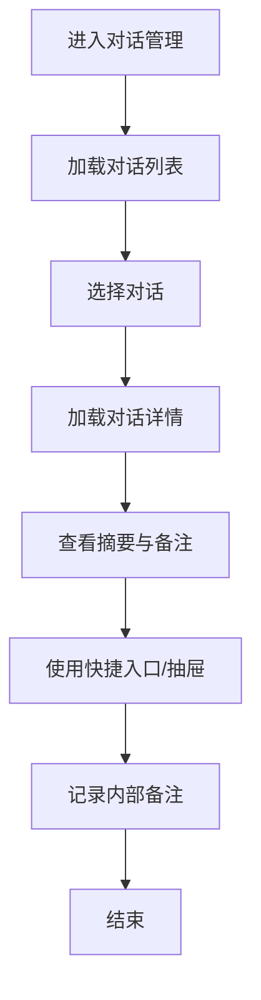
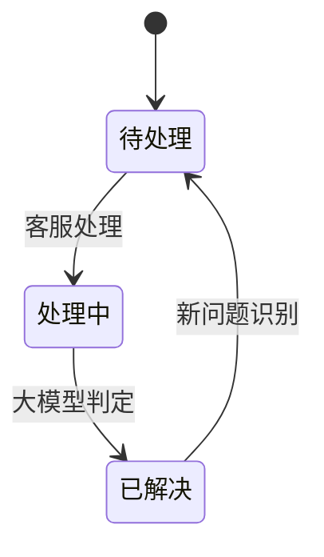
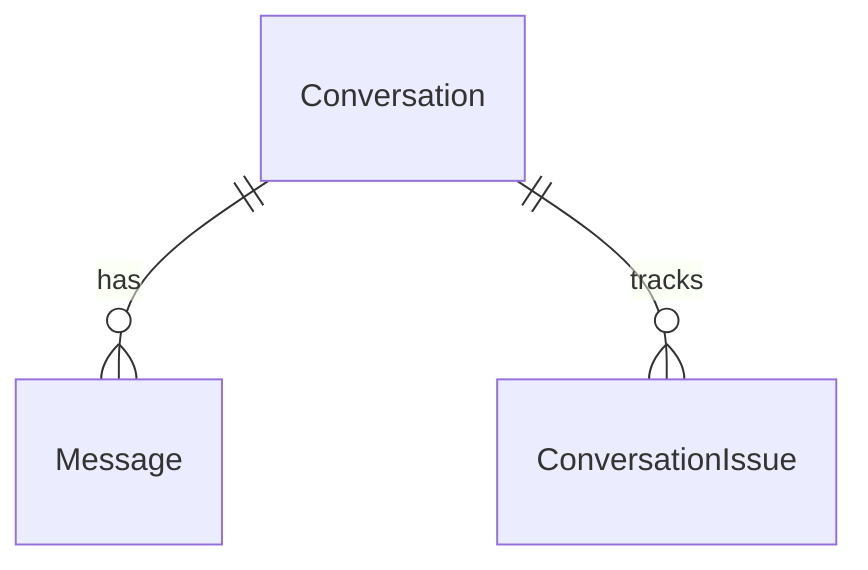

# 功能PRD：对话管理

## 文档信息

| 字段 | 说明 |
|------|------|
| **文档编号** | PRD-FEATURE-Conversation-Management-v1.0 |
| **功能名称** | 对话管理 |
| **核心价值** | 聚合多渠道对话与协作入口，提升处理效率与一致性 |
| **迭代目标** | 支持多渠道会话、快速筛选与AI辅助协作的对话处理 |
| **关联需求** | US-2.1-01, US-2.1-02, US-2.1-03 |
| **状态** | 草稿 |
| **创建日期** | 2026-01-14 |
| **更新日期** | 2026-01-14 |
| **文档Owner** | 产品负责人 |

---

## 1. 功能概述

### 1.1 功能定位

对话管理聚合多渠道群聊与客户对话，提供“多渠道会话 + 内部协作 + AI辅助”的处理入口，作为售后工作台的核心工作区。

### 1.2 目标用户

- **主要用户**: 一线客服
- **次要用户**: 质检专员、主管/经理

### 1.3 核心价值

**对用户的价值**:
- 减少跨系统切换，集中查看多渠道对话与摘要
- 通过快捷入口与AI建议提升处理效率

**对业务的价值**:
- 提升响应速度与一致性
- 增强协同与可追溯能力

### 1.4 优先级

- **优先级**: P0
- **RICE分数**: 88
  - Reach（影响用户数）: 120+客服
  - Impact（对用户价值）: 高
  - Confidence（成功把握）: 85%
  - Effort（开发成本）: 3周

---

## 2. 功能需求

### 2.1 用户故事

**US-01**: 作为一线客服，我希望在一个列表中查看所有对话，以便快速定位待处理问题。

**US-02**: 作为客服，我希望能通过筛选与搜索缩小范围，以便更快处理紧急对话。

**US-03**: 作为客服，我希望能看到对话摘要与客户等级，以便判断优先级。

**US-04**: 作为主管，我希望查看对话处理状态与内部备注，以便复盘处理质量。

**US-05**: 作为质检专员，我希望快速进入质检面板查看会话节选，以便完成质检复盘。

### 2.2 功能列表

| 功能项 | 描述 | 优先级 | 依赖 | 工作量 |
|-------|------|--------|------|--------|
| 对话列表 | 多渠道对话聚合、摘要与状态展示 | P0 | 消息接入 | 4天 |
| 搜索与筛选 | 状态/渠道/紧急度/等级/关键字 | P0 | 对话列表 | 3天 |
| 对话详情 | 消息流、摘要与内部备注 | P0 | 消息接入 | 4天 |
| 快捷入口 | 工单/回复建议/澄清/方案等入口 | P1 | 右侧抽屉 | 2天 |
| 右侧抽屉 | 经典分析与AI辅助面板 | P0 | 客户信息 | 4天 |
| 问题状态 | 问题级状态与会话关联 | P1 | 大模型判定 | 3天 |
| 未读与提醒 | 未读数与紧急度提示 | P1 | 消息接入 | 2天 |
| 外部依赖展示 | 渠道/客户/情绪等依赖数据的降级展示 | P1 | IM/CRM/AI/工单 | 2天 |

### 2.3 详细规格说明

#### 功能1：对话列表

**功能描述**: 展示对话名称、渠道、摘要、更新时间、客户等级、紧急度与未读数，支持滚动加载与高亮当前会话。

**外部依赖与降级展示**:
- **消息接入（IM渠道）**: 提供会话标题、最新消息、渠道标识。若接入失败，列表显示“数据同步中”，禁用进入详情入口，并提供重试。
- **客户画像（CRM）**: 提供客户等级、名称。若获取失败，客户等级显示“-”，名称退化为会话标题。
- **情绪分析（情绪服务）**: 提供情绪标签与图标。若缺失，隐藏情绪图标，不影响排序。
- **紧急度（大模型判定）**: 基于关键词与语义判定紧急度。若缺失，默认“普通”。

**字段定义**:
| 字段名 | 类型 | 必填 | 说明 | 示例 | 约束 |
|-------|------|------|------|------|------|
| conversationId | string | 是 | 对话ID | "c_123" | 唯一 |
| title | string | 是 | 对话名称 | "飞书群-售后" | 1-50 |
| channel | enum | 是 | 渠道 | "feishu" | feishu/qq/wechat |
| summary | string | 否 | 最近摘要 | "无法登录" | 0-200 |
| urgency | enum | 否 | 紧急度 | "high" | high/normal/low |
| slaLevel | enum | 否 | 客户等级 | "VIP" | VIP/KA0/KA1 |
| unreadCount | number | 否 | 未读数量 | 3 | >=0 |
| updatedAt | string | 是 | 最近更新时间 | "2026-01-14T10:00:00Z" | ISO8601 |
| sentiment | string | 否 | 情绪标签 | "负面" | 预置标签 |

**交互行为**:
1. 点击列表项 → 主内容区加载对话详情并高亮
2. 滚动列表 → 触发分页加载
3. 点击未读徽标 → 展开并滚动到第一条未读消息

**边界条件**:
- 无结果 → 展示空状态与“清除筛选”按钮
- 列表加载失败 → 展示重试入口
- 未读数为0 → 隐藏未读徽标
- 渠道数据缺失 → 显示“未知渠道”，不影响点击

**权限要求**:
- 客服：查看列表并进入详情
- 主管/质检：查看

---

#### 功能2：搜索与筛选

**功能描述**: 支持按关键字、状态、渠道、紧急度、客户等级筛选对话列表。

**外部依赖与降级展示**:
- **渠道列表**: 来源于IM接入配置。若加载失败，筛选项仅显示“全部”。
- **客户等级字典**: 来源于CRM或配置服务。若加载失败，隐藏等级筛选。
- **紧急度字典**: 来源于大模型判定策略配置。若加载失败，默认仅“普通”。

**字段定义**:
| 字段名 | 类型 | 必填 | 说明 | 示例 | 约束 |
|-------|------|------|------|------|------|
| keyword | string | 否 | 客户名/摘要关键词 | "登录" | 0-50 |
| status | enum | 否 | 状态 | "pending" | pending/in_progress/resolved |
| channel | enum | 否 | 渠道 | "wechat" | feishu/qq/wechat |
| urgency | enum | 否 | 紧急度 | "high" | high/normal/low |
| slaLevel | enum | 否 | 等级 | "VIP" | VIP/KA0/KA1 |

**交互行为**:
1. 输入关键词 → 触发搜索
2. 选择筛选项 → 列表实时刷新
3. 点击“清空筛选” → 恢复默认列表

**边界条件**:
- 组合筛选为空 → 展示空状态
- 搜索为空 → 不触发请求
- 筛选项缺失 → 自动回退到“全部”

**权限要求**:
- 全员可用

---

#### 功能3：对话详情

**功能描述**: 展示消息流、智能摘要、内部备注输入区与Agent模式切换，支持持续对话。

**外部依赖与降级展示**:
- **消息流（IM接入）**: 若获取失败，展示错误提示与重试按钮。
- **智能摘要（AI摘要服务）**: 若不可用，展示“暂无摘要”，不阻塞消息显示。
- **客户画像（CRM）**: 若不可用，隐藏客户等级与合同信息。

**字段定义**:
| 字段名 | 类型 | 必填 | 说明 | 示例 | 约束 |
|-------|------|------|------|------|------|
| messageId | string | 是 | 消息ID | "m_1" | 唯一 |
| senderRole | enum | 是 | 发送角色 | "customer" | customer/agent/internal |
| content | string | 是 | 内容 | "无法登录" | 1-2000 |
| sentiment | string | 否 | 情绪标签 | "负面" | 预置标签 |
| createdAt | string | 是 | 时间 | "2026-01-14T10:00:00Z" | ISO8601 |
| noteId | string | 否 | 备注ID | "n_1" | - |
| noteContent | string | 否 | 内部备注 | "已确认" | 0-1000 |

**交互行为**:
1. 滚动消息流 → 懒加载更多历史消息
2. 输入内部备注 → 保存为内部记录
3. 切换Agent模式 → 更新AI建议策略
4. 点击“定位对话” → 定位到指定消息

**边界条件**:
- IM接入不可用 → 提示“消息暂不可用”，保留内部备注
- 备注为空 → 不创建记录
- 摘要生成失败 → 展示“待生成”，允许手动刷新

**权限要求**:
- 客服：读写内部备注
- 质检/主管：查看

---

#### 功能4：快捷入口与右侧抽屉

**功能描述**: 提供工单管理、回复建议、问题澄清、解决方案、辅助排查、创建工单、生成故障报告等入口，并在右侧抽屉展示分析与AI辅助内容。

**外部依赖与降级展示**:
- **工单系统**: 若不可用，入口置灰并提示“工单系统维护中”。
- **AI辅助服务**: 若不可用，显示“AI服务暂不可用”，保留人工备注功能。
- **客户信息**: 若不可用，经典分析面板显示占位信息。

**交互行为**:
1. 点击快捷入口 → 打开右侧抽屉并定位对应面板
2. 切换“经典分析/AI辅助”Tab → 展示不同内容
3. 关闭抽屉 → 保留上次Tab状态

**边界条件**:
- 抽屉关闭时再次点击入口 → 自动展开并定位
- 当前模块非对话页 → 抽屉自动关闭
- 依赖服务不可用 → 抽屉展示降级提示与重试入口

**权限要求**:
- 客服：读写
- 主管/质检：查看

---

#### 功能5：问题状态

**功能描述**: 基于大模型判断每次会话提出的问题是否解决，形成问题级状态，状态与会话关联但不关闭会话。

**外部依赖与降级展示**:
- **问题状态服务**: 若写入失败，提示“状态更新失败，请重试”，并回滚展示状态。
- **大模型判定**: 若不可用，默认创建“待处理”问题并允许人工更新状态。

**交互行为**:
1. 识别到新问题 → 标记为“待处理”
2. 客服开始处理 → 标记为“处理中”
3. 大模型判定已解决 → 标记为“已解决”
4. 会话出现新问题 → 新建问题记录并回到“待处理”

**边界条件**:
- 连续对话出现新问题 → 新建问题记录
- 状态更新冲突 → 提示“状态已变更”，刷新详情

**权限要求**:
- 客服：可变更问题状态
- 主管/质检：查看

---

## 3. UI设计

### 3.1 页面布局

#### 布局方案1：四栏主工作区

**页面结构**:
```
┌────────────────────────────────────────────────────────┐
│ 顶部导航                                                 │
├──────┬───────────────────┬─────────────────┬──────────┤
│ Dock │ 左侧对话列表       │ 主对话区        │ 右侧抽屉 │
│      │                   │                 │          │
└──────┴───────────────────┴─────────────────┴──────────┘
```

**布局说明**:
- **左侧栏**: 280px，列表与筛选
- **主内容区**: 自适应宽度，消息流与输入区
- **右侧抽屉**: 360px，可收起

### 3.2 组件说明

#### 组件1：对话列表

**组件类型**: 列表/卡片

**位置**: 左侧栏

**样式规范**:
| 属性 | 值 |
|-----|---|
| 宽度 | 100% |
| 高度 | auto |
| 背景色 | #ffffff |
| 边框 | 1px solid #e5e5e5 |
| 圆角 | 6px |
| 内边距 | 12px |

**状态设计**:
| 状态 | 样式变化 | 触发条件 |
|-----|---------|---------|
| 默认 | 标题黑色，摘要灰色 | - |
| hover | 背景 #f5f5f5 | 鼠标悬停 |
| active | 左侧高亮条 | 当前对话 |
| disabled | 降低透明度 | 无权限 |

**交互行为**:
- 点击列表项加载详情
- 滚动加载更多

---

#### 组件2：右侧抽屉

**组件类型**: 抽屉/Tab

**位置**: 右侧

**样式规范**:
| 属性 | 值 |
|-----|---|
| 宽度 | 360px |
| 高度 | 100% |
| 背景色 | #ffffff |
| 边框 | 1px solid #e5e5e5 |
| 圆角 | 0 |
| 内边距 | 16px |

**交互行为**:
- Tab切换内容
- 关闭后保持状态

---

### 3.3 样式规范

#### 颜色规范

| 用途 | 颜色值 | 示例 |
|-----|--------|------|
| 主色调 | #1890ff | 主按钮、链接 |
| 成功色 | #52c41a | 成功提示 |
| 警告色 | #faad14 | 紧急度提示 |
| 错误色 | #f5222d | 异常提示 |
| 文字主色 | #1a1a1a | 标题、正文 |
| 文字次色 | #666666 | 辅助文字 |
| 边框色 | #e5e5e5 | 分割线 |
| 背景色 | #f5f5f5 | 页面背景 |

#### 字体规范

| 类型 | 字体 | 大小 | 行高 | 粗细 |
|-----|------|------|------|------|
| 页面标题 | PingFang SC | 20px | 28px | 600 |
| 模块标题 | PingFang SC | 16px | 24px | 500 |
| 正文 | PingFang SC | 14px | 22px | 400 |
| 辅助文字 | PingFang SC | 12px | 20px | 400 |

#### 间距规范

| 类型 | 值 |
|-----|------|
| 列表间距 | 12px |
| 组件间距 | 12px |
| 内边距（中） | 12px |
| 内边距（大） | 16px |

### 3.4 响应式设计

| 断点 | 宽度范围 | 布局调整 |
|-----|---------|---------|
| Desktop | >1200px | 四栏布局 |
| Tablet | 768-1199px | 抽屉折叠为覆盖层 |
| Mobile | <768px | 单栏列表+详情切换 |

---

## 4. 交互流程

### 4.1 主流程



**流程说明**:
1. 用户进入对话管理后加载列表
2. 选择对话并加载消息流与摘要
3. 通过快捷入口调用协作或AI辅助

### 4.2 异常分支

#### 异常1：对话加载失败

- **触发条件**: 网络或权限异常
- **处理方式**: 展示重试按钮并记录日志
- **用户提示**: “加载失败，请重试”
- **恢复方式**: 点击重试重新请求

---

### 4.3 状态机



**状态说明**:
| 状态 | 描述 | 可执行操作 | 下一状态 |
|-----|------|-----------|---------|
| 待处理 | 未处理问题 | 查看/筛选 | 处理中 |
| 处理中 | 正在处理 | 记录备注/打开抽屉 | 已解决 |
| 已解决 | 问题解决 | 继续对话 | 待处理 |

---

## 5. 接口定义

### 5.1 获取对话列表

**接口路径**: `/api/conversations`

**请求方法**: GET

**权限要求**: 需要登录

**查询参数**:
| 参数名 | 类型 | 必填 | 说明 | 默认值 |
|-------|------|------|------|------|
| status | string | 否 | 待处理/处理中/已解决 | all |
| channel | string | 否 | 渠道过滤 | all |
| keyword | string | 否 | 关键词 | - |
| page | number | 否 | 页码 | 1 |
| pageSize | number | 否 | 每页数量 | 20 |

**响应体**（成功）:
```json
{
  "success": true,
  "data": {
    "items": [
      {
        "conversationId": "c_1",
        "title": "飞书群-售后",
        "summary": "无法登录",
        "channel": "feishu",
        "urgency": "high",
        "slaLevel": "VIP",
        "unreadCount": 3,
        "updatedAt": "2026-01-14T10:00:00Z"
      }
    ],
    "total": 120
  }
}
```

---

### 5.2 获取对话详情

**接口路径**: `/api/conversations/{id}`

**请求方法**: GET

**权限要求**: 需要登录

**路径参数**:
| 参数名 | 类型 | 必填 | 说明 | 示例 |
|-------|------|------|------|------|
| id | string | 是 | 对话ID | "c_1" |

**响应体**（成功）:
```json
{
  "success": true,
  "data": {
    "id": "c_1",
    "messages": [
      {
        "messageId": "m_1",
        "senderRole": "customer",
        "content": "无法登录",
        "createdAt": "2026-01-14T10:00:00Z"
      }
    ]
  }
}
```

---

### 5.3 新增内部备注

**接口路径**: `/api/conversations/{id}/notes`

**请求方法**: POST

**权限要求**: 需要登录

**请求体**:
```json
{
  "content": "已确认客户环境",
  "visibility": "internal"
}
```

**响应体**（成功）:
```json
{
  "success": true,
  "data": {
    "noteId": "n_1",
    "createdAt": "2026-01-14T10:01:00Z"
  }
}
```

---

## 6. 数据模型

### 6.1 Conversation

**实体描述**: 会话主信息与状态。

**TypeScript接口定义**:
```typescript
interface Conversation {
  id: string;
  title: string;
  channel: 'feishu' | 'qq' | 'wechat';
  urgency?: 'high' | 'normal' | 'low';
  slaLevel?: 'VIP' | 'KA0' | 'KA1';
  summary?: string;
  unreadCount?: number;
  createdAt: Date;
  updatedAt: Date;
}

interface ConversationIssue {
  id: string;
  conversationId: string;
  summary: string;
  status: 'pending' | 'in_progress' | 'resolved';
  detectedBy: 'llm' | 'manual';
  resolvedAt?: Date;
}
```

**字段说明**:
| 字段名 | 类型 | 必填 | 说明 | 约束 | 默认值 |
|-------|------|------|------|------|--------|
| id | string | 是 | 对话ID | UUID | - |
| urgency | enum | 否 | 紧急度 | high/normal/low | normal |

**关联关系**:
- Conversation 一对多关联 Message
- Conversation 一对多关联 ConversationIssue

**索引设计**:
| 索引名称 | 字段 | 类型 | 说明 |
|---------|------|------|------|
| idx_conversation_updated | updatedAt | B-tree | 列表排序 |

---

### 6.2 ConversationIssue

**实体描述**: 会话内问题记录。

**TypeScript接口定义**:
```typescript
interface ConversationIssue {
  id: string;
  conversationId: string;
  summary: string;
  status: 'pending' | 'in_progress' | 'resolved';
  detectedBy: 'llm' | 'manual';
  resolvedAt?: Date;
}
```

---

### 6.3 Message

**实体描述**: 会话消息与内部备注。

**TypeScript接口定义**:
```typescript
interface Message {
  id: string;
  conversationId: string;
  senderRole: 'customer' | 'agent' | 'internal';
  content: string;
  sentiment?: string;
  createdAt: Date;
}
```

---

### 6.4 实体关系图（ERD）



---

## 7. 验收标准

### 7.1 功能验收

| 验收项 | 验收标准 | 优先级 | 测试方法 |
|-------|---------|--------|---------|
| 对话列表 | 显示摘要、等级、情绪、未读 | P0 | 手动 |
| 搜索筛选 | 多条件筛选生效 | P0 | 手动 |
| 对话详情 | 消息流与备注可用 | P0 | 手动 |
| 抽屉面板 | 经典分析与AI辅助可切换 | P1 | 手动 |
| 问题状态 | 状态可更新且记录 | P1 | 手动 |

### 7.2 性能验收

| 验收项 | 验收标准 | 测试方法 |
|-------|---------|---------|
| 列表加载 | <1秒（P95） | 手动/监控 |
| 筛选响应 | <300ms | 手动 |

### 7.3 安全验收

| 验收项 | 验收标准 | 测试方法 |
|-------|---------|---------|
| 权限控制 | 不同角色权限隔离 | 权限矩阵测试 |
| 日志记录 | 关键操作写入审计日志 | 日志检查 |

### 7.4 兼容性验收

| 验收项 | 验收标准 |
|-------|---------|
| 浏览器兼容 | Chrome/Edge 最近2个版本 |

---

## 8. 非功能需求

### 8.1 性能要求

| 指标 | 目标值 | 测量方法 |
|-----|--------|---------|
| 列表首屏 | <1秒（P95） | 监控 |
| 抽屉切换 | <500ms | 手动 |

### 8.2 可用性要求

| 指标 | 目标值 |
|-----|--------|
| 系统可用性 | >99% |
| 错误率 | <1% |

### 8.3 安全要求

- 传输加密：HTTPS
- 授权：RBAC
- 审计日志：记录备注与状态变更

### 8.4 可扩展性要求

- 对话列表支持按渠道扩展
- 抽屉面板支持新增Tab

### 8.5 可维护性要求

- 关键接口有日志与监控
- 文档同步更新

---

## 附录A：术语表

| 术语 | 定义 |
|-----|------|
| 对话 | 多渠道消息聚合的会话单元 |
| 问题状态 | 会话内单次问题的处理状态 |

---

## 附录B：外围系统依赖

| 系统 | 依赖说明 | API路径 | 负责人 |
|------|---------|--------|------|
| IM渠道 | 会话消息接入与渠道字典 | /im/webhook | IM接入团队 |
| CRM | 客户等级与基础信息 | /api/customers | CRM团队 |
| 情绪服务 | 情绪标签与情绪图标 | /api/sentiment | AI服务团队 |
| 大模型服务 | 紧急度判定与问题识别 | /api/llm/triage | AI服务团队 |
| 工单系统 | 工单创建与查询 | /api/tickets | 工单平台团队 |

---

## 附录C：待决策事项

| 事项ID | 事项描述 | 备选方案 | 决策人 | 截止日期 | 状态 |
|--------|---------|---------|--------|---------|------|
| Q-01 | 问题状态是否允许人工标记“已解决” | 允许/仅模型判定 | 产品负责人 | 2026-01-20 | ⏳待决策 |

---

## 附录D：变更历史

| 版本 | 日期 | 变更内容 | 变更人 | 审核人 |
|-----|------|---------|--------|--------|
| v1.0 | 2026-01-14 | 初始版本（按模板补全） | 产品负责人 | 产品负责人 |

---

**文档结束**
