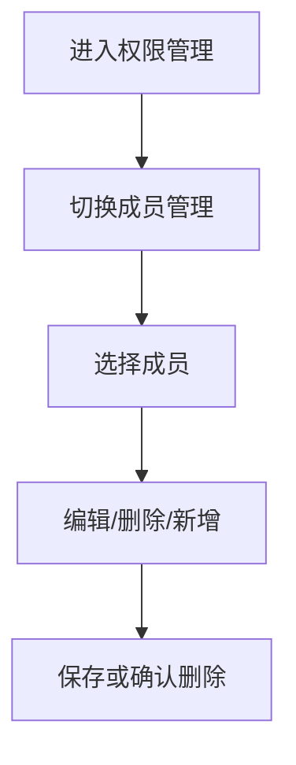
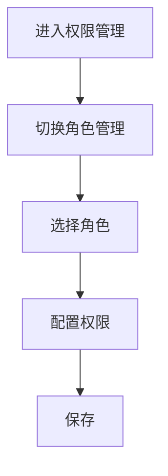
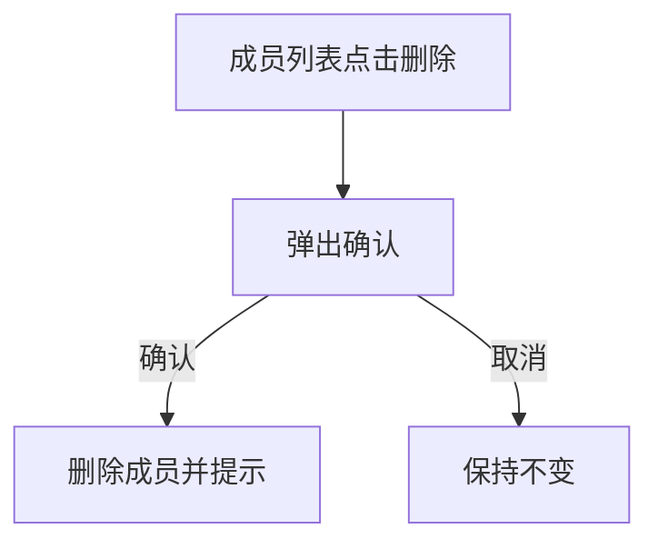

# 功能PRD：权限与入口管理

## 文档信息

| 字段 | 说明 |
|------|------|
| **文档编号** | PRD-FEATURE-Permission-Management-v1.0 |
| **功能名称** | 权限与入口管理 |
| **核心价值** | 统一权限口径，确保所有入口与接口可独立配置，支撑精细化运营 |
| **迭代目标** | Web端提供RBAC配置入口，支持成员/角色管理与权限配置，权限覆盖入口、模块与操作按钮 |
| **关联需求** | US-2.8-01, US-2.9-01 |
| **状态** | 草稿 |
| **创建日期** | 2026-01-14 |
| **更新日期** | 2026-02-09 |
| **文档Owner** | 产品负责人 |

---

## 1. 功能概述

### 1.1 功能定位

权限与入口管理提供统一的权限模型、配置入口与权限矩阵，保障系统入口、功能模块与操作按钮可精细化配置。

### 1.2 目标用户

- **主要用户**: 系统管理员
- **次要用户**: 主管/运营

### 1.3 核心价值

**对用户的价值**:
- 管理员可集中配置成员与角色权限
- 快速按角色切换入口可见性与操作能力

**对业务的价值**:
- 支撑精细化运营与权限收敛
- 降低权限碎片化带来的维护成本

### 1.4 优先级

- **优先级**: P0
- **RICE分数**: 86
  - Reach（影响用户数）: 20+管理员/主管
  - Impact（对用户价值）: 高
  - Confidence（成功把握）: 80%
  - Effort（开发成本）: 2周

---

## 2. 功能需求

### 2.1 用户故事

**US-01**: 作为管理员，我希望按角色集中配置权限，以便快速完成权限收敛。

**US-02**: 作为管理员，我希望为成员分配角色，以便批量控制入口与按钮能力。

**US-03**: 作为主管，我希望权限策略可按模块与动作拆分，以便精细化运营。

### 2.2 功能列表

| 功能项 | 描述 | 优先级 | 依赖 | 工作量 |
|-------|------|--------|------|--------|
| RBAC模型 | 角色-权限-成员三层结构 | P0 | 权限服务 | 3天 |
| 权限配置入口 | Dock新增“权限”入口 | P0 | UI布局 | 1天 |
| 成员管理 | 新增/编辑/删除成员、分配角色 | P0 | 权限服务 | 3天 |
| 角色管理 | 新增角色并配置权限 | P0 | 权限服务 | 3天 |
| 权限矩阵 | 入口/模块/按钮/接口统一清单 | P0 | PRD同步 | 2天 |
| 权限策略 | 无权限隐藏/只读/禁用策略 | P1 | 前端拦截 | 2天 |

### 2.3 详细规格说明

#### 功能1：RBAC模型

**功能描述**: 采用角色-权限-成员三层结构，权限粒度覆盖入口、模块与操作按钮。

**字段定义**:
| 字段名 | 类型 | 必填 | 说明 | 示例 | 约束 |
|-------|------|------|------|------|------|
| roleId | string | 是 | 角色ID | "role_admin" | 唯一 |
| roleName | string | 是 | 角色名称 | "管理员" | 1-20 |
| permissions | array | 是 | 权限列表 | ["dock.reports", "actions.reply.suggest"] | >=1 |
| memberId | string | 是 | 成员ID | "user_001" | 唯一 |
| memberRole | string | 是 | 成员角色 | "role_admin" | roleId |

**交互行为**:
1. 创建角色 → 设置权限 → 保存
2. 新增成员 → 绑定角色 → 保存
3. 权限变更 → 前端实时生效

**边界条件**:
- 权限缺失 → 入口隐藏或降级只读
- 角色被删除 → 需重新分配成员角色

**权限要求**:
- 管理员：读写
- 主管：只读

---

#### 功能2：成员管理

**功能描述**: 管理成员列表并为成员分配角色，支持新增/编辑/删除。

**字段定义**:
| 字段名 | 类型 | 必填 | 说明 | 示例 | 约束 |
|-------|------|------|------|------|------|
| memberId | string | 是 | 成员ID | "user_001" | 唯一 |
| name | string | 是 | 成员姓名 | "张敏" | 1-20 |
| email | string | 是 | 企业邮箱 | "min.zhang@acme.com" | 5-100 |
| roleId | string | 是 | 角色ID | "role_agent" | 需存在 |
| remark | string | 否 | 备注 | "对话/知识应用" | 0-50 |
| status | enum | 否 | 状态 | "active" | active/disabled |

**交互行为**:
1. 点击“新增成员” → 填写成员姓名、邮箱、角色、备注 → 保存
2. 点击“编辑” → 更新成员信息与角色
3. 点击“删除” → 二次确认后删除

**边界条件**:
- 角色不存在 → 禁止保存并提示
- 删除当前登录账号 → 禁止删除并提示
- 成员姓名为空 → 禁止保存并提示
- 邮箱与公司邮箱域名不一致 → 禁止保存并提示
- 邮箱已存在 → 禁止保存并提示

**权限要求**:
- 管理员：读写

**校验规则（新增/编辑成员）**:
- `name`: 必填，1-20字符，仅支持中英文、数字、空格、点、短横线
- `email`: 必填，5-100字符
  - 必须为有效邮箱格式（本地部分+@+域名）
  - 必须匹配公司邮箱域名白名单（来自企业配置）
  - 必须全局唯一（系统内成员维度）
  - 新增时：通过邮箱查询SSO目录存在性，查询失败或不存在则阻止保存
- `roleId`: 必填，必须存在且可用
- `remark`: 可选，0-50字符
- `status`: 可选，默认 `active`

**账号与登录策略**:
- 不设置初始密码
- 成员账号由公司SSO单点登录系统接管
- 新增成员仅建立系统内成员记录与角色绑定
- 依赖公司提供SSO接口文档，由本系统完成对接与联调

---

#### 功能3：角色管理

**功能描述**: 管理角色并配置权限清单，新增角色需填写名称。

**字段定义**:
| 字段名 | 类型 | 必填 | 说明 | 示例 | 约束 |
|-------|------|------|------|------|------|
| roleId | string | 是 | 角色ID | "role_admin" | 唯一 |
| roleName | string | 是 | 角色名称 | "管理员" | 1-20 |
| description | string | 否 | 角色描述 | "报表/质检管理" | 0-50 |
| permissions | array | 是 | 权限列表 | ["dock.reports"] | >=1 |

**交互行为**:
1. 点击“新增角色” → 填写角色名称 → 保存
2. 选择角色 → 勾选权限 → 保存

**边界条件**:
- 角色名称为空 → 禁止保存并提示
- 权限清单为空 → 禁止保存并提示
- 角色名称重复 → 禁止保存并提示

**权限要求**:
- 管理员：读写

**校验规则（新增/编辑角色）**:
- `roleName`: 必填，1-20字符，支持中英文、数字、空格、点、短横线，不允许纯空格
- `description`: 可选，0-50字符
- `permissions`: 必填，至少1项
- `roleId`: 系统生成或按规范生成，唯一性校验

---

#### 功能4：权限策略

**功能描述**: 定义无权限时的展示与操作策略。

**策略定义**:
- 入口级：无权限入口隐藏
- 模块级：无权限模块不可见或只读
- 操作级：无权限按钮禁用或隐藏

**边界条件**:
- 权限服务不可用 → 使用本地缓存或默认权限

**权限要求**:
- 管理员：可配置

---

## 3. UI设计

### 3.1 页面布局

#### 布局方案1：顶部Tab切换（成员管理 / 角色管理）

**页面结构**:
```
┌─────────────────────────────────────┐
│ 权限管理（成员管理 | 角色管理）      │
├─────────────────────────────────────┤
│ 成员管理：成员列表（含列头）         │
│ 角色管理：角色列表 + 权限配置        │
└─────────────────────────────────────┘
```

**布局说明**:
- **顶部Tab**: 切换“成员管理/角色管理”
- **成员管理区**: 列表呈现成员信息与操作
- **角色管理区**: 角色列表 + 权限配置

### 3.2 组件说明

#### 组件1：成员列表

**组件类型**: 列表/表格

**位置**: 成员管理Tab左侧

**字段列**:
| 列名 | 说明 |
|-----|------|
| 成员 | 成员姓名 |
| 邮箱 | 企业邮箱 |
| 角色 | 当前角色 |
| 备注 | 备注信息 |
| 状态 | 当前状态 |
| 操作 | 编辑/删除 |

**交互行为**:
- 点击“编辑/删除” → 弹窗或二次确认

---

#### 组件2：角色权限配置面板

**组件类型**: 表单/复选框

**位置**: 角色管理Tab右侧

**交互行为**:
- 勾选权限 → 保存

---

#### 组件3：角色列表

**组件类型**: 列表

**位置**: 角色管理Tab左侧

**交互行为**:
- 点击角色 → 右侧权限配置联动

---

### 3.3 样式规范

- 颜色、字体、间距与全局一致

### 3.4 响应式设计

| 断点 | 宽度范围 | 布局调整 |
|-----|---------|---------|
| Desktop | >1200px | 左右双栏 |
| Tablet | 768-1199px | 纵向堆叠 |
| Mobile | <768px | Tab + 单列 |

---

## 4. 交互流程

### 4.1 成员管理流程



### 4.2 角色管理流程



### 4.3 删除成员流程



---

## 5. 接口定义

### 5.1 获取权限配置

**接口路径**: `/api/permissions`

**请求方法**: GET

**权限要求**: 管理员

**响应体**:
```json
{
  "success": true,
  "data": {
    "roles": [
      {
        "id": "role_admin",
        "name": "管理员",
        "description": "全局管理与配置",
        "permissions": ["dock.permissions", "actions.ticket.manage"]
      }
    ],
    "members": [
      {
        "id": "user_001",
        "name": "张敏",
        "email": "min.zhang@acme.com",
        "roleId": "role_admin",
        "remark": "对话/知识应用",
        "status": "active"
      }
    ]
  }
}
```

---

### 5.2 保存角色权限

**接口路径**: `/api/permissions/roles`

**请求方法**: POST/PUT

**权限要求**: 管理员

**请求体**:
```json
{
  "id": "role_admin",
  "name": "管理员",
  "description": "全局管理与配置",
  "permissions": ["dock.permissions", "actions.ticket.manage"]
}
```

---

### 5.3 保存成员角色

**接口路径**: `/api/permissions/members`

**请求方法**: POST/PUT

**权限要求**: 管理员

**请求体**:
```json
{
  "id": "user_001",
  "name": "张敏",
  "email": "min.zhang@acme.com",
  "roleId": "role_agent",
  "remark": "对话/知识应用",
  "status": "active"
}
```

---

### 5.4 删除成员

**接口路径**: `/api/permissions/members/{id}`

**请求方法**: DELETE

**权限要求**: 管理员

---

### 5.5 权限项字典

**接口路径**: `/api/permissions/items`

**请求方法**: GET

**权限要求**: 管理员

**响应体**:
```json
{
  "success": true,
  "data": [
    {
      "group": "Dock导航",
      "items": [
        { "key": "dock.messages", "label": "消息入口" }
      ]
    }
  ]
}
```

---

## 6. 数据模型

### 6.1 Role

```typescript
interface Role {
  id: string;
  name: string;
  description?: string;
  permissions: string[];
}
```

### 6.2 Member

```typescript
interface Member {
  id: string;
  name: string;
  email: string;
  roleId: string;
  remark?: string;
  status?: 'active' | 'disabled';
}
```

### 6.3 PermissionItem

```typescript
interface PermissionItem {
  key: string;
  label: string;
  group: string;
}
```

### 6.4 PermissionPolicy

```typescript
interface PermissionPolicy {
  mode: 'hide' | 'disable' | 'readonly';
  fallbackRole?: string;
}
```

---

## 7. 验收标准

### 7.1 功能验收

| 验收项 | 验收标准 | 优先级 | 测试方法 |
|-------|---------|--------|---------|
| 成员管理 | 可新增/编辑/删除成员并分配角色 | P0 | 手动 |
| 邮箱校验 | 公司邮箱域名校验与唯一性校验生效 | P0 | 手动 |
| SSO接入 | 新增成员需在SSO目录存在且无需初始密码 | P0 | 手动 |
| 角色管理 | 可新增角色并配置权限 | P0 | 手动 |
| 权限生效 | 权限变更能影响入口/按钮 | P0 | 手动 |
| 无权限策略 | 入口隐藏或禁用策略生效 | P1 | 手动 |
| 删除提示 | 删除成员需二次确认并提示 | P1 | 手动 |

### 7.2 性能验收

| 验收项 | 验收标准 | 测试方法 |
|-------|---------|---------|
| 页面加载 | <2秒 | 手动 |

---

## 8. 非功能需求

### 8.1 性能要求

| 指标 | 目标值 | 测量方法 |
|-----|--------|---------|
| 权限加载 | <500ms | 监控 |

### 8.2 可用性要求

| 指标 | 目标值 |
|-----|--------|
| 系统可用性 | >99% |

### 8.3 安全要求

- 权限配置操作需记录审计日志
- 权限接口必须鉴权
- 权限变更需记录操作者与时间戳

### 8.4 可扩展性要求

- 支持新增角色与权限项
- 支持权限维度扩展（组织/渠道/环境）

### 8.5 可维护性要求

- 权限矩阵集中维护
- 权限变更需版本化与灰度

---

## 附录A：权限矩阵汇总（按文档）

| 文档 | 功能/入口/接口 | 权限要求 | 无权限处理/范围 | 备注（可配置项） |
|------|---------------|----------|-----------------|------------------|
| 2.1-Conversation-Management-PRD | 对话列表/对话详情/快捷入口/问题状态 | 按登录账号可见会话范围 | 未加入群聊的对话不展示 | 可配置数据范围规则、入口可见性 |
| 2.1-Conversation-Management-PRD | 搜索与筛选 | 全员可用 | - | 可配置开关与筛选项范围 |
| 2.1-Conversation-Management-PRD | /api/conversations（GET） | 需要登录 | 未登录禁止访问 | 接口访问控制、鉴权策略 |
| 2.1-Conversation-Management-PRD | /api/conversations/{id}（GET） | 需要登录 | 未登录禁止访问 | 接口访问控制、鉴权策略 |
| 2.1-Conversation-Management-PRD | /api/conversations/{id}/notes（POST） | 需要登录 | 未登录禁止访问 | 读写权限可独立配置 |
| 2.2-Customer-Management-PRD | 客户信息卡片/合同指标/已购产品/历史对话 | 客服、主管只读 | 超过权限范围隐藏敏感内容 | 模块可见性、字段脱敏规则 |
| 2.2-Customer-Management-PRD | /api/customers/{id}（GET） | 需要登录 | 未登录禁止访问 | 接口访问控制 |
| 2.3-Knowledge-Base-PRD | 知识应用入口 | 客服、管理员具备页面权限 | 无权限入口隐藏 | 菜单入口与页面权限可配置 |
| 2.3-Knowledge-Base-PRD | 语义/关键词检索 | 客服、主管只读 | 无权限禁止检索 | 检索入口与数据范围可配置 |
| 2.3-Knowledge-Management-PRD | 知识管理入口 | 管理员可见，客服无权限 | 无权限入口隐藏 | 菜单入口与页面权限可配置 |
| 2.3-Knowledge-Management-PRD | 分类树浏览 | 知识管理员只读 | 无权限隐藏或禁用 | 分类可见范围、读写权限 |
| 2.3-Knowledge-Management-PRD | 文档列表/上传/详情/删除 | 知识管理员读写 | 无权限禁用操作 | 读写权限与下载/复制可配置 |
| 2.3-Knowledge-Management-PRD | FAQ管理/文档-FAQ关联 | 知识管理员读写 | 无权限禁用操作 | 关联操作可配置 |
| 2.3-Knowledge-Management-PRD | /api/knowledge/docs（POST） | 管理员 | 未授权禁止访问 | 接口写权限独立配置 |
| 2.4-Report-Center-PRD | 报表入口 | 管理层、主管只读 | 无权限提示后阻断访问 | 入口可见性、角色范围 |
| 2.4-Report-Center-PRD | 指标卡片 | 管理层只读 | 无权限不展示数据 | 模块级权限 |
| 2.4-Report-Center-PRD | /api/reports/summary（GET） | 管理层 | 未授权禁止访问 | 接口访问控制 |
| 2.5-Requirement-Detection-PRD | 需求识别/需求卡片 | 客服读写、产品经理只读 | 无权限禁用或降级 | 读写权限可配置 |
| 2.5-Requirement-Detection-PRD | 面板入口 | - | 无权限隐藏入口 | 入口开关独立配置 |
| 2.5-Requirement-Detection-PRD | /mcp/detectRequirement（POST） | 需要登录 | 未登录禁止访问 | 接口访问控制 |
| 2.6-Quality-Inspection-PRD | 质检概览 | 质检、主管只读 | 无权限禁用访问 | 角色范围可配置 |
| 2.6-Quality-Inspection-PRD | /api/quality/overview（GET） | 质检角色 | 未授权禁止访问 | 接口访问控制 |
| 2.7-Toolbox-PRD（参考） | 系统工具 | 管理员读写，其他只读 | 无权限工具隐藏 | 工具级权限独立配置 |
| 2.7-Toolbox-PRD（参考） | 权限加载与降级 | 登录后加载权限配置 | 权限加载失败降级只读 | 权限服务与缓存策略 |
| 2.8-UI-Layout-PRD | Dock导航入口 | 默认全员可用 | 无权限入口隐藏 | 导航项级权限配置 |
| 2.8-UI-Layout-PRD | Dock“权限”入口 | 管理员 | 无权限入口隐藏 | 入口可见性与配置页访问权限 |
| 2.8-UI-Layout-PRD | 权限服务依赖 | /api/permissions | - | 导航与模块权限统一来源 |
| 2.9-Platform-Foundation-PRD | 错误详情查看 | 管理员可见 | 无权限隐藏详情 | 错误详情权限单独配置 |
| 2.9-Platform-Foundation-PRD | 对话内容脱敏与访问控制 | 按角色/范围控制 | 无权限字段脱敏或隐藏 | 数据脱敏规则可配置 |

---

## 附录B：权限项清单（按钮级）

| 分组 | 权限Key | 说明 |
|------|---------|------|
| Dock导航 | dock.messages | 消息入口 |
| Dock导航 | dock.messages.dialog | 消息-对话 |
| Dock导航 | dock.messages.tasks | 消息-任务 |
| Dock导航 | dock.knowledge | 知识入口 |
| Dock导航 | dock.tools | 工具入口 |
| Dock导航 | dock.reports | 报表入口 |
| Dock导航 | dock.permissions | 权限入口 |
| 对话窗口快捷操作 | analysis.panel.open | 分析面板 |
| 对话窗口快捷操作 | chat.mode.auto | Agent自动 |
| 对话窗口快捷操作 | chat.mode.supervised | Agent监督 |
| 对话窗口快捷操作 | chat.mode.human | 人工优先 |
| 对话窗口快捷操作 | chat.action.emoji | 表情 |
| 对话窗口快捷操作 | chat.action.attachment | 附件 |
| 对话窗口快捷操作 | chat.action.mention | 提及 |
| 对话窗口快捷操作 | chat.action.optimize | 话术优化 |
| 对话窗口快捷操作 | chat.action.send | 发送消息 |
| 对话窗口快捷操作 | ai.reply.adopt | 采纳回复建议 |
| 对话快捷入口 | actions.ticket.manage | 工单管理 |
| 对话快捷入口 | actions.reply.suggest | 回复建议 |
| 对话快捷入口 | actions.clarify | 问题澄清 |
| 对话快捷入口 | actions.requirement.detect | 需求检测 |
| 对话快捷入口 | actions.ai.solution | AI解决方案 |
| 对话快捷入口 | actions.assist.check | 辅助排查 |
| 对话快捷入口 | actions.ticket.create | 创建工单 |
| 对话快捷入口 | actions.fault.report | 生成故障报告 |
| 需求检测 | requirements.refresh | 刷新 |
| 需求检测 | requirements.scan | 扫描当前对话 |
| 需求检测 | requirements.create | 创建卡片 |
| 需求检测 | requirements.ignore | 忽略 |
| 需求检测 | requirements.view | 查看详情 |
| 任务与工单 | tasks.delete | 删除任务 |
| 任务与工单 | tasks.conversation.start | 对话驱动任务 |
| 任务与工单 | tasks.agent.send | 派发给Agent |
| 任务与工单 | tasks.command.announcement | 公告生成 |
| 任务与工单 | tasks.command.daily | 每日巡检 |
| 任务与工单 | tasks.command.longterm | 长期化 |
| 知识管理 | knowledge.manage.upload | 上传文档 |
| 知识管理 | knowledge.manage.delete | 删除文档 |
| 知识管理 | knowledge.manage.faq.create | 新增FAQ |
| 知识管理 | knowledge.manage.faq.detect | FAQ检测 |
| 知识管理 | knowledge.manage.faq.similar.add | 相似问题添加 |
| 知识管理 | knowledge.manage.faq.similar.generate | 相似问题生成 |
| 知识管理 | knowledge.manage.faq.save | FAQ保存 |
| 知识管理 | knowledge.manage.faq.delete | FAQ删除 |
| 知识应用 | knowledge.application.search | 搜索 |
| 知识应用 | knowledge.application.shortcut | 快捷入口 |
| 知识应用 | knowledge.application.copy | 复制内容 |
| 工具中心 | tools.system.monitor | 服务状态监控 |
| 工具中心 | tools.system.database | 数据库管理 |
| 工具中心 | tools.system.permissions | 用户权限管理 |
| 工具中心 | tools.system.backup | 数据备份 |
| 工具中心 | tools.system.logs | 错误日志分析 |
| 工具中心 | tools.system.settings | 系统配置 |
| 工具中心 | tools.quick.notify | 发送系统通知 |
| 工具中心 | tools.quick.ticket | 创建事件工单 |
| 工具中心 | tools.quick.escalate | 升级问题 |
| 工具中心 | tools.quick.report | 生成报告 |
| 报表与质检 | reports.view | 报表查看 |
| 报表与质检 | quality.view.mixed | 质检综合视图 |
| 报表与质检 | quality.view.analysis | 质检分析视图 |
| 报表与质检 | quality.view.conversation | 对话复盘视图 |
| 报表与质检 | quality.action.report | 生成质检报告 |
| 报表与质检 | quality.action.suggest | 推送优化建议 |
| 报表与质检 | quality.action.followup | 服务回访 |
| 报表与质检 | quality.action.review | 标记复盘任务 |
| 报表与质检 | quality.conversation.open | 对话质检 |
| 报表与质检 | quality.overview.back | 返回质检概览 |
| 客户信息 | customer.detail.open | 客户详情 |
| 客户信息 | customer.history.view | 历史对话记录 |

---

## 附录C：默认角色模板

| 角色 | 说明 | 默认权限（示例） |
|------|------|------------------|
| 管理员 | 全局管理与配置 | dock.permissions、dock.reports、actions.ticket.manage、tools.system.*、reports.view |
| 主管 | 运营与报表查看 | dock.reports、reports.view、quality.view.*、quality.action.* |
| 客服 | 对话与知识应用 | dock.messages、dock.knowledge、knowledge.application.*、actions.reply.suggest、actions.clarify |

---

## 附录D：字段校验规则

| 字段 | 规则 | 说明 |
|------|------|------|
| roleName | 必填、1-20字符、不可重复 | 系统内唯一 |
| member.name | 必填、1-20字符 | 支持中文/英文/数字/空格/点/短横线 |
| member.email | 必填、5-100字符、格式合法 | 必须匹配公司邮箱域名白名单、系统内唯一、需在SSO目录存在 |
| remark | 0-50字符 | 可为空 |
| permissions | 至少1项 | 为空禁止保存 |

---

## 附录E：异常与降级策略

| 场景 | 处理方式 | 提示 |
|------|----------|------|
| 权限服务不可用 | 读取本地缓存/默认角色 | “权限服务暂不可用” |
| 权限加载超时 | 保持上一版本 | “权限加载超时，已回退” |
| 权限项缺失 | 忽略未知权限 | “权限项未配置” |

---

## 附录F：成员新增/编辑异常提示与错误码

**错误码规范**:
- 前缀：`PERM_MEMBER_`
- 命名规则：`PERM_MEMBER_{场景}_{原因}`
- HTTP状态建议：校验类 `400`，权限类 `403`，资源冲突类 `409`

| 场景 | 错误码 | HTTP状态 | 提示文案 |
|------|--------|----------|----------|
| 成员姓名为空 | PERM_MEMBER_NAME_REQUIRED | 400 | “请输入成员姓名” |
| 成员姓名长度不合法 | PERM_MEMBER_NAME_INVALID | 400 | “成员姓名长度需为1-20个字符” |
| 成员姓名包含非法字符 | PERM_MEMBER_NAME_ILLEGAL | 400 | “成员姓名仅支持中英文、数字、空格、点和短横线” |
| 邮箱为空 | PERM_MEMBER_EMAIL_REQUIRED | 400 | “请输入企业邮箱” |
| 邮箱格式不合法 | PERM_MEMBER_EMAIL_INVALID | 400 | “邮箱格式不正确，请检查” |
| 邮箱域名不匹配 | PERM_MEMBER_EMAIL_DOMAIN_MISMATCH | 400 | “仅支持公司邮箱，请更换为企业邮箱” |
| 邮箱已存在 | PERM_MEMBER_EMAIL_DUPLICATE | 409 | “该邮箱已存在成员，请勿重复添加” |
| 角色为空 | PERM_MEMBER_ROLE_REQUIRED | 400 | “请选择角色” |
| 角色不存在/不可用 | PERM_MEMBER_ROLE_NOT_FOUND | 400 | “角色不存在或已停用，请重新选择” |
| 备注超长 | PERM_MEMBER_REMARK_INVALID | 400 | “备注长度需在50个字符以内” |
| 状态非法 | PERM_MEMBER_STATUS_INVALID | 400 | “成员状态不合法” |
| 删除当前登录账号 | PERM_MEMBER_SELF_DELETE_FORBIDDEN | 403 | “无法删除当前登录账号” |
| 成员不存在 | PERM_MEMBER_NOT_FOUND | 404 | “成员不存在或已被删除” |
| 无权限操作 | PERM_MEMBER_FORBIDDEN | 403 | “无权限操作该成员” |
| SSO目录查询失败 | PERM_MEMBER_SSO_LOOKUP_FAILED | 400 | “SSO查询失败，请稍后重试” |
| SSO目录不存在 | PERM_MEMBER_SSO_NOT_FOUND | 400 | “该邮箱未在SSO目录中注册，请联系管理员” |

---

## 附录G：错误码国际化文案映射规范

**目标**: 前后端统一使用错误码，前端通过 `errorCode` 进行本地化映射，不直接依赖后端 `error` 文案。

**响应规范（建议）**:
```json
{
  "success": false,
  "errorCode": "PERM_MEMBER_EMAIL_DUPLICATE",
  "error": "email already exists"
}
```

**前端 i18n Key 规范**:
- Key 前缀：`permissions.member.`
- 规则：`permissions.member.{errorCodeLowerCase}`
- 例：`PERM_MEMBER_EMAIL_DUPLICATE` → `permissions.member.perm_member_email_duplicate`

**文案映射表（示例）**:
| errorCode | i18nKey | zh-CN | en-US |
|----------|---------|-------|-------|
| PERM_MEMBER_NAME_REQUIRED | permissions.member.perm_member_name_required | 请输入成员姓名 | Please enter member name |
| PERM_MEMBER_NAME_INVALID | permissions.member.perm_member_name_invalid | 成员姓名长度需为1-20个字符 | Name must be 1-20 characters |
| PERM_MEMBER_NAME_ILLEGAL | permissions.member.perm_member_name_illegal | 成员姓名仅支持中英文、数字、空格、点和短横线 | Name contains invalid characters |
| PERM_MEMBER_EMAIL_REQUIRED | permissions.member.perm_member_email_required | 请输入企业邮箱 | Please enter corporate email |
| PERM_MEMBER_EMAIL_INVALID | permissions.member.perm_member_email_invalid | 邮箱格式不正确，请检查 | Invalid email format |
| PERM_MEMBER_EMAIL_DOMAIN_MISMATCH | permissions.member.perm_member_email_domain_mismatch | 仅支持公司邮箱，请更换为企业邮箱 | Corporate email domain required |
| PERM_MEMBER_EMAIL_DUPLICATE | permissions.member.perm_member_email_duplicate | 该邮箱已存在成员，请勿重复添加 | Email already exists |
| PERM_MEMBER_ROLE_REQUIRED | permissions.member.perm_member_role_required | 请选择角色 | Please select a role |
| PERM_MEMBER_ROLE_NOT_FOUND | permissions.member.perm_member_role_not_found | 角色不存在或已停用，请重新选择 | Role not found or inactive |
| PERM_MEMBER_REMARK_INVALID | permissions.member.perm_member_remark_invalid | 备注长度需在50个字符以内 | Remark too long |
| PERM_MEMBER_STATUS_INVALID | permissions.member.perm_member_status_invalid | 成员状态不合法 | Invalid member status |
| PERM_MEMBER_SELF_DELETE_FORBIDDEN | permissions.member.perm_member_self_delete_forbidden | 无法删除当前登录账号 | Cannot delete current user |
| PERM_MEMBER_NOT_FOUND | permissions.member.perm_member_not_found | 成员不存在或已被删除 | Member not found |
| PERM_MEMBER_FORBIDDEN | permissions.member.perm_member_forbidden | 无权限操作该成员 | Insufficient permissions |
| PERM_MEMBER_SSO_LOOKUP_FAILED | permissions.member.perm_member_sso_lookup_failed | SSO查询失败，请稍后重试 | SSO lookup failed |
| PERM_MEMBER_SSO_NOT_FOUND | permissions.member.perm_member_sso_not_found | 该邮箱未在SSO目录中注册，请联系管理员 | Email not found in SSO directory |

**前端处理规则**:
- 优先使用 `errorCode` 映射 i18n 文案
- 若 `errorCode` 缺失，则回退到 `error` 字段
- 未命中 i18n key 时，回退统一兜底文案：`permissions.member.unknown_error`

---

## 附录H：前后端统一错误码枚举表

**用途**: 后端响应 `errorCode`，前端枚举复用以统一处理与埋点。

**枚举建议（TypeScript）**:
```ts
export enum PermissionMemberErrorCode {
  NAME_REQUIRED = 'PERM_MEMBER_NAME_REQUIRED',
  NAME_INVALID = 'PERM_MEMBER_NAME_INVALID',
  NAME_ILLEGAL = 'PERM_MEMBER_NAME_ILLEGAL',
  EMAIL_REQUIRED = 'PERM_MEMBER_EMAIL_REQUIRED',
  EMAIL_INVALID = 'PERM_MEMBER_EMAIL_INVALID',
  EMAIL_DOMAIN_MISMATCH = 'PERM_MEMBER_EMAIL_DOMAIN_MISMATCH',
  EMAIL_DUPLICATE = 'PERM_MEMBER_EMAIL_DUPLICATE',
  ROLE_REQUIRED = 'PERM_MEMBER_ROLE_REQUIRED',
  ROLE_NOT_FOUND = 'PERM_MEMBER_ROLE_NOT_FOUND',
  REMARK_INVALID = 'PERM_MEMBER_REMARK_INVALID',
  STATUS_INVALID = 'PERM_MEMBER_STATUS_INVALID',
  SELF_DELETE_FORBIDDEN = 'PERM_MEMBER_SELF_DELETE_FORBIDDEN',
  MEMBER_NOT_FOUND = 'PERM_MEMBER_NOT_FOUND',
  FORBIDDEN = 'PERM_MEMBER_FORBIDDEN',
  SSO_LOOKUP_FAILED = 'PERM_MEMBER_SSO_LOOKUP_FAILED',
  SSO_NOT_FOUND = 'PERM_MEMBER_SSO_NOT_FOUND',
}
```

**通用错误码（建议，跨模块）**:
```ts
export enum CommonErrorCode {
  UNAUTHORIZED = 'COMMON_UNAUTHORIZED',
  FORBIDDEN = 'COMMON_FORBIDDEN',
  VALIDATION_FAILED = 'COMMON_VALIDATION_FAILED',
  RESOURCE_NOT_FOUND = 'COMMON_RESOURCE_NOT_FOUND',
  CONFLICT = 'COMMON_CONFLICT',
  INTERNAL_ERROR = 'COMMON_INTERNAL_ERROR',
}
```

---

## 附录I：测试用例清单

| 用例 | 覆盖点 | 预期 |
|------|--------|------|
| 新增成员 | 必填校验 | 缺失字段阻止保存 |
| 删除成员 | 二次确认 | 确认后删除并提示 |
| 角色新增 | 名称校验 | 空/重复阻止保存 |
| 权限生效 | 入口/按钮 | 无权限隐藏或禁用 |
| 降级策略 | 权限服务不可用 | 回退缓存 |

---

## 附录J：审计日志字段

| 字段 | 类型 | 说明 |
|------|------|------|
| actionId | string | 操作ID |
| operatorId | string | 操作者ID |
| operatorRole | string | 操作者角色 |
| targetType | string | 角色/成员 |
| targetId | string | 目标ID |
| before | json | 变更前 |
| after | json | 变更后 |
| createdAt | string | 时间戳 |

---

## 附录K：变更历史

| 版本 | 日期 | 变更内容 | 变更人 | 审核人 |
|-----|------|---------|--------|--------|
| v1.0 | 2026-01-14 | 初始版本（集中整理权限口径） | 产品负责人 | 产品负责人 |
| v1.1 | 2026-02-09 | 新增成员/角色校验规则，成员邮箱与SSO策略，移除团队字段 | 产品负责人 | 产品负责人 |
| v1.2 | 2026-02-09 | 补充错误码i18n映射规范与前后端统一枚举 | 产品负责人 | 产品负责人 |
| v1.3 | 2026-02-09 | 增加成员不存在错误码并同步i18n映射 | 产品负责人 | 产品负责人 |

---

**文档结束**
