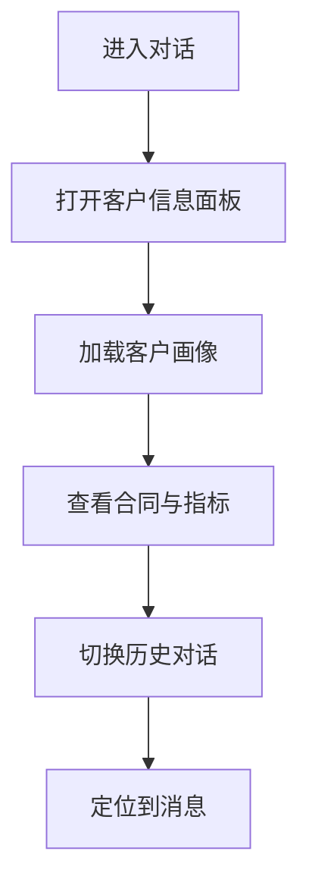

# 功能PRD：客户信息面板

## 文档信息

| 字段 | 说明 |
|------|------|
| **文档编号** | PRD-FEATURE-Customer-Profile-Panel-v1.0 |
| **功能名称** | 客户信息面板 |
| **核心价值** | 在对话处理时快速呈现客户画像与历史记录 |
| **迭代目标** | 建立右侧面板客户信息与历史对话入口 |
| **关联需求** | US-2.2-01, US-2.2-02 |
| **状态** | 草稿 |
| **创建日期** | 2026-01-14 |
| **更新日期** | 2026-01-14 |
| **文档Owner** | 产品负责人 |

---

## 1. 功能概述

### 1.1 功能定位

客户信息面板作为对话页面右侧“经典分析面板”的组成部分，提供客户画像、合同指标与历史对话视图。

### 1.2 目标用户

- **主要用户**: 一线客服
- **次要用户**: 主管/经理

### 1.3 核心价值

**对用户的价值**:
- 快速理解客户等级、合同周期与关键指标
- 在对话中随时查看历史记录与客情摘要

**对业务的价值**:
- 提升服务一致性
- 降低信息缺失导致的处理风险

### 1.4 优先级

- **优先级**: P0
- **RICE分数**: 82
  - Reach（影响用户数）: 120+客服
  - Impact（对用户价值）: 高
  - Confidence（成功把握）: 80%
  - Effort（开发成本）: 2周

---

## 2. 功能需求

### 2.1 用户故事

**US-01**: 作为客服，我希望在对话中快速查看客户画像，以便调整服务策略。

**US-02**: 作为客服，我希望看到合同与服务指标，以便判断响应优先级。

**US-03**: 作为主管，我希望查看历史对话与客情摘要，以便复盘与评估服务质量。

### 2.2 功能列表

| 功能项 | 描述 | 优先级 | 依赖 | 工作量 |
|-------|------|--------|------|--------|
| 客户信息卡片 | 基础信息与等级展示 | P0 | CRM数据 | 2天 |
| 合同与指标 | 合同周期/金额/满意度 | P0 | CRM | 2天 |
| 已购产品 | 已购产品列表 | P1 | CRM | 2天 |
| 客情摘要 | 风险/情绪/建议 | P1 | 质检/AI | 2天 |
| 历史对话时间线 | 可定位到消息 | P1 | 对话服务 | 3天 |
| 群信息 | 群公告/群备注展示 | P2 | IM渠道 | 2天 |
| 外部依赖展示 | 外部数据缺失的降级与占位 | P1 | CRM/IM/对话服务 | 2天 |

### 2.3 详细规格说明

#### 功能1：客户信息卡片

**功能描述**: 展示客户名称、职位、联系方式、客户等级与有效期。

**外部依赖与降级展示**:
- **CRM客户信息**: 若获取失败，显示“未找到客户信息”，并隐藏合同与指标模块。
- **账号体系**: 若无法关联客户ID，展示“未知客户”，允许手动刷新。

**字段定义**:
| 字段名 | 类型 | 必填 | 说明 | 示例 | 约束 |
|-------|------|------|------|------|------|
| name | string | 是 | 客户名称 | "张三" | 1-50 |
| title | string | 否 | 职位 | "IT经理" | 0-50 |
| contacts.phone | string | 否 | 手机 | "138****0000" | 脱敏 |
| contacts.email | string | 否 | 邮箱 | "a***@xx.com" | 脱敏 |
| slaLevel | enum | 是 | 等级 | "VIP" | VIP/KA0/KA1 |
| validUntil | string | 否 | 等级有效期 | "2026-12-31" | YYYY-MM-DD |

**交互行为**:
1. 打开面板 → 自动加载客户卡片
2. 点击联系方式 → 可复制

**边界条件**:
- 信息缺失 → 展示“暂无数据”占位
- 客户不存在 → 展示空状态
- 联系方式为空 → 隐藏复制按钮

**权限要求**:
- 客服：只读
- 主管：只读

---

#### 功能2：合同与指标

**功能描述**: 展示合同周期、合同金额、满意度、合作时长等指标。

**外部依赖与降级展示**:
- **CRM合同模块**: 若获取失败，显示“-”并提示“合同数据暂不可用”。
- **满意度来源**: 若来源不确定，显示“待计算”并隐藏趋势提示。

**字段定义**:
| 字段名 | 类型 | 必填 | 说明 | 示例 | 约束 |
|-------|------|------|------|------|------|
| contractRange | string | 否 | 合同周期 | "2025-01~2026-01" | - |
| contractAmount | string | 否 | 合同金额 | "¥1,000,000" | 金额格式 |
| satisfaction | string | 否 | 满意度 | "4.6" | 0-5 |
| duration | string | 否 | 合作时长 | "2年" | - |

**交互行为**:
1. 指标过期 → 标注“已过期”标签

**边界条件**:
- 指标为空 → 显示“-”
- 合同过期 → 标注“已过期”

**权限要求**:
- 客服/主管只读

---

#### 功能3：已购产品

**功能描述**: 展示客户已购产品列表与版本信息，支持查看关键产品与服务范围。

**外部依赖与降级展示**:
- **CRM订单/订阅模块**: 若获取失败，显示“已购产品暂不可用”，隐藏列表。
- **产品字典**: 若产品名称不可解析，显示产品ID并提示“名称未配置”。

**字段定义**:
| 字段名 | 类型 | 必填 | 说明 | 示例 | 约束 |
|-------|------|------|------|------|------|
| productId | string | 是 | 产品ID | "prd_001" | - |
| productName | string | 否 | 产品名称 | "工单系统" | 0-50 |
| version | string | 否 | 版本 | "v3.2" | - |
| status | string | 否 | 状态 | "active" | active/expired |

**交互行为**:
1. 点击产品项 → 展示产品详情弹窗（含服务范围）

**边界条件**:
- 列表为空 → 显示“暂无已购产品”
- 产品状态过期 → 标注“已过期”

**权限要求**:
- 客服：只读
- 主管：只读

---

#### 功能4：历史对话时间线

**功能描述**: 展示历史沟通记录并支持定位到当前对话内容。

**外部依赖与降级展示**:
- **对话服务**: 若获取失败，显示“历史记录加载失败”并提供重试。
- **消息定位**: 若目标消息已归档，提示“记录已归档，无法定位”。
**交互行为**:
1. 选择时间范围 → 列表刷新
2. 点击“定位对话” → 主对话区滚动定位

**边界条件**:
- 超过权限范围 → 隐藏敏感内容
- 时间线为空 → 显示空状态
- 定位失败 → 展示提示并保持当前视图

**权限要求**:
- 客服：只读
- 主管：只读

---

#### 功能5：客情摘要

**功能描述**: 展示客户情绪、风险与建议标签，供客服参考。

**外部依赖与降级展示**:
- **质检/AI摘要**: 若不可用，显示“待生成”，提供手动刷新入口。

**交互行为**:
1. 点击“展开” → 查看详细建议

**边界条件**:
- 无摘要 → 展示“待生成”

---

#### 功能6：群信息

**功能描述**: 展示群公告与群备注（若IM渠道可用）。

**外部依赖与降级展示**:
- **IM渠道**: 若未接入，隐藏该模块并提示“需接入IM后可用”。
**边界条件**:
- IM未接入 → 隐藏模块

---

## 3. UI设计

### 3.1 页面布局

#### 布局方案1：右侧抽屉Tab

**页面结构**:
```
┌────────────────────────────────┐
│ 客户信息 | 历史对话记录          │
├────────────────────────────────┤
│ 客户信息卡片                    │
│ 合同与指标                      │
│ 已购产品                        │
│ 客情摘要                        │
└────────────────────────────────┘
```

**布局说明**:
- **顶部Tab**: 切换客户信息与历史记录
- **内容区**: 分块展示信息卡片与指标

### 3.2 组件说明

#### 组件1：客户信息卡片

**组件类型**: 卡片

**位置**: 右侧抽屉顶部

**样式规范**:
| 属性 | 值 |
|-----|---|
| 宽度 | 100% |
| 高度 | auto |
| 背景色 | #ffffff |
| 边框 | 1px solid #e5e5e5 |
| 圆角 | 6px |
| 内边距 | 12px |

**交互行为**:
- 点击复制联系方式

---

### 3.3 样式规范

- 颜色、字体、间距与全局一致

### 3.4 响应式设计

| 断点 | 宽度范围 | 布局调整 |
|-----|---------|---------|
| Desktop | >1200px | 抽屉固定宽度 |
| Tablet | 768-1199px | 抽屉覆盖层 |
| Mobile | <768px | 侧滑抽屉 |

---

## 4. 交互流程

### 4.1 主流程



**流程说明**:
1. 在对话中打开客户信息面板
2. 浏览客户画像与指标
3. 切换到历史记录定位对话

### 4.2 异常分支

#### 异常1：客户数据不存在

- **触发条件**: CRM无匹配客户
- **处理方式**: 显示空状态与提示
- **用户提示**: “未找到客户信息”
- **恢复方式**: 允许手动刷新

---

## 5. 接口定义

### 5.1 获取客户画像

**接口路径**: `/api/customers/{id}/profile`

**请求方法**: GET

**权限要求**: 需要登录

**路径参数**:
| 参数名 | 类型 | 必填 | 说明 | 示例 |
|-------|------|------|------|------|
| id | string | 是 | 客户ID | "cust_1" |

**响应体**（成功）:
```json
{
  "success": true,
  "data": {
    "name": "张三",
    "title": "IT经理",
    "slaLevel": "VIP",
    "validUntil": "2026-12-31",
    "contacts": { "phone": "138****0000" }
  }
}
```

---

### 5.2 获取历史对话列表

**接口路径**: `/api/customers/{id}/conversations`

**请求方法**: GET

**查询参数**:
| 参数名 | 类型 | 必填 | 说明 | 默认值 |
|-------|------|------|------|------|
| range | string | 否 | 30d/90d/all | 30d |
| page | number | 否 | 页码 | 1 |
| pageSize | number | 否 | 每页 | 20 |

---

## 6. 数据模型

### 6.1 CustomerProfileView

**实体描述**: 客户画像与指标视图。

**TypeScript接口定义**:
```typescript
interface CustomerProfileView {
  id: string;
  name: string;
  title?: string;
  contacts: { phone?: string; email?: string; wechat?: string };
  slaLevel: 'VIP' | 'KA0' | 'KA1';
  validUntil?: string;
  contractRange?: string;
  metrics: {
    contractAmount?: string;
    satisfaction?: string;
    duration?: string;
  };
  products?: string[];
  summary?: string;
}
```

---

### 6.2 ConversationTrace

**实体描述**: 客户历史对话记录。

**TypeScript接口定义**:
```typescript
interface ConversationTrace {
  id: string;
  customerId: string;
  title: string;
  updatedAt: string;
  linkMessageId?: string;
}
```

---

## 7. 验收标准

### 7.1 功能验收

| 验收项 | 验收标准 | 优先级 | 测试方法 |
|-------|---------|--------|---------|
| 客户信息卡片 | 信息完整展示 | P0 | 手动 |
| 合同与指标 | 指标正确显示 | P0 | 手动 |
| 已购产品 | 列表可查看 | P1 | 手动 |
| 历史对话 | 可定位到对话 | P1 | 手动 |
| 客情摘要 | 有默认/待生成状态 | P1 | 手动 |

### 7.2 性能验收

| 验收项 | 验收标准 | 测试方法 |
|-------|---------|---------|
| 面板打开 | <500ms | 手动 |
| Tab切换 | <300ms | 手动 |

### 7.3 安全验收

| 验收项 | 验收标准 | 测试方法 |
|-------|---------|---------|
| 数据脱敏 | 手机/邮箱脱敏展示 | 检查 |

---

## 8. 非功能需求

### 8.1 性能要求

| 指标 | 目标值 | 测量方法 |
|-----|--------|---------|
| 面板响应 | <500ms | 手动 |

### 8.2 可用性要求

| 指标 | 目标值 |
|-----|--------|
| 系统可用性 | >99% |

### 8.3 安全要求

- 客户敏感字段脱敏
- 只读权限控制

### 8.4 可扩展性要求

- 支持新增画像字段
- 支持新增指标项

### 8.5 可维护性要求

- 指标与字段配置化

---

## 附录A：术语表

| 术语 | 定义 |
|-----|------|
| 客户画像 | 客户基础信息与合同指标集合 |
| 客情摘要 | 反映客户当前满意度与风险 |

---

## 附录B：外围系统依赖

| 系统 | 依赖说明 | API路径 | 负责人 |
|------|---------|--------|------|
| CRM | 客户信息与合同指标 | /api/customers | CRM团队 |
| IM渠道 | 群公告与群备注 | /im/groups | IM接入团队 |
| 对话服务 | 历史对话与定位 | /api/conversations | 对话服务团队 |
| 质检/AI服务 | 客情摘要与情绪标签 | /api/insights | AI服务团队 |
| 订单/订阅服务 | 已购产品与版本信息 | /api/subscriptions | CRM团队 |
| 产品字典 | 产品名称与服务范围 | /api/products | 产品平台团队 |

---

## 附录C：待决策事项

| 事项ID | 事项描述 | 备选方案 | 决策人 | 截止日期 | 状态 |
|--------|---------|---------|--------|---------|------|
| Q-01 | 群公告与群备注是否接入IM | 接入/暂不接入 | 产品负责人 | 2026-01-20 | ⏳待决策 |

---

## 附录D：变更历史

| 版本 | 日期 | 变更内容 | 变更人 | 审核人 |
|-----|------|---------|--------|--------|
| v1.0 | 2026-01-14 | 初始版本（按模板补全） | 产品负责人 | 产品负责人 |

---

**文档结束**
