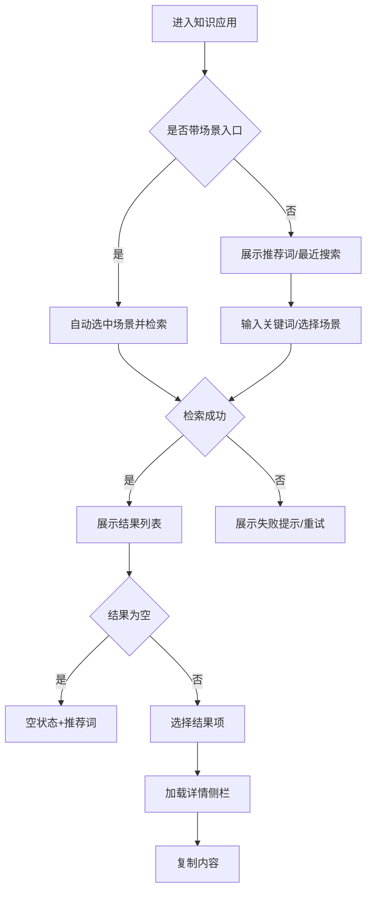

# 功能PRD：知识应用

## 文档信息

| 字段 | 说明 |
|------|------|
| **文档编号** | PRD-FEATURE-Knowledge-Base-v1.0 |
| **功能名称** | 知识应用 |
| **核心价值** | 快速检索并复用知识内容，提升问题处理效率 |
| **迭代目标** | 支持关键词检索、场景快捷入口与一键复制 |
| **关联需求** | US-2.3-01, US-2.3-02 |
| **状态** | 草稿 |
| **创建日期** | 2026-01-14 |
| **更新日期** | 2026-01-14 |
| **文档Owner** | 产品负责人 |

---

## 1. 功能概述

### 1.1 功能定位

知识应用用于在对话处理中快速检索知识内容，展示摘要与正文，并提供复制能力。

### 1.2 目标用户

- **主要用户**: 一线客服
- **次要用户**: 主管/培训人员（权限说明见[权限与入口管理说明](2.10-Permission-Management-PRD.md)）

### 1.3 核心价值

**对用户的价值**:
- 快速定位问题处理步骤
- 通过摘要提升阅读效率

**对业务的价值**:
- 降低新人学习成本
- 提升服务一致性

### 1.4 优先级

- **优先级**: P1
- **RICE分数**: 74
  - Reach（影响用户数）: 100+客服
  - Impact（对用户价值）: 中
  - Confidence（成功把握）: 80%
  - Effort（开发成本）: 2周

### 1.5 权限与入口

详见[权限与入口管理说明](2.10-Permission-Management-PRD.md)。

**本功能最小权限说明**:
- **客服**: 可访问知识应用、检索、查看详情、复制内容
- **主管**: 具备客服权限，另可查看场景入口并访问推荐词配置
- **访客/未登录**: 无访问权限，提示登录

**入口说明**:
- 对话界面侧栏“知识应用”入口
- 工单处理页顶部“知识应用”入口
- 仅内部角色可见

---

## 2. 功能需求

### 2.1 用户故事

**US-01**: 作为客服，我希望输入关键词快速检索知识，以便获取处理步骤。

**US-02**: 作为客服，我希望一键复制知识内容，以便生成回复草稿。

**US-03**: 作为主管，我希望通过场景快捷入口快速查看标准方案，以便培训复盘。

### 2.2 功能列表

| 功能项 | 描述 | 优先级 | 依赖 | 工作量 |
|-------|------|--------|------|--------|
| 语义检索 | 向量召回与语义匹配 | P0 | 向量检索服务 | 4天 |
| 关键词检索 | 模糊匹配与结果排序 | P0 | 知识库 | 3天 |
| 场景快捷入口 | 预置场景按钮 | P1 | 配置服务 | 2天 |
| 结果列表 | 展示标题/摘要/匹配度 | P0 | 检索 | 2天 |
| 详情侧栏 | 正文与标签展示 | P0 | 结果列表 | 2天 |
| 一键复制 | 复制正文 | P1 | 详情侧栏 | 1天 |
| 空状态提示 | 提示与推荐搜索词 | P1 | 无 | 1天 |
| 最近搜索 | 展示最近检索记录 | P2 | 本地存储 | 1天 |

### 2.3 详细规格说明

#### 功能1：语义检索与关键词检索

**功能描述**: 支持语义检索与关键词检索的混合召回与重排，优先满足语义相似度，其次用关键词匹配补充召回，默认按相关性降序。

**外部依赖与降级展示**:
- **向量检索服务**: 提供语义向量召回。若不可用，降级为关键词检索，并提示“语义检索暂不可用，已切换为关键词检索”。
- **知识库全文索引**: 提供关键词检索。若不可用，展示错误提示与重试。
- **场景配置**: 提供场景与默认关键词。若不可用，仅保留手动输入。

**检索策略说明**:
- **召回**: 语义召回TopK（默认K=50） + 关键词召回TopK（默认K=50）。
- **融合**: 对重复结果去重，保留最高评分。
- **重排**: 基于语义评分与关键词匹配度加权，权重可配置（默认语义0.7/关键词0.3）。
- **截断**: 最终返回TopN（默认N=20）。

**字段定义**:
| 字段名 | 类型 | 必填 | 说明 | 示例 | 约束 |
|-------|------|------|------|------|------|
| keyword | string | 是 | 搜索关键词 | "登录失败" | 1-50 |
| score | number | 是 | 匹配度 | 0.82 | 0-1 |
| category | string | 否 | 分类 | "账号问题" | - |
| searchMode | enum | 否 | 检索模式 | "hybrid" | semantic/keyword/hybrid |

**输入限制**:
- **长度**: 最少2个字符，最多50个字符（中文按字符数，英文按字符数）
- **字符集**: 允许中文、英文、数字、空格、常见标点（- / _ . , : ;）
- **非法字符**: 过滤控制字符与重复空格（连续空格折叠为单空格）
- **前后空格**: 自动 trim，不计入长度
- **关键词冲突**: 与场景关键词冲突时以用户手工输入为准

**交互行为**:
1. 输入关键词并按Enter → 触发检索
2. 点击场景按钮 → 自动填入关键词并检索
3. 切换分类筛选 → 结果重新排序
4. 点击搜索按钮（放大镜）→ 触发检索
5. 输入框清空 → 清空结果并显示推荐词
6. 粘贴关键词 → 直接触发长度与非法字符校验

**初始化与默认搜索**:
- 首次进入: 默认展示最近搜索（若存在）与推荐词，不自动检索
- 带场景入口进入: 自动选中对应场景并触发检索
- 返回页面: 保留上次关键词、筛选条件与选中结果
- 无历史记录: 展示默认推荐词与空状态提示

**场景快捷入口规范**:
- **场景列表**（默认预置）:
  - 账号登录失败
  - 账号异常/冻结
  - 密码重置
  - 订单查询
  - 订单取消/退款
  - 物流查询
  - 发票开具
  - 售后退换货
  - 商品质量问题
  - 优惠券/活动规则
- **命名规则**: 2-8个字，名词短语优先，避免歧义
- **数量上限**: 默认最多8个展示，超过部分进入“更多”
- **排序规则**: 配置优先级降序；同优先级按使用频次近7天降序
- **分组规则**: 支持按业务域分组（账号/订单/售后/活动），分组不可折叠
- **可用性**: 配置服务不可用时隐藏场景入口区域
- **场景点击行为**:
  - 单选模式: 点击即选中，替换输入框内容并触发检索
  - 再次点击已选场景: 取消选中，输入框清空并回到推荐词状态
  - 手工编辑输入框后: 取消场景选中状态
  - 场景与手动输入互斥，检索以当前输入框内容为准

**边界条件**:
- 输入为空 → 禁用搜索
- 关键词过短（<2字）→ 提示补充关键词
- 无结果 → 显示空状态和推荐词
- 语义检索超时 → 自动降级为关键词检索
- 输入超长 → 提示“关键词过长，请精简”并阻止检索
- 非法字符 → 自动过滤并提示一次
- 连续快速触发 → 500ms防抖，仅保留最后一次检索

**权限要求**: 详见[权限与入口管理说明](2.10-Permission-Management-PRD.md)

---

#### 功能2：结果列表

**功能描述**: 展示检索结果列表，包含标题、摘要、标签、更新时间与匹配度。

**外部依赖与降级展示**:
- **知识库元数据**: 若元数据缺失，标题显示“未命名知识”，摘要为空时隐藏摘要区域。
- **标签服务**: 若标签不可用，隐藏标签区域，不影响结果排序。

**字段定义**:
| 字段名 | 类型 | 必填 | 说明 | 示例 | 约束 |
|-------|------|------|------|------|------|
| title | string | 是 | 标题 | "登录失败处理" | 1-100 |
| summary | string | 否 | 摘要 | "检查账号状态" | 0-200 |
| tags | array | 否 | 标签 | ["账号"] | 最多5个 |
| updatedAt | string | 否 | 更新时间 | "2026-01-14" | - |
| score | number | 是 | 匹配度 | 0.82 | 0-1 |

**交互行为**:
1. 点击列表项 → 详情侧栏加载
2. 滚动列表 → 分页加载
3. 点击“重试” → 重新拉取当前页
4. 点击“返回顶部” → 滚动到顶部

**边界条件**:
- 列表为空 → 显示空状态
 - 列表加载失败 → 显示“加载失败”与重试入口
- 结果过多 → 按pageSize分页加载，保留滚动位置
- 重复结果 → 去重展示

---

#### 功能3：详情侧栏

**功能描述**: 展示知识摘要、正文、来源、更新时间，提供复制按钮。

**外部依赖与降级展示**:
- **知识详情服务**: 若获取失败，展示“详情加载失败”，并提供重试。
- **知识正文存储**: 若正文缺失，展示“暂无正文”，不影响复制按钮状态（禁用）。

**交互行为**:
1. 选择列表项 → 详情加载
2. 点击复制 → 内容复制到剪贴板并提示“已复制”
3. 点击标签 → 触发二次检索
4. 点击“展开/收起” → 展示完整正文

**边界条件**:
- 正文为空 → 显示“暂无正文”
- 内容过长 → 支持折叠/展开
 - 详情为空 → 显示空占位并引导重新检索
- 详情加载中 → 显示骨架屏

---

#### 功能4：一键复制

**功能描述**: 复制正文内容到剪贴板，用于人工编辑草稿。

**外部依赖与降级展示**:
- **浏览器剪贴板能力**: 若被禁用，展示“复制失败，请手动复制”并自动选中正文。

**交互行为**:
1. 点击“复制内容” → 系统复制并提示

**边界条件**:
- 浏览器禁止复制 → 显示“复制失败，请手动复制”

---

#### 功能5：空状态提示

**功能描述**: 无结果时提供提示与推荐词。

**外部依赖与降级展示**:
- **推荐词服务**: 若不可用，展示默认提示文案，不展示推荐词。

**交互行为**:
1. 点击推荐词 → 触发检索
2. 点击“清空历史” → 清除最近搜索

---

#### 功能6：最近搜索

**功能描述**: 输入框获取焦点，下面显示窗口显示用户最近检索的关键词，支持一键清空。

**外部依赖与降级展示**:
- **本地存储**: 使用浏览器本地存储；若不可用则不展示最近搜索模块。

**交互行为**:
1. 点击最近搜索词 → 填充输入框并触发检索
2. 点击清空 → 清除全部记录

**边界条件**:
- 记录上限为10条，按时间倒序
- 与推荐词同时存在时先展示最近搜索

---

## 3. UI设计

### 3.1 页面布局

#### 布局方案1：检索+列表+详情

**页面结构**:
```
┌────────────────────────────────────┐
│ 检索输入框  [场景按钮...]           │
├────────────────┬───────────────────┤
│ 结果列表       │ 详情侧栏          │
│ 标题/摘要/标签 │ 摘要/正文/复制按钮 │
└────────────────┴───────────────────┘
```

**布局说明**:
- **顶部检索区**: 输入与快捷按钮
- **左侧列表**: 结果列表
- **右侧详情**: 选中结果详情

### 3.2 组件说明

#### 组件1：检索输入框

**组件类型**: 输入框

**位置**: 页面顶部

**样式规范**:
| 属性 | 值 |
|-----|---|
| 宽度 | 320px |
| 高度 | 36px |
| 边框 | 1px solid #e5e5e5 |
| 圆角 | 6px |
| 内边距 | 8px |

**交互行为**:
- Enter触发检索
- 支持点击搜索按钮触发检索
- 支持一键清空输入并回到推荐词状态
- 输入校验失败时显示红色提示文案，禁用检索按钮

---

#### 组件2：场景快捷入口

**组件类型**: 场景按钮组

**位置**: 检索输入框右侧或下方

**样式规范**:
| 属性 | 值 |
|-----|---|
| 按钮高度 | 28px |
| 按钮圆角 | 14px |
| 间距 | 8px |
| 选中态 | 背景#f0f6ff，边框#2b6cf6 |

**交互行为**:
- 单选模式，点击后替换输入框内容并立即检索
- 已选场景再次点击取消选中并清空输入
- 支持“更多”展开全部场景

---

#### 组件3：结果列表

**组件类型**: 列表

**位置**: 页面左侧

**样式规范**:
| 属性 | 值 |
|-----|---|
| 列表宽度 | 40% |
| 列表项高度 | 自适应 |
| 标题字体 | 14px 加粗 |
| 摘要字体 | 12px |

**交互行为**:
- 点击列表项选中并加载详情
- 滚动触底触发分页加载
- 支持加载中骨架与重试态

---

#### 组件4：详情侧栏

**组件类型**: 侧栏

**位置**: 页面右侧

**样式规范**:
| 属性 | 值 |
|-----|---|
| 侧栏宽度 | 60% |
| 标题字体 | 16px 加粗 |
| 正文字体 | 13px |

**交互行为**:
- 支持正文折叠/展开
- 支持复制按钮与复制成功提示
- 标签可点击触发二次检索

---

#### 组件5：推荐词与最近搜索

**组件类型**: 标签流/列表

**位置**: 输入框下方或空状态区域

**样式规范**:
| 属性 | 值 |
|-----|---|
| 标签高度 | 24px |
| 标签间距 | 6px |
| 默认颜色 | #f7f7f7 |

**交互行为**:
- 点击推荐词/最近搜索词触发检索
- 支持清空最近搜索
 

---

### 3.3 样式规范

- 颜色、字体、间距与全局一致

### 3.3.1 状态规范

| 状态 | 触发条件 | 视觉表现 | 提示文案 |
|-----|----------|----------|---------|
| 空状态 | 无检索结果 | 插图+推荐词 | “未找到相关内容” |
| 初始态 | 首次进入 | 推荐词+最近搜索 | “试试这些关键词” |
| 加载中 | 请求中 | 骨架屏/加载动画 | “正在检索...” |
| 失败态 | 请求失败 | 错误图标+重试 | “检索失败，请重试” |
| 降级态 | 语义服务不可用 | 顶部提示条 | “语义检索暂不可用，已切换为关键词检索” |
| 无权限 | 角色不可用 | 错误提示页 | “暂无访问权限” |

### 3.3.2 文案规范

| 场景 | 文案 |
|-----|------|
| 输入为空 | “请输入关键词” |
| 关键词过短 | “关键词过短，请补充” |
| 关键词过长 | “关键词过长，请精简” |
| 复制成功 | “已复制” |
| 复制失败 | “复制失败，请手动复制” |
| 详情为空 | “暂无正文” |

### 3.4 响应式设计

| 断点 | 宽度范围 | 布局调整 |
|-----|---------|---------|
| Desktop | >1200px | 双栏布局 |
| Tablet | 768-1199px | 结果/详情上下排列 |
| Mobile | <768px | 单栏列表 |

---

## 4. 交互流程

### 4.1 主流程



**流程说明**:
1. 支持场景入口直达并自动检索
2. 首次进入默认展示推荐词与最近搜索
3. 检索失败可重试，成功后可查看详情并复制

### 4.2 异常分支

#### 异常1：检索失败

- **触发条件**: 服务异常
- **处理方式**: 提示重试
- **用户提示**: “检索失败，请重试”
- **恢复方式**: 点击重试

#### 异常2：无结果

- **触发条件**: 结果为空
- **处理方式**: 展示空状态与推荐词
- **用户提示**: “未找到相关内容”
- **恢复方式**: 点击推荐词或修改关键词

#### 异常3：语义检索降级

- **触发条件**: 向量检索服务超时或不可用
- **处理方式**: 自动切换为关键词检索并提示

---

## 5. 接口定义

### 5.1 知识检索

**接口路径**: `/api/knowledge/search`

**请求方法**: GET

**查询参数**:
| 参数名 | 类型 | 必填 | 说明 | 默认值 |
|-------|------|------|------|------|
| keyword | string | 是 | 关键词 | - |
| scene | string | 否 | 场景 | - |
| mode | string | 否 | 检索模式 | hybrid |
| rerank | boolean | 否 | 是否重排 | true |
| page | number | 否 | 页码 | 1 |
| pageSize | number | 否 | 每页 | 20 |

**响应体**（成功）:
```json
{
  "success": true,
  "data": {
    "total": 120,
    "page": 1,
    "pageSize": 20,
    "mode": "hybrid",
    "degraded": false,
    "items": [
      {
        "id": "k_1",
        "title": "登录失败处理",
        "summary": "检查账号状态",
        "score": 0.82,
        "updatedAt": "2026-01-14T10:00:00Z"
      }
    ]
  }
}
```

---

### 5.2 获取知识详情

**接口路径**: `/api/knowledge/{id}`

**请求方法**: GET

**路径参数**:
| 参数名 | 类型 | 必填 | 说明 | 示例 |
|-------|------|------|------|------|
| id | string | 是 | 知识ID | "k_1" |

---

### 5.3 场景与推荐词配置

**接口路径**: `/api/config/scenes`

**请求方法**: GET

**响应体**（成功）:
```json
{
  "success": true,
  "data": {
    "scenes": [
      {
        "id": "scene_1",
        "name": "账号登录失败",
        "keyword": "登录失败",
        "group": "账号",
        "priority": 90
      }
    ],
    "recommendKeywords": [
      "登录失败",
      "订单查询",
      "退款流程"
    ]
  }
}
```

---

### 5.4 错误响应规范

**通用错误响应体**:
```json
{
  "success": false,
  "error": {
    "code": "KB_SEARCH_TIMEOUT",
    "message": "检索超时，请重试"
  }
}
```

**错误码说明**:
| 错误码 | 场景 | 处理建议 | 用户提示 |
|-------|------|----------|---------|
| KB_INVALID_KEYWORD | 关键词不合法 | 禁止检索并提示 | “关键词不合法，请修改” |
| KB_SEARCH_TIMEOUT | 检索超时 | 允许重试 | “检索超时，请重试” |
| KB_SEARCH_FAILED | 检索失败 | 允许重试 | “检索失败，请重试” |
| KB_DETAIL_NOT_FOUND | 详情不存在 | 返回空占位 | “内容不存在或已下线” |
| KB_CONFIG_UNAVAILABLE | 场景配置不可用 | 隐藏场景入口 | 无需提示 |
| KB_CLIPBOARD_DENIED | 复制被拒 | 进入手动复制 | “复制失败，请手动复制” |

---

## 6. 数据模型

### 6.1 KnowledgeSearchItem

**实体描述**: 知识检索结果。

**TypeScript接口定义**:
```typescript
interface KnowledgeSearchItem {
  id: string;
  title: string;
  category: string;
  summary: string;
  tags: string[];
  score: number;
  updatedAt: string;
}
```

### 6.2 KnowledgeDetail

**实体描述**: 知识详情。

**TypeScript接口定义**:
```typescript
interface KnowledgeDetail {
  id: string;
  title: string;
  summary: string;
  content: string;
  source?: string;
  tags: string[];
  updatedAt: string;
}
```

### 6.3 KnowledgeSearchResponse

**实体描述**: 知识检索响应。

**TypeScript接口定义**:
```typescript
interface KnowledgeSearchResponse {
  total: number;
  page: number;
  pageSize: number;
  mode: "semantic" | "keyword" | "hybrid";
  degraded: boolean;
  items: KnowledgeSearchItem[];
}
```

### 6.4 SceneConfig

**实体描述**: 场景配置项。

**TypeScript接口定义**:
```typescript
interface SceneConfig {
  id: string;
  name: string;
  keyword: string;
  group?: string;
  priority: number;
}
```

### 6.5 RecommendKeyword

**实体描述**: 推荐关键词。

**TypeScript接口定义**:
```typescript
interface RecommendKeyword {
  keyword: string;
}
```

### 6.6 RecentSearchItem

**实体描述**: 最近搜索记录。

**TypeScript接口定义**:
```typescript
interface RecentSearchItem {
  keyword: string;
  searchedAt: string;
}
```

---

## 7. 验收标准

### 7.1 功能验收

| 验收项 | 验收标准 | 优先级 | 测试方法 |
|-------|---------|--------|---------|
| 语义检索 | 语义检索可用并可降级 | P0 | 手动 |
| 关键词检索 | 可返回匹配结果 | P0 | 手动 |
| 快捷入口 | 场景单选、替换输入并触发检索 | P1 | 手动 |
| 输入校验 | 低于2字或超长不可检索并提示 | P0 | 手动 |
| 结果列表 | 标题/摘要/标签可见 | P0 | 手动 |
| 详情展示 | 摘要与正文可查看 | P0 | 手动 |
| 一键复制 | 复制成功提示 | P1 | 手动 |
| 空状态 | 无结果提示与推荐词 | P1 | 手动 |
| 最近搜索 | 记录上限10条且可清空 | P2 | 手动 |
| 初始化 | 首次进入展示推荐词且不自动检索 | P1 | 手动 |
| 分页加载 | 触底加载且保留滚动位置 | P1 | 手动 |

### 7.2 性能验收

| 验收项 | 验收标准 | 测试方法 |
|-------|---------|---------|
| 检索响应 | <500ms | 手动 |
| 首屏渲染 | <1s | 手动 |

---

## 8. 非功能需求

### 8.1 性能要求

| 指标 | 目标值 | 测量方法 |
|-----|--------|---------|
| 检索响应 | <500ms | 监控 |
| 首屏渲染 | <1s | 监控 |
| 详情加载 | <800ms | 监控 |

### 8.2 可用性要求

| 指标 | 目标值 |
|-----|--------|
| 系统可用性 | >99% |
| 高峰可用性 | >99% |

### 8.3 安全要求

- 权限控制详见[权限与入口管理说明](2.10-Permission-Management-PRD.md)
- 关键日志记录
- 复制内容需脱敏配置支持（如手机号/身份证）

### 8.4 可扩展性要求

- 支持新增场景入口
- 支持多分类维度筛选
- 支持多语言关键词索引（中/英）

### 8.6 容量与并发

| 指标 | 目标值 |
|-----|--------|
| 日均检索量 | 50万 |
| 峰值QPS | 200 |
| 单次返回最大条数 | 50 |

### 8.7 可观测性

- 关键指标：检索成功率、降级率、无结果率、平均耗时
- 关键告警：成功率<95%、p95>1s、降级率>10%

### 8.8 合规要求

- 用户操作日志保留不少于180天
- 内容访问记录可追溯

### 8.5 可维护性要求

- 索引与缓存可配置

---

## 9. 埋点与日志

### 9.1 埋点事件清单

| 事件名 | 触发时机 | 关键属性 |
|-------|----------|---------|
| kb_search_submit | 触发检索 | keywordLength, mode, sceneId, source(manual/scene/recommend/recent), page |
| kb_search_result | 检索返回 | total, page, pageSize, degraded, latency |
| kb_search_no_result | 无结果 | keywordLength, sceneId |
| kb_scene_click | 点击场景 | sceneId, sceneName |
| kb_result_click | 点击列表项 | itemId, rank, score |
| kb_detail_loaded | 详情加载完成 | itemId, latency |
| kb_copy_click | 点击复制 | itemId, success |
| kb_tag_click | 点击标签 | tag, itemId |
| kb_recent_click | 点击最近搜索 | keywordLength |
| kb_recent_clear | 清空最近搜索 | count |

### 9.2 关键日志

- 检索请求参数与耗时
- 检索降级原因与次数
- 详情加载失败原因
- 复制失败原因（浏览器拒绝/权限）

---

## 附录A：术语表

| 术语 | 定义 |
|-----|------|
| 知识应用 | 面向客服的知识检索入口 |
| 匹配度 | 检索结果与关键词的相似度评分 |

---

## 附录B：外围系统依赖

| 系统 | 依赖说明 | API路径 | 负责人 |
|------|---------|--------|------|
| 知识库服务 | 提供知识检索与详情 | /api/knowledge | 知识平台团队 |
| 向量检索服务 | 语义召回与向量索引 | /api/knowledge/semantic | 搜索平台团队 |
| 配置服务 | 场景与推荐词配置 | /api/config/scenes | 平台团队 |

---

## 附录C：待决策事项

| 事项ID | 事项描述 | 备选方案 | 决策人 | 截止日期 | 状态 |
|--------|---------|---------|--------|---------|------|
| Q-01 | 是否接入语义向量检索 | 接入/不接入 | 产品负责人 | 2026-02-01 | ⏳待决策 |

---

## 附录D：变更历史

| 版本 | 日期 | 变更内容 | 变更人 | 审核人 |
|-----|------|---------|--------|--------|
| v1.0 | 2026-01-14 | 初始版本（按模板补全） | 产品负责人 | 产品负责人 |

---

**文档结束**
