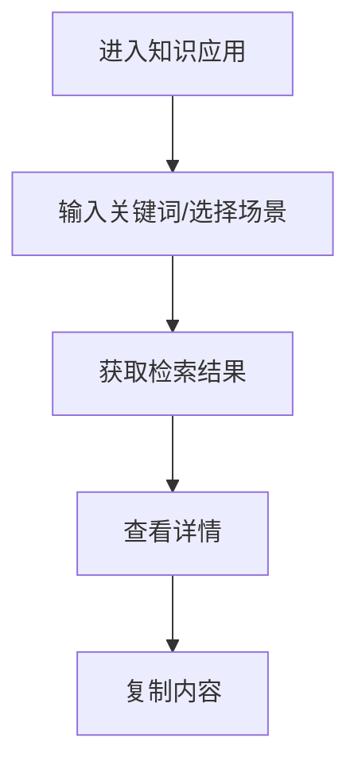

# 功能PRD：知识应用

## 文档信息

| 字段 | 说明 |
|------|------|
| **文档编号** | PRD-FEATURE-Knowledge-Base-v1.0 |
| **功能名称** | 知识应用 |
| **核心价值** | 快速检索并复用知识内容，提升问题处理效率 |
| **迭代目标** | 支持关键词检索、场景快捷入口与一键复制 |
| **关联需求** | US-2.3-01, US-2.3-02 |
| **状态** | 草稿 |
| **创建日期** | 2026-01-14 |
| **更新日期** | 2026-01-14 |
| **文档Owner** | 产品负责人 |

---

## 1. 功能概述

### 1.1 功能定位

知识应用用于在对话处理中快速检索知识内容，展示摘要与正文，并提供复制能力。

### 1.2 目标用户

- **主要用户**: 一线客服
- **次要用户**: 主管/培训人员（需授予知识应用权限）

### 1.3 核心价值

**对用户的价值**:
- 快速定位问题处理步骤
- 通过摘要提升阅读效率

**对业务的价值**:
- 降低新人学习成本
- 提升服务一致性

### 1.4 优先级

- **优先级**: P1
- **RICE分数**: 74
  - Reach（影响用户数）: 100+客服
  - Impact（对用户价值）: 中
  - Confidence（成功把握）: 80%
  - Effort（开发成本）: 2周

### 1.5 权限与入口

- 客服具备“知识应用”页面权限，菜单入口可见
- 管理员具备“知识应用”页面权限，菜单入口可见

---

## 2. 功能需求

### 2.1 用户故事

**US-01**: 作为客服，我希望输入关键词快速检索知识，以便获取处理步骤。

**US-02**: 作为客服，我希望一键复制知识内容，以便生成回复草稿。

**US-03**: 作为主管，我希望通过场景快捷入口快速查看标准方案，以便培训复盘。

### 2.2 功能列表

| 功能项 | 描述 | 优先级 | 依赖 | 工作量 |
|-------|------|--------|------|--------|
| 语义检索 | 向量召回与语义匹配 | P0 | 向量检索服务 | 4天 |
| 关键词检索 | 模糊匹配与结果排序 | P0 | 知识库 | 3天 |
| 场景快捷入口 | 预置场景按钮 | P1 | 配置服务 | 2天 |
| 结果列表 | 展示标题/摘要/匹配度 | P0 | 检索 | 2天 |
| 详情侧栏 | 正文与标签展示 | P0 | 结果列表 | 2天 |
| 一键复制 | 复制正文 | P1 | 详情侧栏 | 1天 |
| 空状态提示 | 提示与推荐搜索词 | P1 | 无 | 1天 |

### 2.3 详细规格说明

#### 功能1：语义检索与关键词检索

**功能描述**: 支持语义检索与关键词检索的混合召回与重排，优先满足语义相似度，其次用关键词匹配补充召回，默认按相关性降序。

**外部依赖与降级展示**:
- **向量检索服务**: 提供语义向量召回。若不可用，降级为关键词检索，并提示“语义检索暂不可用，已切换为关键词检索”。
- **知识库全文索引**: 提供关键词检索。若不可用，展示错误提示与重试。
- **场景配置**: 提供场景与默认关键词。若不可用，仅保留手动输入。

**检索策略说明**:
- **召回**: 语义召回TopK（默认K=50） + 关键词召回TopK（默认K=50）。
- **融合**: 对重复结果去重，保留最高评分。
- **重排**: 基于语义评分与关键词匹配度加权，权重可配置（默认语义0.7/关键词0.3）。
- **截断**: 最终返回TopN（默认N=20）。

**字段定义**:
| 字段名 | 类型 | 必填 | 说明 | 示例 | 约束 |
|-------|------|------|------|------|------|
| keyword | string | 是 | 搜索关键词 | "登录失败" | 1-50 |
| score | number | 是 | 匹配度 | 0.82 | 0-1 |
| category | string | 否 | 分类 | "账号问题" | - |
| searchMode | enum | 否 | 检索模式 | "hybrid" | semantic/keyword/hybrid |

**交互行为**:
1. 输入关键词并按Enter → 触发检索
2. 点击场景按钮 → 自动填入关键词并检索
3. 切换分类筛选 → 结果重新排序

**边界条件**:
- 输入为空 → 禁用搜索
- 关键词过短（<2字）→ 提示补充关键词
- 无结果 → 显示空状态和推荐词
- 语义检索超时 → 自动降级为关键词检索

**权限要求**:
- 客服：只读
- 主管：只读

---

#### 功能2：结果列表

**功能描述**: 展示检索结果列表，包含标题、摘要、标签、更新时间与匹配度。

**外部依赖与降级展示**:
- **知识库元数据**: 若元数据缺失，标题显示“未命名知识”，摘要为空时隐藏摘要区域。
- **标签服务**: 若标签不可用，隐藏标签区域，不影响结果排序。

**字段定义**:
| 字段名 | 类型 | 必填 | 说明 | 示例 | 约束 |
|-------|------|------|------|------|------|
| title | string | 是 | 标题 | "登录失败处理" | 1-100 |
| summary | string | 否 | 摘要 | "检查账号状态" | 0-200 |
| tags | array | 否 | 标签 | ["账号"] | 最多5个 |
| updatedAt | string | 否 | 更新时间 | "2026-01-14" | - |
| score | number | 是 | 匹配度 | 0.82 | 0-1 |

**交互行为**:
1. 点击列表项 → 详情侧栏加载
2. 滚动列表 → 分页加载

**边界条件**:
- 列表为空 → 显示空状态
 - 列表加载失败 → 显示“加载失败”与重试入口

---

#### 功能3：详情侧栏

**功能描述**: 展示知识摘要、正文、来源、更新时间，提供复制按钮。

**外部依赖与降级展示**:
- **知识详情服务**: 若获取失败，展示“详情加载失败”，并提供重试。
- **知识正文存储**: 若正文缺失，展示“暂无正文”，不影响复制按钮状态（禁用）。

**交互行为**:
1. 选择列表项 → 详情加载
2. 点击复制 → 内容复制到剪贴板并提示“已复制”
3. 点击标签 → 触发二次检索

**边界条件**:
- 正文为空 → 显示“暂无正文”
- 内容过长 → 支持折叠/展开
 - 详情为空 → 显示空占位并引导重新检索

---

#### 功能4：一键复制

**功能描述**: 复制正文内容到剪贴板，用于人工编辑草稿。

**外部依赖与降级展示**:
- **浏览器剪贴板能力**: 若被禁用，展示“复制失败，请手动复制”并自动选中正文。

**交互行为**:
1. 点击“复制内容” → 系统复制并提示

**边界条件**:
- 浏览器禁止复制 → 显示“复制失败，请手动复制”

---

#### 功能5：空状态提示

**功能描述**: 无结果时提供提示与推荐词。

**外部依赖与降级展示**:
- **推荐词服务**: 若不可用，展示默认提示文案，不展示推荐词。

**交互行为**:
1. 点击推荐词 → 触发检索

---

## 3. UI设计

### 3.1 页面布局

#### 布局方案1：检索+列表+详情

**页面结构**:
```
┌────────────────────────────────────┐
│ 检索输入框  [场景按钮...]           │
├────────────────┬───────────────────┤
│ 结果列表       │ 详情侧栏          │
│ 标题/摘要/标签 │ 摘要/正文/复制按钮 │
└────────────────┴───────────────────┘
```

**布局说明**:
- **顶部检索区**: 输入与快捷按钮
- **左侧列表**: 结果列表
- **右侧详情**: 选中结果详情

### 3.2 组件说明

#### 组件1：检索输入框

**组件类型**: 输入框

**位置**: 页面顶部

**样式规范**:
| 属性 | 值 |
|-----|---|
| 宽度 | 320px |
| 高度 | 36px |
| 边框 | 1px solid #e5e5e5 |
| 圆角 | 6px |
| 内边距 | 8px |

**交互行为**:
- Enter触发检索

---

### 3.3 样式规范

- 颜色、字体、间距与全局一致

### 3.4 响应式设计

| 断点 | 宽度范围 | 布局调整 |
|-----|---------|---------|
| Desktop | >1200px | 双栏布局 |
| Tablet | 768-1199px | 结果/详情上下排列 |
| Mobile | <768px | 单栏列表 |

---

## 4. 交互流程

### 4.1 主流程



**流程说明**:
1. 用户输入关键词或点击场景按钮
2. 系统返回结果并展示详情

### 4.2 异常分支

#### 异常1：检索失败

- **触发条件**: 服务异常
- **处理方式**: 提示重试
- **用户提示**: “检索失败，请重试”
- **恢复方式**: 点击重试

---

## 5. 接口定义

### 5.1 知识检索

**接口路径**: `/api/knowledge/search`

**请求方法**: GET

**查询参数**:
| 参数名 | 类型 | 必填 | 说明 | 默认值 |
|-------|------|------|------|------|
| keyword | string | 是 | 关键词 | - |
| scene | string | 否 | 场景 | - |
| mode | string | 否 | 检索模式 | hybrid |
| rerank | boolean | 否 | 是否重排 | true |
| page | number | 否 | 页码 | 1 |
| pageSize | number | 否 | 每页 | 20 |

**响应体**（成功）:
```json
{
  "success": true,
  "data": {
    "items": [
      {
        "id": "k_1",
        "title": "登录失败处理",
        "summary": "检查账号状态",
        "score": 0.82,
        "updatedAt": "2026-01-14T10:00:00Z"
      }
    ]
  }
}
```

---

### 5.2 获取知识详情

**接口路径**: `/api/knowledge/{id}`

**请求方法**: GET

**路径参数**:
| 参数名 | 类型 | 必填 | 说明 | 示例 |
|-------|------|------|------|------|
| id | string | 是 | 知识ID | "k_1" |

---

## 6. 数据模型

### 6.1 KnowledgeSearchItem

**实体描述**: 知识检索结果。

**TypeScript接口定义**:
```typescript
interface KnowledgeSearchItem {
  id: string;
  title: string;
  category: string;
  summary: string;
  content: string;
  tags: string[];
  score: number;
  updatedAt: string;
}
```

---

## 7. 验收标准

### 7.1 功能验收

| 验收项 | 验收标准 | 优先级 | 测试方法 |
|-------|---------|--------|---------|
| 语义检索 | 语义检索可用并可降级 | P0 | 手动 |
| 关键词检索 | 可返回匹配结果 | P0 | 手动 |
| 快捷入口 | 可触发检索 | P1 | 手动 |
| 结果列表 | 标题/摘要/标签可见 | P0 | 手动 |
| 详情展示 | 摘要与正文可查看 | P0 | 手动 |
| 一键复制 | 复制成功提示 | P1 | 手动 |
| 空状态 | 无结果提示与推荐词 | P1 | 手动 |

### 7.2 性能验收

| 验收项 | 验收标准 | 测试方法 |
|-------|---------|---------|
| 检索响应 | <500ms | 手动 |

---

## 8. 非功能需求

### 8.1 性能要求

| 指标 | 目标值 | 测量方法 |
|-----|--------|---------|
| 检索响应 | <500ms | 监控 |

### 8.2 可用性要求

| 指标 | 目标值 |
|-----|--------|
| 系统可用性 | >99% |

### 8.3 安全要求

- 权限控制只读，菜单入口按权限展示
- 关键日志记录

### 8.4 可扩展性要求

- 支持新增场景入口
- 支持多分类维度筛选

### 8.5 可维护性要求

- 索引与缓存可配置

---

## 附录A：术语表

| 术语 | 定义 |
|-----|------|
| 知识应用 | 面向客服的知识检索入口 |
| 匹配度 | 检索结果与关键词的相似度评分 |

---

## 附录B：外围系统依赖

| 系统 | 依赖说明 | API路径 | 负责人 |
|------|---------|--------|------|
| 知识库服务 | 提供知识检索与详情 | /api/knowledge | 知识平台团队 |
| 向量检索服务 | 语义召回与向量索引 | /api/knowledge/semantic | 搜索平台团队 |
| 配置服务 | 场景与推荐词配置 | /api/config/scenes | 平台团队 |

---

## 附录C：待决策事项

| 事项ID | 事项描述 | 备选方案 | 决策人 | 截止日期 | 状态 |
|--------|---------|---------|--------|---------|------|
| Q-01 | 是否接入语义向量检索 | 接入/不接入 | 产品负责人 | 2026-02-01 | ⏳待决策 |

---

## 附录D：变更历史

| 版本 | 日期 | 变更内容 | 变更人 | 审核人 |
|-----|------|---------|--------|--------|
| v1.0 | 2026-01-14 | 初始版本（按模板补全） | 产品负责人 | 产品负责人 |

---

**文档结束**
