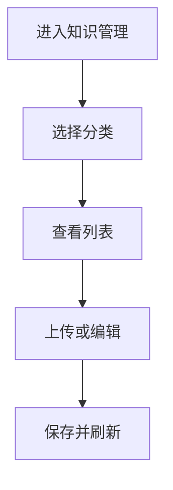
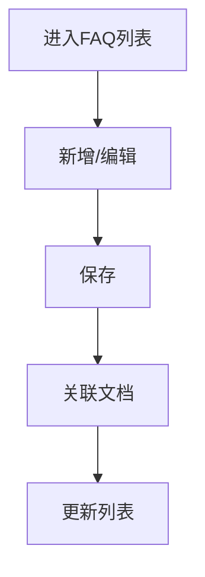

# 功能PRD：知识管理

## 文档信息

| 字段 | 说明 |
|------|------|
| **文档编号** | PRD-FEATURE-Knowledge-Management-v1.0 |
| **功能名称** | 知识管理 |
| **核心价值** | 提供知识文档与FAQ的统一维护能力 |
| **迭代目标** | 完成分类树、文档库与FAQ库的基础管理能力 |
| **关联需求** | US-2.3-03, US-2.3-04 |
| **状态** | 草稿 |
| **创建日期** | 2026-01-14 |
| **更新日期** | 2026-01-14 |
| **文档Owner** | 产品负责人 |

---

## 1. 功能概述

### 1.1 功能定位

知识管理用于维护知识文档与FAQ，提供分类树、搜索、上传、查看、删除等基础管理能力，支撑知识应用的检索与复用。

### 1.2 目标用户

- **主要用户**: 知识管理员
- **次要用户**: 无（客服仅使用知识应用）

### 1.3 核心价值

**对用户的价值**:
- 管理员可快速维护知识内容
- 客服可持续使用结构化知识

**对业务的价值**:
- 知识沉淀标准化
- 支撑后续智能检索与推荐

### 1.4 优先级

- **优先级**: P0
- **RICE分数**: 80
  - Reach（影响用户数）: 20+管理员
  - Impact（对用户价值）: 高
  - Confidence（成功把握）: 75%
  - Effort（开发成本）: 3周

### 1.5 权限与入口

详见[权限与入口管理说明](2.10-Permission-Management-PRD.md)。

**本功能最小权限说明**:
- **知识管理员**: 可访问知识管理、创建/编辑/删除文档与FAQ、维护关联关系
- **主管/经理**: 只读访问文档与FAQ列表与详情，不可编辑与删除
- **其他角色**: 无访问权限

**入口说明**:
- 系统设置或后台管理模块中的“知识管理”入口
- 仅内部账号可见

---

## 2. 功能需求

### 2.1 用户故事

**US-01**: 作为知识管理员，我希望上传与管理文档，以便持续维护知识库。

**US-02**: 作为知识管理员，我希望维护FAQ与相似问题，以便提升检索准确性。

### 2.2 功能列表

| 功能项 | 描述 | 优先级 | 依赖 | 工作量 |
|-------|------|--------|------|--------|
| 分类树浏览 | 三级分类与筛选 | P0 | 分类配置 | 3天 |
| 文档列表 | 搜索/筛选/排序/分页 | P0 | 文档服务 | 4天 |
| 文档上传 | 上传、校验与入库 | P0 | 文件存储 | 4天 |
| 文档详情 | 预览与元信息展示 | P0 | 文件预览 | 3天 |
| 文档删除 | 软删除与审计 | P1 | 审计日志 | 2天 |
| FAQ管理 | 新增/编辑/删除 | P0 | FAQ服务 | 4天 |
| 相似问题 | 手动维护与推荐 | P1 | 推荐服务 | 2天 |
| 文档-FAQ关联 | 关联管理与溯源 | P1 | 关联服务 | 2天 |

### 2.3 详细规格说明

#### 功能1：分类树浏览

**功能描述**: 提供左侧分类树，支持三级分类展开、筛选与面包屑定位。

**分类维护范围**:
- 本模块支持分类的新增、编辑、删除与排序
- 分类层级固定为三级，禁止跨层级移动

**新增规则与要求**:
- 新增时必须选择父级，一级分类的父级为空
- 分类名称去除首尾空格后校验长度1-50，禁止全空格
- 同一父级下名称唯一（忽略大小写与全角半角差异）
- 单个父级下子分类数量上限为50，超出禁止新增
- 排序值为1-9999，越小越靠前，未填写默认按创建时间排序
- 新增成功后默认展开并选中该分类

**编辑规则与要求**:
- 仅允许修改名称与排序值，不允许修改层级
- 编辑后若命名冲突，阻止保存并提示
- 编辑后默认保留原展开状态与选中状态

**排序规则与要求**:
- 支持同级内排序，禁止跨层级拖拽
- 同级排序变更后即时生效，并同步到列表筛选条件
- 批量排序时需一次性保存，保存失败需回滚并提示

**系统分类规则**:
- “未分类”为系统保留分类，不可编辑名称与不可删除
- 未分类下仅允许管理员手动归类或批量迁移

**外部依赖与降级展示**:
- **分类配置服务**: 若加载失败，展示“分类加载失败”，并提供重试。
- **分类数据为空**: 显示“未配置分类”，同时允许显示“未分类”入口。

**字段定义**:
| 字段名 | 类型 | 必填 | 说明 | 示例 | 约束 |
|-------|------|------|------|------|------|
| categoryId | string | 是 | 分类ID | "cat_001" | 唯一 |
| name | string | 是 | 分类名称 | "账号问题" | 1-50 |
| level | number | 是 | 层级 | 1 | 1-3 |
| parentId | string | 否 | 父级ID | "cat_000" | - |

**交互行为**:
1. 点击分类 → 右侧列表刷新
2. 展开/收起分类 → 保持选中状态
3. 点击面包屑 → 快速返回上级分类
4. 新增分类 → 弹窗输入名称，选择父级并保存
5. 编辑分类 → 支持修改名称与排序
6. 删除分类 → 二次确认

**边界条件**:
- 层级超过3 → 不显示
- 当前分类无内容 → 列表显示空状态
- 删除含子级分类 → 禁止删除并提示“请先删除子级分类”
- 删除含文档/FAQ → 禁止删除并提示“分类下仍有内容，请先迁移或删除”
- 分类重名 → 同一父级下名称不可重复

**弹窗与提示文案**:
- 删除分类确认: “确定删除该分类吗？删除后不可恢复。”
- 删除含子级分类: “该分类下存在子级分类，请先删除子级分类。”
- 删除含内容: “该分类下存在文档或FAQ，请先迁移或删除相关内容。”
- 分类命名冲突: “同级分类下已存在相同名称，请修改后再保存。”
- 分类层级限制: “已达到第三级分类，不能继续新增子级。”

**权限要求**: 详见[权限与入口管理说明](2.10-Permission-Management-PRD.md)

---

#### 功能2：文档列表

**功能描述**: 展示文档列表，支持关键字搜索、状态筛选、排序与分页。

**外部依赖与降级展示**:
- **文档服务**: 若获取失败，显示“列表加载失败”，提供重试。
- **搜索服务**: 若不可用，保留分类筛选，禁用关键词搜索输入。

**字段定义**:
| 字段名 | 类型 | 必填 | 说明 | 示例 | 约束 |
|-------|------|------|------|------|------|
| title | string | 是 | 文档标题 | "登录问题处理" | 1-100 |
| categoryName | string | 是 | 分类 | "账号问题" | 1-50 |
| status | enum | 是 | 状态 | "active" | active/archived/deprecated |
| updatedAt | string | 是 | 更新时间 | "2026-01-14" | YYYY-MM-DD |
| owner | string | 否 | 负责人 | "李四" | 0-20 |
| faqCount | number | 否 | 关联FAQ数量 | 3 | >=0 |

**搜索规则**:
- 搜索范围: 标题、摘要、标签
- 支持多关键词，按空格分词，默认“AND”逻辑
- 支持精确短语，使用双引号包裹
- 不区分大小写，忽略首尾空格
- 关键词最少2个字符，最多50个字符

**筛选与排序**:
- **筛选项**: 分类、状态、标签、更新时间范围、负责人
- **排序项**: 更新时间（默认倒序）、标题（升序）
- **分页**: 默认每页20条，可选10/20/50

**字段显示规则**:
- 标题超出20字截断并显示悬浮全文
- 状态用颜色标签标识（active=绿色，archived=灰色，deprecated=橙色）
- 标签最多展示3个，超过显示“+N”
- 负责人为空时显示“—”
- 更新时间显示为YYYY-MM-DD

**交互行为**:
1. 输入关键词 → 列表刷新
2. 选择状态筛选 → 列表刷新
3. 点击排序 → 按选中字段排序
4. 点击行 → 打开详情预览

**边界条件**:
- 无结果 → 显示空状态
- 排序字段为空 → 保持默认顺序

**权限要求**: 详见[权限与入口管理说明](2.10-Permission-Management-PRD.md)

---

#### 功能3：文档上传

**功能描述**: 支持上传文档并入库，填写分类、标签与摘要。

**外部依赖与降级展示**:
- **文件存储**: 上传失败提示错误原因并允许重试。
- **文件预览服务**: 若不可用，仍允许上传，但详情预览仅显示基础信息。
- **FAQ挖掘服务**: 若不可用，默认不触发FAQ挖掘，提示“FAQ挖掘暂不可用”。

**字段定义**:
| 字段名 | 类型 | 必填 | 说明 | 示例 | 约束 |
|-------|------|------|------|------|------|
| title | string | 是 | 文档标题 | "登录问题处理" | 1-100 |
| categoryId | string | 是 | 分类ID | "cat_001" | 必须存在 |
| fileId | string | 是 | 文件ID | "file_1" | - |
| fileName | string | 是 | 文件名 | "login.pdf" | 1-100 |
| fileType | string | 是 | 类型 | "pdf" | pdf/docx/xlsx |
| fileSize | number | 是 | 文件大小 | 2 | 单位MB，<=20 |
| tags | array | 否 | 标签 | ["账号"] | 最多5个且去重 |
| summary | string | 否 | 摘要 | "登录失败处理" | 0-200 |
| faqMining | boolean | 否 | 是否进行FAQ挖掘 | true | 默认false |

**输入限制**:
- 标题不可重复于同一分类下的“活跃文档”，重复时提示并要求确认继续上传
- 标签支持中英文、数字与下划线，单个标签1-20字符
- 文件名支持中英文、数字、空格与常见符号，长度1-100

**相同文档判定与处理规则**:
- **同名判定**: 同一分类下标题完全一致（trim后比较）视为同名
- **重复内容判定**: 文件内容MD5一致视为重复内容（与标题无关）
- **处理规则**:
  - 同名但内容不同: 提示“同名文档已存在”，默认不允许提交，需勾选“确认覆盖/新版本”后才可继续
  - 内容重复但标题不同: 提示“重复内容已存在”，默认不允许提交，提供“关联已有文档/继续上传为新版本”选项
  - 同名且内容重复: 直接阻止上传并提示“已存在相同文档”

**交互行为**:
1. 点击上传 → 选择文件与分类
2. 选择“是否进行FAQ挖掘” → 默认关闭
3. 校验通过 → 开始上传并展示进度
4. 上传成功 → 列表刷新并提示成功
5. 若开启FAQ挖掘 → 进入挖掘任务队列并提示“挖掘中”
6. 上传中可取消 → 取消后不保留草稿

**边界条件**:
- 文件类型不支持 → 阻止上传并提示
- 文件超过大小限制 → 提示并禁止上传
- 挖掘任务失败 → 记录失败原因并提示“挖掘失败，可重新发起”
- 未开启挖掘 → 不产生FAQ任务

**弹窗与提示文案**:
- 同名文档确认: “已存在同名文档，继续上传将生成新版本，是否继续？”
- 重复内容确认: “检测到内容重复，可选择关联已有文档或继续上传为新版本。”
- 取消上传确认: “正在上传，确定取消？取消后将不会保留草稿。”

**权限要求**: 详见[权限与入口管理说明](2.10-Permission-Management-PRD.md)

---

#### 功能4：文档详情

**功能描述**: 展示文档元信息与正文预览，支持复制与下载（权限说明见[权限与入口管理说明](2.10-Permission-Management-PRD.md)）。

**文档与FAQ关系**:
- 文档可作为FAQ挖掘来源，关联关系记录在“文档-FAQ关联表”中。
- 详情页需展示“关联FAQ数量”与入口，支持跳转查看关联FAQ列表。
- 文档状态变为archived/deprecated时，关联FAQ仍可展示，但需显示“来源文档已归档/已废弃”标签。
- 文档删除后，关联FAQ标记“来源文档已删除”，不可回溯正文，仅保留元信息。

**字段展示**:
- 标题、分类、状态、标签、摘要、负责人、更新时间
- 文件名、文件类型、文件大小、来源（手工上传/批量导入）
- 删除状态显示“删除人/删除时间”字段，仅管理员可见
- 正文预览只展示前N页（默认10页），超出部分提示下载查看

**外部依赖与降级展示**:
- **预览服务**: 若不可用，展示“预览不可用”，提供下载入口。
- **内容缺失**: 若正文为空，显示“暂无正文”。

**交互行为**:
1. 打开详情 → 显示摘要与正文
2. 点击复制 → 复制正文到剪贴板
3. 点击“关联FAQ” → 打开关联FAQ列表弹窗

**边界条件**:
- 预览失败 → 提示并允许重试
- 未关联FAQ → 显示“暂无关联FAQ”

**权限要求**: 详见[权限与入口管理说明](2.10-Permission-Management-PRD.md)

---

#### 功能5：文档删除

**功能描述**: 支持软删除文档，删除后不可在检索中出现。

**文档与FAQ关系**:
- 删除文档不会删除已生成的FAQ，但需保留“来源文档已删除”的标记。
- 删除后关联FAQ列表仍可查看，但不可继续回溯文档正文。

**外部依赖与降级展示**:
- **审计日志服务**: 若不可用，禁止删除并提示“审计服务不可用”。

**交互行为**:
1. 点击删除 → 二次确认
2. 若存在关联FAQ → 弹窗提示“是否一并删除关联FAQ”，默认不勾选
3. 删除成功 → 列表刷新

**边界条件**:
- 已删除文档 → 仅显示“已删除”状态
- 关联FAQ存在且未勾选删除 → FAQ保留并标记“来源文档已删除”
- 关联FAQ存在且勾选删除 → 关联FAQ同步删除并记录审计
- 本迭代不提供恢复入口

**弹窗与提示文案**:
- 删除文档确认: “确定删除该文档吗？删除后不可恢复。”
- 删除关联FAQ提示: “该文档存在关联FAQ，是否同时删除关联FAQ？”

**权限要求**: 详见[权限与入口管理说明](2.10-Permission-Management-PRD.md)

---

#### 功能6：FAQ管理

**功能描述**: 支持FAQ新增、编辑、删除及状态管理。

**文档与FAQ关系**:
- FAQ可关联一个或多个来源文档，来源文档用于溯源与复审。
- 编辑FAQ不影响来源文档正文，但需记录变更历史与责任人。

**外部依赖与降级展示**:
- **FAQ服务**: 若获取失败，显示“FAQ加载失败”并提供重试。

**字段定义**:
| 字段名 | 类型 | 必填 | 说明 | 示例 | 约束 |
|-------|------|------|------|------|------|
| question | string | 是 | 问题 | "如何重置密码" | 1-200 |
| answer | string | 是 | 答案 | "进入设置重置" | 1-2000 |
| status | enum | 是 | 状态 | "active" | active/archived/deprecated |
| tags | array | 否 | 标签 | ["账号"] | 最多5个 |
| sourceDocIds | array | 否 | 来源文档ID | ["doc_1"] | 最多20个 |

**输入限制**:
- 问题不得与同分类下已有FAQ重复，重复时提示并阻止保存
- 答案支持富文本，但需过滤脚本标签与外链JS
- 相似问题与主问题不得重复，重复时提示并阻止保存

**相同/相似FAQ判定与处理规则**:
- **同问题判定**: 标题完全一致（trim后比较）视为同问题
- **相似问题判定**: 相似度>=0.85或命中“相似问题”列表
- **处理规则**:
  - 同问题: 阻止保存，提示“已存在相同FAQ”
  - 相似问题: 允许保存但提示“存在相似FAQ”，需确认后提交并记录审计

**交互行为**:
1. 新增FAQ → 保存并刷新
2. 编辑FAQ → 保存并更新
3. 删除FAQ → 二次确认
4. 关联文档 → 选择来源文档并保存关联关系

**字段显示规则**:
- 问题超出30字截断并显示悬浮全文
- 答案在列表仅展示前60字
- 状态标签同文档规则
- 标签最多展示3个，超过显示“+N”

**边界条件**:
- 问题或答案为空 → 提示必填
- 关联文档不可用 → 仅保存FAQ，不建立关联
- 状态变更为deprecated → 从检索结果中降权处理

**弹窗与提示文案**:
- 删除FAQ确认: “确定删除该FAQ吗？删除后不可恢复。”
- 相似FAQ提醒: “检测到相似FAQ，是否继续保存？”

**权限要求**: 详见[权限与入口管理说明](2.10-Permission-Management-PRD.md)

---

#### 功能7：相似问题

**功能描述**: 支持FAQ相似问题维护，包含手动添加与系统推荐。

**外部依赖与降级展示**:
- **推荐服务**: 若不可用，仅保留手动添加入口。

**字段定义**:
| 字段名 | 类型 | 必填 | 说明 | 示例 | 约束 |
|-------|------|------|------|------|------|
| faqId | string | 是 | 所属FAQ | "faq_1" | - |
| question | string | 是 | 相似问题 | "密码忘记怎么办" | 1-200 |
| source | enum | 是 | 来源 | "manual" | manual/recommend |
| createdAt | string | 是 | 创建时间 | "2026-01-14" | YYYY-MM-DD |

**输入限制**:
- 单个FAQ最多维护10条相似问题
- 相似问题去重，忽略大小写与首尾空格

**交互行为**:
1. 点击“添加相似问题” → 输入问题并保存
2. 选择推荐问题 → 一键添加

**边界条件**:
- 相似问题重复 → 去重提示

---

#### 功能8：文档-FAQ关联管理

**功能描述**: 维护文档与FAQ的对应关系，支持来源标记、关联查看与变更追踪。

**外部依赖与降级展示**:
- **关联服务**: 若不可用，关联信息展示“加载失败”，不影响文档/FAQ主体展示。

**字段定义**:
| 字段名 | 类型 | 必填 | 说明 | 示例 | 约束 |
|-------|------|------|------|------|------|
| linkId | string | 是 | 关联ID | "link_1" | 唯一 |
| docId | string | 是 | 文档ID | "doc_1" | - |
| faqId | string | 是 | FAQ ID | "faq_1" | - |
| linkType | enum | 是 | 关联类型 | "mined" | mined/manual |
| sourceStatus | enum | 是 | 来源状态 | "active" | active/deleted |
| createdAt | string | 是 | 创建时间 | "2026-01-14" | YYYY-MM-DD |
| operator | string | 否 | 操作人 | "王五" | 0-20 |

**交互行为**:
1. 文档上传选择FAQ挖掘 → 系统自动建立关联
2. 手动关联FAQ → 保存关联记录
3. 文档删除 → 关联记录sourceStatus更新为deleted

**边界条件**:
- 关联重复 → 去重提示
- 关联变更失败 → 回滚并提示

**权限要求**: 详见[权限与入口管理说明](2.10-Permission-Management-PRD.md)

---

### 2.4 业务规则

- 文档状态默认为active，可切换为archived或deprecated
- archived文档不参与默认检索，但可在管理端筛选查看
- deprecated文档参与检索但排序降权
- 文档删除后不进入检索与推荐，但关联FAQ仍可使用
- 文档上传默认创建为“当前版本”，覆盖/新版本需记录版本号与操作人
- FAQ编辑需记录变更历史（字段：变更前后内容、操作者、时间）

---

## 3. UI设计

### 3.1 页面布局

#### 布局方案1：左树+右列表

**页面结构**:
```
┌──────────────────────────────────┐
│ 分类树       │ 文档/FAQ列表       │
│             │ 详情抽屉/弹窗       │
└──────────────────────────────────┘
```

**布局说明**:
- 左侧分类树，右侧列表与详情

### 3.2 组件说明

#### 组件1：分类树

**组件类型**: 树形导航

**位置**: 左侧

**交互行为**:
- 点击节点筛选列表

#### 组件2：列表与筛选栏

**组件类型**: 表格/列表

**交互行为**:
- 顶部筛选栏支持关键词、状态、标签筛选
- 列表支持排序、分页与行点击

#### 组件3：上传弹窗

**组件类型**: 弹窗或抽屉

**交互行为**:
- 表单校验与上传进度
- 支持取消上传

#### 组件4：详情预览

**组件类型**: 右侧抽屉

**交互行为**:
- 展示元信息、正文与关联FAQ入口

#### 组件5：FAQ编辑表单

**组件类型**: 弹窗

**交互行为**:
- 表单校验、标签与来源文档选择

---

### 3.3 样式规范

- 颜色、字体、间距与全局一致

### 3.4 响应式设计

| 断点 | 宽度范围 | 布局调整 |
|-----|---------|---------|
| Desktop | >1200px | 双栏布局 |
| Tablet | 768-1199px | 树折叠为抽屉 |
| Mobile | <768px | 列表单栏 |

---

## 4. 交互流程

### 4.1 主流程



### 4.2 FAQ管理流程



### 4.3 异常分支

#### 异常1：上传失败

- **触发条件**: 文件存储异常
- **处理方式**: 显示失败提示
- **用户提示**: “上传失败，请重试”
- **恢复方式**: 重新上传

#### 异常2：删除失败

- **触发条件**: 审计服务不可用或删除权限不足
- **处理方式**: 阻止删除并提示原因
- **用户提示**: “当前无法删除，请联系管理员”
- **恢复方式**: 刷新后重试

---

## 5. 接口定义

### 5.0 统一响应与错误码

**统一响应结构**:
```json
{
  "code": "OK",
  "message": "success",
  "requestId": "req_123",
  "data": {}
}
```

**通用错误码**:
| 错误码 | 含义 | 说明 |
|-------|------|------|
| OK | 成功 | 请求成功 |
| INVALID_PARAM | 参数错误 | 校验失败或缺失 |
| UNAUTHORIZED | 未登录 | 需要登录 |
| FORBIDDEN | 无权限 | 无访问或操作权限 |
| NOT_FOUND | 资源不存在 | 文档/FAQ/分类不存在 |
| CONFLICT | 冲突 | 同名/重复内容/状态冲突 |
| DEPENDENCY_FAILED | 依赖失败 | 外部服务不可用 |
| INTERNAL_ERROR | 服务器错误 | 未知错误 |

**错误响应示例**:
```json
{
  "code": "CONFLICT",
  "message": "Duplicate document content",
  "requestId": "req_123",
  "data": {
    "conflictType": "content_md5",
    "existingId": "doc_1"
  }
}
```

### 5.1 获取分类树

**接口路径**: `/api/knowledge/categories`

**请求方法**: GET

**响应示例**:
```json
[
  {
    "id": "cat_001",
    "name": "账号问题",
    "level": 1,
    "parentId": null
  }
]
```

---

### 5.1.1 新增分类

**接口路径**: `/api/knowledge/categories`

**请求方法**: POST

**请求体**:
```json
{
  "name": "账号问题",
  "parentId": null,
  "sortOrder": 10
}
```

---

### 5.1.2 编辑分类

**接口路径**: `/api/knowledge/categories/{id}`

**请求方法**: PUT

**请求体**:
```json
{
  "name": "账号问题",
  "sortOrder": 20
}
```

---

### 5.1.3 删除分类

**接口路径**: `/api/knowledge/categories/{id}`

**请求方法**: DELETE

**失败场景**:
- 分类下存在子分类或文档/FAQ时返回`CONFLICT`

---

### 5.2 获取文档列表

**接口路径**: `/api/knowledge/docs`

**请求方法**: GET

**查询参数**:
| 参数名 | 类型 | 必填 | 说明 | 默认值 |
|-------|------|------|------|------|
| categoryId | string | 否 | 分类ID | - |
| keyword | string | 否 | 关键词 | - |
| status | string | 否 | 状态 | active |
| tags | string | 否 | 标签（逗号分隔） | - |
| owner | string | 否 | 负责人 | - |
| updatedFrom | string | 否 | 更新时间起 | - |
| updatedTo | string | 否 | 更新时间止 | - |
| page | number | 否 | 页码 | 1 |
| pageSize | number | 否 | 每页 | 20 |

**响应示例**:
```json
{
  "total": 120,
  "page": 1,
  "pageSize": 20,
  "items": [
    {
      "id": "doc_1",
      "title": "登录问题处理",
      "categoryId": "cat_001",
      "categoryName": "账号问题",
      "status": "active",
      "updatedAt": "2026-01-14",
      "owner": "李四",
      "faqCount": 3
    }
  ]
}
```

---

### 5.3 获取文档详情

**接口路径**: `/api/knowledge/docs/{id}`

**请求方法**: GET

**响应示例**:
```json
{
  "id": "doc_1",
  "title": "登录问题处理",
  "categoryId": "cat_001",
  "categoryName": "账号问题",
  "status": "active",
  "tags": ["账号"],
  "summary": "账号冻结处理",
  "content": "正文内容...",
  "file": {
    "fileId": "file_1",
    "fileName": "login.pdf",
    "fileType": "pdf",
    "fileSize": 2
  },
  "owner": "李四",
  "updatedAt": "2026-01-14",
  "faqCount": 3
}
```

---

### 5.4 上传文档

**接口路径**: `/api/knowledge/docs`

**请求方法**: POST

**权限要求**: 详见[权限与入口管理说明](2.10-Permission-Management-PRD.md)

**请求体**:
```json
{
  "title": "登录问题处理",
  "categoryId": "cat_001",
  "fileId": "file_1",
  "faqMining": false,
  "tags": ["账号"],
  "summary": "账号冻结处理"
}
```

**冲突说明**:
- 同名文档返回`CONFLICT`，`data.conflictType=title`
- 重复内容返回`CONFLICT`，`data.conflictType=content_md5`

---

### 5.5 删除文档

**接口路径**: `/api/knowledge/docs/{id}`

**请求方法**: DELETE

**查询参数**:
| 参数名 | 类型 | 必填 | 说明 | 默认值 |
|-------|------|------|------|------|
| deleteRelatedFaq | boolean | 否 | 是否删除关联FAQ | false |

---

### 5.6 FAQ管理

**接口路径**: `/api/knowledge/faqs`

**请求方法**: GET/POST/PUT/DELETE

**GET查询参数**:
| 参数名 | 类型 | 必填 | 说明 | 默认值 |
|-------|------|------|------|------|
| keyword | string | 否 | 关键词 | - |
| status | string | 否 | 状态 | active |
| categoryId | string | 否 | 分类ID | - |
| page | number | 否 | 页码 | 1 |
| pageSize | number | 否 | 每页 | 20 |

**POST/PUT请求体**:
```json
{
  "question": "如何重置密码",
  "answer": "进入设置重置",
  "status": "active",
  "tags": ["账号"],
  "sourceDocIds": ["doc_1"]
}
```

---

### 5.7 相似问题维护

**接口路径**: `/api/knowledge/faqs/{id}/similar-questions`

**请求方法**: POST/DELETE

**POST请求体**:
```json
{
  "question": "密码忘记怎么办",
  "source": "manual"
}
```

---

### 5.8 文档-FAQ关联管理

**接口路径**: `/api/knowledge/links`

**请求方法**: GET/POST/DELETE

**POST请求体**:
```json
{
  "docId": "doc_1",
  "faqId": "faq_1",
  "linkType": "manual"
}
```

---

## 6. 数据模型

### 6.1 KnowledgeDoc

**实体描述**: 知识文档。

**TypeScript接口定义**:
```typescript
interface KnowledgeDoc {
  id: string;
  title: string;
  status: 'active' | 'archived' | 'deprecated';
  summary?: string;
  content: string;
  categoryId: string;
  categoryName?: string;
  tags: string[];
  owner?: string;
  source?: 'manual' | 'batch';
  fileId: string;
  fileName: string;
  fileType: string;
  fileSize: number;
  faqCount?: number;
  createdAt?: string;
  updatedAt?: string;
  deletedAt?: string;
  deletedBy?: string;
}
```

### 6.2 KnowledgeFaq

**实体描述**: FAQ条目。

**TypeScript接口定义**:
```typescript
interface KnowledgeFaq {
  id: string;
  question: string;
  answer: string;
  status: 'active' | 'archived' | 'deprecated';
  tags?: string[];
  similarQuestions?: string[];
  sourceDocIds?: string[];
  createdAt?: string;
  updatedAt?: string;
}
```

### 6.3 KnowledgeCategory

**实体描述**: 知识分类。

**TypeScript接口定义**:
```typescript
interface KnowledgeCategory {
  id: string;
  name: string;
  level: 1 | 2 | 3;
  parentId?: string;
}
```

### 6.4 KnowledgeFaqLink

**实体描述**: 文档与FAQ关联关系。

**TypeScript接口定义**:
```typescript
interface KnowledgeFaqLink {
  id: string;
  docId: string;
  faqId: string;
  linkType: 'mined' | 'manual';
  sourceStatus: 'active' | 'deleted';
  createdAt: string;
  operator?: string;
}
```

### 6.5 KnowledgeSimilarQuestion

**实体描述**: FAQ相似问题。

**TypeScript接口定义**:
```typescript
interface KnowledgeSimilarQuestion {
  id: string;
  faqId: string;
  question: string;
  source: 'manual' | 'recommend';
  createdAt: string;
}
```

---

## 7. 验收标准

### 7.1 功能验收

| 验收项 | 验收标准 | 优先级 | 测试方法 |
|-------|---------|--------|---------|
| 分类树 | 可筛选与切换 | P0 | 手动 |
| 文档列表 | 搜索/筛选/排序可用 | P0 | 手动 |
| 文档上传 | 校验与上传成功 | P0 | 手动 |
| 文档详情 | 预览与复制可用 | P1 | 手动 |
| 文档删除 | 软删除生效且记录审计 | P1 | 手动 |
| FAQ管理 | 新增/编辑/删除可用 | P0 | 手动 |
| 相似问题 | 手动维护与去重 | P1 | 手动 |
| 文档-FAQ关联 | 关联可查看与删除标记 | P1 | 手动 |
| 权限控制 | 角色权限符合说明 | P0 | 手动 |

### 7.2 性能验收

| 验收项 | 验收标准 | 测试方法 |
|-------|---------|---------|
| 列表刷新 | <500ms | 手动 |
| 上传响应 | <2秒开始上传 | 手动 |
| 详情加载 | <500ms | 手动 |

---

## 8. 非功能需求

### 8.1 性能要求

| 指标 | 目标值 | 测量方法 |
|-----|--------|---------|
| 分类树渲染 | <300ms | 手动 |
| 详情加载 | <500ms | 手动 |

### 8.2 可用性要求

| 指标 | 目标值 |
|-----|--------|
| 系统可用性 | >99% |

### 8.3 安全要求

- 权限控制详见[权限与入口管理说明](2.10-Permission-Management-PRD.md)
- 上传文件类型与大小限制
- 删除操作记录审计日志
- FAQ内容编辑需记录操作人

### 8.4 可扩展性要求

- 分类层级可配置
- 标签体系可扩展

### 8.5 可维护性要求

- 文档状态可配置
- 关联关系可追溯

---

## 附录A：术语表

| 术语 | 定义 |
|-----|------|
| FAQ | 常见问题与标准答案 |
| 分类树 | 知识目录层级结构 |

---

## 附录B：外围系统依赖

| 系统 | 依赖说明 | API路径 | 负责人 |
|------|---------|--------|------|
| 文件存储 | 文档上传与预览 | /api/files | 平台团队 |
| 文档预览 | 文档在线预览 | /api/files/preview | 平台团队 |
| 推荐服务 | 相似问题推荐 | /api/recommendations | 搜索平台团队 |

---

## 附录C：待决策事项

| 事项ID | 事项描述 | 备选方案 | 决策人 | 截止日期 | 状态 |
|--------|---------|---------|--------|---------|------|
| Q-01 | 相似问题自动生成方式 | 规则/模型 | 产品负责人 | 2026-02-01 | ⏳待决策 |
| Q-02 | FAQ挖掘默认开关 | 默认关闭/默认开启 | 产品负责人 | 2026-02-01 | ⏳待决策 |

---

## 附录D：变更历史

| 版本 | 日期 | 变更内容 | 变更人 | 审核人 |
|-----|------|---------|--------|--------|
| v1.0 | 2026-01-14 | 初始版本（按模板补全） | 产品负责人 | 产品负责人 |

---

**文档结束**
