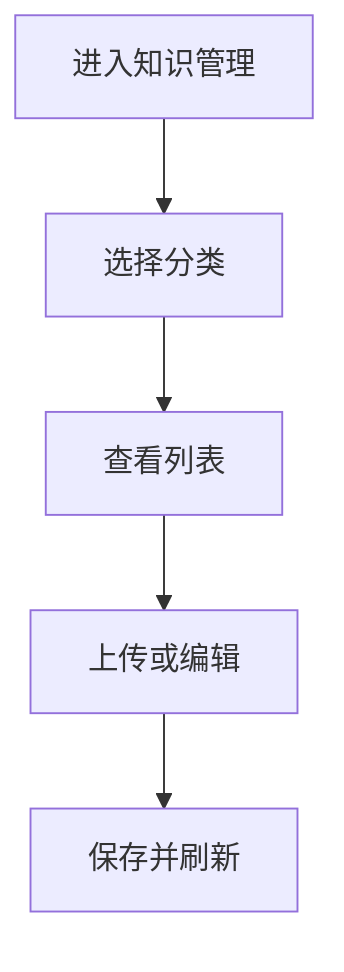

# 功能PRD：知识管理

## 文档信息

| 字段 | 说明 |
|------|------|
| **文档编号** | PRD-FEATURE-Knowledge-Management-v1.0 |
| **功能名称** | 知识管理 |
| **核心价值** | 提供知识文档与FAQ的统一维护能力 |
| **迭代目标** | 完成分类树、文档库与FAQ库的基础管理能力 |
| **关联需求** | US-2.3-03, US-2.3-04 |
| **状态** | 草稿 |
| **创建日期** | 2026-01-14 |
| **更新日期** | 2026-01-14 |
| **文档Owner** | 产品负责人 |

---

## 1. 功能概述

### 1.1 功能定位

知识管理用于维护知识文档与FAQ，提供分类树、搜索、上传、查看、删除等基础管理能力，支撑知识应用的检索与复用。

### 1.2 目标用户

- **主要用户**: 知识管理员
- **次要用户**: 无（客服仅使用知识应用）

### 1.3 核心价值

**对用户的价值**:
- 管理员可快速维护知识内容
- 客服可持续使用结构化知识

**对业务的价值**:
- 知识沉淀标准化
- 支撑后续智能检索与推荐

### 1.4 优先级

- **优先级**: P0
- **RICE分数**: 80
  - Reach（影响用户数）: 20+管理员
  - Impact（对用户价值）: 高
  - Confidence（成功把握）: 75%
  - Effort（开发成本）: 3周

### 1.5 权限与入口

- 管理员具备“知识管理”页面权限，菜单入口可见
- 客服无“知识管理”权限，菜单入口不展示

---

## 2. 功能需求

### 2.1 用户故事

**US-01**: 作为知识管理员，我希望上传与管理文档，以便持续维护知识库。

**US-02**: 作为知识管理员，我希望维护FAQ与相似问题，以便提升检索准确性。

### 2.2 功能列表

| 功能项 | 描述 | 优先级 | 依赖 | 工作量 |
|-------|------|--------|------|--------|
| 分类树浏览 | 三级分类与筛选 | P0 | 分类配置 | 3天 |
| 文档列表 | 搜索/筛选/排序/分页 | P0 | 文档服务 | 4天 |
| 文档上传 | 上传、校验与入库 | P0 | 文件存储 | 4天 |
| 文档详情 | 预览与元信息展示 | P0 | 文件预览 | 3天 |
| 文档删除 | 软删除与审计 | P1 | 审计日志 | 2天 |
| FAQ管理 | 新增/编辑/删除 | P0 | FAQ服务 | 4天 |
| 相似问题 | 手动维护与推荐 | P1 | 推荐服务 | 2天 |
| 文档-FAQ关联 | 关联管理与溯源 | P1 | 关联服务 | 2天 |

### 2.3 详细规格说明

#### 功能1：分类树浏览

**功能描述**: 提供左侧分类树，支持三级分类展开、筛选与面包屑定位。

**外部依赖与降级展示**:
- **分类配置服务**: 若加载失败，展示“分类加载失败”，并提供重试。
- **分类数据为空**: 显示“未配置分类”，同时允许显示“未分类”入口。

**字段定义**:
| 字段名 | 类型 | 必填 | 说明 | 示例 | 约束 |
|-------|------|------|------|------|------|
| categoryId | string | 是 | 分类ID | "cat_001" | 唯一 |
| name | string | 是 | 分类名称 | "账号问题" | 1-50 |
| level | number | 是 | 层级 | 1 | 1-3 |
| parentId | string | 否 | 父级ID | "cat_000" | - |

**交互行为**:
1. 点击分类 → 右侧列表刷新
2. 展开/收起分类 → 保持选中状态
3. 点击面包屑 → 快速返回上级分类

**边界条件**:
- 层级超过3 → 不显示
- 当前分类无内容 → 列表显示空状态

**权限要求**:
- 知识管理员：只读分类

---

#### 功能2：文档列表

**功能描述**: 展示文档列表，支持关键字搜索、状态筛选、排序与分页。

**外部依赖与降级展示**:
- **文档服务**: 若获取失败，显示“列表加载失败”，提供重试。
- **搜索服务**: 若不可用，保留分类筛选，禁用关键词搜索输入。

**字段定义**:
| 字段名 | 类型 | 必填 | 说明 | 示例 | 约束 |
|-------|------|------|------|------|------|
| title | string | 是 | 文档标题 | "登录问题处理" | 1-100 |
| category | string | 是 | 分类 | "账号问题" | 1-50 |
| status | enum | 是 | 状态 | "active" | active/archived/deprecated |
| updatedAt | string | 是 | 更新时间 | "2026-01-14" | YYYY-MM-DD |
| owner | string | 否 | 负责人 | "李四" | 0-20 |

**交互行为**:
1. 输入关键词 → 列表刷新
2. 选择状态筛选 → 列表刷新
3. 点击排序 → 按更新时间排序
4. 点击行 → 打开详情预览

**边界条件**:
- 无结果 → 显示空状态
- 排序字段为空 → 保持默认顺序

**权限要求**:
- 知识管理员：读写

---

#### 功能3：文档上传

**功能描述**: 支持上传文档并入库，填写分类、标签与摘要。

**外部依赖与降级展示**:
- **文件存储**: 上传失败提示错误原因并允许重试。
- **文件预览服务**: 若不可用，仍允许上传，但详情预览仅显示基础信息。
 - **FAQ挖掘服务**: 若不可用，默认不触发FAQ挖掘，提示“FAQ挖掘暂不可用”。

**字段定义**:
| 字段名 | 类型 | 必填 | 说明 | 示例 | 约束 |
|-------|------|------|------|------|------|
| fileId | string | 是 | 文件ID | "file_1" | - |
| fileName | string | 是 | 文件名 | "login.pdf" | 1-100 |
| fileType | string | 是 | 类型 | "pdf" | pdf/docx/xlsx |
| fileSize | number | 是 | 文件大小 | 2 | 单位MB，<=20 |
| tags | array | 否 | 标签 | ["账号"] | 最多5个 |
| summary | string | 否 | 摘要 | "登录失败处理" | 0-200 |
| faqMining | boolean | 否 | 是否进行FAQ挖掘 | true | 默认false |

**交互行为**:
1. 点击上传 → 选择文件与分类
2. 选择“是否进行FAQ挖掘” → 默认关闭
3. 校验通过 → 开始上传并展示进度
4. 上传成功 → 列表刷新并提示成功
5. 若开启FAQ挖掘 → 进入挖掘任务队列并提示“挖掘中”

**边界条件**:
- 文件类型不支持 → 阻止上传并提示
- 文件超过大小限制 → 提示并禁止上传
 - 挖掘任务失败 → 记录失败原因并提示“挖掘失败，可重新发起”
 - 未开启挖掘 → 不产生FAQ任务

**权限要求**:
- 知识管理员：读写

---

#### 功能4：文档详情

**功能描述**: 展示文档元信息与正文预览，支持复制与下载（如有权限）。

**文档与FAQ关系**:
- 文档可作为FAQ挖掘来源，关联关系记录在“文档-FAQ关联表”中。
- 详情页需展示“关联FAQ数量”与入口，支持跳转查看关联FAQ列表。

**外部依赖与降级展示**:
- **预览服务**: 若不可用，展示“预览不可用”，提供下载入口。
- **内容缺失**: 若正文为空，显示“暂无正文”。

**交互行为**:
1. 打开详情 → 显示摘要与正文
2. 点击复制 → 复制正文到剪贴板
3. 点击“关联FAQ” → 打开关联FAQ列表弹窗

**边界条件**:
- 预览失败 → 提示并允许重试
 - 未关联FAQ → 显示“暂无关联FAQ”

**权限要求**:
- 知识管理员：读写

---

#### 功能5：文档删除

**功能描述**: 支持软删除文档，删除后不可在检索中出现。

**文档与FAQ关系**:
- 删除文档不会删除已生成的FAQ，但需保留“来源文档已删除”的标记。
- 删除后关联FAQ列表仍可查看，但不可继续回溯文档正文。

**外部依赖与降级展示**:
- **审计日志服务**: 若不可用，禁止删除并提示“审计服务不可用”。

**交互行为**:
1. 点击删除 → 二次确认
2. 若存在关联FAQ → 弹窗提示“是否一并删除关联FAQ”，默认不勾选
3. 删除成功 → 列表刷新

**边界条件**:
- 已删除文档 → 仅显示“已删除”状态
- 关联FAQ存在且未勾选删除 → FAQ保留并标记“来源文档已删除”
- 关联FAQ存在且勾选删除 → 关联FAQ同步删除并记录审计

**权限要求**:
- 知识管理员：读写

---

#### 功能6：FAQ管理

**功能描述**: 支持FAQ新增、编辑、删除及状态管理。

**文档与FAQ关系**:
- FAQ可关联一个或多个来源文档，来源文档用于溯源与复审。
- 编辑FAQ不影响来源文档正文，但需记录变更历史与责任人。

**外部依赖与降级展示**:
- **FAQ服务**: 若获取失败，显示“FAQ加载失败”并提供重试。

**字段定义**:
| 字段名 | 类型 | 必填 | 说明 | 示例 | 约束 |
|-------|------|------|------|------|------|
| question | string | 是 | 问题 | "如何重置密码" | 1-200 |
| answer | string | 是 | 答案 | "进入设置重置" | 1-2000 |
| status | enum | 是 | 状态 | "active" | active/archived/deprecated |
| tags | array | 否 | 标签 | ["账号"] | 最多5个 |

**交互行为**:
1. 新增FAQ → 保存并刷新
2. 编辑FAQ → 保存并更新
3. 删除FAQ → 二次确认
4. 关联文档 → 选择来源文档并保存关联关系

**边界条件**:
- 问题或答案为空 → 提示必填
 - 关联文档不可用 → 仅保存FAQ，不建立关联

**权限要求**:
- 知识管理员：读写

---

#### 功能7：相似问题

**功能描述**: 支持FAQ相似问题维护，包含手动添加与系统推荐。

**外部依赖与降级展示**:
- **推荐服务**: 若不可用，仅保留手动添加入口。

**交互行为**:
1. 点击“添加相似问题” → 输入问题并保存
2. 选择推荐问题 → 一键添加

**边界条件**:
- 相似问题重复 → 去重提示

---

#### 功能8：文档-FAQ关联管理

**功能描述**: 维护文档与FAQ的对应关系，支持来源标记、关联查看与变更追踪。

**外部依赖与降级展示**:
- **关联服务**: 若不可用，关联信息展示“加载失败”，不影响文档/FAQ主体展示。

**字段定义**:
| 字段名 | 类型 | 必填 | 说明 | 示例 | 约束 |
|-------|------|------|------|------|------|
| linkId | string | 是 | 关联ID | "link_1" | 唯一 |
| docId | string | 是 | 文档ID | "doc_1" | - |
| faqId | string | 是 | FAQ ID | "faq_1" | - |
| linkType | enum | 是 | 关联类型 | "mined" | mined/manual |
| sourceStatus | enum | 是 | 来源状态 | "active" | active/deleted |
| createdAt | string | 是 | 创建时间 | "2026-01-14" | YYYY-MM-DD |

**交互行为**:
1. 文档上传选择FAQ挖掘 → 系统自动建立关联
2. 手动关联FAQ → 保存关联记录
3. 文档删除 → 关联记录sourceStatus更新为deleted

**边界条件**:
- 关联重复 → 去重提示
- 关联变更失败 → 回滚并提示

**权限要求**:
- 知识管理员：读写

---

## 3. UI设计

### 3.1 页面布局

#### 布局方案1：左树+右列表

**页面结构**:
```
┌──────────────────────────────────┐
│ 分类树       │ 文档/FAQ列表       │
│             │ 详情弹窗           │
└──────────────────────────────────┘
```

**布局说明**:
- 左侧分类树，右侧列表与详情

### 3.2 组件说明

#### 组件1：分类树

**组件类型**: 树形导航

**位置**: 左侧

**交互行为**:
- 点击节点筛选列表

---

### 3.3 样式规范

- 颜色、字体、间距与全局一致

### 3.4 响应式设计

| 断点 | 宽度范围 | 布局调整 |
|-----|---------|---------|
| Desktop | >1200px | 双栏布局 |
| Tablet | 768-1199px | 树折叠为抽屉 |
| Mobile | <768px | 列表单栏 |

---

## 4. 交互流程

### 4.1 主流程



### 4.2 异常分支

#### 异常1：上传失败

- **触发条件**: 文件存储异常
- **处理方式**: 显示失败提示
- **用户提示**: “上传失败，请重试”
- **恢复方式**: 重新上传

---

## 5. 接口定义

### 5.1 获取文档列表

**接口路径**: `/api/knowledge/docs`

**请求方法**: GET

**查询参数**:
| 参数名 | 类型 | 必填 | 说明 | 默认值 |
|-------|------|------|------|------|
| categoryId | string | 否 | 分类ID | - |
| keyword | string | 否 | 关键词 | - |
| status | string | 否 | 状态 | active |
| page | number | 否 | 页码 | 1 |
| pageSize | number | 否 | 每页 | 20 |

---

### 5.2 上传文档

**接口路径**: `/api/knowledge/docs`

**请求方法**: POST

**权限要求**: 管理员

**请求体**:
```json
{
  "title": "登录问题处理",
  "category": "账号问题",
  "fileId": "file_1",
  "faqMining": false,
  "tags": ["账号"],
  "summary": "账号冻结处理"
}
```

---

### 5.3 FAQ管理

**接口路径**: `/api/knowledge/faqs`

**请求方法**: POST/PUT/DELETE

---

## 6. 数据模型

### 6.1 KnowledgeDoc

**实体描述**: 知识文档。

**TypeScript接口定义**:
```typescript
interface KnowledgeDoc {
  id: string;
  title: string;
  status: 'active' | 'archived' | 'deprecated';
  summary?: string;
  content: string;
  category: string;
  tags: string[];
  owner?: string;
  source?: string;
  createdAt?: string;
  updatedAt?: string;
}
```

### 6.2 KnowledgeFaq

**实体描述**: FAQ条目。

**TypeScript接口定义**:
```typescript
interface KnowledgeFaq {
  id: string;
  question: string;
  answer: string;
  status: 'active' | 'archived' | 'deprecated';
  similarQuestions?: string[];
  sourceDocIds?: string[];
  createdAt?: string;
  updatedAt?: string;
}
```

### 6.3 KnowledgeCategory

**实体描述**: 知识分类。

**TypeScript接口定义**:
```typescript
interface KnowledgeCategory {
  id: string;
  name: string;
  level: 1 | 2 | 3;
  parentId?: string;
}
```

### 6.4 KnowledgeFaqLink

**实体描述**: 文档与FAQ关联关系。

**TypeScript接口定义**:
```typescript
interface KnowledgeFaqLink {
  id: string;
  docId: string;
  faqId: string;
  linkType: 'mined' | 'manual';
  sourceStatus: 'active' | 'deleted';
  createdAt: string;
}
```

---

## 7. 验收标准

### 7.1 功能验收

| 验收项 | 验收标准 | 优先级 | 测试方法 |
|-------|---------|--------|---------|
| 分类树 | 可筛选与切换 | P0 | 手动 |
| 文档列表 | 搜索/筛选/排序可用 | P0 | 手动 |
| 文档上传 | 校验与上传成功 | P0 | 手动 |
| 文档详情 | 预览与复制可用 | P1 | 手动 |
| FAQ管理 | 新增/编辑/删除可用 | P0 | 手动 |
| 相似问题 | 手动维护与去重 | P1 | 手动 |
| 文档-FAQ关联 | 关联可查看与删除标记 | P1 | 手动 |

### 7.2 性能验收

| 验收项 | 验收标准 | 测试方法 |
|-------|---------|---------|
| 列表刷新 | <500ms | 手动 |
| 上传响应 | <2秒开始上传 | 手动 |

---

## 8. 非功能需求

### 8.1 性能要求

| 指标 | 目标值 | 测量方法 |
|-----|--------|---------|
| 分类树渲染 | <300ms | 手动 |
| 详情加载 | <500ms | 手动 |

### 8.2 可用性要求

| 指标 | 目标值 |
|-----|--------|
| 系统可用性 | >99% |

### 8.3 安全要求

- 管理员权限控制与菜单入口可见性
- 上传文件类型与大小限制
- 删除操作记录审计日志

### 8.4 可扩展性要求

- 分类层级可配置
- 标签体系可扩展

### 8.5 可维护性要求

- 文档状态可配置

---

## 附录A：术语表

| 术语 | 定义 |
|-----|------|
| FAQ | 常见问题与标准答案 |
| 分类树 | 知识目录层级结构 |

---

## 附录B：外围系统依赖

| 系统 | 依赖说明 | API路径 | 负责人 |
|------|---------|--------|------|
| 文件存储 | 文档上传与预览 | /api/files | 平台团队 |
| 文档预览 | 文档在线预览 | /api/files/preview | 平台团队 |
| 推荐服务 | 相似问题推荐 | /api/recommendations | 搜索平台团队 |

---

## 附录C：待决策事项

| 事项ID | 事项描述 | 备选方案 | 决策人 | 截止日期 | 状态 |
|--------|---------|---------|--------|---------|------|
| Q-01 | 相似问题自动生成方式 | 规则/模型 | 产品负责人 | 2026-02-01 | ⏳待决策 |
| Q-02 | FAQ挖掘默认开关 | 默认关闭/默认开启 | 产品负责人 | 2026-02-01 | ⏳待决策 |

---

## 附录D：变更历史

| 版本 | 日期 | 变更内容 | 变更人 | 审核人 |
|-----|------|---------|--------|--------|
| v1.0 | 2026-01-14 | 初始版本（按模板补全） | 产品负责人 | 产品负责人 |

---

**文档结束**
