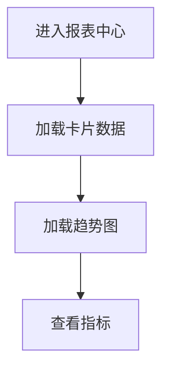

# 功能PRD：报表中心

## 文档信息

| 字段 | 说明 |
|------|------|
| **文档编号** | PRD-FEATURE-Report-Center-v1.0 |
| **功能名称** | 报表中心 |
| **核心价值** | 为管理层提供核心指标快速总览 |
| **迭代目标** | 构建基础报表卡片与趋势图 |
| **关联需求** | US-2.4-01, US-2.4-02 |
| **状态** | 草稿 |
| **创建日期** | 2026-01-14 |
| **更新日期** | 2026-01-14 |
| **文档Owner** | 产品负责人 |

---

## 1. 功能概述

### 1.1 功能定位

报表中心为管理层提供核心指标总览，入口位于 Dock 导航栏“报表”模块。

### 1.2 目标用户

- **主要用户**: 管理层
- **次要用户**: 主管/经理

### 1.3 核心价值

**对用户的价值**:
- 一屏查看核心运营指标
- 关注趋势变化

**对业务的价值**:
- 管理决策更及时
- 指标统一口径

### 1.4 优先级

- **优先级**: P2
- **RICE分数**: 60
  - Reach（影响用户数）: 20+管理层
  - Impact（对用户价值）: 中
  - Confidence（成功把握）: 70%
  - Effort（开发成本）: 2周

---

## 2. 功能需求

### 2.1 用户故事

**US-01**: 作为管理层，我希望快速查看关键指标，以便判断服务质量。

**US-02**: 作为主管，我希望查看近7天趋势，以便发现异常波动。

### 2.2 功能列表

| 功能项 | 描述 | 优先级 | 依赖 | 工作量 |
|-------|------|--------|------|--------|
| 报表入口 | Dock导航入口 | P0 | UI布局 | 1天 |
| 指标卡片 | 4个基础指标卡片 | P0 | 数据服务 | 2天 |
| 趋势图 | 近7天趋势图 | P1 | 数据服务 | 2天 |
| 时间范围 | 7天/30天切换 | P1 | 数据服务 | 1天 |
| 数据刷新 | 手动刷新与提示 | P1 | 数据服务 | 1天 |

### 2.3 详细规格说明

#### 功能1：报表入口

**功能描述**: Dock导航栏提供“报表”入口，点击后进入报表中心视图。

**外部依赖与降级展示**:
- **导航配置**: 若入口配置缺失，隐藏入口并记录日志。

**交互行为**:
1. 点击入口 → 进入报表中心

**边界条件**:
- 权限不足 → 处理方式详见[权限与入口管理说明](2.10-Permission-Management-PRD.md)

**权限要求**: 详见[权限与入口管理说明](2.10-Permission-Management-PRD.md)

---

#### 功能2：指标卡片

**功能描述**: 展示核心指标分组数据，包括响应时效、满意度、开单情况等。

**外部依赖与降级展示**:
- **指标服务**: 若获取失败，卡片显示“数据不可用”，保留刷新按钮。

**字段定义**:
| 字段名 | 类型 | 必填 | 说明 | 示例 | 约束 |
|-------|------|------|------|------|------|
| title | string | 是 | 卡片标题 | "响应时效" | 1-50 |
| metrics | array | 是 | 指标集合 | - | 至少1项 |
| metrics.label | string | 是 | 指标名称 | "平均首响" | 1-20 |
| metrics.value | string | 是 | 指标值 | "32秒" | - |

**交互行为**:
1. 进入报表中心 → 自动加载卡片
2. 悬停指标 → 显示口径说明

**边界条件**:
- 指标为空 → 显示“-”

**权限要求**: 详见[权限与入口管理说明](2.10-Permission-Management-PRD.md)

---

#### 功能3：趋势图

**功能描述**: 展示响应时效与满意度趋势曲线。

**外部依赖与降级展示**:
- **趋势数据服务**: 若不可用，显示“趋势图加载失败”。

**交互行为**:
1. 默认展示近7天
2. 悬停显示具体数值

**边界条件**:
- 数据点为空 → 显示空状态

---

#### 功能4：时间范围

**功能描述**: 支持7天/30天时间范围切换，影响卡片与趋势图。

**交互行为**:
1. 切换范围 → 重新请求数据

**边界条件**:
- 未返回数据 → 保持上一次成功数据并提示

---

#### 功能5：数据刷新

**功能描述**: 提供手动刷新按钮，展示刷新时间与结果提示。

**交互行为**:
1. 点击刷新 → 请求最新数据
2. 成功后提示“已更新”

**边界条件**:
- 刷新失败 → 提示“刷新失败”

---

## 3. UI设计

### 3.1 页面布局

#### 布局方案1：卡片+趋势图

**页面结构**:
```
┌──────────────────────────────────┐
│ 报表卡片区（4张）                 │
├──────────────────────────────────┤
│ 近7天趋势图                       │
└──────────────────────────────────┘
```

**布局说明**:
- 上方卡片区展示核心指标
- 下方趋势图展示时序数据

### 3.2 组件说明

#### 组件1：报表卡片

**组件类型**: 指标卡片

**位置**: 页面顶部

**交互行为**:
- 悬停显示指标说明

---

### 3.3 样式规范

- 颜色、字体、间距与全局一致

### 3.4 响应式设计

| 断点 | 宽度范围 | 布局调整 |
|-----|---------|---------|
| Desktop | >1200px | 四列卡片 |
| Tablet | 768-1199px | 两列卡片 |
| Mobile | <768px | 单列卡片 |

---

## 4. 交互流程

### 4.1 主流程



### 4.2 异常分支

#### 异常1：数据服务超时

- **触发条件**: 数据接口超时
- **处理方式**: 提示重试
- **用户提示**: “报表加载失败”
- **恢复方式**: 点击重试

---

## 5. 接口定义

### 5.1 获取报表卡片

**接口路径**: `/api/reports/summary`

**请求方法**: GET

**权限要求**: 详见[权限与入口管理说明](2.10-Permission-Management-PRD.md)

---

### 5.2 获取趋势数据

**接口路径**: `/api/reports/trends`

**请求方法**: GET

**查询参数**:
| 参数名 | 类型 | 必填 | 说明 | 默认值 |
|-------|------|------|------|------|
| range | string | 否 | 7d/30d | 7d |

---

## 6. 数据模型

### 6.1 ReportSummaryCard

**实体描述**: 报表卡片数据。

**TypeScript接口定义**:
```typescript
interface ReportSummaryCard {
  title: string;
  metrics: Array<{ label: string; value: string }>;
}
```

---

## 7. 验收标准

### 7.1 功能验收

| 验收项 | 验收标准 | 优先级 | 测试方法 |
|-------|---------|--------|---------|
| 报表入口 | Dock入口可用 | P0 | 手动 |
| 卡片展示 | 4个卡片数据正确 | P0 | 手动 |
| 趋势图 | 可展示7天/30天趋势 | P1 | 手动 |
| 刷新 | 手动刷新成功 | P1 | 手动 |

### 7.2 性能验收

| 验收项 | 验收标准 | 测试方法 |
|-------|---------|---------|
| 报表加载 | <500ms | 手动 |

---

## 8. 非功能需求

### 8.1 性能要求

| 指标 | 目标值 | 测量方法 |
|-----|--------|---------|
| 报表加载 | <500ms | 监控 |

### 8.2 可用性要求

| 指标 | 目标值 |
|-----|--------|
| 系统可用性 | >99% |

### 8.3 安全要求

- 权限控制详见[权限与入口管理说明](2.10-Permission-Management-PRD.md)

### 8.4 可扩展性要求

- 支持新增报表卡片
- 支持新增趋势指标

### 8.5 可维护性要求

- 报表配置可维护

---

## 附录A：术语表

| 术语 | 定义 |
|-----|------|
| 报表卡片 | 聚合展示核心指标的组件 |
| 趋势图 | 时间序列指标变化视图 |

---

## 附录B：外围系统依赖

| 系统 | 依赖说明 | API路径 | 负责人 |
|------|---------|--------|------|
| 数据服务 | 指标汇总与趋势数据 | /api/reports | 数据团队 |
| 指标口径配置 | 指标定义与说明 | /api/reports/metrics | 数据团队 |

---

## 附录C：待决策事项

| 事项ID | 事项描述 | 备选方案 | 决策人 | 截止日期 | 状态 |
|--------|---------|---------|--------|---------|------|
| Q-01 | 是否支持报表导出 | 支持/不支持 | 产品负责人 | 2026-02-01 | ⏳待决策 |

---

## 附录D：变更历史

| 版本 | 日期 | 变更内容 | 变更人 | 审核人 |
|-----|------|---------|--------|--------|
| v1.0 | 2026-01-14 | 初始版本（按模板补全） | 产品负责人 | 产品负责人 |

---

**文档结束**
