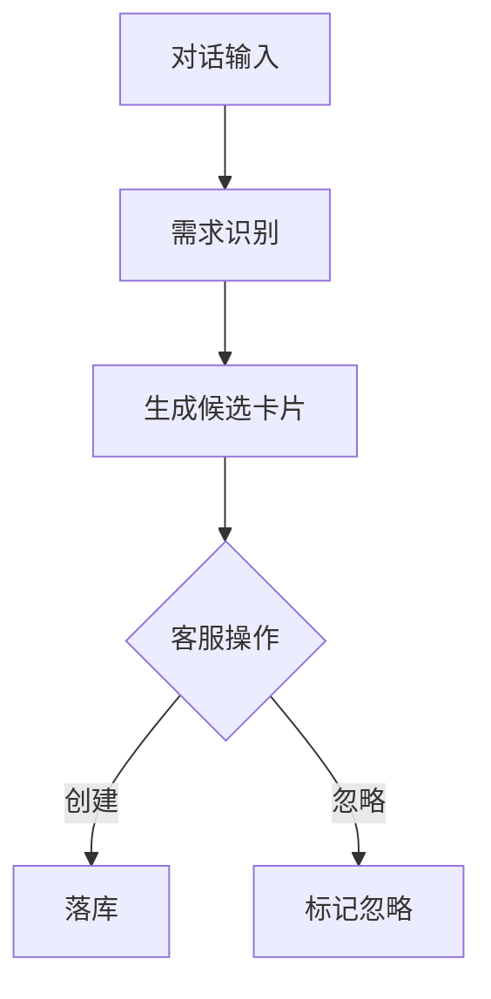

# 功能PRD：需求检测

## 文档信息

| 字段 | 说明 |
|------|------|
| **文档编号** | PRD-FEATURE-Requirement-Detection-v1.0 |
| **功能名称** | 需求检测 |
| **核心价值** | 自动识别需求文本并形成卡片，支撑需求收集与趋势分析 |
| **迭代目标** | 对话中生成需求卡片、支持状态管理与统计展示 |
| **关联需求** | US-2.5-01, US-2.5-02 |
| **状态** | 草稿 |
| **创建日期** | 2026-01-14 |
| **更新日期** | 2026-01-14 |
| **文档Owner** | 产品负责人 |

---

## 1. 功能概述

### 1.1 功能定位

需求检测用于从对话中识别需求文本并生成需求卡片，供客服与产品团队记录与分析。

### 1.2 目标用户

- **主要用户**: 产品经理
- **次要用户**: 一线客服

### 1.3 核心价值

**对用户的价值**:
- 减少人工整理需求的时间
- 可视化需求趋势

**对业务的价值**:
- 快速收集真实用户需求
- 为产品规划提供数据支撑

### 1.4 优先级

- **优先级**: P1
- **RICE分数**: 72
  - Reach（影响用户数）: 30+产品/客服
  - Impact（对用户价值）: 中
  - Confidence（成功把握）: 70%
  - Effort（开发成本）: 2周

---

## 2. 功能需求

### 2.1 用户故事

**US-01**: 作为客服，我希望系统自动识别需求并生成卡片，以便快速记录。

**US-02**: 作为产品经理，我希望查看需求统计趋势，以便调整规划。

**US-03**: 作为产品经理，我希望按状态筛选需求，以便区分处理优先级。

### 2.2 功能列表

| 功能项 | 描述 | 优先级 | 依赖 | 工作量 |
|-------|------|--------|------|--------|
| 需求识别 | 对话触发识别 | P0 | MCP检测服务 | 3天 |
| 需求卡片 | 创建/忽略与状态管理 | P0 | ezOne平台 | 3天 |
| 统计图表 | 需求趋势统计 | P1 | 报表链路 | 3天 |
| 面板入口 | 快捷入口与抽屉面板 | P0 | UI布局 | 2天 |
| 需求详情 | 需求详情与来源对话 | P1 | 对话服务 | 2天 |

### 2.3 详细规格说明

#### 功能1：需求识别

**功能描述**: 在对话中识别需求文本并生成候选卡片。

**外部依赖与降级展示**:
- **检测服务**: 若不可用，提示“识别服务异常，可手动创建”。
- **对话上下文**: 若上下文缺失，提示“无法识别，缺少对话内容”。

**字段定义**:
| 字段名 | 类型 | 必填 | 说明 | 示例 | 约束 |
|-------|------|------|------|------|------|
| content | string | 是 | 需求内容 | "支持批量导出" | 1-200 |
| sourceMessageId | string | 是 | 来源消息 | "m_1" | - |
| confidence | number | 否 | 置信度 | 0.76 | 0-1 |

**交互行为**:
1. 系统识别 → 生成候选卡片
2. 客服点击“创建/忽略” → 更新状态

**边界条件**:
- 置信度低于阈值 → 默认不提示
- 同一消息重复识别 → 去重提示

**权限要求**:
- 客服：读写

---

#### 功能2：需求卡片

**功能描述**: 展示需求内容、状态、来源、创建人，并支持状态流转。

**外部依赖与降级展示**:
- **需求服务**: 若不可用，卡片显示“保存失败”，允许重试。
 - **ezOne平台**: 需求创建与进度查询依赖ezOne接口，若不可用，卡片仅保留本地“待同步”状态并提示“同步失败，请稍后重试”。

**交互行为**:
1. 点击“创建” → 落库并标记“待处理”
2. 点击“忽略” → 标记“已忽略”
3. 变更状态 → 记录时间与操作者

**边界条件**:
- 状态冲突 → 提示“状态已变更”，刷新列表

---

#### 功能3：统计图表

**功能描述**: 展示需求数量趋势与状态分布。

**外部依赖与降级展示**:
- **统计服务**: 若不可用，展示“统计暂不可用”。

**交互行为**:
1. 选择时间范围 → 图表刷新

**边界条件**:
- 无数据 → 展示空状态

---

#### 功能4：面板入口

**功能描述**: 输入框上方快捷入口与右侧抽屉面板入口。

**交互行为**:
1. 点击入口 → 打开抽屉并加载列表

**边界条件**:
- 无权限 → 隐藏入口

---

#### 功能5：需求详情

**功能描述**: 展示需求详情与来源对话节选，支持跳转到对话。

**外部依赖与降级展示**:
- **对话服务**: 若不可用，隐藏跳转入口。

**交互行为**:
1. 点击“查看详情” → 展示详情与来源消息
2. 点击“定位对话” → 跳转对话并定位消息

**边界条件**:
- 来源消息已归档 → 提示“无法定位”

---

## 3. UI设计

### 3.1 页面布局

#### 布局方案1：右侧抽屉面板

**页面结构**:
```
┌────────────────────────────────┐
│ 需求检测                        │
├────────────────────────────────┤
│ 需求卡片列表                    │
│ 状态筛选  统计图表              │
└────────────────────────────────┘
```

**布局说明**:
- 抽屉顶部为筛选与统计区
- 下方为需求卡片列表

### 3.2 组件说明

#### 组件1：需求卡片

**组件类型**: 卡片

**位置**: 抽屉列表区

**交互行为**:
- 点击“创建/忽略”更新状态

---

### 3.3 样式规范

- 颜色、字体、间距与全局一致

### 3.4 响应式设计

| 断点 | 宽度范围 | 布局调整 |
|-----|---------|---------|
| Desktop | >1200px | 抽屉固定 |
| Tablet | 768-1199px | 抽屉覆盖 |
| Mobile | <768px | 全屏面板 |

---

## 4. 交互流程

### 4.1 主流程



### 4.2 异常分支

#### 异常1：识别服务不可用

- **触发条件**: MCP工具异常
- **处理方式**: 降级为手动创建
- **用户提示**: “识别服务异常，可手动创建”
- **恢复方式**: 服务恢复后自动提示

---

## 5. 接口定义

### 5.1 需求识别（工具）

**接口路径**: `/mcp/detectRequirement`

**请求方法**: POST

**权限要求**: 需要登录

---

### 5.2 需求创建

**接口路径**: `/api/requirements`（内部服务转发至ezOne平台）

**请求方法**: POST

**请求体**:
```json
{
  "content": "支持批量导出",
  "sourceMessageId": "m_1",
  "customerId": "cust_1"
}
```

---

## 6. 数据模型

### 6.1 RequirementItem

**实体描述**: 需求卡片。

**TypeScript接口定义**:
```typescript
interface RequirementItem {
  id: string;
  content: string;
  status: '待处理' | '处理中' | '已完成' | '已拒绝' | '已忽略';
  timestamp: string;
  customer?: string;
  createdBy?: string;
  sourceMessageId?: string;
}
```

---

## 7. 验收标准

### 7.1 功能验收

| 验收项 | 验收标准 | 优先级 | 测试方法 |
|-------|---------|--------|---------|
| 自动识别 | 生成需求卡片 | P0 | 手动 |
| 创建/忽略 | 可更新状态 | P0 | 手动 |
| 统计图表 | 趋势图可展示 | P1 | 手动 |
| 详情跳转 | 可定位到对话 | P1 | 手动 |

### 7.2 性能验收

| 验收项 | 验收标准 | 测试方法 |
|-------|---------|---------|
| 识别响应 | <2秒 | 手动 |

---

## 8. 非功能需求

### 8.1 性能要求

| 指标 | 目标值 | 测量方法 |
|-----|--------|---------|
| 识别响应 | <2秒 | 监控 |

### 8.2 可用性要求

| 指标 | 目标值 |
|-----|--------|
| 系统可用性 | >99% |

### 8.3 安全要求

- 需求数据仅内部可见

### 8.4 可扩展性要求

- 支持新增需求分类

### 8.5 可维护性要求

- MCP工具调用可监控

---

## 附录A：术语表

| 术语 | 定义 |
|-----|------|
| 需求卡片 | 由对话识别生成的需求记录 |
| MCP工具 | 后端工具服务接口 |

---

## 附录B：外围系统依赖

| 系统 | 依赖说明 | API路径 | 负责人 |
|------|---------|--------|------|
| MCP服务 | 需求识别工具 | /mcp/detectRequirement | 后端团队 |
| ezOne平台 | 需求创建与进度查询 | /ezone/requirements | ezOne平台团队 |
| 对话服务 | 需求详情定位 | /api/conversations | 对话服务团队 |
| 统计服务 | 需求趋势与统计 | /api/reports/requirements | 数据团队 |

---

## 附录C：待决策事项

| 事项ID | 事项描述 | 备选方案 | 决策人 | 截止日期 | 状态 |
|--------|---------|---------|--------|---------|------|
| Q-01 | 需求趋势图指标口径 | 新增/已完成 | 产品负责人 | 2026-02-01 | ⏳待决策 |

---

## 附录D：变更历史

| 版本 | 日期 | 变更内容 | 变更人 | 审核人 |
|-----|------|---------|--------|--------|
| v1.0 | 2026-01-14 | 初始版本（按模板补全） | 产品负责人 | 产品负责人 |

---

**文档结束**
