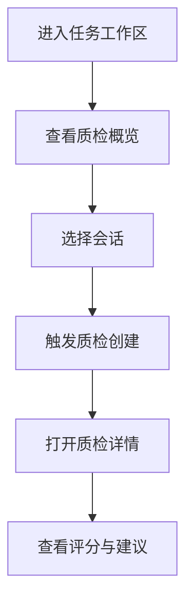
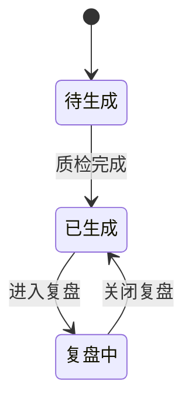

# 功能PRD：质检

## 文档信息

| 字段 | 说明 |
|------|------|
| **文档编号** | PRD-FEATURE-Quality-Inspection-v1.0 |
| **功能名称** | 质检 |
| **核心价值** | 提供对话质量评估与改进建议 |
| **迭代目标** | 构建质检概览、详情与维度评分展示 |
| **关联需求** | US-2.6-01, US-2.6-02, US-2.6-03 |
| **状态** | 草稿 |
| **创建日期** | 2026-01-14 |
| **更新日期** | 2026-02-09 |
| **文档Owner** | 产品负责人 |

---

## 1. 功能概述

### 1.1 功能定位

质检功能用于质量专员在任务工作区对群聊会话进行质检复盘，展示质检摘要、维度评分与优化建议。

### 1.2 目标用户

- **主要用户**: 质检专员
- **次要用户**: 主管/经理

### 1.3 核心价值

**对用户的价值**:
- 快速定位问题对话
- 一次性查看质检摘要与维度评分

**对业务的价值**:
- 统一质量标准
- 推动服务优化

### 1.4 优先级

- **优先级**: P0
- **RICE分数**: 84
  - Reach（影响用户数）: 30+质检/主管
  - Impact（对用户价值）: 高
  - Confidence（成功把握）: 75%
  - Effort（开发成本）: 3周

---

## 2. 功能需求

### 2.1 用户故事

**US-01**: 作为质检专员，我希望查看质检概览，以便快速识别高风险对话。

**US-02**: 作为主管，我希望查看质检详情与建议，以便优化服务标准。

**US-03**: 作为质检专员，我希望筛选低分对话，以便优先复盘。

### 2.2 功能列表

| 功能项 | 描述 | 优先级 | 依赖 | 工作量 |
|-------|------|--------|------|--------|
| 质检概览 | 指标卡片与列表（当前为静态占位） | P0 | 无 | 1天 |
| 质检详情 | 右侧抽屉质检面板（3维度评分+节选） | P0 | 会话质检接口 | 4天 |
| 视图切换 | 综合/质检分析/对话复盘 | P1 | UI布局 | 1天 |
| 筛选与搜索 | 客户等级/时间/关键词控件（当前不联动） | P1 | 无 | 1天 |
| 质检触发 | 问题解决事件触发质检 | P1 | AgentScope | 2天 |
| 质检动作 | 报告/建议/回访/复盘按钮（当前无联动） | P2 | 无 | 1天 |

### 2.3 详细规格说明

#### 功能1：质检概览（当前实现）

**功能描述**: 任务工作区内展示质检概览卡片与列表容器，作为入口与占位信息（数据为静态示例）。

**字段定义**:
| 字段名 | 类型 | 必填 | 说明 | 示例 | 约束 |
|-------|------|------|------|------|------|
| avgScore | number | 是 | 平均得分 | 82 | 0-100 |
| highUrgencyCount | number | 是 | 高紧急会话 | 12 | >=0 |
| conversationId | string | 是 | 会话ID | "c_1" | - |

**交互行为**:
1. 点击“对话驱动任务” → 进入对话驱动任务区
2. 点击“返回质检概览” → 返回概览

**边界条件**:
- 列表无数据 → 展示“暂无质检会话”

**权限要求**: 详见[权限与入口管理说明](2.10-Permission-Management-PRD.md)

---

#### 功能2：质检详情（右侧抽屉）

**功能描述**: 通过右侧抽屉展示质检摘要、3维度评分、对话节选与洞察建议。

**外部依赖与降级展示**:
- **会话质检接口**: 若接口不可用，提示“质检数据加载失败”。

**维度说明**:
- 响应时效（satisfaction）、情感态度（emotion）、回复质量（quality）
- 评分范围 0-100，展示分值、标签与进度条

**交互行为**:
1. 选择会话 → 详情加载
2. 切换视图 → 切换展示布局（综合/质检分析/对话复盘）

**边界条件**:
- 无质检数据 → 提示“暂无质检数据”

---

#### 功能3：筛选与搜索（当前实现）

**功能描述**: 提供客户等级/时间/关键词筛选控件（UI展示，尚未联动数据源）。

**交互行为**:
1. 选择筛选项 → 维持控件选中状态
2. 输入关键词 → 不触发列表更新（待接入）

**边界条件**:
- 无数据 → 显示空状态

---

#### 功能4：质检触发（后端事件）

**功能描述**: 当问题被标记为已解决时自动触发质检任务，后端调用AgentScope生成质检报告并落库。

**触发方式**:
- **ProblemResolvedEvent**: IM对话的问题解决事件触发
- **ConversationClosedEvent（非IM）**: 仅非IM渠道关闭时触发

**自动触发补充**:
- 触发来源为问题状态变更（标记已解决）或非IM关闭事件
- 触发时机为事件入库后异步执行，不阻塞主流程
- 触发结果写入质检报告表，供前端查询

**交互行为**:
1. 后端异步触发 → 保存质检报告
2. 前端通过接口加载最新报告（如有）

**边界条件**:
- 触发失败 → 记录日志，不影响对话流程
- IM对话不支持关闭触发，仅走问题解决事件

---

#### 功能4.1：创建失败重试与自恢复

**功能描述**: 当质检创建失败（调用AgentScope失败或返回异常）时，系统自动重试并具备自恢复机制，保证最终一致性。

**重试策略**:
- 重试次数：最多3次
- 退避策略：指数退避（1min / 5min / 15min）
- 超时：单次调用超时与全流程超时分离（避免阻塞主线程）

**自恢复逻辑**:
- 失败任务记录入库（含失败原因、重试次数、下次重试时间）
- 服务重启后扫描未完成任务并继续重试
- 连续失败超过阈值 → 标记为“需人工介入”

**监控与告警**:
- 失败率超过阈值（如5%）触发告警
- 单任务连续失败3次触发告警并记录工单

---

#### 功能4.2：质检提示词与上下文（对齐实现）

**提示词来源**:
- AgentScope 侧 `InspectorAgent` 系统提示词（文件：`agentscope-service/src/agents/inspector_agent.py`）
- 若未加载自定义模板，则使用内置 fallback 提示词

**系统提示词（摘要）**:
- 角色：专业质检专员
- 目标：对话质量评估、情绪分析、生成质检报告、回访建议
- 输出：必须为 JSON 结构，包含 `quality_score`、`dimensions`、`sentiment_improvement`、`customer_satisfaction_prediction`、`risk_indicators`、`improvement_suggestions`、`need_follow_up` 等字段

**调用大模型时的上下文**:
- **必带上下文**: 大模型识别为“同一问题闭环”的完整对话范围（按“角色: 内容”拼接）
- **不包含**: 对话内与该问题无关的消息片段，不进行跨问题拼接
- **可选上下文**（开启预取时注入）:
  - 会话历史摘要（`conversation_history`）
  - 客户历史/画像（`customer_history`）
- **输入消息构造**:
  - system: `请对以下对话进行质检评分：\n\n{history_text}`
  - metadata: `{ conversationId }`（用于上下文关联）

**实现约束**:
- 当 MCP 工具 `inspectConversation` 可用时优先调用（由 AgentScope 内部处理上下文拼接）
- MCP 工具不可用时，使用上述 system 消息 + 会话历史文本直接调用 LLM 生成 JSON

---

#### 功能5：质检动作（当前实现）

**功能描述**: 质检面板提供“生成质检报告/推送优化建议/服务回访/标记复盘任务”等按钮入口。

**交互行为**:
1. 点击按钮 → 仅前端展示（当前无后端联动）

---

#### 功能6：质检报告数据接口（已实现，UI未使用）

**功能描述**: 提供按会话与全局的质检报告查询接口，供后续报表或列表接入。

## 3. UI设计

### 3.1 页面布局

#### 布局方案1：任务工作区 + 右侧抽屉

**页面结构**:
```
┌──────────────────────────────────┐
│ 质检概览（指标卡片+列表）         │
├──────────────────────────────────┤
│ 右侧抽屉：质检详情                │
└──────────────────────────────────┘
```

### 3.2 组件说明

#### 组件1：质检评分条

**组件类型**: 评分条

**位置**: 质检详情面板

**交互行为**:
- 悬停显示评分说明

---

### 3.3 样式规范

- 颜色、字体、间距与全局一致

### 3.4 响应式设计

| 断点 | 宽度范围 | 布局调整 |
|-----|---------|---------|
| Desktop | >1200px | 抽屉固定 |
| Tablet | 768-1199px | 抽屉覆盖 |
| Mobile | <768px | 详情全屏 |

---

## 4. 交互流程

### 4.1 主流程



### 4.2 异常分支

#### 异常1：质检评分未生成

- **触发条件**: InspectorAgent未产出
- **处理方式**: 显示“待生成”状态
- **用户提示**: “质检结果生成中”
- **恢复方式**: 支持刷新

---

### 4.3 状态机



---

## 5. 接口定义

### 5.1 获取会话质检（前端使用）

**接口路径**: `/quality/{conversationId}`

**请求方法**: GET

**说明**:
- 先读取最新质检报告；若无报告则回退为AI质检分析
- 返回结构存在两种形态（见下）

**返回示例A（存在质检报告）**:
```json
{
  "success": true,
  "data": {
    "conversationId": "c_1",
    "quality": {
      "score": 86,
      "report": {},
      "createdAt": "2026-02-09T10:00:00Z"
    }
  }
}
```

**返回示例B（AI回退分析）**:
```json
{
  "success": true,
  "data": {
    "conversationId": "c_1",
    "title": "客户 · c_1",
    "score": 86,
    "summary": "质检摘要",
    "urgency": "高紧急",
    "urgencyClass": "chip-urgent",
    "tone": "urgent",
    "sla": "VIP",
    "impact": "需关注",
    "channel": "web",
    "time": "2026-02-09T10:00:00Z",
    "tags": ["情绪安抚", "进度同步"],
    "metrics": {
      "urgency": "92%",
      "emotion": 92,
      "eta": "2026-02-10T10:00:00Z"
    },
    "dimensions": {
      "emotion": { "score": 92, "label": "中性", "bar": 92 },
      "quality": { "score": 86, "label": "质检分析完成", "bar": 86 },
      "satisfaction": { "score": 80, "label": "客户满意度", "bar": 80 }
    },
    "actions": ["补充回访", "同步进展"],
    "tip": "建议持续跟进客户问题",
    "threadTitle": "对话节选 · c_1",
    "thread": [
      { "role": "客户", "text": "仍有问题", "sentiment": "客户反馈", "tag": "客户消息" }
    ],
    "insights": ["跟进客户问题"]
  }
}
```

---

### 5.2 获取会话质检报告列表（前端可用）

**接口路径**: `/quality/{conversationId}/reports`

**请求方法**: GET

---

### 5.3 获取最新质检报告列表（前端可用）

**接口路径**: `/quality/reports`

**请求方法**: GET

---

### 5.4 获取质检报告（数据服务）

**接口路径**: `/api/quality/{conversationId}`

**请求方法**: GET

---

### 5.5 获取会话质检报告列表（数据服务）

**接口路径**: `/api/quality/{conversationId}/reports`

**请求方法**: GET

---

### 5.6 获取最新质检报告列表（数据服务）

**接口路径**: `/api/quality/reports`

**请求方法**: GET

---

### 5.7 质检任务重试（管理接口）

**接口路径**: `/api/quality/retry/{conversationId}`

**请求方法**: POST

**说明**:
- 手动触发重试（用于人工介入或运维恢复）
- 仅在任务失败状态可执行

---

## 6. 数据模型

### 6.1 QualityProfile（前端展示模型）

**实体描述**: 质检详情视图（对齐 `/quality/{conversationId}` 返回）。

**TypeScript接口定义**:
```typescript
interface QualityProfile {
  conversationId: string;
  title: string;
  score?: number;
  summary: string;
  urgency: string;
  urgencyClass?: string;
  tone?: string;
  sla?: string;
  impact?: string;
  channel: string;
  time: string;
  tags?: string[];
  metrics?: {
    urgency?: string;
    emotion?: number;
    eta?: string;
  };
  dimensions?: {
    emotion?: { score: number; label: string; bar: number };
    quality?: { score: number; label: string; bar: number };
    satisfaction?: { score: number; label: string; bar: number };
  };
  actions?: string[];
  tip?: string;
  threadTitle?: string;
  thread: Array<{ role: string; text: string; sentiment?: string; tag?: string }>;
  insights?: string[];
}
```

### 6.2 QualityReport（数据服务模型）

**实体描述**: 质检报告实体（对齐 `quality_reports` 表）。

**TypeScript接口定义**:
```typescript
interface QualityReport {
  id: string;
  conversationId: string;
  problemId?: string | null;
  qualityScore?: number | null;
  report: Record<string, unknown>;
  createdAt: string;
  updatedAt: string;
}
```

---

## 7. 验收标准

### 7.1 功能验收

| 验收项 | 验收标准 | 优先级 | 测试方法 |
|-------|---------|--------|---------|
| 质检概览 | 指标卡片与列表可见 | P0 | 手动 |
| 质检详情 | 评分与节选展示正常 | P0 | 手动 |
| 视图切换 | 综合/复盘切换有效 | P1 | 手动 |
| 筛选搜索 | 控件可用但不联动 | P2 | 手动 |
| 质检触发 | 问题解决事件触发质检 | P1 | 手动/日志 |
| 质检动作 | 按钮可点击（无联动） | P2 | 手动 |

### 7.2 性能验收

| 验收项 | 验收标准 | 测试方法 |
|-------|---------|---------|
| 面板切换 | <500ms | 手动 |

---

## 8. 非功能需求

### 8.1 性能要求

| 指标 | 目标值 | 测量方法 |
|-----|--------|---------|
| 质检详情加载 | <1秒 | 监控 |
| 质检创建重试完成 | <30分钟 | 监控 |

### 8.2 可用性要求

| 指标 | 目标值 |
|-----|--------|
| 系统可用性 | >99% |

### 8.3 安全要求

- 质检数据仅内部可见
- 严重违规需触发人工复核与告警

### 8.4 可扩展性要求

- 支持新增质检维度

### 8.5 可维护性要求

- 质检规则可配置
- 失败任务可追踪、可手动重试

---

## 附录A：术语表

| 术语 | 定义 |
|-----|------|
| 质检摘要 | 对话质量概览描述 |
| 维度评分 | 多维度质量评分结果 |

---

## 附录B：外围系统依赖

| 系统 | 依赖说明 | API路径 | 负责人 |
|------|---------|--------|------|
| InspectorAgent | 质检评分生成 | /mcp/inspectConversation | 后端团队 |
| 质检数据服务 | 概览与详情数据 | /api/quality | 质检平台团队 |
| 对话服务 | 对话节选 | /api/conversations | 对话服务团队 |

---

## 附录C：待决策事项

| 事项ID | 事项描述 | 备选方案 | 决策人 | 截止日期 | 状态 |
|--------|---------|---------|--------|---------|------|
| Q-01 | 质检触发规则细化 | 完成后触发/定时触发 | 产品负责人 | 2026-02-01 | ⏳待决策 |
| Q-02 | 质检概览是否接入真实数据 | 接入/保持占位 | 产品负责人 | 2026-02-20 | ⏳待决策 |
| Q-03 | 重试与自恢复策略参数 | 固定阈值/可配置 | 产品负责人 | 2026-02-20 | ⏳待决策 |

---

## 附录D：变更历史

| 版本 | 日期 | 变更内容 | 变更人 | 审核人 |
|-----|------|---------|--------|--------|
| v1.0 | 2026-01-14 | 初始版本（按模板补全） | 产品负责人 | 产品负责人 |
| v1.1 | 2026-02-09 | 对齐Web实现：接口与质检面板 | 产品负责人 | 产品负责人 |
| v1.2 | 2026-02-09 | 补充自动触发与重试自恢复机制 | 产品负责人 | 产品负责人 |
| v1.3 | 2026-02-09 | 补充质检提示词与上下文说明 | 产品负责人 | 产品负责人 |

---

**文档结束**
