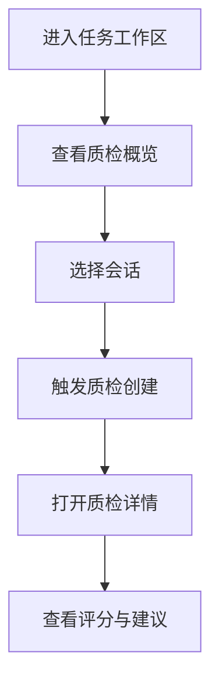
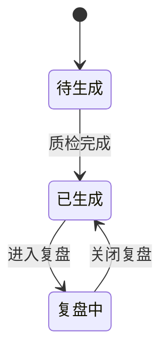

# 功能PRD：质检

## 文档信息

| 字段 | 说明 |
|------|------|
| **文档编号** | PRD-FEATURE-Quality-Inspection-v1.0 |
| **功能名称** | 质检 |
| **核心价值** | 提供对话质量评估与改进建议 |
| **迭代目标** | 构建质检概览、详情与维度评分展示 |
| **关联需求** | US-2.6-01, US-2.6-02 |
| **状态** | 草稿 |
| **创建日期** | 2026-01-14 |
| **更新日期** | 2026-01-14 |
| **文档Owner** | 产品负责人 |

---

## 1. 功能概述

### 1.1 功能定位

质检功能用于质量专员在任务工作区对群聊会话进行质检复盘，展示质检摘要、维度评分与优化建议。

### 1.2 目标用户

- **主要用户**: 质检专员
- **次要用户**: 主管/经理

### 1.3 核心价值

**对用户的价值**:
- 快速定位问题对话
- 一次性查看质检摘要与维度评分

**对业务的价值**:
- 统一质量标准
- 推动服务优化

### 1.4 优先级

- **优先级**: P0
- **RICE分数**: 84
  - Reach（影响用户数）: 30+质检/主管
  - Impact（对用户价值）: 高
  - Confidence（成功把握）: 75%
  - Effort（开发成本）: 3周

---

## 2. 功能需求

### 2.1 用户故事

**US-01**: 作为质检专员，我希望查看质检概览，以便快速识别高风险对话。

**US-02**: 作为主管，我希望查看质检详情与建议，以便优化服务标准。

**US-03**: 作为质检专员，我希望筛选低分对话，以便优先复盘。

### 2.2 功能列表

| 功能项 | 描述 | 优先级 | 依赖 | 工作量 |
|-------|------|--------|------|--------|
| 质检概览 | 指标卡片与列表 | P0 | 质检数据 | 3天 |
| 质检详情 | 维度评分与对话节选 | P0 | 质检数据 | 4天 |
| 视图切换 | 综合/质检/复盘 | P1 | UI布局 | 2天 |
| 筛选与排序 | 低分/高紧急筛选 | P1 | 质检数据 | 2天 |
| 质检规则与抽样 | 触发规则与优先级 | P1 | 质检数据 | 2天 |
| 质检报告 | 个人/团队报告查看 | P2 | 报表链路 | 3天 |

### 2.3 详细规格说明

#### 功能1：质检概览

**功能描述**: 展示平均得分、高紧急会话、自动派发指令等指标与客户列表。

**外部依赖与降级展示**:
- **质检数据服务**: 若获取失败，显示“概览加载失败”，提供重试。

**字段定义**:
| 字段名 | 类型 | 必填 | 说明 | 示例 | 约束 |
|-------|------|------|------|------|------|
| avgScore | number | 是 | 平均得分 | 82 | 0-100 |
| highUrgencyCount | number | 是 | 高紧急会话 | 12 | >=0 |
| conversationId | string | 是 | 会话ID | "c_1" | - |

**交互行为**:
1. 点击“对话质检” → 打开右侧面板

**边界条件**:
- 无质检数据 → 展示空状态

**权限要求**: 详见[权限与入口管理说明](2.10-Permission-Management-PRD.md)

---

#### 功能2：质检详情

**功能描述**: 展示摘要、维度评分、对话节选与优化建议。

**外部依赖与降级展示**:
- **质检评分服务**: 若未生成，显示“待生成”。
- **对话服务**: 若节选不可用，显示“无法获取对话节选”。

**质检内容范围**:
- 质检内容需包含该事件的完整IM对话过程（从问题提出到处理结束）
- 评分与违规证据引用应来自完整对话片段

**维度说明**:
- 响应速度、专业度、友好度、规范性、解决率（0-100分）
- 总分与等级（优秀/良好/合格/待改进/不合格）

**违规与提醒**:
- 识别严重违规（信息泄露/辱骂客户/越权操作）时标记需人工复核
- 违规项需展示证据片段与严重级别

**交互行为**:
1. 选择会话 → 详情加载
2. 切换视图 → 更新展示内容

**边界条件**:
- 维度评分缺失 → 展示“待生成”

---

#### 功能3：筛选与排序

**功能描述**: 支持按得分区间、紧急度、渠道筛选与排序。

**交互行为**:
1. 选择筛选项 → 列表刷新
2. 点击排序 → 按得分/更新时间排序

**边界条件**:
- 无数据 → 显示空状态

---

#### 功能4：质检创建

**功能描述**: 由质检专员在概览列表触发质检创建，或由系统按规则自动触发生成质检结果。

**创建方式**:
- **手动触发**: 质检专员在对话列表点击“生成质检”，系统调用InspectorAgent生成评分与建议。
- **自动触发**: 满足规则（如高紧急会话、随机抽检）时自动创建质检任务并生成结果。
- **模型判断触发**: 大模型基于对话判断“问题是否完整被处理”，并在判定完成时触发质检生成。

**交互行为**:
1. 手动点击“生成质检” → 状态变为“待生成”
2. 生成完成 → 状态变为“已生成”，详情可查看

**边界条件**:
- 重复触发 → 提示“已在生成中”，不重复创建
- 生成失败 → 标记“生成失败”，允许重试
- 处理未完成 → 不触发质检生成，仅保留对话标签

---

#### 功能5：质检规则与抽样

**功能描述**: 配置质检触发规则与优先级，保障重点会话优先覆盖。

**规则说明**:
- VIP客户对话：100%质检，24小时内完成
- 投诉/高紧急会话：100%质检
- 新人客服（<3个月）：100%质检
- 问题客服（平均分<70）：50%抽检
- 普通客服：20%随机抽检
- 优秀客服（平均分>90）：10%抽检
- 问题已完整处理（模型判断）优先触发质检

**交互行为**:
1. 规则触发 → 自动创建质检任务
2. 质检完成 → 写入概览与详情

**边界条件**:
- 规则冲突 → 按优先级最高的规则执行

---

#### 功能6：质检报告

**功能描述**: 提供个人周报与团队月报的质检报告入口，支持查看摘要与重点问题。

**外部依赖与降级展示**:
- **报表服务**: 若不可用，展示“报告暂不可用”。

**交互行为**:
1. 选择报告类型与周期 → 加载报告
2. 点击问题项 → 跳转到对应对话

**边界条件**:
- 报告为空 → 展示空状态

## 3. UI设计

### 3.1 页面布局

#### 布局方案1：任务工作区 + 右侧抽屉

**页面结构**:
```
┌──────────────────────────────────┐
│ 质检概览（指标卡片+列表）         │
├──────────────────────────────────┤
│ 右侧抽屉：质检详情                │
└──────────────────────────────────┘
```

### 3.2 组件说明

#### 组件1：质检评分条

**组件类型**: 评分条

**位置**: 质检详情面板

**交互行为**:
- 悬停显示评分说明

---

### 3.3 样式规范

- 颜色、字体、间距与全局一致

### 3.4 响应式设计

| 断点 | 宽度范围 | 布局调整 |
|-----|---------|---------|
| Desktop | >1200px | 抽屉固定 |
| Tablet | 768-1199px | 抽屉覆盖 |
| Mobile | <768px | 详情全屏 |

---

## 4. 交互流程

### 4.1 主流程



### 4.2 异常分支

#### 异常1：质检评分未生成

- **触发条件**: InspectorAgent未产出
- **处理方式**: 显示“待生成”状态
- **用户提示**: “质检结果生成中”
- **恢复方式**: 支持刷新

---

### 4.3 状态机



---

## 5. 接口定义

### 5.1 获取质检概览

**接口路径**: `/api/quality/overview`

**请求方法**: GET

**权限要求**: 详见[权限与入口管理说明](2.10-Permission-Management-PRD.md)

---

### 5.2 获取质检详情

**接口路径**: `/api/quality/conversations/{id}`

**请求方法**: GET

**返回字段**:
- overallScore / grade / confidence
- scoreBreakdown（responseSpeed/professionalism/friendliness/compliance/resolutionRate）
- violations（type/severity/description/evidence）
- highlights / improvements
- needHumanReview / reviewReason
- thread（完整IM对话过程）

---

### 5.3 质检评分生成（工具）

**接口路径**: `/mcp/inspectConversation`

**请求方法**: POST

**说明**:
- 手动与自动创建均调用该工具生成质检结果
- 返回结果写入质检数据服务，用于概览与详情展示
- 输入需包含完整IM对话过程，用于评分与证据提取

---

## 6. 数据模型

### 6.1 QualityProfile

**实体描述**: 质检详情视图。

**TypeScript接口定义**:
```typescript
interface QualityProfile {
  title: string;
  summary: string;
  urgency: string;
  channel: string;
  time: string;
  overallScore?: number;
  grade?: string;
  confidence?: number;
  dimensions: {
    responseSpeed?: { score: number; label: string; bar: number };
    professionalism?: { score: number; label: string; bar: number };
    friendliness?: { score: number; label: string; bar: number };
    compliance?: { score: number; label: string; bar: number };
    resolutionRate?: { score: number; label: string; bar: number };
  };
  scoreBreakdown?: {
    responseSpeed?: number;
    professionalism?: number;
    friendliness?: number;
    compliance?: number;
    resolutionRate?: number;
  };
  violations?: Array<{
    type: string;
    severity: string;
    description: string;
    evidence?: string;
  }>;
  highlights?: string[];
  improvements?: Array<{ dimension: string; issue: string; suggestion: string; priority: string }>;
  needHumanReview?: boolean;
  reviewReason?: string | null;
  thread: Array<{ role: string; text: string; sentiment?: string; tag?: string }>;
  insights: string[];
}
```

---

## 7. 验收标准

### 7.1 功能验收

| 验收项 | 验收标准 | 优先级 | 测试方法 |
|-------|---------|--------|---------|
| 质检概览 | 指标卡片与列表可见 | P0 | 手动 |
| 质检详情 | 评分与节选展示正常 | P0 | 手动 |
| 视图切换 | 综合/复盘切换有效 | P1 | 手动 |
| 筛选排序 | 低分/高紧急筛选可用 | P1 | 手动 |
| 质检规则 | VIP/投诉/新人规则生效 | P1 | 手动 |
| 报告入口 | 周报/月报可查看 | P2 | 手动 |

### 7.2 性能验收

| 验收项 | 验收标准 | 测试方法 |
|-------|---------|---------|
| 面板切换 | <500ms | 手动 |

---

## 8. 非功能需求

### 8.1 性能要求

| 指标 | 目标值 | 测量方法 |
|-----|--------|---------|
| 质检详情加载 | <1秒 | 监控 |

### 8.2 可用性要求

| 指标 | 目标值 |
|-----|--------|
| 系统可用性 | >99% |

### 8.3 安全要求

- 质检数据仅内部可见
- 严重违规需触发人工复核与告警

### 8.4 可扩展性要求

- 支持新增质检维度

### 8.5 可维护性要求

- 质检规则可配置

---

## 附录A：术语表

| 术语 | 定义 |
|-----|------|
| 质检摘要 | 对话质量概览描述 |
| 维度评分 | 多维度质量评分结果 |

---

## 附录B：外围系统依赖

| 系统 | 依赖说明 | API路径 | 负责人 |
|------|---------|--------|------|
| InspectorAgent | 质检评分生成 | /mcp/inspectConversation | 后端团队 |
| 质检数据服务 | 概览与详情数据 | /api/quality | 质检平台团队 |
| 对话服务 | 对话节选 | /api/conversations | 对话服务团队 |

---

## 附录C：待决策事项

| 事项ID | 事项描述 | 备选方案 | 决策人 | 截止日期 | 状态 |
|--------|---------|---------|--------|---------|------|
| Q-01 | 质检触发规则细化 | 完成后触发/定时触发 | 产品负责人 | 2026-02-01 | ⏳待决策 |

---

## 附录D：变更历史

| 版本 | 日期 | 变更内容 | 变更人 | 审核人 |
|-----|------|---------|--------|--------|
| v1.0 | 2026-01-14 | 初始版本（按模板补全） | 产品负责人 | 产品负责人 |

---

**文档结束**
