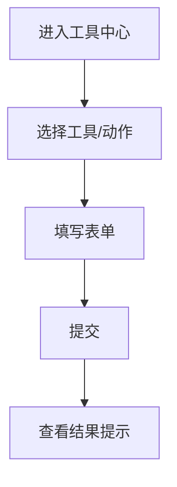

# 功能PRD：工具中心

## 文档信息

| 字段 | 说明 |
|------|------|
| **文档编号** | PRD-FEATURE-Toolbox-v1.0 |
| **功能名称** | 工具中心 |
| **核心价值** | 集中入口提供系统巡检与协作工具 |
| **迭代目标** | 构建工具入口、系统工具与快捷动作 |
| **关联需求** | US-2.7-01, US-2.7-02 |
| **状态** | 草稿 |
| **创建日期** | 2026-01-14 |
| **更新日期** | 2026-01-14 |
| **文档Owner** | 产品负责人 |

---

## 1. 功能概述

### 1.1 功能定位

工具中心提供系统巡检与协作的快捷入口，覆盖服务状态、数据管理与协作动作。

**实现说明**:
- 当前工具列表为mock数据，待售后侧完成工具梳理后接入真实系统。

### 1.2 目标用户

- **主要用户**: 系统管理员
- **次要用户**: 运维/客服

### 1.3 核心价值

**对用户的价值**:
- 快速访问常用系统工具
- 简化协作与通知流程

**对业务的价值**:
- 提升系统维护效率
- 统一工具入口降低成本

### 1.4 优先级

- **优先级**: P1
- **RICE分数**: 68
  - Reach（影响用户数）: 20+管理员/运维
  - Impact（对用户价值）: 中
  - Confidence（成功把握）: 70%
  - Effort（开发成本）: 2周

---

## 2. 功能需求

### 2.1 用户故事

**US-01**: 作为系统管理员，我希望查看服务状态，以便及时发现异常。

**US-02**: 作为运维，我希望快速创建事件工单，以便跟踪问题处理。

**US-03**: 作为客服，我希望发送系统通知，以便同步重要信息。

### 2.2 功能列表

| 功能项 | 描述 | 优先级 | 依赖 | 工作量 |
|-------|------|--------|------|--------|
| 工具入口 | Dock入口进入工具中心 | P0 | UI布局 | 1天 |
| 系统工具 | 状态监控/数据库/权限/备份（mock） | P1 | 售后侧梳理后接入 | 3天 |
| 快捷动作 | 通知/工单/升级/报告（mock） | P1 | 售后侧梳理后接入 | 2天 |
| 操作日志 | 操作记录与追踪 | P1 | 日志服务 | 2天 |
| 权限控制 | 不同角色可见工具 | P0 | 权限服务 | 2天 |

### 2.3 详细规格说明

#### 功能1：系统工具

**功能描述**: 展示系统工具列表并可触发对应操作弹窗。

**外部依赖与降级展示**:
- **售后侧工具清单**: 未完成梳理前全部以mock数据展示。
- **运维服务**: 接入后若不可用，工具卡片显示“不可用”。

**字段定义**:
| 字段名 | 类型 | 必填 | 说明 | 示例 | 约束 |
|-------|------|------|------|------|------|
| toolId | string | 是 | 工具ID | "db_manage" | 唯一 |
| name | string | 是 | 工具名称 | "数据库管理" | 1-50 |
| status | string | 否 | 状态 | "normal" | normal/warn/error |
| desc | string | 否 | 描述 | "查看数据库连接" | 0-200 |

**交互行为**:
1. 点击工具 → 打开操作弹窗

**边界条件**:
- 工具不可用 → 显示禁用状态

**权限要求**:
- 管理员：读写
- 其他：只读

---

#### 功能2：快捷动作

**功能描述**: 提供一键创建通知、事件工单、升级问题与报告。

**外部依赖与降级展示**:
- **售后侧动作清单**: 未完成梳理前全部以mock数据展示。
- **协作服务**: 接入后若不可用，按钮置灰并提示“服务维护中”。

**交互行为**:
1. 点击动作按钮 → 打开表单
2. 提交后提示结果

**边界条件**:
- 表单校验失败 → 提示必填项

---

#### 功能3：操作日志

**功能描述**: 记录工具与动作操作日志，用于追溯。

**外部依赖与降级展示**:
- **日志服务**: 若不可用，禁止高风险操作并提示。

**交互行为**:
1. 操作成功 → 写入日志

**边界条件**:
- 写入失败 → 提示并回滚操作

---

#### 功能4：权限控制

**功能描述**: 不同角色看到不同工具与动作。

**交互行为**:
1. 登录后加载权限配置
2. 无权限工具直接隐藏

**边界条件**:
- 权限加载失败 → 降级为只读视图

---

## 3. UI设计

### 3.1 页面布局

#### 布局方案1：工具卡片网格

**页面结构**:
```
┌──────────────────────────────────┐
│ 系统工具（卡片网格）              │
├──────────────────────────────────┤
│ 快捷动作（按钮列表）              │
└──────────────────────────────────┘
```

### 3.2 组件说明

#### 组件1：工具卡片

**组件类型**: 卡片

**位置**: 系统工具区域

**交互行为**:
- 点击打开弹窗

---

### 3.3 样式规范

- 颜色、字体、间距与全局一致

### 3.4 响应式设计

| 断点 | 宽度范围 | 布局调整 |
|-----|---------|---------|
| Desktop | >1200px | 四列卡片 |
| Tablet | 768-1199px | 两列卡片 |
| Mobile | <768px | 单列卡片 |

---

## 4. 交互流程

### 4.1 主流程



### 4.2 异常分支

#### 异常1：操作失败

- **触发条件**: 服务异常
- **处理方式**: 提示失败并保留表单
- **用户提示**: “操作失败，请重试”
- **恢复方式**: 重新提交

---

## 5. 接口定义

### 5.1 获取工具列表

**接口路径**: `/api/tools`

**请求方法**: GET

---

### 5.2 创建事件工单

**接口路径**: `/api/tools/incidents`

**请求方法**: POST

**请求体**:
```json
{
  "title": "数据库连接异常",
  "priority": "high",
  "description": "连接超时"
}
```

---

## 6. 数据模型

### 6.1 ToolActionResult

**实体描述**: 工具动作执行结果。

**TypeScript接口定义**:
```typescript
interface ToolActionResult {
  title: string;
  message: string;
  status: 'info' | 'success' | 'warning';
}
```

---

## 7. 验收标准

### 7.1 功能验收

| 验收项 | 验收标准 | 优先级 | 测试方法 |
|-------|---------|--------|---------|
| 工具入口 | Dock入口可用 | P0 | 手动 |
| 系统工具 | 弹窗可打开 | P1 | 手动 |
| 快捷动作 | 操作反馈提示 | P1 | 手动 |
| 权限控制 | 不同角色可见性正确 | P0 | 手动 |

### 7.2 性能验收

| 验收项 | 验收标准 | 测试方法 |
|-------|---------|---------|
| 弹窗打开 | <300ms | 手动 |

---

## 8. 非功能需求

### 8.1 性能要求

| 指标 | 目标值 | 测量方法 |
|-----|--------|---------|
| 弹窗响应 | <300ms | 手动 |

### 8.2 可用性要求

| 指标 | 目标值 |
|-----|--------|
| 系统可用性 | >99% |

### 8.3 安全要求

- 关键操作记录日志

### 8.4 可扩展性要求

- 可新增工具卡片与动作

### 8.5 可维护性要求

- 工具配置集中管理

---

## 附录A：术语表

| 术语 | 定义 |
|-----|------|
| 工具中心 | 系统工具与协作入口聚合 |
| 事件工单 | 记录系统事件的处理单 |

---

## 附录B：外围系统依赖

| 系统 | 依赖说明 | API路径 | 负责人 |
|------|---------|--------|------|
| 运维平台 | 事件工单与通知 | /api/tools | 运维团队 |
| 权限服务 | 工具权限控制 | /api/permissions | 平台团队 |
| 日志服务 | 操作日志记录 | /api/logs | 平台团队 |

---

## 附录C：待决策事项

| 事项ID | 事项描述 | 备选方案 | 决策人 | 截止日期 | 状态 |
|--------|---------|---------|--------|---------|------|
| Q-01 | 工具清单来源 | 静态/动态配置 | 产品负责人 | 2026-02-01 | ⏳待决策 |

---

## 附录D：变更历史

| 版本 | 日期 | 变更内容 | 变更人 | 审核人 |
|-----|------|---------|--------|--------|
| v1.0 | 2026-01-14 | 初始版本（按模板补全） | 产品负责人 | 产品负责人 |

---

**文档结束**
