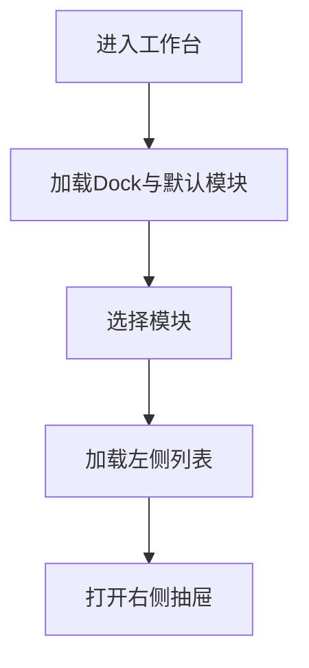

# 功能PRD：UI布局

## 文档信息

| 字段 | 说明 |
|------|------|
| **文档编号** | PRD-FEATURE-UI-Layout-v1.0 |
| **功能名称** | UI布局 |
| **核心价值** | 统一工作台四栏布局，保障核心信息同屏展示 |
| **迭代目标** | 完成Dock导航、左右侧栏与抽屉布局规范 |
| **关联需求** | US-2.8-01, US-2.8-02 |
| **状态** | 草稿 |
| **创建日期** | 2026-01-14 |
| **更新日期** | 2026-01-14 |
| **文档Owner** | 产品负责人 |

---

## 1. 功能概述

### 1.1 功能定位

UI布局采用四栏结构：Dock导航栏 + 左侧边栏 + 主内容区 + 右侧抽屉面板，支持协作与分析同屏。

### 1.2 目标用户

- **主要用户**: 客服人员
- **次要用户**: 质检专员、管理层

### 1.3 核心价值

**对用户的价值**:
- 统一入口减少切换成本
- 右侧抽屉快速获取分析信息

**对业务的价值**:
- 统一交互与信息布局规范
- 降低新功能接入成本

### 1.4 优先级

- **优先级**: P0
- **RICE分数**: 86
  - Reach（影响用户数）: 150+用户
  - Impact（对用户价值）: 高
  - Confidence（成功把握）: 85%
  - Effort（开发成本）: 2周

---

## 2. 功能需求

### 2.1 用户故事

**US-01**: 作为客服，我希望在同屏查看对话与分析面板，以便快速处理问题。

**US-02**: 作为质检专员，我希望切换质检面板而不离开当前任务视图。

### 2.2 功能列表

| 功能项 | 描述 | 优先级 | 依赖 | 工作量 |
|-------|------|--------|------|--------|
| Dock导航 | 模块切换入口 | P0 | 无 | 2天 |
| 左侧边栏 | 列表与子菜单 | P0 | 模块数据 | 2天 |
| 主内容区 | 内容渲染区域 | P0 | 模块组件 | 2天 |
| 右侧抽屉 | 分析/AI/质检 | P0 | 抽屉组件 | 3天 |
| 宽度拖拽 | 左右侧宽度调整 | P1 | 布局容器 | 2天 |
| 布局配置 | 默认宽度与模式 | P1 | 配置服务 | 2天 |

### 2.3 详细规格说明

#### 功能1：Dock导航

**功能描述**: 提供消息、知识、工具、报表、权限等模块入口。

**外部依赖与降级展示**:
- **导航配置服务**: 若加载失败，使用内置默认导航。

**交互行为**:
1. 点击Dock项 → 切换主内容区
2. Dock顺序中“权限”位于“报表”下方

**边界条件**:
- 当前模块未完成加载 → 显示加载状态

**权限要求**: 详见[权限与入口管理说明](2.10-Permission-Management-PRD.md)

---

#### 功能2：左侧边栏

**功能描述**: 展示当前模块的列表或子菜单，支持折叠与滚动。

**外部依赖与降级展示**:
- **模块数据服务**: 若不可用，显示“加载失败”，并提供重试。

**交互行为**:
1. 点击列表项 → 主内容区更新
2. 点击折叠 → 左侧栏缩小

**边界条件**:
- 无列表项 → 显示空状态

---

#### 功能3：右侧抽屉

**功能描述**: 承载经典分析、AI辅助、质检等面板。

**外部依赖与降级展示**:
- **抽屉内容服务**: 若不可用，显示“内容加载失败”。

**交互行为**:
1. 点击入口 → 抽屉展开
2. Tab切换 → 内容切换

**边界条件**:
- 非对话模块 → 抽屉默认关闭

---

#### 功能4：宽度拖拽

**功能描述**: 支持左侧边栏与右侧抽屉的宽度拖拽调整。

**交互行为**:
1. 拖拽分隔线 → 实时调整宽度
2. 松开拖拽 → 保存当前宽度

**边界条件**:
- 小于最小宽度 → 限制并回弹

---

#### 功能5：布局配置

**功能描述**: 支持读取默认宽度与抽屉模式配置。

**外部依赖与降级展示**:
- **配置服务**: 若不可用，使用内置默认值（左侧280px，抽屉360px）。

**交互行为**:
1. 进入工作台 → 加载配置并应用

---

## 3. UI设计

### 3.1 页面布局

#### 布局方案1：四栏结构

**页面结构**:
```
┌────────────────────────────────────────────────────────┐
│ Header (56px)                                           │
├──────┬──────────────────┬─────────────────┬───────────┤
│ Dock │ 左侧边栏 (可拖拽) │ 主内容区        │ 右侧抽屉  │
└──────┴──────────────────┴─────────────────┴───────────┘
```

**布局说明**:
- Dock宽度固定64px
- 左侧边栏默认280px，可拖拽
- 右侧抽屉默认360px，可收起

### 3.2 组件说明

#### 组件1：Dock导航条

**组件类型**: 纵向导航

**位置**: 左侧固定

**交互行为**:
- 点击切换模块

---

### 3.3 样式规范

- 颜色、字体、间距与全局一致

### 3.4 响应式设计

| 断点 | 宽度范围 | 布局调整 |
|-----|---------|---------|
| Desktop | >1200px | 四栏布局 |
| Tablet | 768-1199px | 抽屉覆盖层 |
| Mobile | <768px | Dock折叠为底部导航 |

---

## 4. 交互流程

### 4.1 主流程



### 4.2 异常分支

#### 异常1：布局加载失败

- **触发条件**: 资源加载异常
- **处理方式**: 展示全局错误页
- **用户提示**: “页面加载失败”
- **恢复方式**: 刷新

---

## 5. 接口定义

### 5.1 获取布局配置

**接口路径**: `/api/layout/config`

**请求方法**: GET

---

## 6. 数据模型

### 6.1 LayoutState

**实体描述**: 布局状态与抽屉模式。

**TypeScript接口定义**:
```typescript
interface LayoutState {
  leftSidebarWidth?: number;
  drawerWidth?: number;
  drawerMode?: 'analysis' | 'ai' | 'quality';
}
```

---

## 7. 验收标准

### 7.1 功能验收

| 验收项 | 验收标准 | 优先级 | 测试方法 |
|-------|---------|--------|---------|
| Dock联动 | 切换模块正确 | P0 | 手动 |
| 抽屉开关 | 可开关与切换 | P0 | 手动 |
| 拖拽调整 | 宽度调整生效 | P1 | 手动 |
| 默认配置 | 无配置时使用默认宽度 | P1 | 手动 |

### 7.2 性能验收

| 验收项 | 验收标准 | 测试方法 |
|-------|---------|---------|
| 布局切换 | <300ms | 手动 |

---

## 8. 非功能需求

### 8.1 性能要求

| 指标 | 目标值 | 测量方法 |
|-----|--------|---------|
| 布局切换 | <300ms | 手动 |

### 8.2 可用性要求

| 指标 | 目标值 |
|-----|--------|
| 系统可用性 | >99% |

### 8.3 安全要求

- 无敏感数据

### 8.4 可扩展性要求

- 新模块可无侵入接入

### 8.5 可维护性要求

- 布局配置化

---

## 附录A：术语表

| 术语 | 定义 |
|-----|------|
| Dock | 左侧全局导航栏 |
| 抽屉 | 右侧可展开面板 |

---

## 附录B：外围系统依赖

| 系统 | 依赖说明 | API路径 | 负责人 |
|------|---------|--------|------|
| 配置服务 | 布局配置与开关 | /api/layout | 平台团队 |
| 权限服务 | 导航与模块权限 | /api/permissions | 平台团队 |

---

## 附录C：待决策事项

| 事项ID | 事项描述 | 备选方案 | 决策人 | 截止日期 | 状态 |
|--------|---------|---------|--------|---------|------|
| Q-01 | 布局自定义与持久化 | 支持/不支持 | 产品负责人 | 2026-02-01 | ⏳待决策 |

---

## 附录D：变更历史

| 版本 | 日期 | 变更内容 | 变更人 | 审核人 |
|-----|------|---------|--------|--------|
| v1.0 | 2026-01-14 | 初始版本（按模板补全） | 产品负责人 | 产品负责人 |

---

**文档结束**
