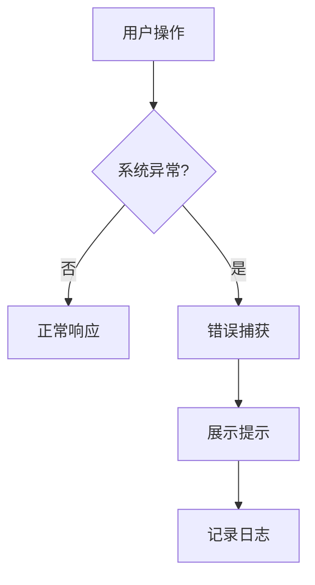

# 功能PRD：平台基础能力

## 文档信息

| 字段 | 说明 |
|------|------|
| **文档编号** | PRD-FEATURE-Platform-Foundation-v1.0 |
| **功能名称** | 平台基础能力 |
| **核心价值** | 提升系统稳定性、性能与安全合规能力 |
| **迭代目标** | 建立错误处理、性能优化与审计日志体系 |
| **关联需求** | US-2.9-01, US-2.9-02 |
| **状态** | 草稿 |
| **创建日期** | 2026-01-14 |
| **更新日期** | 2026-01-14 |
| **文档Owner** | 产品负责人 |

---

## 1. 功能概述

### 1.1 功能定位

平台基础能力覆盖稳定性、性能与安全合规要求，是所有业务功能的共用底座。

### 1.2 目标用户

- **主要用户**: 业务团队
- **次要用户**: 运维团队、管理层

### 1.3 核心价值

**对用户的价值**:
- 稳定、快速、安全的系统体验

**对业务的价值**:
- 降低故障率与合规风险
- 提升运维效率与可追溯性

### 1.4 优先级

- **优先级**: P0
- **RICE分数**: 90
  - Reach（影响用户数）: 全员
  - Impact（对用户价值）: 高
  - Confidence（成功把握）: 80%
  - Effort（开发成本）: 4周

---

## 2. 功能需求

### 2.1 用户故事

**US-01**: 作为业务用户，我希望系统稳定且响应快速，以便不影响日常工作。

**US-02**: 作为运维，我希望有完整审计日志与错误追踪，以便快速定位问题。

### 2.2 功能列表

| 功能项 | 描述 | 优先级 | 依赖 | 工作量 |
|-------|------|--------|------|--------|
| 错误处理 | 全局错误边界与统一提示 | P0 | 前端框架 | 4天 |
| 性能优化 | 前端与后端优化策略 | P0 | 架构优化 | 5天 |
| 安全合规 | 加密、审计日志 | P0 | 安全组件 | 4天 |
| 监控与告警 | 指标/日志采集 | P1 | 监控平台 | 5天 |
| 版本回滚 | 灰度与回滚策略 | P1 | 发布平台 | 3天 |

### 2.3 详细规格说明

#### 功能1：错误处理与稳定性

**功能描述**: 统一捕获前端与后端异常并提供友好提示，同时记录日志。

**外部依赖与降级展示**:
- **日志上报服务**: 若不可用，缓存日志并延迟上报。

**字段定义**:
| 字段名 | 类型 | 必填 | 说明 | 示例 | 约束 |
|-------|------|------|------|------|------|
| errorId | string | 是 | 错误ID | "err_1" | 唯一 |
| errorType | string | 是 | 类型 | "network" | - |
| message | string | 是 | 描述 | "请求超时" | 1-200 |

**交互行为**:
1. 发生异常 → 触发错误边界
2. 展示错误提示并记录日志

**边界条件**:
- 重复错误 → 合并上报

**权限要求**:
- 管理员可查看错误详情

---

#### 功能2：性能优化

**功能描述**: 前端采用懒加载、虚拟滚动与代码分割；后端优化索引与缓存。

**交互行为**:
1. 列表滚动 → 虚拟滚动加载
2. 路由切换 → 懒加载模块

**边界条件**:
- 缓存未命中 → 回退到数据库查询

---

#### 功能3：安全与合规

**功能描述**: 保障数据传输与存储安全，记录审计日志。

**交互行为**:
1. 敏感操作 → 写入审计日志

**边界条件**:
- 审计服务不可用 → 禁止高风险操作

---

#### 功能4：监控与告警

**功能描述**: 采集前后端指标、日志与链路数据，并触发告警。

**外部依赖与降级展示**:
- **监控平台**: 若不可用，指标缓存并延迟上报。

**交互行为**:
1. 指标异常 → 触发告警

---

#### 功能5：版本回滚

**功能描述**: 支持灰度发布与快速回滚。

**外部依赖与降级展示**:
- **发布平台**: 若不可用，阻止发布操作并提示。

**交互行为**:
1. 灰度发布 → 分批上线
2. 触发回滚 → 恢复上一版本

---

## 3. UI设计

### 3.1 页面布局

#### 布局方案1：系统级提示

**页面结构**:
```
┌──────────────────────────────────┐
│ 全局提示条/错误页/通知中心        │
└──────────────────────────────────┘
```

### 3.2 组件说明

#### 组件1：全局错误提示

**组件类型**: 提示条/错误页

**位置**: 页面顶部或内容区

**交互行为**:
- 支持重试

---

### 3.3 样式规范

- 颜色、字体、间距与全局一致

### 3.4 响应式设计

| 断点 | 宽度范围 | 布局调整 |
|-----|---------|---------|
| Desktop | >1200px | 提示条固定 |
| Tablet | 768-1199px | 提示条折行 |
| Mobile | <768px | 提示条全宽 |

---

## 4. 交互流程

### 4.1 主流程



### 4.2 异常分支

#### 异常1：监控服务不可用

- **触发条件**: 监控上报失败
- **处理方式**: 本地缓存与重试
- **用户提示**: 无
- **恢复方式**: 服务恢复后补报

---

## 5. 接口定义

### 5.1 写入审计日志

**接口路径**: `/api/audit/logs`

**请求方法**: POST

**请求体**:
```json
{
  "action": "EXPORT_REPORT",
  "actorId": "u_1",
  "resource": "report",
  "timestamp": "2026-01-14T10:00:00Z"
}
```

---

### 5.2 获取审计日志

**接口路径**: `/api/audit/logs`

**请求方法**: GET

---

## 6. 数据模型

### 6.1 AuditLog

**实体描述**: 审计日志记录。

**TypeScript接口定义**:
```typescript
interface AuditLog {
  id: string;
  actorId: string;
  action: string;
  resource: string;
  timestamp: string;
  metadata?: Record<string, unknown>;
}
```

---

## 7. 验收标准

### 7.1 功能验收

| 验收项 | 验收标准 | 优先级 | 测试方法 |
|-------|---------|--------|---------|
| 统一错误处理 | 前后端错误可捕获 | P0 | 手动 |
| 性能优化 | 指标达标 | P0 | 监控 |
| 审计日志 | 关键操作完整记录 | P0 | 日志检查 |
| 告警 | 异常告警触发 | P1 | 监控 |

### 7.2 性能验收

| 验收项 | 验收标准 | 测试方法 |
|-------|---------|---------|
| API响应 | <2秒（P95） | 监控 |

---

## 8. 非功能需求

### 8.1 性能要求

| 指标 | 目标值 | 测量方法 |
|-----|--------|---------|
| API响应时间 | <2秒（P95） | 监控 |
| 前端首屏渲染 | <1秒 | Lighthouse |
| 并发支持 | 100并发 | 压测 |
| 数据库查询 | <500ms | 慢查询 |

### 8.2 可用性要求

| 指标 | 目标值 |
|-----|--------|
| 系统可用性 | >99% |
| 错误率 | <1% |

### 8.3 安全要求

- 传输加密：HTTPS/TLS 1.3
- 存储加密：数据库透明加密
- 敏感字段加密：AES-256
- 审计日志记录

### 8.4 可扩展性要求

- 支持多实例部署
- 无状态设计

### 8.5 可维护性要求

- 监控与告警体系完善
- 日志分级管理

---

## 附录A：术语表

| 术语 | 定义 |
|-----|------|
| 审计日志 | 记录关键操作的合规日志 |
| 错误边界 | 前端全局错误捕获机制 |

---

## 附录B：外围系统依赖

| 系统 | 依赖说明 | API路径 | 负责人 |
|------|---------|--------|------|
| 监控平台 | 指标与告警 | /api/metrics | 运维团队 |
| 日志平台 | 日志采集 | /api/logs | 运维团队 |
| 发布平台 | 灰度与回滚 | /api/releases | 运维团队 |

---

## 附录C：待决策事项

| 事项ID | 事项描述 | 备选方案 | 决策人 | 截止日期 | 状态 |
|--------|---------|---------|--------|---------|------|
| Q-01 | 是否启用全量审计日志 | 全量/关键操作 | 产品负责人 | 2026-02-01 | ⏳待决策 |

---

## 附录D：变更历史

| 版本 | 日期 | 变更内容 | 变更人 | 审核人 |
|-----|------|---------|--------|--------|
| v1.0 | 2026-01-14 | 初始版本（按模板补全） | 产品负责人 | 产品负责人 |

---

**文档结束**
