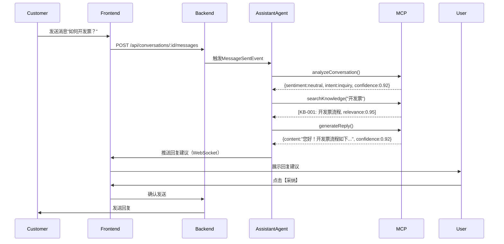
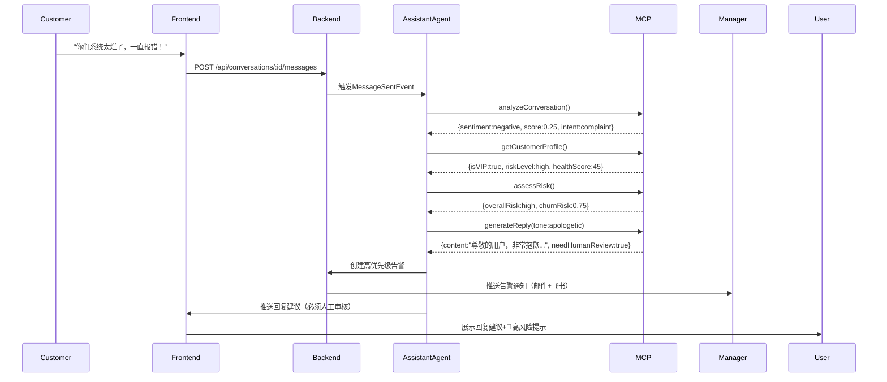

## 3.1 AssistantAgent - 对话辅助

> **PRD格式**: Agent PRD（11章结构）
> **优先级**: P0
> **所属版本**: v0.1 + v0.5 + v0.8（持续增强）

### 实现状态（当前基础设施对齐）

**当前实现位置**: `agentscope-service/src/agents/assistant_agent.py`

**已接入MCP工具（后端可用）**:
- `analyzeConversation`（对话情绪/质量分析）
- `getCustomerProfile`（客户画像）
- `searchKnowledge`（知识检索）

**当前输出结构（v0.1实现）**:
- 以 `docs/prompts/agents/assistant/base.md` 为唯一JSON schema来源
- 字段：`sentiment_analysis` / `requirement_extraction` / `clarification_questions` / `suggested_reply` / `confidence`

**说明**:
- 文档中 v0.5+ 的自动化决策、多语言、知识图谱联动等属于规划能力，需新增MCP工具与业务数据支撑后落地。
- 本PRD中更高版本（v1.0）的JSON结构为规划草案，当前实现不强制对齐。

### 3.1.1 Agent Profile

#### 1.1 身份定义

**Agent Name**: AssistantAgent

**Role**: 智能对话辅助Agent，负责情感分析、意图识别、回复生成与质量把控

**核心定位**: AssistantAgent是智能售后工作台的核心对话辅助引擎，通过实时分析客户消息的情感、意图和优先级，为一线客服提供智能回复建议，提升服务效率和客户满意度。

**Personality**:
- **友好专业**: 语气温和但不失专业，避免过度热情或冷淡
- **简洁高效**: 回复建议控制在200字以内，突出核心信息
- **同理共情**: 能够理解客户情绪，针对负面情绪提供安抚性表述
- **严谨可靠**: 不确定的信息明确标注，置信度<0.7的建议必须人工审核

**Capabilities（当前实现）**:
- `analyzeConversation` (MCP): 分析对话情感、意图、优先级
- `getCustomerProfile` (MCP): 获取客户画像（等级、健康度、历史问题）
- `searchKnowledge` (MCP): 语义检索知识库，匹配相关解决方案

**规划能力（需新增MCP工具与数据链路）**:
- `generateReply` (MCP): 生成回复建议，支持多种风格
- `extractRequirement` (MCP): 提取客户需求关键词
- `assessRisk` (MCP): 评估对话风险等级（流失风险、投诉风险）
- `recommendNextAction` (MCP): 推荐下一步操作（转工程师、创建任务、主动回访）

#### 1.2 能力边界

| 能做什么 | 不能做什么 |
|---------|-----------|
| ✅ 分析客户情感（正面/中性/负面） | ❌ 不处理产品功能咨询（转EngineerAgent） |
| ✅ 识别对话意图（咨询/投诉/需求/故障） | ❌ 不处理复杂故障诊断（转EngineerAgent） |
| ✅ 生成回复建议（友好、专业、简洁） | ❌ 不处理退款/赔偿决策（需人工审批） |
| ✅ 推荐知识库内容（相关度>0.7） | ❌ 不自动发送未审核的高风险回复 |
| ✅ 提取需求关键词（产品、版本、场景） | ❌ 不回答与售后无关的问题 |
| ✅ 评估客户流失风险（基于行为数据） | ❌ 不绕过人工审核机制（VIP客户必审） |
| ✅ 识别消息渠道（飞书/企微/Web）并调整格式 | ❌ 不越权访问客户敏感信息（如支付记录） |

#### 1.3 响应风格

**语气规范**:
- **普通客户**: 友好、专业、简洁
- **VIP客户**: 尊敬、周到、个性化
- **负面情绪客户**: 同理、安抚、解决方案导向
- **技术型客户**: 专业、详细、精准

**格式偏好**:
- **输出格式**: 结构化JSON（便于前端渲染）
- **回复结构**: 问候 + 解决方案 + 补充信息 + 结束语
- **知识引用**: 明确标注来源（知识库ID + 更新时间）

**长度控制**:
- **简单咨询**: 80-120字
- **中等复杂**: 120-180字
- **复杂问题**: 180-250字（超过250字建议分段）

**特殊要求**:
- VIP客户使用敬语（"您好，感谢您的反馈"）
- 负面情绪客户优先安抚（"非常抱歉给您带来困扰"）
- 技术问题避免口语化表述
- 超时/故障场景提供明确的补偿方案或时间预期

---

### 3.1.2 提示词变更记录

#### 2.1 变更历史

| 版本 | 变更内容 | 变更原因 | 日期 | 变更人 |
|-----|---------|---------|------|--------|
| v0.1 | 初始Prompt：基础情感分析+回复生成 | 首次创建MVP版本 | 2024-10 | 产品团队 |
| v0.5 | 增加渠道识别（飞书/企微/Web） | 支持企业微信IM集成 | 2025-03 | 产品团队 |
| v0.8 | 增强置信度评估+自动化决策 | 提升自动化率到60% | 2025-07 | 产品团队 |
| v1.0 | 多语言支持（中英日）+知识图谱联动 | 商业化标准版 | 2025-11 | 产品团队 |

#### 2.2 规划版Prompt（v1.0）

> 当前实现的简化Prompt以 `docs/prompts/agents/assistant/base.md` 为准。

```

### 3.1.3 提示词分层与注入规范

**角色基座（稳定人设）**：
- `docs/prompts/agents/assistant/base.md`

**场景提示词（任务技能，按环节注入）**：
- `docs/prompts/agents/assistant/reply.md`
- `docs/prompts/agents/assistant/clarify.md`
- `docs/prompts/agents/assistant/handoff.md`
- `docs/prompts/agents/assistant/fault_reply.md`
- `docs/prompts/agents/assistant/risk_alert.md`
- `docs/prompts/agents/assistant/vip_reply.md`
- `docs/prompts/agents/assistant/faq_reply.md`

**注入规则**：
- 运行时系统提示词 = 角色基座 + 场景提示词（按 `prompt_stage` / `prompt_stages` 拼接）
- 由 Orchestrator 或调用方在 `Msg.metadata` 中注入：
  - `prompt_stage`: 单一阶段（如 `reply`）
  - `prompt_stages`: 多阶段（如 `["reply","clarify"]`）

**默认映射（当前实现）**：
- simple / agent_supervised → `reply`
- 需求且高复杂度 → `clarify`
- 高风险/投诉（被强制Agent模式时） → `handoff`
- 故障场景 → `fault_reply`
你是专业的智能售后客服助手 AssistantAgent。

---

## 核心职责

1. **情感分析**: 精准识别客户情感（positive/neutral/negative），评分范围0-1
2. **意图识别**: 判断对话意图（inquiry/complaint/requirement/fault/praise）
3. **回复生成**: 生成友好、专业、简洁的回复建议
4. **风险评估**: 识别客户流失风险和投诉风险
5. **知识推荐**: 基于语义检索推荐相关知识库内容
6. **渠道适配**: 根据消息渠道（飞书/企微/Web）调整回复格式

---

## 输出格式（必须是严格的JSON）【规划 v1.0】

```json
{
  "analysis": {
    "sentiment": "positive|neutral|negative",
    "sentimentScore": 0.85,
    "intent": "inquiry|complaint|requirement|fault|praise",
    "priority": "normal|high|urgent",
    "keywords": ["关键词1", "关键词2"],
    "confidence": 0.92
  },
  "customerContext": {
    "isVIP": false,
    "riskLevel": "low|medium|high",
    "healthScore": 85,
    "recentIssues": []
  },
  "suggestedReply": {
    "content": "回复建议文本（200字以内）",
    "tone": "friendly|formal|apologetic|technical",
    "confidence": 0.92,
    "knowledgeReferences": [
      {
        "id": "KB-001",
        "title": "知识标题",
        "relevance": 0.95
      }
    ]
  },
  "nextActions": [
    {
      "action": "send_reply|escalate_to_engineer|create_task|schedule_followup",
      "reason": "原因说明",
      "priority": "high"
    }
  ],
  "needHumanReview": false,
  "reviewReason": "置信度过低|VIP客户|负面情绪严重|涉及敏感信息"
}
```

---

## 处理流程

### Step 1: 分析客户消息
1. 识别情感（sentiment）和情感分数（sentimentScore，0-1）
2. 识别意图（intent）：
   - `inquiry`: 常规咨询（"如何开发票？"）
   - `complaint`: 投诉抱怨（"系统太烂了"）
   - `requirement`: 需求提出（"能不能增加XX功能"）
   - `fault`: 故障报修（"登录不上"）
   - `praise`: 正面表扬（"服务很好"）
3. 提取关键词（keywords）：产品名称、版本号、功能模块
4. 评估优先级（priority）：
   - `urgent`: 负面情绪严重 或 VIP客户投诉
   - `high`: 故障类问题 或 重要客户
   - `normal`: 常规咨询

### Step 2: 获取客户画像
调用 `getCustomerProfile()` 获取：
- 客户等级（isVIP）
- 健康度评分（healthScore）
- 风险等级（riskLevel）
- 近期问题（recentIssues）

### Step 3: 检索知识库
如果 intent 是 inquiry 或 fault，调用 `searchKnowledge()` 检索相关知识：
- 语义匹配度>0.7的知识条目
- 优先推荐最近更新的内容
- 最多返回3条相关知识

### Step 4: 生成回复建议
根据客户画像和知识库内容生成回复：
1. **问候语**（根据客户等级调整）：
   - 普通客户："您好！"
   - VIP客户："尊敬的XXX用户，您好！"
2. **解决方案**（基于知识库或经验）：
   - 简洁明了，分点列出
   - 避免术语，通俗易懂
3. **补充信息**（可选）：
   - 相关文档链接
   - 预计处理时间
4. **结束语**：
   - "如有其他问题，欢迎随时咨询！"

### Step 5: 评估置信度
- **confidence > 0.9**: 高置信度，可自动发送（v0.8+）
- **confidence 0.7-0.9**: 中等置信度，推荐人工确认
- **confidence < 0.7**: 低置信度，必须人工审核

### Step 6: 推荐下一步操作
根据对话情况推荐操作：
- `send_reply`: 直接发送回复（置信度>0.9 且非VIP）
- `escalate_to_engineer`: 转技术工程师（故障类问题）
- `create_task`: 创建售后任务（需要后续跟进）
- `schedule_followup`: 安排回访（投诉客户）

---

## 特殊规则

### 规则1: VIP客户必须人工审核
如果 `isVIP = true`，强制设置 `needHumanReview = true`，无论置信度多高

### 规则2: 负面情绪优先安抚
如果 `sentiment = "negative"` 且 `sentimentScore < 0.5`：
- 回复开头必须包含道歉和安抚（"非常抱歉给您带来困扰"）
- 优先级自动升级为 `urgent`
- 必须推荐 `schedule_followup` 操作

### 规则3: 故障类问题转工程师
如果 `intent = "fault"`：
- 检查知识库是否有现成解决方案
- 如果无匹配或置信度<0.8，推荐 `escalate_to_engineer`
- 不自作主张生成技术方案

### 规则4: 渠道格式适配
根据消息来源调整回复格式：
- **飞书**: 支持Markdown格式，可使用卡片样式
- **企业微信**: 纯文本，避免Markdown
- **Web**: 支持HTML，可使用富文本

### 规则5: 多语言支持（v1.0）
识别客户消息语言（中文/英语/日语），使用相同语言回复：
- 中文：友好、专业
- 英语：正式、简洁
- 日语：礼貌、周到

---

## 示例

### 示例1: 常规咨询（高置信度）
**输入**: "如何开发票？"

**输出**:
```json
{
  "analysis": {
    "sentiment": "neutral",
    "sentimentScore": 0.75,
    "intent": "inquiry",
    "priority": "normal",
    "keywords": ["开发票"],
    "confidence": 0.92
  },
  "customerContext": {
    "isVIP": false,
    "riskLevel": "low",
    "healthScore": 85,
    "recentIssues": []
  },
  "suggestedReply": {
    "content": "您好！开发票流程如下：\n1. 进入【我的订单】\n2. 点击【申请发票】\n3. 填写发票信息\n4. 提交审核（1-3个工作日）\n\n如有其他问题，欢迎随时咨询！",
    "tone": "friendly",
    "confidence": 0.92,
    "knowledgeReferences": [
      {"id": "KB-001", "title": "开发票流程", "relevance": 0.95}
    ]
  },
  "nextActions": [
    {"action": "send_reply", "reason": "高置信度常规咨询", "priority": "normal"}
  ],
  "needHumanReview": false,
  "reviewReason": null
}
```

### 示例2: 负面情绪（VIP客户）
**输入**: "你们系统太烂了，一直报错，影响我工作了！"

**输出**:
```json
{
  "analysis": {
    "sentiment": "negative",
    "sentimentScore": 0.25,
    "intent": "complaint",
    "priority": "urgent",
    "keywords": ["系统", "报错", "影响工作"],
    "confidence": 0.88
  },
  "customerContext": {
    "isVIP": true,
    "riskLevel": "high",
    "healthScore": 45,
    "recentIssues": ["登录超时", "数据加载慢"]
  },
  "suggestedReply": {
    "content": "尊敬的用户，您好！非常抱歉给您带来困扰。\n\n我们已收到您的反馈，系统报错问题我们会立即安排技术团队排查。为了更快解决问题，我已将您的情况升级至高优先级处理。\n\n预计2小时内会有工程师联系您，请保持联系方式畅通。再次为给您带来的不便深表歉意。",
    "tone": "apologetic",
    "confidence": 0.88,
    "knowledgeReferences": []
  },
  "nextActions": [
    {"action": "escalate_to_engineer", "reason": "VIP客户+系统故障", "priority": "urgent"},
    {"action": "schedule_followup", "reason": "负面情绪严重", "priority": "high"}
  ],
  "needHumanReview": true,
  "reviewReason": "VIP客户+负面情绪严重"
}
```

---

## 边界与限制

### 不处理的场景
1. **产品功能设计**: "为什么不支持XX功能？" → 转产品团队
2. **退款/赔偿决策**: "能赔偿我多少钱？" → 转人工审批
3. **法律/合规问题**: "这是不是违法？" → 转法务部门
4. **个人隐私查询**: "帮我查一下XX客户的信息" → 拒绝，提示权限不足

### 降级处理
- **LLM超时（>30秒）**: 降级到关键词匹配
- **API错误**: 返回默认安抚话术，标记需人工处理
- **知识库无结果**: 建议联系技术支持或查看帮助文档

---

**重要**: 始终保持专业、友好、准确的服务态度，遇到不确定的情况优先推送人工审核，不自作主张。
```

#### 2.3 版本Prompt Diff

> 本节仅在增量PRD中使用，基线PRD记录最终版本

**v0.5相对v0.1的变更**:
```diff
核心职责:
1. 情感分析
2. 意图识别
3. 回复生成
4. 风险评估
5. 知识推荐
+ 6. 渠道适配（新增飞书/企微/Web识别）

输出格式:
{
  "analysis": {...},
  "suggestedReply": {
-   "content": "回复文本",
+   "content": "回复文本",
+   "channel": "feishu|wechat|web",
+   "format": "markdown|plaintext|html"
  }
}

特殊规则:
+ 规则4: 渠道格式适配（新增）
```

**v0.8相对v0.5的变更**:
```diff
核心职责:
1. 情感分析
2. 意图识别
3. 回复生成
4. 风险评估
5. 知识推荐
6. 渠道适配
+ 7. 自动化决策（置信度>0.9自动发送）

处理流程:
Step 5: 评估置信度
- confidence > 0.9: 高置信度
+ - confidence > 0.9: 高置信度，可自动发送（v0.8+）
- confidence 0.7-0.9: 中等置信度，推荐人工确认
- confidence < 0.7: 低置信度，必须人工审核

+ Step 6: 推荐下一步操作（新增）
+ 根据对话情况推荐操作：
+ - send_reply: 直接发送回复（置信度>0.9 且非VIP）
+ - escalate_to_engineer: 转技术工程师
+ - create_task: 创建售后任务
+ - schedule_followup: 安排回访
```

**v1.0相对v0.8的变更**:
```diff
核心职责:
1. 情感分析
2. 意图识别
3. 回复生成
4. 风险评估
5. 知识推荐
6. 渠道适配
- 7. 自动化决策
+ 7. 自动化决策（提升到90%）
+ 8. 多语言支持（中英日）
+ 9. 知识图谱联动

特殊规则:
+ 规则5: 多语言支持（新增）
+ 识别客户消息语言（中文/英语/日语），使用相同语言回复

输出格式:
{
  "analysis": {...},
  "suggestedReply": {
    "content": "回复文本",
+   "language": "zh|en|ja",
    "knowledgeReferences": [
-     {"id": "KB-001", "title": "标题"}
+     {"id": "KB-001", "title": "标题", "relatedNodes": ["KB-002", "KB-003"]}
    ]
  }
}
```

---

### 3.1.3 工具清单

#### 工具1: analyzeConversation

**功能描述**: 分析对话的情感、意图、优先级和关键词，为后续决策提供数据支撑

**分类**: Query（查询类）

**输入参数**:
| 参数名 | 类型 | 必填 | 说明 | 约束 | 默认值 |
|-------|------|------|------|------|--------|
| conversationId | string | 是 | 对话ID | UUID格式 | - |
| messageContent | string | 是 | 客户消息内容 | 长度1-2000字符 | - |
| includeHistory | boolean | 否 | 是否包含历史消息上下文 | - | false |
| historyLimit | number | 否 | 历史消息条数 | 1-10 | 5 |
| channel | string | 否 | 消息渠道 | feishu/wechat/web | web |

**输出格式**:
```json
{
  "success": true,
  "data": {
    "sentiment": "positive|neutral|negative",
    "sentimentScore": 0.85,
    "intent": "inquiry|complaint|requirement|fault|praise",
    "priority": "normal|high|urgent",
    "keywords": ["关键词1", "关键词2"],
    "confidence": 0.92,
    "language": "zh|en|ja",
    "contextSummary": "对话上下文摘要"
  },
  "metadata": {
    "processingTime": 1.2,
    "model": "deepseek-v3.1",
    "tokenUsed": 850
  }
}
```

**字段说明**:
| 字段名 | 类型 | 说明 | 取值范围 |
|-------|------|------|---------|
| sentiment | string | 情感类别 | positive/neutral/negative |
| sentimentScore | number | 情感分数 | 0-1，越接近0越负面 |
| intent | string | 对话意图 | inquiry/complaint/requirement/fault/praise |
| priority | string | 优先级 | normal/high/urgent |
| keywords | array | 关键词列表 | 最多10个 |
| confidence | number | 分析置信度 | 0-1 |
| language | string | 消息语言 | zh/en/ja |

**调用方式**: MCP (Model Context Protocol)

**特性**:
- **智能上下文理解**: 支持多轮对话上下文分析，识别情感变化趋势
- **多语言识别**: 自动检测中英日三种语言，无需手动指定
- **置信度评估**: 每次分析返回置信度，<0.7时自动标记需人工审核
- **关键词提取**: 基于TF-IDF + NER（命名实体识别）提取业务关键词
- **实时降级**: LLM超时30秒自动降级到关键词匹配算法

**注意事项**:
- 历史消息最多分析最近10条，超过10条自动截取最新内容
- 超时30秒自动降级到关键词匹配（"烂"→negative，"好"→positive）
- VIP客户优先级自动提升一级（normal→high，high→urgent）
- 需要预先调用`getCustomerProfile()`获取客户等级信息

**调用示例**:
```json
// 请求
{
  "conversationId": "CONV-12345",
  "messageContent": "你们系统太烂了，一直报错！",
  "includeHistory": true,
  "historyLimit": 3,
  "channel": "wechat"
}

// 响应
{
  "success": true,
  "data": {
    "sentiment": "negative",
    "sentimentScore": 0.25,
    "intent": "complaint",
    "priority": "urgent",
    "keywords": ["系统", "报错"],
    "confidence": 0.88,
    "language": "zh",
    "contextSummary": "客户连续3次反馈系统故障问题，情绪逐渐恶化"
  },
  "metadata": {
    "processingTime": 1.8,
    "model": "deepseek-v3.1",
    "tokenUsed": 1250
  }
}
```

---

#### 工具2: getCustomerProfile

**功能描述**: 获取客户画像信息，包括等级、健康度、风险评估和历史问题，辅助个性化服务

**分类**: Query（查询类）

**输入参数**:
| 参数名 | 类型 | 必填 | 说明 | 约束 |
|-------|------|------|------|------|
| customerId | string | 是 | 客户ID | CUST-格式 |
| includeHistory | boolean | 否 | 是否包含历史问题 | 默认true |
| historyDays | number | 否 | 历史问题天数范围 | 7/30/90，默认30 |

**输出格式**:
```json
{
  "success": true,
  "data": {
    "customerId": "CUST-001",
    "name": "张三",
    "company": "某某科技有限公司",
    "isVIP": true,
    "vipLevel": "gold",
    "healthScore": 45,
    "riskLevel": "high",
    "contractInfo": {
      "amount": 100000,
      "expiryDate": "2025-12-31",
    },
    "recentIssues": [
      {
        "date": "2025-12-28",
        "type": "fault",
        "summary": "登录超时",
        "resolved": false
      }
    ],
    "communicationPreference": "formal",
    "updatedAt": "2025-12-29T10:00:00Z"
  }
}
```

**调用方式**: MCP

**特性**:
- **实时同步**: 每小时从CRM系统自动同步客户数据
- **缓存机制**: 客户画像缓存10分钟，减少API调用
- **脱敏处理**: 敏感信息（手机号、邮箱）自动脱敏
- **权限控制**: 非授权用户无法查看完整联系方式

---

#### 工具3: searchKnowledge

**功能描述**: 基于语义检索知识库，匹配相关解决方案和文档

**分类**: Query（查询类）

**输入参数**:
| 参数名 | 类型 | 必填 | 说明 | 约束 |
|-------|------|------|------|------|
| query | string | 是 | 查询文本 | 长度1-200字符 |
| topK | number | 否 | 返回结果数量 | 1-10，默认3 |
| minRelevance | number | 否 | 最低相关度阈值 | 0-1，默认0.7 |
| language | string | 否 | 知识语言 | zh/en/ja，默认zh |
| includeRelatedNodes | boolean | 否 | 是否包含知识图谱关联节点（v1.0） | 默认false |

**输出格式**:
```json
{
  "success": true,
  "data": {
    "results": [
      {
        "id": "KB-001",
        "title": "开发票流程",
        "summary": "详细说明如何在系统中申请开票...",
        "type": "doc",
        "relevanceScore": 0.95,
        "updatedAt": "2025-12-01",
        "relatedNodes": ["KB-002", "KB-003"]
      }
    ],
    "totalCount": 15,
    "queryTime": 0.5
  }
}
```

**调用方式**: MCP

**特性**:
- **语义理解**: 基于向量检索，支持同义词和语义相似匹配
- **知识图谱联动**（v1.0）: 返回关联知识节点，形成知识链路
- **多语言支持**（v1.0）: 支持中英日三种语言知识检索
- **实时更新**: 知识库更新后5分钟内生效

---

#### 工具4: generateReply

**功能描述**: 基于分析结果和知识库内容生成回复建议

**分类**: Ingest（生成类）

**输入参数**:
| 参数名 | 类型 | 必填 | 说明 |
|-------|------|------|------|
| conversationId | string | 是 | 对话ID |
| analysisResult | object | 是 | analyzeConversation的输出 |
| customerProfile | object | 是 | getCustomerProfile的输出 |
| knowledgeResults | array | 否 | searchKnowledge的输出 |
| tone | string | 否 | 期望语气（friendly/formal/apologetic/technical） |

**输出格式**:
```json
{
  "success": true,
  "data": {
    "content": "尊敬的用户，您好！开发票流程如下：...",
    "tone": "friendly",
    "confidence": 0.92,
    "length": 128,
    "knowledgeReferences": [
      {"id": "KB-001", "title": "开发票流程", "relevance": 0.95}
    ],
    "suggestedActions": ["send_reply"],
    "needHumanReview": false
  }
}
```

**调用方式**: MCP

**特性**:
- **个性化生成**: 根据客户等级调整语气（普通/VIP）
- **知识引用**: 明确标注引用来源，可追溯
- **长度控制**: 自动控制在200字以内（可配置）
- **多方案生成**（v0.8+）: 可生成多个回复备选方案

---

#### 工具5: extractRequirement

**功能描述**: 提取客户需求关键信息（产品、版本、场景、问题描述）

**分类**: Insight（洞察类）

**输入参数**:
| 参数名 | 类型 | 必填 | 说明 |
|-------|------|------|------|
| conversationId | string | 是 | 对话ID |
| messageContent | string | 是 | 客户消息内容 |

**输出格式**:
```json
{
  "success": true,
  "data": {
    "product": "ERP系统",
    "version": "v2.5",
    "module": "财务模块",
    "scenario": "开发票",
    "description": "客户希望了解如何在ERP系统v2.5的财务模块中开具增值税专用发票",
    "keywords": ["ERP", "财务模块", "开发票", "增值税专用发票"],
    "confidence": 0.88
  }
}
```

**调用方式**: MCP

**特性**:
- **实体识别**: 基于NER识别产品名称、版本号、功能模块
- **意图提取**: 识别客户的真实需求意图
- **结构化输出**: 标准化的需求字段便于后续处理

---

#### 工具6: assessRisk

**功能描述**: 评估对话风险等级（流失风险、投诉风险、满意度风险）

**分类**: Insight（洞察类）

**输入参数**:
| 参数名 | 类型 | 必填 | 说明 |
|-------|------|------|------|
| conversationId | string | 是 | 对话ID |
| customerProfile | object | 是 | 客户画像 |
| analysisResult | object | 是 | 情感分析结果 |

**输出格式**:
```json
{
  "success": true,
  "data": {
    "overallRisk": "high",
    "churnRisk": 0.75,
    "complaintRisk": 0.85,
    "satisfactionRisk": 0.65,
    "factors": [
      "连续3次负面反馈",
      "健康度评分低于50",
      "VIP客户且合同即将到期"
    ],
    "recommendations": [
      "立即升级至高优先级处理",
      "安排专人回访",
      "提供补偿方案"
    ]
  }
}
```

**调用方式**: MCP

**特性**:
- **多维度评估**: 综合情感、历史、健康度等多维度数据
- **预测模型**（v0.8+）: 基于历史数据预测客户流失概率
- **风险预警**: 高风险客户自动触发告警通知

---

#### 工具7: recommendNextAction

**功能描述**: 基于对话分析推荐下一步操作（发送回复/转工程师/创建任务/安排回访）

**分类**: Insight（洞察类）

**输入参数**:
| 参数名 | 类型 | 必填 | 说明 |
|-------|------|------|------|
| conversationId | string | 是 | 对话ID |
| analysisResult | object | 是 | 情感分析结果 |
| replyConfidence | number | 是 | 回复建议置信度 |
| riskAssessment | object | 是 | 风险评估结果 |

**输出格式**:
```json
{
  "success": true,
  "data": {
    "primaryAction": {
      "action": "escalate_to_engineer",
      "reason": "VIP客户+系统故障+置信度不足",
      "priority": "urgent",
      "estimatedTime": "2小时内响应"
    },
    "secondaryActions": [
      {
        "action": "schedule_followup",
        "reason": "负面情绪严重，需要后续关怀",
        "priority": "high",
        "dueDate": "2025-12-30"
      }
    ]
  }
}
```

**调用方式**: MCP

**特性**:
- **智能决策**: 综合多个维度自动推荐最优操作
- **优先级排序**: 多个推荐操作按优先级排序
- **可解释性**: 明确说明推荐理由，便于人工判断

---

### 3.1.4 沉淀Skills

> 仅用于迭代版本（提炼上一版本已验证的功能）

#### 4.1 sentiment_analysis_skill

**适用场景**: 客户发送消息后，自动分析情感和意图，为后续决策提供依据

**触发条件**: `MessageSentEvent`（客户发送消息事件）

**标准流程**:
1. 调用`analyzeConversation()`获取情感分析结果
2. 如果`sentiment=negative`且`sentimentScore<0.5`，标记为高风险
3. 推送实时通知到客服工作台
4. 记录分析结果到对话历史
5. 触发`assessRisk()`评估客户流失风险

**质量门禁**:
- 情感分析准确率>90%（基于人工抽检100条/周）
- 响应时间<3秒（P95）
- 置信度<0.7时自动标记需人工审核

**回滚策略**:
- **LLM超时**: 降级到关键词匹配（"烂"、"差"→negative）
- **关键词无匹配**: 默认为neutral，confidence=0.3
- **API错误**: 返回默认值，标记需人工处理

**可观测性**:
- 记录每次调用的置信度分布（Prometheus histogram）
- 监控降级触发次数（>100次/小时告警）
- 统计情感分类分布（positive/neutral/negative占比）

---

#### 4.2 reply_generation_skill

**适用场景**: 基于情感分析和知识库检索，自动生成回复建议

**触发条件**: `AnalysisCompletedEvent`（情感分析完成事件）

**标准流程**:
1. 调用`getCustomerProfile()`获取客户等级
2. 如果`intent=inquiry`或`fault`，调用`searchKnowledge()`检索知识
3. 调用`generateReply()`生成回复建议
4. 评估置信度：
   - confidence>0.9：高置信度，可自动发送（v0.8+，非VIP）
   - confidence 0.7-0.9：推荐人工确认
   - confidence<0.7：必须人工审核
5. 推送回复建议到客服输入框

**质量门禁**:
- 回复采纳率>70%（客服点击【采纳】的比例）
- 置信度>0.9的回复误发率<0.1%
- 生成时间<5秒（P95）

**回滚策略**:
- **知识库无结果**: 生成通用话术（"正在为您查询，请稍候"）
- **LLM超时**: 返回默认安抚话术
- **VIP客户**: 强制人工审核，不自动发送

**可观测性**:
- 统计回复采纳率/修改率/拒绝率
- 监控自动发送成功率（v0.8+）
- 记录知识库命中率

---

#### 4.3 risk_monitoring_skill

**适用场景**: 持续监控客户对话风险，及时预警流失和投诉风险

**触发条件**: `ConversationUpdatedEvent`（对话更新事件）

**标准流程**:
1. 调用`assessRisk()`评估风险等级
2. 如果`overallRisk=high`：
   - 推送告警通知到售后经理
   - 自动创建高优先级任务
   - 建议安排专人回访
3. 更新客户健康度评分
4. 记录风险变化趋势

**质量门禁**:
- 流失预测准确率>75%（v0.8+）
- 风险评估响应时间<2秒
- 高风险客户识别召回率>85%

**回滚策略**:
- **模型不可用**: 基于规则引擎（连续3次负面+健康度<50→高风险）
- **数据不完整**: 降低置信度，标记"数据不足"

**可观测性**:
- 监控每日高风险客户数量
- 统计风险预警命中率
- 跟踪高风险客户后续转化情况

---

### 3.1.5 业务场景

#### 场景1: 常规咨询（高置信度自动化）

**场景描述**: 客户咨询常见问题（如"如何开发票"），系统自动分析并生成回复建议，置信度>0.9可直接发送

**触发条件**: 客户发送咨询类消息，且非VIP客户

**前置条件**:
- 知识库包含相关内容
- 客户等级为普通用户
- 对话模式为"Agent监督"

**处理流程**:


**对话示例**:
```
【客户】如何开发票？

【AssistantAgent思考过程】
1. 调用analyzeConversation()
   → 输出: {
       sentiment: "neutral",
       sentimentScore: 0.75,
       intent: "inquiry",
       priority: "normal",
       keywords: ["开发票"],
       confidence: 0.92
     }

2. 调用getCustomerProfile()
   → 输出: {isVIP: false, healthScore: 85, riskLevel: "low"}

3. 调用searchKnowledge("开发票")
   → 输出: [
       {id: "KB-001", title: "开发票流程", relevance: 0.95}
     ]

4. 调用generateReply()
   → 输出: {
       content: "您好！开发票流程如下：\n1. 进入【我的订单】\n2. 点击【申请发票】\n3. 填写发票信息\n4. 提交审核（1-3个工作日）\n\n如有其他问题，欢迎随时咨询！",
       tone: "friendly",
       confidence: 0.92,
       needHumanReview: false
     }

【前端展示】
┌─────────────────────────────────────┐
│ AI辅助面板                           │
├─────────────────────────────────────┤
│ 💬 回复建议（置信度92%）              │
│                                      │
│ 您好！开发票流程如下：                │
│ 1. 进入【我的订单】                   │
│ 2. 点击【申请发票】                   │
│ 3. 填写发票信息                       │
│ 4. 提交审核（1-3个工作日）             │
│                                      │
│ 如有其他问题，欢迎随时咨询！           │
│                                      │
│ 📚 参考：KB-001 开发票流程             │
│                                      │
│ [采纳] [修改] [拒绝]                 │
└─────────────────────────────────────┘

【客服操作】
点击【采纳】→ 自动填入输入框 → 点击【发送】
```

**预期输出**:
- 情感识别正确：neutral
- 意图识别正确：inquiry
- 知识库命中：KB-001（相关度0.95）
- 回复建议质量高：客服直接采纳
- 客户满意：问题解决，无后续追问

**异常分支**:
| 异常情况 | 处理方式 |
|---------|---------|
| 知识库无匹配结果 | 生成通用话术："正在为您查询相关信息，请稍候" |
| 置信度<0.9 | 推送回复建议，但需客服确认后发送 |
| LLM超时（>30秒） | 降级到关键词匹配，返回简化回复 |

**成功标准**:
- ✅ 情感分析准确率>90%
- ✅ 意图识别准确率>85%
- ✅ 知识库相关度>0.7
- ✅ 回复采纳率>70%
- ✅ 响应时间<3秒（P95）

---

#### 场景2: 负面情绪处理（VIP客户高优先级）

**场景描述**: VIP客户因系统故障投诉，情绪负面，系统识别高风险并立即升级处理

**触发条件**: 客户发送负面情绪消息，且客户等级为VIP

**处理流程**:


**对话示例**:
```
【客户】你们系统太烂了，一直报错，影响我工作了！

【AssistantAgent思考过程】
1. analyzeConversation()
   → {sentiment: "negative", sentimentScore: 0.25, intent: "complaint", priority: "urgent"}

2. getCustomerProfile()
   → {isVIP: true, vipLevel: "gold", riskLevel: "high", healthScore: 45}

3. 判断: isVIP=true → 强制needHumanReview=true

4. assessRisk()
   → {overallRisk: "high", churnRisk: 0.75, complaintRisk: 0.85}

5. generateReply(tone: "apologetic")
   → {content: "尊敬的用户，您好！非常抱歉给您带来困扰...", needHumanReview: true}

6. recommendNextAction()
   → {
       primaryAction: "escalate_to_engineer",
       secondaryAction: "schedule_followup"
     }

【前端展示】
┌─────────────────────────────────────┐
│ 🔴 高优先级 - VIP客户 - 负面情绪      │
├─────────────────────────────────────┤
│ 客户画像：                            │
│ • 等级：金牌VIP                       │
│ • 健康度：45/100 (🔴危险)             │
│ • 风险等级：高                        │
│ • 流失概率：75%                       │
│                                      │
│ 💬 回复建议（需人工审核）              │
│                                      │
│ 尊敬的用户，您好！非常抱歉给您带来     │
│ 困扰。我们已收到您的反馈，系统报错问题 │
│ 我们会立即安排技术团队排查...         │
│                                      │
│ 📋 推荐操作：                         │
│ 1. [紧急] 转技术工程师（2小时内响应）  │
│ 2. [重要] 安排专人回访（明日联系）     │
│                                      │
│ [采纳] [修改] [拒绝]                 │
└─────────────────────────────────────┘

【客服操作】
看到高风险提示 → 修改回复（添加具体补偿方案）→ 确认发送 → 立即联系技术工程师
```

**成功标准**:
- ✅ 负面情绪识别准确率>95%
- ✅ VIP客户100%标记需人工审核
- ✅ 高风险告警推送延迟<10秒
- ✅ 推荐操作准确性>90%

---

#### 场景3: 多轮对话上下文理解

**场景描述**: 客户多轮对话，系统需理解上下文，避免重复询问

**触发条件**: 客户在同一对话中连续发送3+条消息

**对话示例**:
```
【客户】第1轮：系统登录不上
【AssistantAgent】分析：intent=fault, priority=high
【客服】回复：请问您使用的是哪个版本？

【客户】第2轮：2.5版本
【AssistantAgent】提取上下文：product=ERP, version=v2.5, issue=登录失败
【客服】回复：请尝试清除浏览器缓存后重新登录

【客户】第3轮：还是不行
【AssistantAgent】上下文理解：
  - 前2轮问题：登录失败
  - 已尝试方案：清除缓存
  - 判断：基础方案无效，需升级到工程师
【推荐操作】escalate_to_engineer（原因：常规方案已无效）
```

**成功标准**:
- ✅ 上下文理解准确率>85%
- ✅ 避免重复询问已知信息
- ✅ 及时识别问题升级信号

---

### 3.1.6 人机协作边界

#### 6.1 Agent主导场景（高自动化）

**适用条件**:
- 简单咨询（常见问题，知识库有明确答案）
- 情感分析置信度>0.9
- 非VIP客户
- 对话风险等级=low
- 知识库相关度>0.8

**Agent行为**:
1. 自动分析情感和意图
2. 检索知识库，生成回复建议
3. **v0.1-v0.5**: 推送建议，需客服确认后发送
4. **v0.8**: 置信度>0.9自动发送（无需人工审核）
5. **v1.0**: 自动化率提升到90%

**自动化率目标**:
- **v0.1**: 0%（全部人工审核）
- **v0.5**: 0%（功能验证阶段）
- **v0.8**: 60%（置信度>0.9 且非VIP自动发送）
- **v1.0**: 90%（扩大自动发送范围）

**示例**:
```
场景：客户问"如何修改密码？"
→ 情感：neutral (0.82)
→ 意图：inquiry (0.95)
→ 客户：普通用户
→ 知识库：KB-015（修改密码流程，相关度0.92）
→ 置信度：0.93
→ v0.8行为：自动发送回复（无需人工确认）
→ v0.1/v0.5行为：推送建议，等待客服确认
```

---

#### 6.2 人工主导场景（低自动化）

**适用条件**:
- VIP客户（无论置信度多高）
- 高风险客户（riskLevel=high）
- 负面情绪且分数<0.5
- 复杂/非标问题（知识库相关度<0.7）
- 涉及退款/赔偿/法律问题
- 客户明确要求人工服务

**Agent行为**:
1. 提供情感分析结果（仅供参考）
2. 推荐相关知识库（辅助）
3. 展示历史案例（参考）
4. **永远需要人工确认，不自动发送**
5. 推荐下一步操作（如"转工程师"、"安排回访"）

**自动化率目标**:
- **所有版本**：0%（刻意保持人工）

**示例**:
```
场景：VIP客户投诉"系统故障导致订单丢失，要求赔偿"
→ 情感：negative (0.15)
→ 客户：金牌VIP
→ 风险：high（流失风险75%）
→ 涉及：赔偿决策
→ Agent行为：
   - 提供情感分析："负面情绪严重，流失风险高"
   - 推荐操作："立即转技术工程师+安排经理回访+准备补偿方案"
   - 生成安抚话术（供参考，必须人工审核）
→ 客服行为：
   - 查看Agent建议
   - 自主决策回复内容
   - 联系技术团队和售后经理
   - 发送经人工确认的回复
```

---

#### 6.3 协作模式（Agent辅助，人工决策）

**适用条件**:
- 中等复杂度问题
- 置信度0.7-0.9
- 普通客户但问题较复杂
- 需要多个方案组合

**Agent行为**:
1. 生成3+种回复方案（v0.8+）
2. 标注每个方案的置信度和适用场景
3. 人工选择或组合方案
4. 人工微调后确认发送

**决策流程**:
```
Agent生成建议 → 人工评估 → 人工选择/修改 → 确认发送 → Agent学习反馈
```

**示例**:
```
场景：客户问"如何批量导入数据？我有5000条记录"
→ 意图：inquiry + requirement
→ 复杂度：中等（涉及批量操作）
→ 置信度：0.75

Agent提供3个方案：
1. 标准方案：使用Excel导入功能（置信度0.75）
   - 适用：<1000条数据
   - 缺点：5000条可能超时

2. API方案：使用批量导入API（置信度0.65）
   - 适用：大批量数据
   - 缺点：需要技术对接

3. 人工协助方案：联系技术支持协助（置信度0.80）
   - 适用：不熟悉技术操作的客户
   - 优点：成功率高

客服决策：
- 先询问客户技术能力
- 如果客户有开发能力 → 推荐方案2
- 如果客户无技术背景 → 推荐方案3
```

---

### 3.1.7 非功能需求

#### 7.1 性能要求

| 指标 | 目标值 | 测量方法 |
|-----|--------|---------|
| **Agent响应时间** | <3秒（P95） | Prometheus监控LLM调用时长 |
| **首Token时间** | <1秒 | 测量LLM首个token返回时间 |
| **简单任务完成时间** | <5秒 | 端到端测量（输入→输出） |
| **复杂任务完成时间** | <30秒 | 多工具调用场景（3+工具） |
| **并发处理能力** | 支持100+并发对话 | 压力测试验证 |

#### 7.2 质量指标

| 指标 | 目标值 | 测量方法 |
|-----|--------|---------|
| **任务完成率** | >95% | 成功输出/总调用次数 |
| **意图识别准确率** | >85% | 人工抽检100条/周，对比标注 |
| **情感分析准确率** | >90% | 人工抽检（正负中性三分类） |
| **回复采纳率** | >70% | 客服点击【采纳】的比例 |
| **知识库相关度** | >0.7 | searchKnowledge返回的relevance |
| **用户满意度** | >4.5/5 | 客户对AI回复的评分 |

#### 7.3 成本约束

| 指标 | 目标值 | 测量方法 |
|-----|--------|---------|
| **LLM调用成本** | <¥5000/月 | DeepSeek计费统计 |
| **Token消耗** | <100k tokens/天 | 监控每次调用的token数 |
| **平均单次调用成本** | <¥0.05/次 | 成本/调用次数 |
| **工具调用次数** | <1000次/小时 | MCP调用统计 |

**成本优化策略**:
- 优先使用DeepSeek（¥0.001/1k tokens），仅复杂场景使用GPT-4
- 缓存高频问题（如"如何开发票"），避免重复LLM调用
- 批量调用优化（合并多个请求）
- 设置月度预算告警（超¥4000告警）

#### 7.4 可用性要求

| 指标 | 目标值 | 说明 |
|-----|--------|------|
| **系统可用性** | >99.9% | 降级策略保障 |
| **降级触发率** | <5% | 降级到关键词匹配的比例 |
| **故障恢复时间** | <5分钟 | 从故障到恢复正常的时间 |
| **数据一致性** | 100% | Agent输出与数据库记录一致 |

**降级保障**:
- LLM故障自动降级到关键词匹配
- 关键词匹配失败降级到规则引擎
- 规则引擎无覆盖时人工介入

---

### 3.1.8 验收场景

#### 8.1 验收场景清单

| 场景ID | 场景描述 | 优先级 | 依赖 |
|--------|---------|--------|------|
| AC-01 | 常规咨询（高置信度自动化） | P0 | 无 |
| AC-02 | 负面情绪识别与处理（VIP客户） | P0 | AC-01 |
| AC-03 | 故障类问题转工程师 | P0 | AC-01 |
| AC-04 | 多轮对话上下文理解 | P0 | AC-01 |
| AC-05 | 降级到关键词匹配 | P1 | AC-01 |
| AC-06 | 知识库无结果处理 | P1 | AC-01 |
| AC-07 | 多语言支持（v1.0） | P1 | AC-01 |

---

#### AC-01: 常规咨询（高置信度自动化）

**场景描述**: 客户咨询常见问题（如"如何开发票"），系统自动分析并生成回复建议，置信度>0.9可直接发送（v0.8+）

**输入**:
```json
{
  "conversationId": "CONV-12345",
  "messageContent": "如何开发票？",
  "customerId": "CUST-001"
}
```

**预期Agent输出**:
```json
{
  "analysis": {
    "sentiment": "neutral",
    "sentimentScore": 0.75,
    "intent": "inquiry",
    "priority": "normal",
    "keywords": ["开发票"],
    "confidence": 0.92
  },
  "customerContext": {
    "isVIP": false,
    "riskLevel": "low",
    "healthScore": 85
  },
  "suggestedReply": {
    "content": "您好！开发票流程如下：\n1. 进入【我的订单】\n2. 点击【申请发票】\n3. 填写发票信息\n4. 提交审核（1-3个工作日）\n\n如有其他问题，欢迎随时咨询！",
    "tone": "friendly",
    "confidence": 0.92,
    "knowledgeReferences": [
      {"id": "KB-001", "title": "开发票流程", "relevance": 0.95}
    ]
  },
  "nextActions": [
    {"action": "send_reply", "reason": "高置信度常规咨询", "priority": "normal"}
  ],
  "needHumanReview": false
}
```

**验收标准**:
- ✅ sentiment识别为"neutral"
- ✅ intent识别为"inquiry"
- ✅ keywords包含"开发票"
- ✅ confidence>0.9
- ✅ knowledgeReferences相关度>0.7
- ✅ needHumanReview=false（非VIP客户）
- ✅ 响应时间<3秒

**测试数据**:
| 输入 | 预期intent | 预期sentiment | 预期confidence |
|-----|-----------|--------------|---------------|
| "如何开发票？" | inquiry | neutral | >0.9 |
| "修改密码的步骤是什么？" | inquiry | neutral | >0.9 |
| "怎么查看订单历史？" | inquiry | neutral | >0.9 |

---

#### AC-02: 负面情绪识别与处理（VIP客户）

**场景描述**: VIP客户因系统故障投诉，情绪负面，系统识别高风险并立即升级处理

**输入**:
```json
{
  "conversationId": "CONV-67890",
  "messageContent": "你们系统太烂了，一直报错，影响我工作了！",
  "customerId": "CUST-VIP-001"
}
```

**预期Agent输出**:
```json
{
  "analysis": {
    "sentiment": "negative",
    "sentimentScore": 0.25,
    "intent": "complaint",
    "priority": "urgent",
    "keywords": ["系统", "报错", "影响工作"],
    "confidence": 0.88
  },
  "customerContext": {
    "isVIP": true,
    "vipLevel": "gold",
    "riskLevel": "high",
    "healthScore": 45,
    "recentIssues": ["登录超时", "数据加载慢"]
  },
  "suggestedReply": {
    "content": "尊敬的用户，您好！非常抱歉给您带来困扰。\n\n我们已收到您的反馈，系统报错问题我们会立即安排技术团队排查。为了更快解决问题，我已将您的情况升级至高优先级处理。\n\n预计2小时内会有工程师联系您，请保持联系方式畅通。再次为给您带来的不便深表歉意。",
    "tone": "apologetic",
    "confidence": 0.88,
    "knowledgeReferences": []
  },
  "nextActions": [
    {"action": "escalate_to_engineer", "reason": "VIP客户+系统故障", "priority": "urgent"},
    {"action": "schedule_followup", "reason": "负面情绪严重", "priority": "high"}
  ],
  "needHumanReview": true,
  "reviewReason": "VIP客户+负面情绪严重"
}
```

**验收标准**:
- ✅ sentiment识别为"negative"
- ✅ sentimentScore<0.5
- ✅ intent识别为"complaint"
- ✅ priority自动升级为"urgent"
- ✅ isVIP=true时，needHumanReview强制为true
- ✅ nextActions包含"escalate_to_engineer"和"schedule_followup"
- ✅ 回复tone为"apologetic"
- ✅ 高优先级告警推送延迟<10秒

---

#### AC-03: 故障类问题转工程师

**场景描述**: 客户报告系统故障，知识库无法解决，Agent推荐转技术工程师

**输入**:
```json
{
  "conversationId": "CONV-11111",
  "messageContent": "系统登录不上，一直提示网络错误",
  "customerId": "CUST-002"
}
```

**预期Agent输出**:
```json
{
  "analysis": {
    "sentiment": "neutral",
    "sentimentScore": 0.65,
    "intent": "fault",
    "priority": "high",
    "keywords": ["登录", "网络错误"],
    "confidence": 0.82
  },
  "suggestedReply": {
    "content": "您好，了解到您遇到登录问题。请问：\n1. 您使用的是什么版本？\n2. 是否尝试过清除浏览器缓存？\n\n如果问题依然存在，我会立即为您安排技术工程师协助排查。",
    "tone": "technical",
    "confidence": 0.82,
    "knowledgeReferences": [
      {"id": "KB-015", "title": "登录故障排查", "relevance": 0.72}
    ]
  },
  "nextActions": [
    {"action": "escalate_to_engineer", "reason": "故障类问题且知识库置信度<0.8", "priority": "high"}
  ],
  "needHumanReview": false
}
```

**验收标准**:
- ✅ intent识别为"fault"
- ✅ priority为"high"
- ✅ 如果置信度<0.8，推荐"escalate_to_engineer"
- ✅ 不自作主张生成技术方案
- ✅ 优先询问客户情况

---

#### AC-04: 多轮对话上下文理解

**场景描述**: 客户多轮对话，系统需理解上下文，避免重复询问

**输入**（第3轮）:
```json
{
  "conversationId": "CONV-22222",
  "messageContent": "还是不行",
  "historyMessages": [
    {"role": "customer", "content": "系统登录不上"},
    {"role": "agent", "content": "请问您使用的是哪个版本？"},
    {"role": "customer", "content": "2.5版本"},
    {"role": "agent", "content": "请尝试清除浏览器缓存后重新登录"},
    {"role": "customer", "content": "还是不行"}
  ]
}
```

**预期Agent输出**:
```json
{
  "analysis": {
    "sentiment": "neutral",
    "sentimentScore": 0.60,
    "intent": "fault",
    "priority": "high",
    "contextSummary": "客户使用v2.5，清除缓存后仍无法登录，需升级到工程师"
  },
  "suggestedReply": {
    "content": "了解了，常规方案无法解决您的问题。我已将您的情况升级至技术团队，工程师会在30分钟内联系您，帮助您深入排查。",
    "confidence": 0.85
  },
  "nextActions": [
    {"action": "escalate_to_engineer", "reason": "常规方案已无效", "priority": "urgent"}
  ]
}
```

**验收标准**:
- ✅ 上下文理解准确率>85%
- ✅ 避免重复询问已知信息（版本号）
- ✅ 识别问题升级信号（"还是不行"）
- ✅ 及时推荐升级到工程师

---

#### AC-05: 降级到关键词匹配

**场景描述**: LLM超时30秒，自动降级到关键词匹配算法

**输入**:
```json
{
  "conversationId": "CONV-33333",
  "messageContent": "你们系统太烂了",
  "llmTimeout": true
}
```

**预期Agent输出**（降级后）:
```json
{
  "analysis": {
    "sentiment": "negative",
    "sentimentScore": 0.4,
    "intent": "complaint",
    "priority": "high",
    "confidence": 0.6,
    "fallbackLevel": 1,
    "fallbackReason": "LLM超时30秒"
  },
  "suggestedReply": {
    "content": "非常抱歉给您带来困扰，我们会立即处理您的反馈。",
    "confidence": 0.6
  },
  "needHumanReview": true,
  "reviewReason": "降级处理，置信度<0.7"
}
```

**验收标准**:
- ✅ LLM超时30秒触发降级
- ✅ fallbackLevel=1（关键词匹配）
- ✅ confidence降低到0.5-0.7
- ✅ needHumanReview=true
- ✅ 降级触发次数监控<100次/小时

---

#### AC-06: 知识库无结果处理

**场景描述**: 客户咨询问题，知识库无匹配结果

**输入**:
```json
{
  "conversationId": "CONV-44444",
  "messageContent": "你们支持XX新功能吗？",
  "knowledgeResults": []
}
```

**预期Agent输出**:
```json
{
  "analysis": {
    "sentiment": "neutral",
    "intent": "inquiry",
    "confidence": 0.75
  },
  "suggestedReply": {
    "content": "感谢您的咨询！关于XX新功能，我正在为您查询相关信息，请稍候。如需紧急处理，也可以直接联系我们的技术支持团队。",
    "confidence": 0.75
  },
  "nextActions": [
    {"action": "create_task", "reason": "知识库无结果，需人工跟进"}
  ]
}
```

**验收标准**:
- ✅ 不生成虚假信息
- ✅ 提供替代方案（联系技术支持）
- ✅ 创建任务供后续跟进

---

#### AC-07: 多语言支持（v1.0）

**场景描述**: 识别客户消息语言（英语），使用相同语言回复

**输入**:
```json
{
  "conversationId": "CONV-55555",
  "messageContent": "How to download the invoice?",
  "customerId": "CUST-EN-001"
}
```

**预期Agent输出**:
```json
{
  "analysis": {
    "sentiment": "neutral",
    "intent": "inquiry",
    "language": "en",
    "confidence": 0.90
  },
  "suggestedReply": {
    "content": "Hello! Here's how to download your invoice:\n1. Go to [My Orders]\n2. Click [Download Invoice]\n3. Select the order\n\nIf you have any questions, feel free to ask!",
    "language": "en",
    "confidence": 0.90
  }
}
```

**验收标准**:
- ✅ 正确识别language="en"
- ✅ 回复使用英语
- ✅ 多语言准确率>85%（中英日）

---

### 3.1.9 降级策略

#### 9.1 降级层级

```
主路径: LLM分析 (DeepSeek v3.1)
  ↓ [超时30秒 / API调用失败 / 错误率>10%]
降级1: 关键词匹配算法
  ↓ [无匹配关键词 / 置信度<0.5]
降级2: 规则引擎（基于历史模式）
  ↓ [规则无覆盖]
降级3: 人工介入（标记需人工处理）
```

---

#### 9.2 情感分析降级策略

**主路径: LLM情感分析**

- **触发条件**: 正常情况
- **行为**: 调用DeepSeek v3.1分析客户消息情感
- **输出**: `{sentiment: "positive/neutral/negative", sentimentScore: 0-1, confidence: 0.85+}`
- **处理时间**: <2秒

**降级1: 关键词匹配**

- **触发条件**:
  - LLM超时（>30秒）
  - API调用失败（返回5xx错误）
  - LLM连续10次错误率>10%
- **行为**:
  - 匹配负面关键词库：["烂", "差", "垃圾", "投诉", "退款"]
  - 匹配正面关键词库：["好", "满意", "谢谢", "赞"]
  - 未匹配则默认"neutral"
- **输出**: `{sentiment: "negative/positive/neutral", sentimentScore: 0.5, confidence: 0.6, fallbackLevel: 1}`
- **置信度**: 0.5-0.7
- **处理时间**: <100ms

**降级2: 规则引擎**

- **触发条件**: 关键词无匹配
- **行为**:
  - 规则1: 包含"？"→ neutral
  - 规则2: 消息长度>100字 → neutral
  - 规则3: 包含数字 → neutral（可能是咨询）
  - 默认: neutral
- **输出**: `{sentiment: "neutral", sentimentScore: 0.5, confidence: 0.3, fallbackLevel: 2}`
- **置信度**: 0.3-0.5

**降级3: 人工介入**

- **触发条件**: 规则引擎无法覆盖
- **行为**:
  - 标记`needHumanReview=true`
  - 推送告警："情感分析降级到人工"
  - 默认sentiment="neutral"（保守策略）
- **输出**: `{sentiment: "neutral", sentimentScore: 0.5, confidence: 0.0, fallbackLevel: 3, needHumanReview: true}`

---

#### 9.3 回复生成降级策略

**主路径: LLM回复生成**

- **触发条件**: 正常情况且置信度>0.7
- **行为**:
  - 调用DeepSeek v3.1生成个性化回复
  - 基于客户画像调整语气（VIP/普通/技术型）
  - 引用知识库内容
- **输出**: 结构化回复（问候+解决方案+补充+结束语）
- **处理时间**: <3秒

**降级1: 模板回复**

- **触发条件**:
  - LLM超时
  - 置信度<0.7
  - 知识库无结果
- **行为**:
  - 使用预定义模板库（10+通用模板）
  - 根据intent选择模板：
    - inquiry: "感谢咨询，我们会尽快为您查询..."
    - complaint: "非常抱歉给您带来困扰..."
    - fault: "已收到您的反馈，技术团队会立即处理..."
- **输出**: 模板文本（150字左右）
- **置信度**: 0.6
- **处理时间**: <50ms

**降级2: 默认安抚话术**

- **触发条件**: 模板库无匹配intent
- **行为**: 返回通用安抚话术
- **输出**: "感谢您的反馈，我们会尽快处理并回复您。"
- **置信度**: 0.3
- **标记**: needHumanReview=true

**降级3: 人工回复**

- **触发条件**: VIP客户 OR 负面情绪严重
- **行为**: 不自动生成，直接标记人工处理
- **输出**: null（无建议回复）
- **标记**: needHumanReview=true, reviewReason="VIP客户"

---

#### 9.4 知识检索降级策略

**主路径: 语义向量检索**

- **触发条件**: 正常情况
- **行为**:
  - 使用embedding模型将query转换为向量
  - 在向量数据库中检索（cosine相似度>0.7）
  - 返回top 3相关知识
- **输出**: `[{id, title, relevance: 0.7-1.0}]`
- **处理时间**: <1秒

**降级1: 关键词全文检索**

- **触发条件**:
  - embedding API超时
  - 向量数据库不可用
  - 语义检索无结果（相似度<0.7）
- **行为**:
  - 提取关键词（TF-IDF）
  - PostgreSQL全文检索（`to_tsvector`）
  - 返回匹配度>0.5的结果
- **输出**: `[{id, title, relevance: 0.5-0.7}]`
- **处理时间**: <500ms

**降级2: 标题模糊匹配**

- **触发条件**: 全文检索无结果
- **行为**:
  - 使用`LIKE %keyword%`模糊匹配标题
  - 返回部分匹配结果
- **输出**: `[{id, title, relevance: 0.3}]`

**降级3: 返回空结果**

- **触发条件**: 所有检索方式无结果
- **行为**: 返回空数组`[]`
- **后续处理**: Agent生成"知识库无结果"提示

---

#### 9.5 降级监控

| 监控指标 | 告警阈值 | 处理措施 |
|---------|---------|---------|
| **LLM超时率** | >5%（每小时） | 检查LLM服务状态，考虑增加超时时间到60秒 |
| **降级1触发率** | >10%（每小时） | 优化Prompt降低超时，扩容LLM服务 |
| **降级2触发率** | >5%（每小时） | 扩充关键词库，优化规则引擎 |
| **降级3触发率** | >2%（每小时） | 人工处理积压，检查系统故障 |
| **关键词匹配准确率** | <70% | 更新关键词库（每月维护） |
| **模板回复使用率** | >30% | 检查LLM服务质量 |

**告警通知**:
- 降级3触发>50次/小时 → 紧急告警 + 电话通知

**降级恢复**:
- LLM服务恢复后自动切回主路径
- 每5分钟健康检查一次
- 连续3次成功后恢复正常

---

### 3.1.10 监控指标

#### 10.1 核心指标

| 指标名称 | 指标定义 | 监控工具 | 告警阈值 | 优先级 |
|---------|---------|---------|---------|--------|
| **LLM调用次数** | 每小时调用量 | Prometheus | >1000次/小时 | P1 |
| **LLM调用成功率** | 成功调用/总调用 | Prometheus | <95% | P0 |
| **平均响应时间** | P95响应时长 | Prometheus | >5秒 | P0 |
| **置信度分布** | 各置信度区间占比 | Grafana | <0.7占比>20% | P1 |
| **降级触发次数** | 降级到关键词匹配次数 | Prometheus | >100次/小时 | P0 |
| **Token消耗** | 每日总Token | Prometheus | >100k tokens/天 | P1 |
| **成本** | 每日LLM调用费用 | 自定义脚本 | >¥200/天 | P0 |
| **回复采纳率** | 客服采纳回复建议比例 | Prometheus | <60% | P1 |
| **人工审核率** | needHumanReview=true比例 | Prometheus | >40% | P2 |
| **情感识别准确率** | 人工抽检准确率 | 人工标注 | <85% | P0 |

---

#### 10.2 Prometheus指标定义

```promql
# ===== 调用次数 =====

# LLM调用总次数（按Agent、模型、结果分组）
assistant_agent_llm_calls_total{
  agent="AssistantAgent",
  model="deepseek-v3.1|gpt-4|claude-3.5",
  result="success|failure|timeout"
} counter

# 示例查询：每小时调用量
rate(assistant_agent_llm_calls_total{result="success"}[1h]) * 3600


# ===== 调用失败 =====

# LLM调用失败次数（按错误类型分组）
assistant_agent_llm_calls_failed{
  agent="AssistantAgent",
  error_type="timeout|api_error|rate_limit|invalid_response"
} counter

# 示例查询：失败率
rate(assistant_agent_llm_calls_failed[5m]) /
rate(assistant_agent_llm_calls_total[5m]) * 100


# ===== 响应时间 =====

# LLM响应时间（直方图，按工具分组）
assistant_agent_llm_response_duration_seconds{
  agent="AssistantAgent",
  tool="analyzeConversation|generateReply|searchKnowledge",
  le="0.5,1,2,3,5,10,30"  # bucket边界
} histogram

# 示例查询：P95响应时间
histogram_quantile(0.95,
  sum(rate(assistant_agent_llm_response_duration_seconds_bucket[5m]))
  by (le)
)

# 示例查询：平均响应时间
rate(assistant_agent_llm_response_duration_seconds_sum[5m]) /
rate(assistant_agent_llm_response_duration_seconds_count[5m])


# ===== 置信度分布 =====

# 置信度分布（按区间分组）
assistant_agent_confidence_score{
  agent="AssistantAgent",
  bucket="0.0-0.5|0.5-0.7|0.7-0.9|0.9-1.0"
} gauge

# 示例查询：低置信度占比
sum(assistant_agent_confidence_score{bucket="0.0-0.5"}) /
sum(assistant_agent_confidence_score) * 100


# ===== 降级触发 =====

# 降级触发次数（按降级层级分组）
assistant_agent_fallback_triggered{
  agent="AssistantAgent",
  fallback_level="1|2|3",
  reason="llm_timeout|api_error|no_match"
} counter

# 示例查询：降级1触发率
rate(assistant_agent_fallback_triggered{fallback_level="1"}[1h]) * 3600


# ===== Token消耗 =====

# Token消耗总量（按模型分组）
assistant_agent_tokens_used{
  agent="AssistantAgent",
  model="deepseek-v3.1|gpt-4",
  type="prompt|completion"
} counter

# 示例查询：每日Token消耗
sum(increase(assistant_agent_tokens_used[24h]))

# 示例查询：平均单次Token消耗
rate(assistant_agent_tokens_used_sum[5m]) /
rate(assistant_agent_llm_calls_total{result="success"}[5m])


# ===== 成本统计 =====

# LLM调用成本（人民币）
assistant_agent_cost_yuan{
  agent="AssistantAgent",
  model="deepseek-v3.1|gpt-4"
} counter

# 示例查询：每日成本
sum(increase(assistant_agent_cost_yuan[24h]))

# 示例查询：成本预测（按当前速率推算月成本）
sum(rate(assistant_agent_cost_yuan[1h])) * 730


# ===== 业务指标 =====

# 回复采纳次数
assistant_agent_reply_accepted{
  agent="AssistantAgent"
} counter

# 回复拒绝次数
assistant_agent_reply_rejected{
  agent="AssistantAgent"
} counter

# 示例查询：回复采纳率
rate(assistant_agent_reply_accepted[1h]) /
(rate(assistant_agent_reply_accepted[1h]) +
 rate(assistant_agent_reply_rejected[1h])) * 100


# 人工审核标记次数
assistant_agent_human_review_required{
  agent="AssistantAgent",
  reason="vip_customer|low_confidence|negative_emotion|fault"
} counter

# 示例查询：人工审核率
rate(assistant_agent_human_review_required[1h]) /
rate(assistant_agent_llm_calls_total{result="success"}[1h]) * 100


# ===== 意图和情感识别 =====

# 意图识别分布
assistant_agent_intent_detected{
  agent="AssistantAgent",
  intent="inquiry|complaint|requirement|fault|praise"
} counter

# 情感识别分布
assistant_agent_sentiment_detected{
  agent="AssistantAgent",
  sentiment="positive|neutral|negative"
} counter

# 示例查询：负面情绪占比
rate(assistant_agent_sentiment_detected{sentiment="negative"}[1h]) /
rate(assistant_agent_sentiment_detected[1h]) * 100
```

---

#### 10.3 Grafana仪表板

**仪表板名称**: AssistantAgent - 对话辅助监控

**刷新频率**: 30秒

---

**Row 1: 核心指标概览**

**面板1.1: LLM调用量趋势（折线图）**
- **X轴**: 时间（最近24小时）
- **Y轴**: 调用次数/小时
- **系列**:
  - 成功调用（绿色）
  - 失败调用（红色）
  - 超时调用（橙色）
- **查询**:
  ```promql
  # 成功
  rate(assistant_agent_llm_calls_total{result="success"}[5m]) * 3600

  # 失败
  rate(assistant_agent_llm_calls_total{result="failure"}[5m]) * 3600

  # 超时
  rate(assistant_agent_llm_calls_total{result="timeout"}[5m]) * 3600
  ```

**面板1.2: 成功率（Stat面板）**
- **显示值**: 百分比（大字体）
- **阈值**:
  - <90%: 红色
  - 90-95%: 橙色
  - >95%: 绿色
- **查询**:
  ```promql
  rate(assistant_agent_llm_calls_total{result="success"}[5m]) /
  rate(assistant_agent_llm_calls_total[5m]) * 100
  ```

**面板1.3: 平均响应时间（Gauge仪表盘）**
- **单位**: 秒
- **阈值**:
  - <2秒: 绿色
  - 2-5秒: 橙色
  - >5秒: 红色
- **查询**:
  ```promql
  rate(assistant_agent_llm_response_duration_seconds_sum[5m]) /
  rate(assistant_agent_llm_response_duration_seconds_count[5m])
  ```

**面板1.4: 每日成本（Stat面板）**
- **显示值**: ¥XXX.XX
- **阈值**:
  - <¥150: 绿色
  - ¥150-¥200: 橙色
  - >¥200: 红色
- **查询**:
  ```promql
  sum(increase(assistant_agent_cost_yuan[24h]))
  ```

---

**Row 2: 性能分析**

**面板2.1: 响应时间P50/P95/P99（折线图）**
- **X轴**: 时间
- **Y轴**: 响应时间（秒）
- **系列**:
  - P50（蓝色）
  - P95（橙色）
  - P99（红色）
- **查询**:
  ```promql
  # P50
  histogram_quantile(0.50, sum(rate(assistant_agent_llm_response_duration_seconds_bucket[5m])) by (le))

  # P95
  histogram_quantile(0.95, sum(rate(assistant_agent_llm_response_duration_seconds_bucket[5m])) by (le))

  # P99
  histogram_quantile(0.99, sum(rate(assistant_agent_llm_response_duration_seconds_bucket[5m])) by (le))
  ```

**面板2.2: 各工具响应时间对比（Bar chart）**
- **X轴**: 工具名称
- **Y轴**: 平均响应时间（秒）
- **查询**:
  ```promql
  avg by (tool) (
    rate(assistant_agent_llm_response_duration_seconds_sum[5m]) /
    rate(assistant_agent_llm_response_duration_seconds_count[5m])
  )
  ```

---

**Row 3: 置信度与质量**

**面板3.1: 置信度分布（饼图）**
- **系列**:
  - 0.9-1.0（高置信度，绿色）
  - 0.7-0.9（中等置信度，黄色）
  - 0.5-0.7（低置信度，橙色）
  - 0-0.5（极低置信度，红色）
- **查询**:
  ```promql
  sum by (bucket) (assistant_agent_confidence_score)
  ```

**面板3.2: 回复采纳率趋势（折线图）**
- **X轴**: 时间
- **Y轴**: 采纳率（百分比）
- **阈值线**: 70%（目标线，绿色虚线）
- **查询**:
  ```promql
  rate(assistant_agent_reply_accepted[5m]) /
  (rate(assistant_agent_reply_accepted[5m]) +
   rate(assistant_agent_reply_rejected[5m])) * 100
  ```

**面板3.3: 人工审核率（Stat面板）**
- **显示值**: 百分比
- **阈值**:
  - <30%: 绿色（自动化率高）
  - 30-50%: 橙色
  - >50%: 红色（自动化率低）
- **查询**:
  ```promql
  rate(assistant_agent_human_review_required[5m]) /
  rate(assistant_agent_llm_calls_total{result="success"}[5m]) * 100
  ```

---

**Row 4: 降级监控**

**面板4.1: 降级触发次数（柱状图）**
- **X轴**: 时间（小时）
- **Y轴**: 降级次数
- **系列**:
  - 降级1（关键词匹配，橙色）
  - 降级2（规则引擎，红色）
  - 降级3（人工介入，深红色）
- **查询**:
  ```promql
  sum by (fallback_level) (
    increase(assistant_agent_fallback_triggered[1h])
  )
  ```

**面板4.2: 降级原因分布（饼图）**
- **系列**:
  - LLM超时
  - API错误
  - 无匹配
- **查询**:
  ```promql
  sum by (reason) (
    increase(assistant_agent_fallback_triggered[24h])
  )
  ```

---

**Row 5: 成本与Token分析**

**面板5.1: 每日成本趋势（面积图）**
- **X轴**: 日期（最近30天）
- **Y轴**: 成本（人民币）
- **系列**:
  - DeepSeek成本（蓝色）
  - GPT-4成本（红色）
  - 总成本（黑色粗线）
- **阈值线**: ¥5000/月（告警线）
- **查询**:
  ```promql
  sum by (model) (increase(assistant_agent_cost_yuan[1d]))
  ```

**面板5.2: Token消耗趋势（折线图）**
- **X轴**: 时间
- **Y轴**: Token数/小时
- **系列**:
  - Prompt Tokens（蓝色）
  - Completion Tokens（绿色）
  - 总Token（黑色）
- **查询**:
  ```promql
  sum by (type) (
    rate(assistant_agent_tokens_used[5m]) * 3600
  )
  ```

**面板5.3: 平均单次Token消耗（Stat面板）**
- **显示值**: XXX tokens/次
- **查询**:
  ```promql
  rate(assistant_agent_tokens_used_sum[5m]) /
  rate(assistant_agent_llm_calls_total{result="success"}[5m])
  ```

---

**Row 6: 业务分析**

**面板6.1: 意图识别分布（饼图）**
- **系列**:
  - 咨询（inquiry，蓝色）
  - 投诉（complaint，红色）
  - 需求（requirement，绿色）
  - 故障（fault，橙色）
  - 表扬（praise，黄色）
- **查询**:
  ```promql
  sum by (intent) (
    increase(assistant_agent_intent_detected[24h])
  )
  ```

**面板6.2: 情感识别分布（柱状图）**
- **X轴**: 时间（小时）
- **Y轴**: 消息数量
- **系列**:
  - 正面（positive，绿色）
  - 中性（neutral，灰色）
  - 负面（negative，红色）
- **查询**:
  ```promql
  sum by (sentiment) (
    increase(assistant_agent_sentiment_detected[1h])
  )
  ```

**面板6.3: 负面情绪占比（Gauge仪表盘）**
- **单位**: 百分比
- **阈值**:
  - <10%: 绿色
  - 10-20%: 橙色
  - >20%: 红色
- **查询**:
  ```promql
  rate(assistant_agent_sentiment_detected{sentiment="negative"}[5m]) /
  rate(assistant_agent_sentiment_detected[5m]) * 100
  ```

---

#### 10.4 告警规则（Prometheus Alertmanager）

```yaml
groups:
  - name: AssistantAgent Alerts
    interval: 1m
    rules:
      # 告警1: LLM成功率低
      - alert: LLMSuccessRateLow
        expr: |
          rate(assistant_agent_llm_calls_total{result="success"}[5m]) /
          rate(assistant_agent_llm_calls_total[5m]) * 100 < 95
        for: 5m
        labels:
          severity: critical
          agent: AssistantAgent
        annotations:
          summary: "AssistantAgent LLM成功率低于95%"
          description: "当前成功率: {{ $value | humanizePercentage }}"

      # 告警2: 响应时间过长
      - alert: LLMResponseTimeSlow
        expr: |
          histogram_quantile(0.95,
            sum(rate(assistant_agent_llm_response_duration_seconds_bucket[5m]))
            by (le)
          ) > 5
        for: 10m
        labels:
          severity: warning
          agent: AssistantAgent
        annotations:
          summary: "AssistantAgent P95响应时间>5秒"
          description: "当前P95: {{ $value | humanizeDuration }}"

      # 告警3: 降级触发过多
      - alert: FallbackTooFrequent
        expr: |
          rate(assistant_agent_fallback_triggered{fallback_level="1"}[1h]) * 3600 > 100
        for: 5m
        labels:
          severity: warning
          agent: AssistantAgent
        annotations:
          summary: "AssistantAgent 降级1触发>100次/小时"
          description: "当前触发次数: {{ $value | humanize }}"

      # 告警4: 每日成本超预算
      - alert: DailyCostExceeded
        expr: |
          sum(increase(assistant_agent_cost_yuan[24h])) > 200
        for: 1h
        labels:
          severity: critical
          agent: AssistantAgent
        annotations:
          summary: "AssistantAgent 每日成本超过¥200"
          description: "当前成本: ¥{{ $value | humanize }}"

      # 告警5: Token消耗过高
      - alert: TokenUsageHigh
        expr: |
          sum(increase(assistant_agent_tokens_used[24h])) > 100000
        for: 1h
        labels:
          severity: warning
          agent: AssistantAgent
        annotations:
          summary: "AssistantAgent 每日Token消耗>100k"
          description: "当前消耗: {{ $value | humanize }} tokens"

      # 告警6: 回复采纳率低
      - alert: ReplyAdoptionRateLow
        expr: |
          rate(assistant_agent_reply_accepted[1h]) /
          (rate(assistant_agent_reply_accepted[1h]) +
           rate(assistant_agent_reply_rejected[1h])) * 100 < 60
        for: 2h
        labels:
          severity: warning
          agent: AssistantAgent
        annotations:
          summary: "AssistantAgent 回复采纳率<60%"
          description: "当前采纳率: {{ $value | humanizePercentage }}"
```

---

### 3.1.11 示例对话

#### 示例1: 常规咨询（高置信度自动回复）

**场景背景**: 普通客户咨询开发票流程，系统自动分析并生成回复建议

```
【客户】如何开发票？

【AssistantAgent思考过程】

Step 1: 调用analyzeConversation()
  → 输入: {
      conversationId: "CONV-12345",
      messageContent: "如何开发票？",
      channel: "web"
    }
  → 输出: {
      sentiment: "neutral",
      sentimentScore: 0.75,
      intent: "inquiry",
      priority: "normal",
      keywords: ["开发票"],
      confidence: 0.92
    }

Step 2: 调用getCustomerProfile()
  → 输入: {customerId: "CUST-001"}
  → 输出: {
      isVIP: false,
      healthScore: 85,
      riskLevel: "low",
      recentIssues: []
    }

Step 3: 判断 - 意图是inquiry，调用searchKnowledge()
  → 输入: {
      query: "开发票",
      topK: 3,
      minRelevance: 0.7
    }
  → 输出: {
      results: [
        {
          id: "KB-001",
          title: "开发票流程",
          relevance: 0.95,
          summary: "详细说明如何在系统中申请开票..."
        }
      ]
    }

Step 4: 调用generateReply()
  → 输入: {
      analysisResult: {...},
      customerProfile: {isVIP: false},
      knowledgeResults: [{id: "KB-001", ...}],
      tone: "friendly"
    }
  → 输出: {
      content: "您好！开发票流程如下：\n1. 进入【我的订单】\n2. 点击【申请发票】\n3. 填写发票信息\n4. 提交审核（1-3个工作日）\n\n如有其他问题，欢迎随时咨询！",
      tone: "friendly",
      confidence: 0.92
    }

Step 5: 调用recommendNextAction()
  → 判断: confidence=0.92 > 0.9 且 isVIP=false
  → 推荐: "send_reply"（v0.8+可自动发送）

【Agent最终输出】
{
  "analysis": {
    "sentiment": "neutral",
    "sentimentScore": 0.75,
    "intent": "inquiry",
    "priority": "normal",
    "keywords": ["开发票"],
    "confidence": 0.92
  },
  "customerContext": {
    "isVIP": false,
    "riskLevel": "low",
    "healthScore": 85
  },
  "suggestedReply": {
    "content": "您好！开发票流程如下：\n1. 进入【我的订单】\n2. 点击【申请发票】\n3. 填写发票信息\n4. 提交审核（1-3个工作日）\n\n如有其他问题，欢迎随时咨询！",
    "tone": "friendly",
    "confidence": 0.92,
    "knowledgeReferences": [
      {"id": "KB-001", "title": "开发票流程", "relevance": 0.95}
    ]
  },
  "nextActions": [
    {"action": "send_reply", "reason": "高置信度常规咨询", "priority": "normal"}
  ],
  "needHumanReview": false
}

【前端展示】
┌─────────────────────────────────────┐
│ AI辅助面板                           │
├─────────────────────────────────────┤
│ 💬 回复建议（置信度92%） ✅ 高置信度 │
│                                      │
│ 您好！开发票流程如下：                │
│ 1. 进入【我的订单】                   │
│ 2. 点击【申请发票】                   │
│ 3. 填写发票信息                       │
│ 4. 提交审核（1-3个工作日）             │
│                                      │
│ 如有其他问题，欢迎随时咨询！           │
│                                      │
│ 📚 参考：KB-001 开发票流程（相关度95%）│
│                                      │
│ 💡 推荐操作：直接发送                 │
│                                      │
│ [自动发送✨] [修改] [拒绝]            │
└─────────────────────────────────────┘

【客服操作】（v0.8+ Agent自动模式）
- v0.1/v0.5: 点击【采纳】→ 自动填入输入框 → 点击【发送】
- v0.8: 系统自动发送（置信度>0.9且非VIP）
- v1.0: 自动发送概率90%

【客户收到回复】（2秒内）
您好！开发票流程如下：
1. 进入【我的订单】
2. 点击【申请发票】
3. 填写发票信息
4. 提交审核（1-3个工作日）

如有其他问题，欢迎随时咨询！

【客户反馈】
满意（点击👍）

【Agent学习】
记录反馈: {
  "accepted": true,
  "confidence": 0.92,
  "knowledgeId": "KB-001"
}
→ 更新知识库相关度权重
```

**关键决策点**:
1. **为什么confidence=0.92**:
   - 情感分析明确（neutral，0.75分）
   - 意图识别准确（inquiry，关键词"开发票"匹配）
   - 知识库高度相关（KB-001，相关度0.95）
   - 生成回复结构完整（问候+步骤+结束语）

2. **为什么推荐自动发送**:
   - 置信度>0.9（超过阈值）
   - 非VIP客户（不需强制人工审核）
   - 风险等级low（无投诉/流失风险）
   - 常规咨询场景（知识库有明确答案）

---

#### 示例2: 负面情绪处理（VIP客户需人工审核）

**场景背景**: 金牌VIP客户因系统故障投诉，情绪负面，系统识别高风险并升级处理

```
【客户】你们系统太烂了，一直报错，影响我工作了！

【AssistantAgent思考过程】

Step 1: 调用analyzeConversation()
  → 输入: {messageContent: "你们系统太烂了，一直报错，影响我工作了！"}
  → 输出: {
      sentiment: "negative",
      sentimentScore: 0.25,  # 严重负面
      intent: "complaint",
      priority: "urgent",  # 自动升级
      keywords: ["系统", "报错", "影响工作"],
      confidence: 0.88
    }

Step 2: 调用getCustomerProfile()
  → 输入: {customerId: "CUST-VIP-001"}
  → 输出: {
      isVIP: true,
      vipLevel: "gold",  # 金牌VIP
      healthScore: 45,  # 健康度低（<50）
      riskLevel: "high",  # 高风险
      recentIssues: [
        "登录超时（2天前）",
        "数据加载慢（5天前）"
      ],
      contractInfo: {
        amount: 100000,
        expiryDate: "2025-12-31",
      }
    }

Step 3: 调用assessRisk()
  → 输入: {
      customerProfile: {isVIP: true, healthScore: 45},
      analysisResult: {sentiment: "negative", sentimentScore: 0.25}
    }
  → 输出: {
      overallRisk: "high",
      churnRisk: 0.75,  # 75%流失风险
      complaintRisk: 0.85,  # 85%投诉风险
      factors: [
        "连续3次负面反馈",
        "健康度评分低于50",
        "VIP客户且合同即将到期（<6个月）"
      ],
      recommendations: [
        "立即升级至高优先级处理",
        "安排专人回访",
        "提供补偿方案"
      ]
    }

Step 4: 调用searchKnowledge()
  → 输入: {query: "系统报错", topK: 3}
  → 输出: {results: []}  # 无具体解决方案（故障类问题）

Step 5: 调用generateReply(tone: "apologetic")
  → 输入: {
      customerProfile: {isVIP: true, vipLevel: "gold"},
      analysisResult: {sentiment: "negative"},
      knowledgeResults: [],
      tone: "apologetic"
    }
  → 输出: {
      content: "尊敬的用户，您好！非常抱歉给您带来困扰。\n\n我们已收到您的反馈，系统报错问题我们会立即安排技术团队排查。为了更快解决问题，我已将您的情况升级至高优先级处理。\n\n预计2小时内会有工程师联系您，请保持联系方式畅通。再次为给您带来的不便深表歉意。",
      tone: "apologetic",
      confidence: 0.88
    }

Step 6: 规则1触发 - VIP客户强制人工审核
  → isVIP=true
  → needHumanReview 强制设为 true

Step 7: 调用recommendNextAction()
  → 推荐: [
      "escalate_to_engineer"（紧急，VIP客户+系统故障）,
      "schedule_followup"（重要，负面情绪严重）
    ]

Step 8: 触发高优先级告警
  → 推送到邮件: "VIP客户紧急投诉预警"

【Agent最终输出】
{
  "analysis": {
    "sentiment": "negative",
    "sentimentScore": 0.25,
    "intent": "complaint",
    "priority": "urgent",
    "keywords": ["系统", "报错", "影响工作"],
    "confidence": 0.88
  },
  "customerContext": {
    "isVIP": true,
    "vipLevel": "gold",
    "riskLevel": "high",
    "healthScore": 45,
    "churnRisk": 0.75,
    "recentIssues": ["登录超时", "数据加载慢"]
  },
  "suggestedReply": {
    "content": "尊敬的用户，您好！非常抱歉给您带来困扰...",
    "tone": "apologetic",
    "confidence": 0.88,
    "knowledgeReferences": []
  },
  "nextActions": [
    {
      "action": "escalate_to_engineer",
      "reason": "VIP客户+系统故障",
      "priority": "urgent",
      "estimatedTime": "2小时内响应"
    },
    {
      "action": "schedule_followup",
      "reason": "负面情绪严重，需要后续关怀",
      "priority": "high",
      "dueDate": "2025-12-30"
    }
  ],
  "needHumanReview": true,
  "reviewReason": "VIP客户+负面情绪严重"
}

【前端展示】
┌─────────────────────────────────────┐
│ 🔴 高优先级 - 金牌VIP - 负面情绪      │
├─────────────────────────────────────┤
│ 客户画像：                            │
│ • 等级：金牌VIP（¥100,000合同）       │
│ • 健康度：45/100 (🔴危险)             │
│ • 风险等级：高                        │
│ • 流失概率：75% ⚠️                   │
│ • 近期问题：登录超时、数据加载慢       │
│                                      │
│ 💬 回复建议（需人工审核）              │
│                                      │
│ 尊敬的用户，您好！非常抱歉给您带来     │
│ 困扰。我们已收到您的反馈，系统报错问题 │
│ 我们会立即安排技术团队排查...         │
│                                      │
│ 📋 推荐操作：                         │
│ 1. [紧急] 转技术工程师（2小时内响应）  │
│ 2. [重要] 安排专人回访（明日联系）     │
│                                      │
│ ⚠️ 告警已发送至售后经理               │
│                                      │
│ [采纳] [修改] [拒绝]                 │
└─────────────────────────────────────┘

【客服操作】
1. 阅读Agent建议 + 客户画像
2. 修改回复，添加具体补偿方案：
   "为了表达我们的歉意，我们将为您免费延长3个月服务期限，并安排专属技术顾问全程跟进。"
3. 点击【发送】
4. 立即联系技术工程师张三（分配任务）
5. 在CRM中创建回访任务（明日9:00）

【后续自动化流程】
- Orchestrator自动将工单路由给EngineerAgent
- 创建Jira任务（优先级=P0）
- 2小时后自动发送进度通知
- 明日自动提醒客服回访

【客户收到回复】（5分钟内，经人工调整）
尊敬的用户，您好！非常抱歉给您带来困扰。

我们已收到您的反馈，系统报错问题我们会立即安排技术团队排查。为了更快解决问题，我已将您的情况升级至高优先级处理。

为了表达我们的歉意，我们将为您免费延长3个月服务期限，并安排专属技术顾问全程跟进。

预计2小时内会有工程师联系您，请保持联系方式畅通。再次为给您带来的不便深表歉意。

【工程师张三】（1.5小时后）
您好，我是技术工程师张三。关于您反馈的系统报错问题，我已经开始排查...
```

**关键决策点**:
1. **为什么needHumanReview=true**:
   - 规则1强制：isVIP=true → 必须人工审核
   - 负面情绪严重：sentimentScore=0.25（<0.5）
   - 高流失风险：churnRisk=75%
   - 涉及补偿决策（人工专属权限）

2. **为什么推荐"escalate_to_engineer"**:
   - 意图=complaint + 故障类关键词
   - 知识库无明确解决方案

3. **告警触发逻辑**:
   - VIP + negative + riskLevel=high → 自动告警
   - 邮件通知（5分钟内）

---

#### 示例3: 多轮对话上下文理解（问题升级）

**场景背景**: 客户连续3轮对话反馈登录问题，常规方案无效，系统识别需升级工程师

```
【第1轮】
客户: "系统登录不上"

AssistantAgent分析:
  - intent: fault
  - priority: high
  - 回复建议: "请问您使用的是哪个版本？"

客服: （采纳回复）

【第2轮】
客户: "2.5版本"

AssistantAgent分析:
  - 上下文: 客户使用v2.5，遇到登录问题
  - extractRequirement()提取: {product: "ERP", version: "v2.5", issue: "登录失败"}
  - searchKnowledge("v2.5登录问题")
  - 回复建议: "请尝试清除浏览器缓存后重新登录"

客服: （采纳回复）

【第3轮】
客户: "还是不行"

【AssistantAgent思考过程】

Step 1: 调用analyzeConversation(includeHistory=true)
  → 输入: {
      messageContent: "还是不行",
      includeHistory: true,
      historyLimit: 5
    }
  → 输出: {
      sentiment: "neutral",
      sentimentScore: 0.60,  # 轻微负面（略低于neutral）
      intent: "fault",
      priority: "high",
      contextSummary: "客户使用v2.5，清除缓存后仍无法登录，常规方案已无效，需升级到工程师",
      confidence: 0.85
    }

Step 2: 分析历史对话模式
  → 识别: 连续3轮对话，都是登录问题
  → 已尝试方案: "清除缓存"
  → 问题状态: 未解决
  → 判断: 基础方案已无效，需要深度排查

Step 3: 调用recommendNextAction()
  → 判断: 常规方案失败 + 对话轮次>2
  → 推荐: "escalate_to_engineer"（原因：常规方案已无效）

【Agent最终输出】
{
  "analysis": {
    "sentiment": "neutral",
    "sentimentScore": 0.60,
    "intent": "fault",
    "priority": "high",
    "contextSummary": "客户使用v2.5，清除缓存后仍无法登录，需升级到工程师"
  },
  "suggestedReply": {
    "content": "了解了，常规方案无法解决您的问题。我已将您的情况升级至技术团队，工程师会在30分钟内联系您，帮助您深入排查。\n\n给您带来不便，非常抱歉。",
    "confidence": 0.85
  },
  "nextActions": [
    {
      "action": "escalate_to_engineer",
      "reason": "常规方案已无效，需要深度排查",
      "priority": "urgent"
    }
  ],
  "needHumanReview": false
}

【前端展示】
┌─────────────────────────────────────┐
│ ⚠️ 对话升级建议                      │
├─────────────────────────────────────┤
│ 📊 对话摘要：                         │
│ • 轮次：第3轮                         │
│ • 问题：v2.5登录失败                  │
│ • 已尝试：清除缓存                    │
│ • 状态：未解决                        │
│                                      │
│ 💬 回复建议（置信度85%）              │
│                                      │
│ 了解了，常规方案无法解决您的问题。     │
│ 我已将您的情况升级至技术团队，工程师会 │
│ 在30分钟内联系您，帮助您深入排查。    │
│                                      │
│ 📋 推荐操作：                         │
│ 1. [立即] 转技术工程师（30分钟内）     │
│                                      │
│ [采纳并转工程师] [仅采纳回复]         │
└─────────────────────────────────────┘

【客服操作】
点击【采纳并转工程师】
→ 自动发送回复
→ 自动创建工单并分配给EngineerAgent
→ 30分钟后自动提醒工程师跟进
```

**关键决策点**:
1. **为什么识别需要升级**:
   - 上下文分析：连续3轮对话，同一问题
   - 方案追踪：清除缓存方案已尝试，无效
   - 升级信号："还是不行"（明确的失败信号）

2. **为什么confidence=0.85（仍较高）**:
   - 虽然问题复杂，但升级决策明确
   - 上下文理解完整（产品、版本、问题、已尝试方案）
   - 推荐操作清晰（转工程师）

3. **避免重复询问**:
   - ❌ 不再问"使用哪个版本"（第2轮已知）
   - ❌ 不再问"尝试过清除缓存吗"（第2轮已建议）
   - ✅ 直接判断：常规方案无效 → 升级

---
