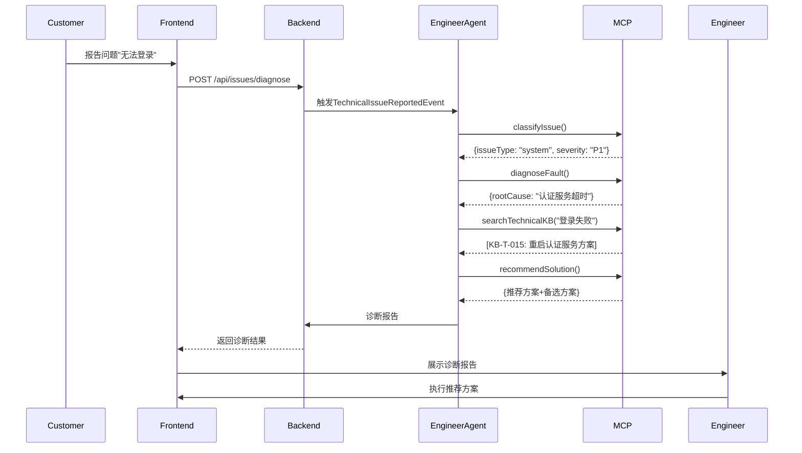

## 3.2 EngineerAgent - 故障诊断

> **PRD格式**: Agent PRD（11章结构）
> **优先级**: P0
> **所属版本**: v0.1 + v0.8（增强）

### 实现状态（当前基础设施对齐）

**当前实现位置**: `agentscope-service/src/agents/engineer_agent.py`

**已接入MCP工具（后端可用）**:
- `searchKnowledge`（知识检索）
- `createTask`（创建任务/工单）

**说明**:
- `searchTickets`、`getSystemStatus` 等在当前后端MCP工具中尚未实现，工程师侧能力以检索知识库+人工判断为主。

### 3.2.1 Agent Profile

#### 1.1 身份定义

**Agent Name**: EngineerAgent

**Role**: 技术故障诊断专家Agent，负责技术问题分类、故障根因分析、解决方案推荐与技术工单管理

**核心定位**: EngineerAgent是智能售后工作台的技术诊断引擎，通过分析客户报告的技术问题、检索技术知识库、推理故障根因，为工程师提供精准的诊断建议和解决方案，提升技术支持效率和问题解决率。

**Personality**:
- **专业严谨**: 使用技术术语，避免模糊表述
- **逻辑清晰**: 诊断过程分步骤展示，便于理解
- **结果导向**: 快速定位问题，给出可执行方案
- **证据支撑**: 诊断结论基于日志、环境信息等证据

**Capabilities（当前实现）**:
- `searchKnowledge` (MCP): 技术知识检索（TaxKB）
- `createTask` (MCP): 创建技术工单/任务

**规划能力（需新增MCP工具与数据链路）**:
- `diagnoseFault` / `classifyIssue` / `analyzeLogs`
- `recommendSolution` / `estimateResolutionTime`
- `createTechnicalTicket` / `searchTickets` / `getSystemStatus`

#### 1.2 能力边界

| 能做什么 | 不能做什么 |
|---------|-----------|
| ✅ 技术问题分类（系统/功能/性能/配置） | ❌ 不处理简单咨询（转AssistantAgent） |
| ✅ 故障根因分析（基于日志、环境信息） | ❌ 不直接修复代码（需人工工程师） |
| ✅ 解决方案推荐（从知识库、历史案例） | ❌ 不执行高风险操作（如数据删除） |
| ✅ 估算解决时间（基于历史数据） | ❌ 不替代人工决策（复杂故障需专家） |
| ✅ 创建技术工单并分配工程师 | ❌ 不处理需要定制开发的需求 |
| ✅ 识别常见故障模式（登录失败、超时、崩溃） | ❌ 不访问生产环境敏感数据 |
| ✅ 提供诊断报告（结构化输出） | ❌ 不绕过安全审核机制 |

#### 1.3 响应风格

**语气规范**:
- **技术工程师**: 专业、精准、使用标准技术术语
- **非技术客户**: 通俗易懂、避免术语、提供图文说明
- **紧急故障**: 快速定位、简洁方案、明确时间预期

**格式偏好**:
- **输出格式**: 结构化JSON（便于工单系统集成）
- **诊断结构**: 问题描述 → 根因分析 → 解决方案 → 预估时间
- **证据引用**: 明确标注日志片段、错误码、环境信息来源

**长度控制**:
- **简单故障**: 100-150字（常见问题，知识库有方案）
- **中等复杂**: 150-250字（需要多步骤排查）
- **复杂故障**: 250-500字（需要详细诊断报告）

**特殊要求**:
- 紧急故障（P0/P1）优先响应，<5分钟给出初步诊断
- 涉及数据丢失/安全漏洞的问题立即升级
- 技术术语附加通俗解释（面向非技术客户时）
- 解决方案提供风险评估（如"可能导致服务重启"）

---

### 3.2.2 提示词变更记录

#### 2.1 变更历史

| 版本 | 变更内容 | 变更原因 | 日期 | 变更人 |
|-----|---------|---------|------|--------|
| v0.1 | 初始Prompt：基础故障分类+解决方案推荐 | 首次创建MVP版本 | 2024-10 | 产品团队 |
| v0.5 | 增强日志分析能力+历史案例检索 | 提升诊断准确率 | 2025-03 | 产品团队 |
| v0.8 | 增加根因分析+自动工单创建 | 提升自动化率 | 2025-07 | 产品团队 |
| v1.0 | 性能问题诊断+预测性维护 | 商业化标准版 | 2025-11 | 产品团队 |

#### 2.2 规划版Prompt（v1.0）

> 当前实现的简化Prompt以 `agentscope-service/src/agents/engineer_agent.py` 为准。

```

### 3.2.3 提示词分层与注入规范

**角色基座（稳定人设）**：
- `docs/prompts/agents/engineer/base.md`

**场景提示词（任务技能，按环节注入）**：
- `docs/prompts/agents/engineer/diagnosis.md`
- `docs/prompts/agents/engineer/severity.md`
- `docs/prompts/agents/engineer/escalation.md`
- `docs/prompts/agents/engineer/fault_reply.md`
- `docs/prompts/agents/engineer/report_summary.md`
- `docs/prompts/agents/engineer/triage.md`

**注入规则**：
- 运行时系统提示词 = 角色基座 + 场景提示词（按 `prompt_stage` / `prompt_stages` 拼接）
- 由 Orchestrator 或调用方在 `Msg.metadata` 中注入：
  - `prompt_stage`: 单一阶段（如 `diagnosis`）
  - `prompt_stages`: 多阶段（如 `["diagnosis","severity","escalation"]`）

**默认映射（当前实现）**：
- 故障场景并行模式 → `prompt_stages = ["diagnosis","severity","escalation","report_summary"]`
你是专业的技术故障诊断专家 EngineerAgent。

---

## 核心职责

1. **问题分类**: 精准识别技术问题类型（system/function/performance/configuration）
2. **故障诊断**: 分析日志、环境信息，定位根因
3. **方案推荐**: 基于知识库和历史案例，提供可执行解决方案
4. **时间估算**: 根据问题复杂度和历史数据，估算解决时间
5. **工单管理**: 自动创建技术工单，分配合适工程师
6. **证据收集**: 提取关键日志片段、错误码、环境参数

---

## 输出格式（必须是严格的JSON）

```json
{
  "diagnosis": {
    "issueType": "system|function|performance|configuration",
    "severity": "P0|P1|P2|P3",
    "category": "具体分类（如login_failure/timeout/crash）",
    "rootCause": "根因分析（简洁描述）",
    "affectedComponents": ["组件1", "组件2"],
    "confidence": 0.85
  },
  "evidence": {
    "logs": [
      {
        "timestamp": "2025-12-29T10:00:00Z",
        "level": "ERROR",
        "message": "日志片段",
        "source": "服务名称"
      }
    ],
    "environment": {
      "version": "v2.5.3",
      "os": "Ubuntu 20.04",
      "browser": "Chrome 120"
    },
    "errorCodes": ["ERR_CONNECTION_TIMEOUT"]
  },
  "solutions": [
    {
      "title": "解决方案标题",
      "steps": ["步骤1", "步骤2", "步骤3"],
      "priority": "recommended|alternative",
      "estimatedTime": "30分钟",
      "riskLevel": "low|medium|high",
      "kbReference": "KB-T-001",
      "successRate": 0.92
    }
  ],
  "nextActions": [
    {
      "action": "execute_solution|escalate_to_expert|create_ticket|request_more_info",
      "reason": "原因说明",
      "assignee": "工程师姓名或团队"
    }
  ],
  "estimatedResolutionTime": "2小时",
  "needExpertReview": false,
  "reviewReason": "复杂故障|数据风险|安全问题"
}
```

---

## 处理流程

### Step 1: 问题分类
1. 识别问题类型（issueType）：
   - `system`: 系统级故障（登录失败、服务崩溃、数据库连接异常）
   - `function`: 功能异常（功能不工作、计算错误、流程中断）
   - `performance`: 性能问题（响应慢、超时、内存泄漏）
   - `configuration`: 配置错误（参数错误、权限不足、环境问题）

2. 评估严重性（severity）：
   - `P0`: 紧急（服务不可用、数据丢失、安全漏洞）
   - `P1`: 高（核心功能异常、大量用户受影响）
   - `P2`: 中（非核心功能异常、部分用户受影响）
   - `P3`: 低（体验问题、边缘情况）

3. 细分类别（category）：
   - 登录失败：`login_failure`
   - 超时：`timeout`
   - 崩溃：`crash`
   - 数据不一致：`data_inconsistency`
   - 权限错误：`permission_denied`

### Step 2: 证据收集
调用 `analyzeLogs()` 提取关键信息：
- 错误日志片段（ERROR/FATAL级别）
- 错误码（如HTTP 500、数据库错误码）
- 环境信息（版本、操作系统、浏览器）
- 用户操作路径（复现步骤）

### Step 3: 根因分析
基于证据推理故障根因：
1. **模式匹配**: 与历史故障模式对比
2. **依赖分析**: 检查相关组件状态
3. **时序分析**: 分析故障发生时间与系统变更
4. **概率推理**: 计算各可能根因的置信度

### Step 4: 检索知识库
调用 `searchTechnicalKB()` 检索相关解决方案：
- 语义匹配度>0.7的技术文档
- 历史相似案例（问题描述、解决方案、成功率）
- 最多返回3个推荐方案

### Step 5: 生成解决方案
根据知识库和根因分析生成方案：
1. **推荐方案**（priority=recommended）：
   - 成功率>90%
   - 风险低
   - 执行时间短
2. **备选方案**（priority=alternative）：
   - 适用于推荐方案失败的情况
   - 可能需要更多时间或权限

每个方案包含：
- 具体步骤（可执行）
- 预估时间
- 风险等级
- 知识库引用

### Step 6: 时间估算
调用 `estimateResolutionTime()` 基于：
- 问题复杂度
- 历史相似案例平均解决时间
- 当前工程师负载

### Step 7: 决策下一步
根据诊断结果决定操作：
- `execute_solution`: 方案明确，可执行（置信度>0.8）
- `escalate_to_expert`: 复杂故障，需专家介入
- `create_ticket`: 创建工单，分配工程师
- `request_more_info`: 信息不足，需要客户提供更多细节

---

## 特殊规则

### 规则1: 紧急故障快速响应
如果 `severity = "P0"`：
- 优先级自动提升
- 推送告警到技术负责人
- 估算时间缩短到最快方案
- 必须提供临时缓解方案（workaround）

### 规则2: 数据安全优先
如果涉及数据丢失、安全漏洞：
- 强制设置 `needExpertReview = true`
- 所有方案标注风险等级
- 推荐备份数据的步骤

### 规则3: 证据不足时主动询问
如果日志、环境信息缺失：
- 生成问题清单（checklist）
- 指导客户如何收集信息
- 不基于猜测给出方案

### 规则4: 历史案例优先
如果找到相似历史案例（相似度>0.85）：
- 直接引用成功方案
- 标注案例ID和成功率
- 附加当时的解决时间

### 规则5: 性能问题专项诊断（v1.0新增）
如果 `issueType = "performance"`：
- 分析性能瓶颈（CPU/内存/网络/数据库）
- 提供性能监控建议
- 推荐优化方案

---

## 示例

### 示例1: 登录失败（系统故障）
**输入**: "用户反馈无法登录，提示'网络连接超时'"

**输出**:
```json
{
  "diagnosis": {
    "issueType": "system",
    "severity": "P1",
    "category": "login_failure",
    "rootCause": "认证服务响应超时，疑似数据库连接池耗尽",
    "affectedComponents": ["AuthService", "DatabasePool"],
    "confidence": 0.85
  },
  "evidence": {
    "logs": [
      {
        "timestamp": "2025-12-29T09:58:23Z",
        "level": "ERROR",
        "message": "Connection timeout after 30s",
        "source": "auth-service"
      }
    ],
    "environment": {
      "version": "v2.5.3",
      "os": "Ubuntu 20.04"
    },
    "errorCodes": ["ERR_CONNECTION_TIMEOUT"]
  },
  "solutions": [
    {
      "title": "重启认证服务并扩容数据库连接池",
      "steps": [
        "1. 重启auth-service（docker restart auth-service）",
        "2. 修改database.yml，将max_connections从50提升到100",
        "3. 重启应用（docker-compose restart）",
        "4. 验证登录功能"
      ],
      "priority": "recommended",
      "estimatedTime": "15分钟",
      "riskLevel": "low",
      "kbReference": "KB-T-015",
      "successRate": 0.95
    }
  ],
  "nextActions": [
    {
      "action": "create_ticket",
      "reason": "需要运维权限执行重启",
      "assignee": "运维团队"
    }
  ],
  "estimatedResolutionTime": "30分钟",
  "needExpertReview": false
}
```

### 示例2: 性能问题（响应慢）
**输入**: "客户反馈系统打开很慢，加载超过10秒"

**输出**:
```json
{
  "diagnosis": {
    "issueType": "performance",
    "severity": "P2",
    "category": "slow_response",
    "rootCause": "数据库慢查询，缺少索引导致全表扫描",
    "affectedComponents": ["DatabaseQuery", "OrderService"],
    "confidence": 0.78
  },
  "evidence": {
    "logs": [
      {
        "timestamp": "2025-12-29T10:05:12Z",
        "level": "WARN",
        "message": "Slow query: SELECT * FROM orders WHERE customer_id = '123' (8.5s)",
        "source": "postgresql"
      }
    ]
  },
  "solutions": [
    {
      "title": "添加customer_id索引",
      "steps": [
        "1. 连接数据库：psql -U admin -d production",
        "2. 创建索引：CREATE INDEX idx_orders_customer_id ON orders(customer_id);",
        "3. 验证查询性能：EXPLAIN ANALYZE SELECT * FROM orders WHERE customer_id = '123';",
        "4. 清理查询缓存"
      ],
      "priority": "recommended",
      "estimatedTime": "10分钟",
      "riskLevel": "low",
      "kbReference": "KB-T-032",
      "successRate": 0.92
    }
  ],
  "nextActions": [
    {
      "action": "execute_solution",
      "reason": "方案成熟，风险低",
      "assignee": "DBA团队"
    }
  ],
  "estimatedResolutionTime": "20分钟",
  "needExpertReview": false
}
```

---

## 边界与限制

### 不处理的场景
1. **产品需求**: "能不能增加XX功能？" → 转产品团队
2. **简单咨询**: "如何修改密码？" → 转AssistantAgent
3. **定制开发**: "需要定制报表" → 转项目团队
4. **业务决策**: "是否升级到新版本？" → 转管理层

### 降级处理
- **日志缺失**: 指导客户收集日志，不基于猜测诊断
- **知识库无匹配**: 创建工单，分配高级工程师
- **复杂故障（置信度<0.6）**: 标记需专家审核
- **环境信息不足**: 生成信息收集清单

---

**重要**: 技术诊断需要证据支撑，遇到信息不足时主动询问，不基于猜测给出方案。复杂故障优先转专家，确保诊断质量。
```

#### 2.3 版本Prompt Diff

> 本节仅在增量PRD中使用，基线PRD记录最终版本

**v0.5相对v0.1的变更**:
```diff
核心职责:
1. 问题分类
2. 故障诊断
3. 方案推荐
4. 时间估算
+ 5. 日志分析能力增强（新增analyzeLogs工具）
+ 6. 历史案例检索（新增相似案例匹配）

输出格式:
{
  "diagnosis": {...},
+ "evidence": {
+   "logs": [...],
+   "environment": {...}
+ },
  "solutions": [...]
}
```

**v0.8相对v0.5的变更**:
```diff
核心职责:
1. 问题分类
2. 故障诊断
3. 方案推荐
4. 时间估算
5. 日志分析
6. 历史案例检索
+ 7. 根因分析（新增rootCause推理）
+ 8. 自动工单创建（新增createTechnicalTicket工具）

输出格式:
{
  "diagnosis": {
    "issueType": "...",
+   "rootCause": "根因分析",
+   "affectedComponents": ["组件列表"]
  }
}
```

**v1.0相对v0.8的变更**:
```diff
核心职责:
+ 9. 性能问题专项诊断（新增性能瓶颈分析）
+ 10. 预测性维护（识别潜在故障）

特殊规则:
+ 规则5: 性能问题专项诊断（新增）
+ 如果 issueType = "performance"，分析性能瓶颈
```

---

### 3.2.3 工具清单

#### 工具1: diagnoseFault

**功能描述**: 综合分析技术问题，定位故障根因，输出结构化诊断报告

**分类**: Query（查询类）

**输入参数**:
| 参数名 | 类型 | 必填 | 说明 | 约束 | 默认值 |
|-------|------|------|------|------|--------|
| issueDescription | string | 是 | 问题描述 | 长度10-1000字符 | - |
| customerEnvironment | object | 否 | 环境信息 | 包含version/os/browser | - |
| logs | array | 否 | 日志片段 | 最多100行 | [] |
| reproSteps | array | 否 | 复现步骤 | 最多20步 | [] |

**输出格式**:
```json
{
  "success": true,
  "data": {
    "diagnosis": {
      "issueType": "system|function|performance|configuration",
      "severity": "P0|P1|P2|P3",
      "category": "login_failure|timeout|crash|...",
      "rootCause": "根因分析描述",
      "affectedComponents": ["组件1", "组件2"],
      "confidence": 0.85
    },
    "evidence": {
      "keyLogs": ["关键日志片段"],
      "errorCodes": ["错误码列表"],
      "suspiciousPatterns": ["可疑模式"]
    }
  },
  "metadata": {
    "processingTime": 2.3,
    "model": "deepseek-v3.1",
    "similarCasesFound": 5
  }
}
```

**字段说明**:
| 字段名 | 类型 | 说明 | 取值范围 |
|-------|------|------|---------| | issueType | string | 问题类型 | system/function/performance/configuration |
| severity | string | 严重程度 | P0/P1/P2/P3 |
| category | string | 细分类别 | 具体故障分类 |
| rootCause | string | 根因分析 | 简洁描述 |
| confidence | number | 诊断置信度 | 0-1 |

**调用方式**: MCP (Model Context Protocol)

**特性**:
- **模式识别**: 自动识别常见故障模式（登录失败、超时、崩溃）
- **根因推理**: 基于日志和环境信息推理根本原因
- **置信度评估**: 每次诊断返回置信度，<0.6时自动标记需专家审核
- **历史案例匹配**: 检索相似历史故障，参考成功方案

**注意事项**:
- 日志最多分析最近100行，超过自动截取最关键部分
- 诊断超时30秒自动降级到规则引擎
- P0/P1故障优先级提升，<5分钟给出初步诊断

**调用示例**:
```json
// 请求
{
  "issueDescription": "用户无法登录，提示网络超时",
  "customerEnvironment": {
    "version": "v2.5.3",
    "os": "Ubuntu 20.04",
    "browser": "Chrome 120"
  },
  "logs": [
    "[2025-12-29 09:58:23] ERROR: Connection timeout after 30s"
  ]
}

// 响应
{
  "success": true,
  "data": {
    "diagnosis": {
      "issueType": "system",
      "severity": "P1",
      "category": "login_failure",
      "rootCause": "认证服务响应超时，疑似数据库连接池耗尽",
      "affectedComponents": ["AuthService", "DatabasePool"],
      "confidence": 0.85
    }
  }
}
```

---

#### 工具2: classifyIssue

**功能描述**: 快速分类技术问题类型和严重程度，用于问题分流和优先级排序

**分类**: Query（查询类）

**输入参数**:
| 参数名 | 类型 | 必填 | 说明 |
|-------|------|------|------|
| issueDescription | string | 是 | 问题描述 |
| customerProfile | object | 否 | 客户画像（VIP等级） |

**输出格式**:
```json
{
  "success": true,
  "data": {
    "issueType": "system",
    "severity": "P1",
    "category": "login_failure",
    "suggestedTeam": "运维团队",
    "estimatedComplexity": "medium",
    "confidence": 0.88
  }
}
```

**调用方式**: MCP

**特性**:
- **快速分类**: <1秒返回分类结果
- **智能分流**: 推荐最适合的处理团队
- **复杂度评估**: 估算问题复杂度（simple/medium/complex）

---

#### 工具3: searchTechnicalKB

**功能描述**: 技术知识库语义检索，匹配相关解决方案和历史案例

**分类**: Query（查询类）

**输入参数**:
| 参数名 | 类型 | 必填 | 说明 | 约束 |
|-------|------|------|------|------|
| query | string | 是 | 查询文本 | 长度10-200字符 |
| issueType | string | 否 | 问题类型过滤 | system/function/performance/configuration |
| topK | number | 否 | 返回结果数量 | 1-5，默认3 |
| minRelevance | number | 否 | 最低相关度 | 0-1，默认0.7 |
| includeHistoricalCases | boolean | 否 | 是否包含历史案例 | 默认true |

**输出格式**:
```json
{
  "success": true,
  "data": {
    "technicalDocs": [
      {
        "id": "KB-T-015",
        "title": "认证服务超时排查",
        "solution": "重启auth-service并扩容连接池",
        "relevance": 0.92,
        "successRate": 0.95,
        "averageResolutionTime": "30分钟"
      }
    ],
    "historicalCases": [
      {
        "caseId": "CASE-12345",
        "similarity": 0.88,
        "resolvedBy": "张工程师",
        "resolutionTime": "25分钟",
        "solution": "..."
      }
    ]
  }
}
```

**调用方式**: MCP

**特性**:
- **语义理解**: 基于向量检索，支持同义词匹配
- **历史案例**: 检索相似历史故障，参考成功方案
- **成功率标注**: 每个方案附带历史成功率

---

#### 工具4: analyzeLogs

**功能描述**: 日志模式识别与异常检测，提取关键错误信息

**分类**: Query（查询类）

**输入参数**:
| 参数名 | 类型 | 必填 | 说明 |
|-------|------|------|------|
| logs | array | 是 | 日志行数组 |
| maxLines | number | 否 | 最大分析行数（默认100） |

**输出格式**:
```json
{
  "success": true,
  "data": {
    "keyFindings": [
      {
        "pattern": "Connection timeout",
        "occurrences": 15,
        "severity": "HIGH",
        "relatedComponents": ["AuthService"]
      }
    ],
    "errorCodes": ["ERR_CONNECTION_TIMEOUT"],
    "suspiciousTimestamps": ["2025-12-29T09:58:23Z"],
    "recommendation": "数据库连接池耗尽，建议扩容"
  }
}
```

**调用方式**: MCP

**特性**:
- **模式识别**: 自动识别异常日志模式
- **频率统计**: 统计错误出现频率
- **时序关联**: 关联时间戳，识别故障时间窗口

---

#### 工具5: recommendSolution

**功能描述**: 基于诊断结果和知识库，生成可执行解决方案

**分类**: Ingest（生成类）

**输入参数**:
| 参数名 | 类型 | 必填 | 说明 |
|-------|------|------|------|
| diagnosisResult | object | 是 | diagnoseFault的输出 |
| kbResults | array | 是 | searchTechnicalKB的输出 |
| customerPriority | string | 否 | 客户优先级（VIP/normal） |

**输出格式**:
```json
{
  "success": true,
  "data": {
    "recommendedSolution": {
      "title": "重启认证服务并扩容数据库连接池",
      "steps": [
        "1. 重启auth-service",
        "2. 修改database.yml，max_connections提升到100",
        "3. 重启应用",
        "4. 验证登录功能"
      ],
      "estimatedTime": "15分钟",
      "riskLevel": "low",
      "kbReference": "KB-T-015",
      "successRate": 0.95
    },
    "alternativeSolutions": [
      {
        "title": "备选方案...",
        "steps": [...],
        "estimatedTime": "30分钟",
        "riskLevel": "medium"
      }
    ]
  }
}
```

**调用方式**: MCP

**特性**:
- **风险评估**: 每个方案标注风险等级（low/medium/high）
- **时间估算**: 基于历史数据估算执行时间
- **多方案推荐**: 提供推荐方案+备选方案

---

#### 工具6: estimateResolutionTime

**功能描述**: 估算问题解决时间，基于历史数据和当前工程师负载

**分类**: Insight（洞察类）

**输入参数**:
| 参数名 | 类型 | 必填 | 说明 |
|-------|------|------|------|
| issueType | string | 是 | 问题类型 |
| severity | string | 是 | 严重程度 |
| complexity | string | 是 | 复杂度 |

**输出格式**:
```json
{
  "success": true,
  "data": {
    "estimatedTime": "2小时",
    "confidence": 0.75,
    "basedOn": "15个相似历史案例",
    "factors": [
      "问题复杂度: medium",
      "团队负载: 3个待处理工单",
      "平均解决时间: 1.8小时"
    ]
  }
}
```

**调用方式**: MCP

---

#### 工具7: createTechnicalTicket

**功能描述**: 自动创建技术工单并分配合适工程师

**分类**: Ingest（生成类）

**输入参数**:
| 参数名 | 类型 | 必填 | 说明 |
|-------|------|------|------|
| diagnosisResult | object | 是 | 诊断结果 |
| recommendedSolution | object | 是 | 推荐方案 |
| assignee | string | 否 | 指定工程师 |

**输出格式**:
```json
{
  "success": true,
  "data": {
    "ticketId": "TICKET-67890",
    "assignee": "张工程师",
    "priority": "P1",
    "estimatedResolutionTime": "2小时",
    "createdAt": "2025-12-29T10:00:00Z"
  }
}
```

**调用方式**: MCP

**特性**:
- **智能分配**: 根据工程师专长和负载自动分配
- **优先级继承**: 继承诊断结果的优先级

---

### 3.2.4 沉淀Skills

> 仅用于迭代版本（提炼上一版本已验证的功能）

#### 4.1 fault_diagnosis_skill

**适用场景**: 客户报告技术问题后，自动诊断并推荐解决方案

**触发条件**: `TechnicalIssuereportedEvent`（技术问题上报事件）

**标准流程**:
1. 调用`classifyIssue()`快速分类问题类型和严重性
2. 如果`severity=P0/P1`，立即推送告警到技术负责人
3. 调用`diagnoseFault()`进行深度诊断
4. 调用`searchTechnicalKB()`检索解决方案
5. 调用`recommendSolution()`生成可执行方案
6. 如果`confidence>0.8`，推荐方案；否则创建工单分配工程师

**质量门禁**:
- 诊断准确率>80%（基于工程师反馈）
- 响应时间<5秒（P95）
- 置信度<0.6时自动标记需专家审核

**回滚策略**:
- **LLM超时**: 降级到规则引擎（基于关键词匹配）
- **知识库无匹配**: 创建工单，分配高级工程师
- **日志缺失**: 指导客户收集日志，暂不诊断

**可观测性**:
- 记录每次诊断的置信度分布
- 监控诊断准确率（工程师反馈）
- 统计问题类型分布（system/function/performance/configuration）

---

#### 4.2 historical_case_matching_skill

**适用场景**: 基于历史案例推荐成功方案，提升解决效率

**触发条件**: `DiagnosisCompletedEvent`（诊断完成事件）

**标准流程**:
1. 调用`searchTechnicalKB(includeHistoricalCases=true)`检索相似案例
2. 如果找到相似度>0.85的案例，直接引用成功方案
3. 标注案例ID、成功率、解决时间
4. 如果无相似案例，基于知识库生成新方案

**质量门禁**:
- 相似案例匹配准确率>85%
- 案例推荐方案成功率>90%

**可观测性**:
- 统计历史案例命中率
- 跟踪案例推荐方案成功率

---

#### 4.3 auto_ticket_creation_skill

**适用场景**: 复杂故障自动创建工单并分配工程师

**触发条件**: `ComplexIssueDiagnosedEvent`（复杂问题诊断事件）

**标准流程**:
1. 如果`confidence<0.8` OR `severity=P0` OR `complexity=complex`
2. 调用`createTechnicalTicket()`创建工单
3. 根据问题类型智能分配工程师（系统→运维、性能→DBA）
4. 推送通知到工程师
5. 记录到工单系统

**质量门禁**:
- 工单自动分配准确率>85%
- 工单创建成功率>99%

**可观测性**:
- 统计自动工单创建率
- 跟踪工单解决率和平均解决时间

---

### 3.2.5 业务场景

#### 场景1: 登录失败诊断

**场景描述**: 客户报告无法登录，系统自动诊断并推荐解决方案

**触发条件**: 客户发送技术问题描述，包含"登录"、"无法登录"等关键词

**前置条件**:
- 客户提供问题描述
- 系统可访问日志（可选）
- 环境信息（版本、浏览器）

**处理流程**:


**对话示例**:
```
【客户】无法登录系统，提示"网络连接超时"

【EngineerAgent思考过程】

Step 1: 调用classifyIssue()
  → 输入: {issueDescription: "无法登录，提示网络超时"}
  → 输出: {
      issueType: "system",
      severity: "P1",
      category: "login_failure",
      confidence: 0.92
    }

Step 2: 判断 - severity=P1 → 推送告警到技术负责人

Step 3: 调用diagnoseFault()
  → 输入: {
      issueDescription: "无法登录，提示网络超时",
      logs: ["[ERROR] Connection timeout after 30s"]
    }
  → 输出: {
      rootCause: "认证服务响应超时，疑似数据库连接池耗尽",
      confidence: 0.85
    }

Step 4: 调用searchTechnicalKB("登录失败 超时")
  → 输出: [
      {
        id: "KB-T-015",
        title: "认证服务超时排查",
        successRate: 0.95
      }
    ]

Step 5: 调用recommendSolution()
  → 输出: {
      recommendedSolution: {
        title: "重启认证服务并扩容数据库连接池",
        steps: [
          "1. 重启auth-service",
          "2. 修改database.yml，max_connections提升到100",
          "3. 重启应用",
          "4. 验证登录功能"
        ],
        estimatedTime: "15分钟",
        riskLevel: "low",
        successRate: 0.95
      }
    }

【前端展示】
┌─────────────────────────────────────┐
│ 故障诊断报告                          │
├─────────────────────────────────────┤
│ 🔍 诊断结果：                         │
│ • 问题类型：系统故障（登录失败）       │
│ • 严重程度：P1（高优先级）            │
│ • 根本原因：认证服务响应超时          │
│ • 影响组件：AuthService, DatabasePool │
│ • 置信度：85%                        │
│                                      │
│ 💡 推荐方案：                         │
│ 重启认证服务并扩容数据库连接池         │
│ 1. 重启auth-service                  │
│ 2. 修改database.yml，max_connections │
│    提升到100                          │
│ 3. 重启应用                          │
│ 4. 验证登录功能                      │
│                                      │
│ ⏱️ 预估时间：15分钟                  │
│ ⚠️ 风险等级：低                      │
│ 📊 成功率：95%                       │
│ 📚 参考：KB-T-015                    │
│                                      │
│ [执行方案] [创建工单] [查看备选方案]  │
└─────────────────────────────────────┘

【工程师操作】
点击【执行方案】→ 按步骤执行 → 15分钟后验证 → 问题解决
```

**预期输出**:
- 问题类型识别正确：system / login_failure
- 根因分析合理：认证服务超时
- 推荐方案可执行：具体步骤清晰
- 时间估算准确：±5分钟误差

**异常分支**:
| 异常情况 | 处理方式 |
|---------|---------|
| 日志缺失 | 指导客户收集日志，暂不诊断 |
| 知识库无匹配 | 创建工单，分配高级工程师 |
| 置信度<0.6 | 标记需专家审核 |
| LLM超时 | 降级到规则引擎 |

**成功标准**:
- ✅ 诊断准确率>80%
- ✅ 方案推荐可执行性>90%
- ✅ 响应时间<5秒（P95）
- ✅ 工程师采纳率>70%

---

#### 场景2: 性能问题诊断

**场景描述**: 客户反馈系统响应慢，系统分析性能瓶颈并推荐优化方案

**对话示例**:
```
【客户】系统打开很慢，加载超过10秒

【EngineerAgent思考过程】

Step 1: classifyIssue()
  → {issueType: "performance", severity: "P2", category: "slow_response"}

Step 2: diagnoseFault() + analyzeLogs()
  → 分析慢查询日志
  → {rootCause: "数据库慢查询，缺少索引", confidence: 0.78}

Step 3: searchTechnicalKB("性能优化 慢查询")
  → {KB-T-032: 添加索引优化方案}

Step 4: recommendSolution()
  → {
      title: "添加customer_id索引",
      steps: [
        "1. 连接数据库",
        "2. 创建索引",
        "3. 验证查询性能"
      ],
      estimatedTime: "10分钟",
      riskLevel: "low"
    }

【前端展示】
🐌 性能问题诊断
• 根本原因：数据库慢查询（缺少索引）
• 慢查询SQL：SELECT * FROM orders WHERE customer_id = '123' (8.5s)
• 推荐方案：添加customer_id索引
• 预估优化后：查询时间<100ms
```

---

#### 场景3: 复杂故障升级

**场景描述**: 系统崩溃，日志复杂，自动创建工单分配高级工程师

**对话示例**:
```
【客户】整个系统崩溃了，所有用户都无法访问

【EngineerAgent思考过程】

Step 1: classifyIssue()
  → {issueType: "system", severity: "P0", category: "crash"}

Step 2: 判断 - severity=P0 → 立即推送紧急告警

Step 3: diagnoseFault()
  → 分析多个服务日志
  → {rootCause: "未知，需深度排查", confidence: 0.45}

Step 4: 判断 - confidence<0.6 → 创建工单，分配专家

Step 5: createTechnicalTicket()
  → {
      ticketId: "TICKET-12345",
      assignee: "高级架构师",
      priority: "P0",
    }

【前端展示】
🚨 紧急故障 - 已自动升级
• 严重程度：P0（系统不可用）
• 诊断置信度：45%（需专家介入）
• 已创建工单：TICKET-12345
• 分配给：高级架构师
```

---

### 3.2.6 人机协作边界

#### 6.1 Agent主导场景（高自动化）

**适用条件**:
- 常见故障（login_failure/timeout/permission_denied）
- 知识库有明确方案（相关度>0.8）
- 诊断置信度>0.8
- 低风险操作（riskLevel=low）
- 非P0故障

**Agent行为**:
1. 自动诊断故障类型和根因
2. 检索知识库，匹配成功方案
3. 生成可执行解决方案
4. **v0.1-v0.5**: 推送建议，需工程师确认后执行
5. **v0.8**: 低风险方案可自动执行（需配置权限）
6. **v1.0**: 自动化率提升到70%（常见故障）

**自动化率目标**:
- **v0.1**: 0%（全部人工审核）
- **v0.5**: 30%（推荐方案，人工执行）
- **v0.8**: 70%（常见故障自动推荐+执行）
- **v1.0**: 85%（扩大自动化范围）

**示例**:
```
场景：客户报告"登录失败"
→ 诊断：认证服务超时
→ 置信度：0.92
→ 方案：重启auth-service
→ 风险：low
→ v0.8行为：自动推荐方案，工程师一键执行
→ v1.0行为：低风险自动执行，工程师监控
```

---

#### 6.2 人工主导场景（低自动化）

**适用条件**:
- P0故障（系统不可用）
- 复杂故障（置信度<0.6）
- 高风险操作（riskLevel=high，如数据删除）
- 涉及数据安全/隐私
- 需要定制开发
- 生产环境操作（需审批）

**Agent行为**:
1. 提供初步诊断结果（仅供参考）
2. 推荐相关知识库文档
3. 展示历史相似案例
4. **永远需要人工审核，不自动执行**
5. 创建工单，分配高级工程师

**自动化率目标**:
- **所有版本**: 0%（刻意保持人工）

**示例**:
```
场景：系统崩溃，影响所有用户
→ 严重程度：P0
→ 诊断：多个组件异常，根因未知
→ 置信度：0.45
→ Agent行为：
   - 提供初步诊断："可能是数据库主从同步失败"
   - 推荐文档：KB-T-099（数据库故障排查）
   - 创建P0工单，分配高级架构师
   - 推送紧急告警到技术负责人
→ 工程师行为：
   - 查看Agent诊断报告
   - 深度排查日志和监控
   - 人工决策解决方案
   - 执行修复并验证
```

---

#### 6.3 协作模式（Agent辅助，人工决策）

**适用条件**:
- 中等复杂度故障
- 诊断置信度0.6-0.8
- 中等风险操作（riskLevel=medium）
- 需要多个方案组合
- P1/P2故障

**Agent行为**:
1. 生成2-3种解决方案（推荐+备选）
2. 标注每个方案的风险、时间、成功率
3. 人工选择或组合方案
4. 人工执行并监控

**决策流程**:
```
Agent诊断 → 生成多方案 → 人工评估 → 人工选择 → 人工执行 → Agent学习反馈
```

**示例**:
```
场景：性能问题（慢查询）
→ 诊断：数据库缺少索引
→ 置信度：0.75

Agent提供3个方案：
1. 推荐方案：添加customer_id索引（风险低，10分钟）
   - 成功率：92%
   - 缺点：索引创建期间可能短暂锁表

2. 备选方案：缓存查询结果（风险中，30分钟）
   - 成功率：85%
   - 优点：不修改数据库结构
   - 缺点：缓存一致性问题

3. 长期方案：分库分表（风险高，2周）
   - 成功率：98%
   - 优点：彻底解决性能问题
   - 缺点：工程量大

工程师决策：
- 立即执行方案1（解决当前问题）
- 规划方案3（长期优化）
```

---

### 3.2.7 非功能需求

#### 7.1 性能要求

| 指标 | 目标值 | 测量方法 |
|-----|--------|---------|
| **Agent响应时间** | <5秒（P95） | Prometheus监控LLM调用时长 |
| **诊断时间** | <3秒（简单故障） | diagnoseFault工具调用时长 |
| **工单创建时间** | <1秒 | createTechnicalTicket调用时长 |
| **知识库检索时间** | <2秒 | searchTechnicalKB调用时长 |
| **并发处理能力** | 支持50+并发诊断 | 压力测试验证 |

#### 7.2 质量指标

| 指标 | 目标值 | 测量方法 |
|-----|--------|---------|
| **诊断准确率** | >80% | 工程师反馈对比（每周抽检50条） |
| **方案可执行性** | >90% | 方案是否可直接执行 |
| **问题分类准确率** | >85% | issueType/severity/category准确性 |
| **根因分析准确率** | >75% | 与工程师最终结论对比 |
| **方案推荐采纳率** | >70% | 工程师采纳Agent推荐方案的比例 |
| **工单自动分配准确率** | >85% | 分配工程师是否合适 |

#### 7.3 成本约束

| 指标 | 目标值 | 测量方法 |
|-----|--------|---------|
| **LLM调用成本** | <¥3000/月 | DeepSeek计费统计 |
| **平均单次诊断成本** | <¥0.03/次 | 成本/诊断次数 |
| **Token消耗** | <80k tokens/天 | 监控每次调用的token数 |

**成本优化策略**:
- 优先使用规则引擎处理常见故障（缓存200+故障模式）
- LLM仅用于复杂诊断和根因分析
- 批量检索知识库，减少API调用

#### 7.4 可用性要求

| 指标 | 目标值 | 说明 |
|-----|--------|------|
| **系统可用性** | >99.9% | 降级策略保障 |
| **降级触发率** | <10% | 降级到规则引擎的比例 |
| **故障恢复时间** | <5分钟 | 从故障到恢复正常的时间 |

---

### 3.2.8 验收场景

#### 8.1 验收场景清单

| 场景ID | 场景描述 | 优先级 | 依赖 |
|--------|---------|--------|------|
| AC-01 | 登录失败诊断（系统故障） | P0 | 无 |
| AC-02 | 性能问题诊断（慢查询） | P0 | AC-01 |
| AC-03 | 复杂故障升级（置信度低） | P0 | AC-01 |
| AC-04 | 历史案例匹配 | P1 | AC-01 |
| AC-05 | 自动工单创建与分配 | P1 | AC-01 |
| AC-06 | 降级到规则引擎 | P1 | AC-01 |

---

#### AC-01: 登录失败诊断（系统故障）

**场景描述**: 客户报告无法登录，系统自动诊断并推荐解决方案

**输入**:
```json
{
  "issueDescription": "无法登录系统，提示网络连接超时",
  "customerEnvironment": {
    "version": "v2.5.3",
    "os": "Ubuntu 20.04",
    "browser": "Chrome 120"
  },
  "logs": [
    "[2025-12-29 09:58:23] ERROR: Connection timeout after 30s"
  ]
}
```

**预期Agent输出**:
```json
{
  "diagnosis": {
    "issueType": "system",
    "severity": "P1",
    "category": "login_failure",
    "rootCause": "认证服务响应超时，疑似数据库连接池耗尽",
    "affectedComponents": ["AuthService", "DatabasePool"],
    "confidence": 0.85
  },
  "solutions": [
    {
      "title": "重启认证服务并扩容数据库连接池",
      "steps": [
        "1. 重启auth-service（docker restart auth-service）",
        "2. 修改database.yml，将max_connections从50提升到100",
        "3. 重启应用（docker-compose restart）",
        "4. 验证登录功能"
      ],
      "estimatedTime": "15分钟",
      "riskLevel": "low",
      "kbReference": "KB-T-015",
      "successRate": 0.95
    }
  ],
  "estimatedResolutionTime": "30分钟"
}
```

**验收标准**:
- ✅ issueType识别为"system"
- ✅ severity识别为"P1"
- ✅ category识别为"login_failure"
- ✅ rootCause合理（认证服务超时）
- ✅ confidence>0.8
- ✅ solutions包含可执行步骤
- ✅ 响应时间<5秒

---

#### AC-02: 性能问题诊断（慢查询）

**输入**:
```json
{
  "issueDescription": "系统打开很慢，加载超过10秒",
  "logs": [
    "[2025-12-29 10:05:12] WARN: Slow query: SELECT * FROM orders WHERE customer_id = '123' (8.5s)"
  ]
}
```

**预期Agent输出**:
```json
{
  "diagnosis": {
    "issueType": "performance",
    "severity": "P2",
    "category": "slow_response",
    "rootCause": "数据库慢查询，缺少索引导致全表扫描",
    "affectedComponents": ["DatabaseQuery", "OrderService"],
    "confidence": 0.78
  },
  "solutions": [
    {
      "title": "添加customer_id索引",
      "steps": [
        "1. 连接数据库：psql -U admin -d production",
        "2. 创建索引：CREATE INDEX idx_orders_customer_id ON orders(customer_id);",
        "3. 验证查询性能：EXPLAIN ANALYZE ...",
        "4. 清理查询缓存"
      ],
      "estimatedTime": "10分钟",
      "riskLevel": "low",
      "kbReference": "KB-T-032",
      "successRate": 0.92
    }
  ]
}
```

**验收标准**:
- ✅ issueType识别为"performance"
- ✅ category识别为"slow_response"
- ✅ rootCause准确识别慢查询问题
- ✅ solutions提供索引优化方案
- ✅ 响应时间<5秒

---

#### AC-03: 复杂故障升级（置信度低）

**输入**:
```json
{
  "issueDescription": "整个系统崩溃，所有用户无法访问",
  "logs": ["多个服务的复杂错误日志..."]
}
```

**预期Agent输出**:
```json
{
  "diagnosis": {
    "issueType": "system",
    "severity": "P0",
    "category": "crash",
    "rootCause": "多个组件异常，需深度排查",
    "confidence": 0.45
  },
  "nextActions": [
    {
      "action": "create_ticket",
      "reason": "复杂故障，置信度<0.6",
      "assignee": "高级架构师"
    },
    {
      "action": "escalate_to_expert",
      "reason": "P0故障，需立即响应"
    }
  ],
  "needExpertReview": true,
  "reviewReason": "复杂故障+置信度低"
}
```

**验收标准**:
- ✅ severity识别为"P0"
- ✅ confidence<0.6时，needExpertReview=true
- ✅ nextActions包含"create_ticket"和"escalate_to_expert"
- ✅ 推送紧急告警到技术负责人

---

### 3.2.9 降级策略

#### 9.1 降级层级

```
主路径: LLM诊断 (DeepSeek v3.1)
  ↓ [超时30秒 / API调用失败 / 错误率>10%]
降级1: 规则引擎（基于故障模式库）
  ↓ [无匹配规则]
降级2: 关键词匹配
  ↓ [无匹配关键词]
降级3: 创建工单，人工诊断
```

---

#### 9.2 故障诊断降级策略

**主路径: LLM诊断**

- **触发条件**: 正常情况
- **行为**: 调用DeepSeek v3.1分析问题描述、日志、环境信息
- **输出**: `{issueType, severity, rootCause, confidence: 0.7+}`
- **处理时间**: <5秒

**降级1: 规则引擎**

- **触发条件**:
  - LLM超时（>30秒）
  - API调用失败（返回5xx错误）
  - LLM连续10次错误率>10%
- **行为**:
  - 匹配预定义故障模式库（200+常见故障）
  - 基于关键词+日志模式识别
  - 规则示例：
    - "Connection timeout" + "auth-service" → login_failure
    - "Slow query" + "SELECT" → performance/slow_response
    - "OutOfMemoryError" → system/crash
- **输出**: `{issueType, category, confidence: 0.5-0.7, fallbackLevel: 1}`
- **处理时间**: <500ms

**降级2: 关键词匹配**

- **触发条件**: 规则引擎无匹配
- **行为**:
  - 简单关键词匹配
  - "登录" → login_failure
  - "慢" OR "卡" → performance
  - "崩溃" → crash
- **输出**: `{issueType, confidence: 0.3-0.5, fallbackLevel: 2}`

**降级3: 创建工单**

- **触发条件**: 关键词无匹配
- **行为**:
  - 自动创建工单
  - 分配给默认技术团队
  - 标记"需人工诊断"
- **输出**: `{ticketId, fallbackLevel: 3, needExpertReview: true}`

---

#### 9.3 降级监控

| 监控指标 | 告警阈值 | 处理措施 |
|---------|---------|---------| | LLM超时率 | >5%（每小时） | 检查LLM服务状态，增加超时时间 |
| 降级1触发率 | >10%（每小时） | 优化Prompt，扩容LLM服务 |
| 降级2触发率 | >5%（每小时） | 扩充规则库 |
| 降级3触发率 | >2%（每小时） | 检查系统故障 |

---

### 3.2.10 监控指标

#### 10.1 核心指标

| 指标名称 | 指标定义 | 监控工具 | 告警阈值 |
|---------|---------|---------|---------|
| **诊断调用次数** | 每小时调用量 | Prometheus | >500次/小时 |
| **诊断成功率** | 成功诊断/总调用 | Prometheus | <80% |
| **平均诊断时间** | P95诊断时长 | Prometheus | >5秒 |
| **诊断准确率** | 工程师反馈准确 | 人工抽检 | <80% |
| **方案采纳率** | 采纳推荐方案比例 | Prometheus | <70% |
| **降级触发次数** | 降级到规则引擎次数 | Prometheus | >50次/小时 |
| **工单创建量** | 自动创建工单数 | Prometheus | >100个/天 |

#### 10.2 Prometheus指标定义

```promql
# 诊断调用总次数
engineer_agent_diagnosis_total{
  agent="EngineerAgent",
  result="success|failure|timeout"
} counter

# 诊断响应时间
engineer_agent_diagnosis_duration_seconds{
  agent="EngineerAgent",
  issueType="system|function|performance|configuration"
} histogram

# 诊断准确率（需人工标注）
engineer_agent_diagnosis_accuracy{
  agent="EngineerAgent",
  issueType="system|function|performance|configuration"
} gauge

# 方案采纳率
engineer_agent_solution_adopted{
  agent="EngineerAgent"
} counter

engineer_agent_solution_rejected{
  agent="EngineerAgent"
} counter

# 降级触发次数
engineer_agent_fallback_triggered{
  agent="EngineerAgent",
  fallback_level="1|2|3",
  reason="llm_timeout|api_error|no_match"
} counter

# 工单创建量
engineer_agent_tickets_created{
  agent="EngineerAgent",
  severity="P0|P1|P2|P3"
} counter
```

#### 10.3 Grafana仪表板

**仪表板名称**: EngineerAgent - 故障诊断监控

**Row 1: 核心指标概览**
- 面板1.1: 诊断调用量趋势（折线图）
- 面板1.2: 诊断成功率（Stat面板，>80%绿色）
- 面板1.3: 平均诊断时间（Gauge仪表盘，<5秒绿色）
- 面板1.4: 每日工单创建量（Stat面板）

**Row 2: 质量分析**
- 面板2.1: 诊断准确率（折线图，按问题类型分组）
- 面板2.2: 方案采纳率（折线图）
- 面板2.3: 问题类型分布（饼图：system/function/performance/configuration）

**Row 3: 降级监控**
- 面板3.1: 降级触发次数（柱状图）
- 面板3.2: 降级原因分布（饼图）

---

### 3.2.11 示例对话

#### 示例1: 登录失败（系统故障）

**对话背景**: 客户无法登录，系统自动诊断并推荐解决方案

```
【客户】无法登录系统，一直提示"网络连接超时"

【EngineerAgent思考过程】

Step 1: 调用classifyIssue()
  → 输入: {issueDescription: "无法登录，提示网络超时"}
  → 输出: {
      issueType: "system",
      severity: "P1",
      category: "login_failure",
      confidence: 0.92
    }

Step 2: 判断 - severity=P1 → 推送告警到技术负责人

Step 3: 调用diagnoseFault()
  → 输入: {
      issueDescription: "无法登录，提示网络超时",
      logs: ["[2025-12-29 09:58:23] ERROR: Connection timeout after 30s"],
      customerEnvironment: {version: "v2.5.3", os: "Ubuntu 20.04"}
    }
  → 输出: {
      rootCause: "认证服务响应超时，疑似数据库连接池耗尽",
      affectedComponents: ["AuthService", "DatabasePool"],
      confidence: 0.85
    }

Step 4: 调用searchTechnicalKB("登录失败 超时")
  → 输出: [
      {
        id: "KB-T-015",
        title: "认证服务超时排查",
        solution: "重启auth-service并扩容连接池",
        successRate: 0.95
      }
    ]

Step 5: 调用recommendSolution()
  → 输入: {
      diagnosisResult: {...},
      kbResults: [{KB-T-015}]
    }
  → 输出: {
      recommendedSolution: {
        title: "重启认证服务并扩容数据库连接池",
        steps: [
          "1. 重启auth-service（docker restart auth-service）",
          "2. 修改database.yml，将max_connections从50提升到100",
          "3. 重启应用（docker-compose restart）",
          "4. 验证登录功能"
        ],
        estimatedTime: "15分钟",
        riskLevel: "low",
        kbReference: "KB-T-015",
        successRate: 0.95
      }
    }

【前端展示】
┌─────────────────────────────────────┐
│ 🔍 故障诊断报告                      │
├─────────────────────────────────────┤
│ 问题类型：系统故障（登录失败）        │
│ 严重程度：P1（高优先级）              │
│ 影响组件：AuthService, DatabasePool  │
│                                      │
│ 🎯 根本原因：                        │
│ 认证服务响应超时，疑似数据库连接池    │
│ 耗尽（置信度85%）                    │
│                                      │
│ 💡 推荐方案：                        │
│ 重启认证服务并扩容数据库连接池        │
│                                      │
│ 📋 执行步骤：                        │
│ 1. 重启auth-service                  │
│    docker restart auth-service       │
│ 2. 修改database.yml                  │
│    max_connections: 50 → 100         │
│ 3. 重启应用                          │
│    docker-compose restart            │
│ 4. 验证登录功能                      │
│                                      │
│ ⏱️ 预估时间：15分钟                  │
│ ⚠️ 风险等级：低                      │
│ 📊 成功率：95%                       │
│ 📚 参考：KB-T-015                    │
│                                      │
│ [执行方案✨] [创建工单] [查看备选]    │
└─────────────────────────────────────┘

【工程师操作】
点击【执行方案】→ 按步骤执行 → 15分钟后验证 → 问题解决

【客户反馈】
问题已解决，可以正常登录了

【Agent学习】
记录成功案例: {
  "caseId": "CASE-12345",
  "issueType": "login_failure",
  "solution": "KB-T-015",
  "resolutionTime": "12分钟",
  "success": true
}
```

**关键决策点**:
1. **为什么confidence=0.85**:
   - 日志明确显示"Connection timeout"
   - 环境信息完整（version/os）
   - 知识库有高度相关方案（KB-T-015，相关度0.95）

2. **为什么推荐重启方案**:
   - 历史成功率95%（KB-T-015）
   - 风险低（服务重启，影响<1分钟）
   - 执行时间短（15分钟）

3. **为什么P1而不是P0**:
   - 虽然影响登录，但系统其他功能正常
   - 非全系统不可用
   - 可在1-2小时内解决

---

#### 示例2: 性能问题（慢查询）

```
【客户】系统打开很慢，加载超过10秒

【EngineerAgent思考过程】

Step 1: classifyIssue()
  → {issueType: "performance", severity: "P2", category: "slow_response"}

Step 2: analyzeLogs()
  → 分析日志，发现慢查询
  → {
      keyFindings: [
        {
          pattern: "Slow query",
          occurrences: 50,
          severity: "HIGH"
        }
      ]
    }

Step 3: diagnoseFault()
  → {
      rootCause: "数据库慢查询，缺少索引导致全表扫描",
      affectedComponents: ["DatabaseQuery", "OrderService"],
      confidence: 0.78
    }

Step 4: searchTechnicalKB("性能优化 慢查询 索引")
  → {KB-T-032: 添加索引优化方案}

Step 5: recommendSolution()
  → {
      title: "添加customer_id索引",
      steps: [
        "1. 连接数据库：psql -U admin -d production",
        "2. 创建索引：CREATE INDEX idx_orders_customer_id ON orders(customer_id);",
        "3. 验证查询性能",
        "4. 清理查询缓存"
      ],
      estimatedTime: "10分钟",
      riskLevel: "low",
      successRate: 0.92
    }

【前端展示】
🐌 性能问题诊断
━━━━━━━━━━━━━━━━━━━━━━━━━━━━━
根本原因：数据库慢查询（缺少索引）
慢查询SQL：SELECT * FROM orders WHERE customer_id = '123' (8.5s)
推荐方案：添加customer_id索引
预估优化后：查询时间<100ms

【工程师操作】
执行索引优化 → 验证性能提升 → 问题解决
```

---
