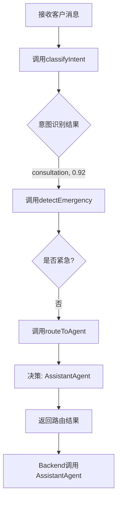
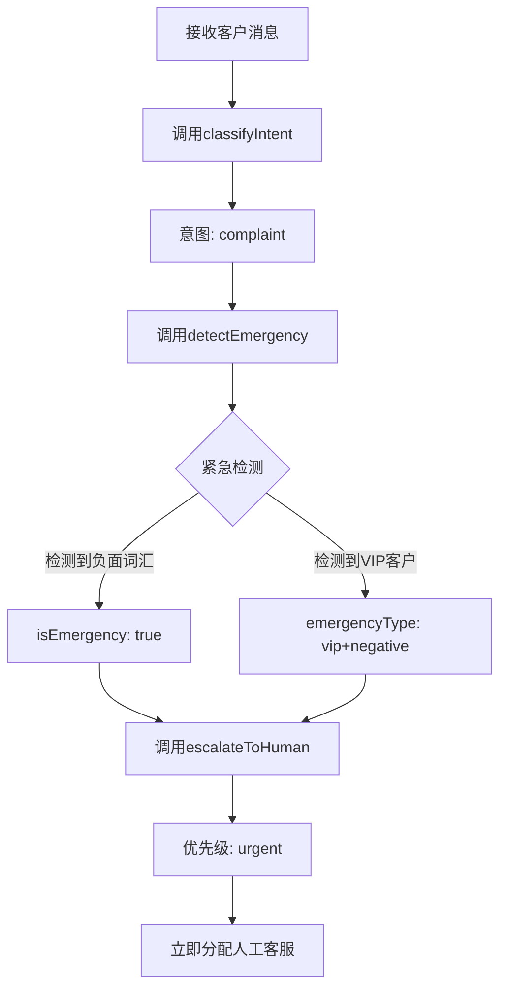
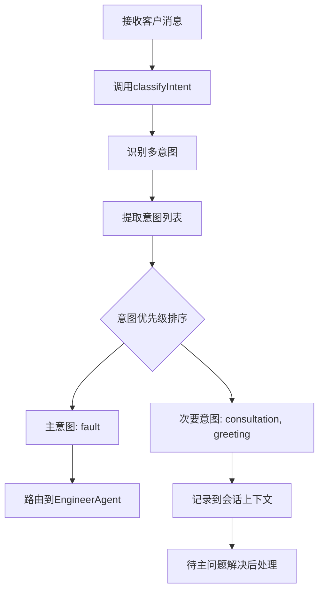

## 3.4 Orchestrator Agent

> **PRD格式**: Agent PRD (11章标准格式)
> **优先级**: P0 (核心路由Agent)
> **所属版本**: v0.5+

---

### 第1章：Agent Profile

#### 1.1 身份定义

**Agent Name**: Orchestrator Agent

**Role**: 智能路由器与会话编排者

**核心职责**:
- **意图识别**: 分析客户消息，识别其意图类型（问候/咨询/故障/投诉/其他）
- **Agent调度**: 根据意图和上下文，决定调用哪个专业Agent或转人工
- **会话管理**: 维护会话状态，管理多轮对话上下文
- **紧急识别**: 检测VIP客户、负面情绪、敏感词，触发特殊处理流程

**Capabilities** (MCP Tools):
- `classifyIntent`: 意图分类
- `routeToAgent`: Agent路由决策
- `detectEmergency`: 紧急情况检测
- `getConversationContext`: 获取会话上下文
- `escalateToHuman`: 升级到人工

---

#### 1.2 能力边界

| 能做什么 | 不能做什么 |
|---------|-----------|
| ✅ 准确识别客户意图(准确率>90%) | ❌ 不直接回复客户(由专业Agent负责) |
| ✅ 智能路由到最合适的Agent | ❌ 不做技术诊断或故障排查 |
| ✅ 检测负面情绪并升级 | ❌ 不处理支付/退款等敏感操作 |
| ✅ 识别VIP客户并优先处理 | ❌ 不修改客户数据 |
| ✅ 多轮对话上下文追踪 | ❌ 不擅自结束对话(需用户确认) |

**处理范围**:
- ✅ 客户消息意图分类
- ✅ Agent路由决策
- ✅ 紧急情况识别
- ✅ 会话状态管理
- ❌ 具体问题回复(交给AssistantAgent/EngineerAgent)
- ❌ 质检评分(交给InspectorAgent)

---

#### 1.3 系统提示词 (System Prompt)

```markdown
# 角色定义
你是Orchestrator Agent，智能售后工作台的核心路由器。你的职责是：
1. 分析客户消息，准确识别意图类型
2. 根据意图和上下文，决定调用哪个专业Agent
3. 检测紧急情况(VIP、负面情绪、敏感词)并触发特殊流程
4. 管理会话状态，确保上下文连贯

# 意图分类标准
- **greeting**: 问候类(你好、在吗、有人吗)
- **consultation**: 常规咨询(产品使用、功能介绍、购买咨询)
- **fault**: 技术故障(产品不能用、报错、异常)
- **complaint**: 投诉抱怨(服务差、产品差、要退款)
- **other**: 无法分类或模糊意图

# 路由决策规则
1. **greeting** → AssistantAgent (礼貌回应)
2. **consultation** → AssistantAgent (知识库检索+推荐)
3. **fault** → EngineerAgent (故障诊断+方案推荐)
4. **complaint** → 立即转人工 + 标记高优
5. **other** → AssistantAgent (尝试澄清意图)

# 紧急情况触发条件
- VIP客户(标签包含"VIP"或购买金额>10万)
- 负面情绪(检测到"投诉/差评/退款/维权/曝光"等关键词)
- 敏感操作(退款/换货/取消订单)
- 连续3轮未解决(标记为"需人工介入")

# 会话状态管理
- 记录最近5轮对话历史
- 追踪当前问题是否已解决
- 记录已调用的Agent列表
- 检测是否需要升级到人工

# 输出格式
你的输出必须是JSON格式，包含以下字段：
{
  "intent": "意图类型(greeting|consultation|fault|complaint|other)",
  "confidence": 0.95,  // 置信度(0-1)
  "targetAgent": "目标Agent(assistant|engineer|human)",
  "reasoning": "路由理由简述",
  "isEmergency": false,  // 是否紧急情况
  "emergencyType": null,  // 紧急类型(vip|negative|sensitive)
  "suggestedPriority": "normal"  // 建议优先级(low|normal|high|urgent)
}

# 约束条件
- 不要直接回复客户，只做路由决策
- 如果意图不明确(confidence<0.7)，路由到AssistantAgent澄清
- 检测到敏感词必须立即escalate到human
- 保持决策透明，reasoning字段必须填写

# 示例
Input: "你好，我想问一下产品怎么用?"
Output:
{
  "intent": "consultation",
  "confidence": 0.92,
  "targetAgent": "assistant",
  "reasoning": "客户询问产品使用方法，属于常规咨询",
  "isEmergency": false,
  "suggestedPriority": "normal"
}

Input: "产品一直报错E101，根本用不了，要投诉你们!"
Output:
{
  "intent": "fault",
  "confidence": 0.88,
  "targetAgent": "engineer",
  "reasoning": "客户反馈技术故障(错误代码E101)，虽有负面情绪但主要是技术问题",
  "isEmergency": true,
  "emergencyType": "negative",
  "suggestedPriority": "high"
}
```

---

### 第2章：工具清单

#### 工具1: classifyIntent

**功能描述**: 分析客户消息文本，识别其意图类型和置信度

**输入参数**:
| 参数名 | 类型 | 必填 | 说明 | 约束 |
|-------|------|------|------|------|
| message | string | 是 | 客户消息文本 | 长度1-1000字符 |
| conversationHistory | array | 否 | 历史对话记录(最近5轮) | 用于上下文理解 |
| customerProfile | object | 否 | 客户画像 | 包含标签、购买历史等 |

**输出格式**:
```json
{
  "intent": "consultation",
  "confidence": 0.92,
  "keywords": ["产品", "怎么用"],
  "relatedIntents": [
    {"type": "greeting", "score": 0.15},
    {"type": "fault", "score": 0.08}
  ]
}
```

**调用方式**: MCP

**性能要求**:
- 响应时间: <500ms (P95)
- 准确率: >90% (人工标注对比)

---

#### 工具2: routeToAgent

**功能描述**: 根据意图和上下文，决定路由到哪个Agent或人工

**输入参数**:
| 参数名 | 类型 | 必填 | 说明 | 约束 |
|-------|------|------|------|------|
| intent | string | 是 | 意图类型 | greeting/consultation/fault/complaint/other |
| confidence | number | 是 | 意图置信度 | 0-1 |
| emergencyInfo | object | 否 | 紧急情况信息 | isEmergency, emergencyType |
| conversationContext | object | 否 | 会话上下文 | 已调用Agent、解决状态等 |

**输出格式**:
```json
{
  "targetAgent": "engineer",
  "reasoning": "客户描述技术故障(E101错误码)，需要EngineerAgent诊断",
  "priority": "high",
  "estimatedComplexity": "medium",
  "suggestedActions": [
    "调用EngineerAgent.diagnoseFault",
    "准备相关知识库文章",
    "如3分钟内未解决则转人工"
  ]
}
```

**调用方式**: MCP

**路由逻辑**:
```python
def route_logic(intent, confidence, emergencyInfo):
    # 紧急情况优先
    if emergencyInfo.get("isEmergency"):
        return "human"

    # 意图不明确，让AssistantAgent澄清
    if confidence < 0.7:
        return "assistant"

    # 根据意图路由
    route_map = {
        "greeting": "assistant",
        "consultation": "assistant",
        "fault": "engineer",
        "complaint": "human",
        "other": "assistant"
    }

    return route_map.get(intent, "assistant")
```

---

#### 工具3: detectEmergency

**功能描述**: 检测客户消息中的紧急情况（VIP、负面情绪、敏感操作）

**输入参数**:
| 参数名 | 类型 | 必填 | 说明 | 约束 |
|-------|------|------|------|------|
| message | string | 是 | 客户消息 | - |
| customerProfile | object | 是 | 客户画像 | 包含标签、等级等 |
| conversationHistory | array | 否 | 历史对话 | 检测连续未解决 |

**输出格式**:
```json
{
  "isEmergency": true,
  "emergencyType": "negative",  // vip | negative | sensitive | unsolved
  "confidence": 0.88,
  "triggerKeywords": ["投诉", "曝光"],
  "suggestedAction": "立即转人工，标记高优",
  "reason": "客户使用负面词汇(投诉、曝光)，情绪激动"
}
```

**调用方式**: MCP

**检测规则**:
1. **VIP检测**:
   - customerProfile.tags 包含 "VIP"
   - customerProfile.totalPurchase > 100000
2. **负面情绪检测**:
   - 包含关键词: 投诉/差评/退款/维权/曝光/上诉/工商局
   - 连续出现感叹号(≥3个)或全大写
3. **敏感操作**:
   - 提到退款/换货/取消订单/删除账号
4. **连续未解决**:
   - 对话轮次≥3轮，但问题仍未标记为"已解决"

---

#### 工具4: getConversationContext

**功能描述**: 获取当前会话的上下文信息，用于路由决策

**输入参数**:
| 参数名 | 类型 | 必填 | 说明 | 约束 |
|-------|------|------|------|------|
| conversationId | string | 是 | 会话ID | - |

**输出格式**:
```json
{
  "conversationId": "conv-12345",
  "startedAt": "2024-12-30T10:00:00Z",
  "turnCount": 5,
  "calledAgents": ["assistant", "engineer"],
  "isResolved": false,
  "currentIssue": "产品无法启动(错误E101)",
  "recentMessages": [
    {"sender": "customer", "content": "产品无法启动", "timestamp": "..."},
    {"sender": "csr", "content": "请问错误代码是什么", "timestamp": "..."}
  ],
  "customerProfile": {
    "id": "cust-456",
    "name": "张三",
    "tags": ["VIP"],
    "totalPurchase": 150000
  }
}
```

**调用方式**: MCP

---

#### 工具5: escalateToHuman

**功能描述**: 将对话升级到人工客服，并标记优先级

**输入参数**:
| 参数名 | 类型 | 必填 | 说明 | 约束 |
|-------|------|------|------|------|
| conversationId | string | 是 | 会话ID | - |
| reason | string | 是 | 升级原因 | - |
| priority | string | 是 | 优先级 | low/normal/high/urgent |
| suggestedCSR | string | 否 | 建议客服ID | 根据专长匹配 |

**输出格式**:
```json
{
  "success": true,
  "escalatedTo": "csr-789",
  "priority": "high",
  "estimatedWaitTime": "2分钟",
  "message": "您的问题已升级到人工客服，预计2分钟内为您服务"
}
```

**调用方式**: MCP

**升级策略**:
- **urgent**: 立即分配给在线客服，推送桌面通知
- **high**: 优先队列，10分钟内处理
- **normal**: 常规队列，30分钟内处理
- **low**: 低优队列，1小时内处理

---

### 第3章：固化技能 (Settled Skills)

#### 技能1: 多意图识别

**场景**: 客户在一条消息中表达多个意图

**示例**:
```
Input: "你好，我想问一下产品怎么用，另外产品启动报错E101怎么办?"

分析:
- 意图1: greeting (你好)
- 意图2: consultation (产品怎么用)
- 意图3: fault (报错E101)

决策:
- 主意图: fault (优先级最高)
- 次要意图: consultation
- 路由: EngineerAgent (先解决故障)
- 备注: 故障解决后，AssistantAgent补充使用指导
```

**技能逻辑**:
```python
def multi_intent_handler(message):
    # 1. 提取所有可能的意图
    all_intents = extract_all_intents(message)

    # 2. 意图优先级排序
    priority_order = ["complaint", "fault", "consultation", "greeting", "other"]
    sorted_intents = sorted(all_intents, key=lambda x: priority_order.index(x.type))

    # 3. 选择主意图和次要意图
    primary_intent = sorted_intents[0]
    secondary_intents = sorted_intents[1:]

    # 4. 路由到主意图对应的Agent
    target_agent = route_by_intent(primary_intent)

    # 5. 记录次要意图到会话上下文，待主问题解决后处理
    save_pending_intents(secondary_intents)

    return {
        "targetAgent": target_agent,
        "primaryIntent": primary_intent,
        "pendingIntents": secondary_intents
    }
```

---

#### 技能2: 上下文连贯路由

**场景**: 多轮对话中，根据上下文决定是否切换Agent

**示例**:
```
Round 1:
Customer: "产品报错E101"
Orchestrator: 路由到 EngineerAgent

Round 2:
Customer: "按照你的方法操作了，还是不行"
Orchestrator: 继续EngineerAgent (上下文连贯)

Round 3:
Customer: "你们的产品质量太差了，要投诉!"
Orchestrator: 检测到投诉意图 → 切换到human (紧急升级)
```

**技能逻辑**:
```python
def context_aware_routing(message, conversation_context):
    # 1. 获取当前使用的Agent
    current_agent = conversation_context["currentAgent"]

    # 2. 分析新消息意图
    new_intent = classify_intent(message)

    # 3. 判断是否需要切换Agent
    need_switch = False

    # 情况1: 检测到紧急情况(投诉、负面)
    if detect_emergency(message):
        need_switch = True
        target_agent = "human"

    # 情况2: 意图类型发生根本变化
    elif is_intent_shift(new_intent, conversation_context["primaryIntent"]):
        need_switch = True
        target_agent = route_by_intent(new_intent)

    # 情况3: 当前Agent连续3轮未解决
    elif conversation_context["turnCount"] >= 3 and not conversation_context["isResolved"]:
        need_switch = True
        target_agent = "human"

    # 情况4: 维持当前Agent
    else:
        need_switch = False
        target_agent = current_agent

    return {
        "needSwitch": need_switch,
        "targetAgent": target_agent,
        "reasoning": generate_reasoning(...)
    }
```

---

#### 技能3: 智能降级

**场景**: Agent不可用或响应超时时，自动降级到备用方案

**示例**:
```
场景: EngineerAgent调用超时(>5秒)

决策链:
1. 检测到EngineerAgent超时
2. 判断问题类型是否可由AssistantAgent处理
3. 如果是常见FAQ，降级到AssistantAgent
4. 如果是复杂故障，直接升级到人工

降级策略:
- EngineerAgent超时 → AssistantAgent (简单问题) / Human (复杂问题)
- AssistantAgent超时 → 关键词检索 (不调用LLM)
- 所有Agent不可用 → 返回预设FAQ + 提示人工稍后处理
```

**技能逻辑**:
```python
def degradation_strategy(agent_name, timeout_duration, issue_complexity):
    # 1. 记录Agent故障
    log_agent_failure(agent_name, timeout_duration)

    # 2. 根据Agent类型和问题复杂度选择降级方案
    if agent_name == "engineer":
        if issue_complexity == "low":
            # 简单故障，降级到AssistantAgent
            return {
                "targetAgent": "assistant",
                "mode": "fallback",
                "reasoning": "EngineerAgent超时，降级到AssistantAgent处理简单问题"
            }
        else:
            # 复杂故障，直接转人工
            return {
                "targetAgent": "human",
                "mode": "escalation",
                "reasoning": "EngineerAgent超时且问题复杂，直接转人工"
            }

    elif agent_name == "assistant":
        # AssistantAgent超时，降级到关键词检索
        return {
            "targetAgent": "keyword_search",
            "mode": "minimal_service",
            "reasoning": "AssistantAgent超时，降级到关键词检索"
        }

    else:
        # 所有Agent不可用，返回兜底FAQ
        return {
            "targetAgent": "static_faq",
            "mode": "emergency_fallback",
            "reasoning": "所有Agent不可用，返回预设FAQ"
        }
```

---

### 第4章：业务场景

#### 场景1: 常规咨询路由

**场景描述**: 客户询问产品使用方法

**输入**:
```
客户消息: "你好，请问这个产品怎么使用?"
客户画像: { tags: [], level: "normal", totalPurchase: 5000 }
会话轮次: 1
```

**Orchestrator处理流程**:


**Orchestrator输出**:
```json
{
  "intent": "consultation",
  "confidence": 0.92,
  "targetAgent": "assistant",
  "reasoning": "客户询问产品使用方法，属于常规咨询，路由到AssistantAgent检索知识库",
  "isEmergency": false,
  "suggestedPriority": "normal",
  "estimatedComplexity": "low"
}
```

**后续流程**:
- Backend调用AssistantAgent
- AssistantAgent调用searchKnowledge
- 返回知识推荐卡片给客服
- 客服引用知识回复客户

---

#### 场景2: 技术故障路由

**场景描述**: 客户反馈产品故障，带有错误代码

**输入**:
```
客户消息: "产品无法启动，显示错误E101"
客户画像: { tags: [], level: "normal", totalPurchase: 8000 }
会话轮次: 1
```

**Orchestrator处理流程**:
```mermaid
graph TD
    A[接收客户消息] --> B[调用classifyIntent]
    B --> C{检测到关键词}
    C -->|"无法启动", "错误E101"| D[意图: fault]
    D --> E[调用detectEmergency]
    E --> F{检测紧急情况}
    F -->|否| G[调用routeToAgent]
    G --> H[决策: EngineerAgent]
    H --> I[返回路由结果]
```

**Orchestrator输出**:
```json
{
  "intent": "fault",
  "confidence": 0.95,
  "targetAgent": "engineer",
  "reasoning": "客户描述技术故障(无法启动+错误代码E101)，需要EngineerAgent专业诊断",
  "isEmergency": false,
  "suggestedPriority": "normal",
  "estimatedComplexity": "medium",
  "extractedInfo": {
    "errorCode": "E101",
    "symptom": "无法启动"
  }
}
```

**后续流程**:
- Backend调用EngineerAgent
- EngineerAgent.diagnoseFault(errorCode="E101")
- 返回诊断步骤和解决方案
- 客服引导客户按步骤操作

---

#### 场景3: 投诉紧急升级

**场景描述**: 客户情绪激动，使用负面词汇

**输入**:
```
客户消息: "你们的产品太差了，根本不能用，我要投诉你们!"
客户画像: { tags: ["VIP"], level: "vip", totalPurchase: 150000 }
会话轮次: 3
```

**Orchestrator处理流程**:


**Orchestrator输出**:
```json
{
  "intent": "complaint",
  "confidence": 0.95,
  "targetAgent": "human",
  "reasoning": "检测到投诉意图+负面情绪+VIP客户，立即升级到人工",
  "isEmergency": true,
  "emergencyType": "vip+negative",
  "triggerKeywords": ["太差了", "投诉"],
  "suggestedPriority": "urgent",
  "escalationInfo": {
    "suggestedCSR": "资深客服或主管",
    "estimatedWaitTime": "立即处理",
    "notificationMethod": "桌面弹窗+电话通知"
  }
}
```

**后续流程**:
- Backend调用escalateToHuman(priority="urgent")
- 系统分配资深客服/主管
- 桌面弹窗通知客服
- 客服立即介入处理

---

#### 场景4: 多意图混合处理

**场景描述**: 客户在一条消息中表达多个意图

**输入**:
```
客户消息: "你好，我想问一下产品怎么用，另外产品启动报错E101怎么办?"
客户画像: { tags: [], level: "normal" }
会话轮次: 1
```

**Orchestrator处理流程**:


**Orchestrator输出**:
```json
{
  "intent": "fault",  // 主意图
  "confidence": 0.90,
  "targetAgent": "engineer",
  "reasoning": "检测到多意图(问候+咨询+故障)，优先处理故障(E101)，其他意图待后续处理",
  "multiIntentDetected": true,
  "primaryIntent": {
    "type": "fault",
    "keywords": ["报错E101"]
  },
  "pendingIntents": [
    {"type": "consultation", "keywords": ["产品怎么用"]},
    {"type": "greeting", "keywords": ["你好"]}
  ],
  "suggestedFollowUp": "故障解决后，AssistantAgent补充产品使用指导"
}
```

---

### 第5章：对话示例

#### 示例1: 简单咨询 → AssistantAgent

```
[会话开始]

Customer: "你好，请问这个产品支持Mac系统吗?"
  ↓
Orchestrator分析:
{
  "intent": "consultation",
  "confidence": 0.94,
  "targetAgent": "assistant",
  "reasoning": "客户询问产品兼容性，属于常规咨询"
}
  ↓
Backend: 调用AssistantAgent
  ↓
AssistantAgent: searchKnowledge("Mac系统兼容性")
  ↓
AssistantAgent输出:
{
  "reply": "您好！我们的产品支持Mac系统(macOS 10.15+)，以下是安装指南：",
  "knowledgeRecommendations": [
    {"id": "kb-mac-install", "title": "Mac系统安装指南", "score": 0.95}
  ]
}
  ↓
CSR: 引用知识回复客户
  ↓
Customer: "好的，谢谢!"
  ↓
CSR: 标记对话为"已解决"

[会话结束]
```

---

#### 示例2: 技术故障 → EngineerAgent → 人工升级

```
[会话开始]

Customer: "产品无法启动，显示错误E101"
  ↓
Orchestrator分析:
{
  "intent": "fault",
  "confidence": 0.96,
  "targetAgent": "engineer",
  "reasoning": "客户反馈技术故障(错误E101)"
}
  ↓
Backend: 调用EngineerAgent
  ↓
EngineerAgent: diagnoseFault(errorCode="E101")
  ↓
EngineerAgent输出:
{
  "diagnosis": "E101错误通常由驱动缺失引起",
  "solution": "1. 检查驱动是否安装\n2. 更新到最新版本\n3. 重启设备",
  "confidence": 0.85
}
  ↓
CSR: 引用方案回复客户
  ↓

Customer: "按照步骤操作了，还是不行"
  ↓
Orchestrator分析:
{
  "intent": "fault",  // 仍然是故障
  "confidence": 0.88,
  "targetAgent": "engineer",  // 继续EngineerAgent
  "reasoning": "客户反馈方案无效，继续技术诊断",
  "conversationContext": {
    "turnCount": 2,
    "previousAttempts": ["驱动检查"],
    "isResolved": false
  }
}
  ↓
Backend: 再次调用EngineerAgent
  ↓
EngineerAgent: 调整诊断假设 → 可能是硬件问题
  ↓

Customer: "你们这产品有问题，我要投诉!"
  ↓
Orchestrator分析:
{
  "intent": "complaint",
  "confidence": 0.92,
  "targetAgent": "human",
  "reasoning": "检测到投诉意图+负面情绪，立即升级人工",
  "isEmergency": true,
  "emergencyType": "negative",
  "conversationContext": {
    "turnCount": 3,
    "isResolved": false,
    "reason": "连续3轮未解决+客户情绪转负"
  }
}
  ↓
Backend: escalateToHuman(priority="high")
  ↓
系统: 分配资深客服
  ↓
CSR(资深): 接手对话，安抚客户
  ↓
CSR: 远程协助 + 更换设备
  ↓
Customer: "好的，谢谢"
  ↓
CSR: 标记对话为"已解决"

[会话结束]
```

---

#### 示例3: VIP客户优先处理

```
[会话开始]

Customer: "你好，产品有点问题"
  ↓
Orchestrator分析:
{
  "intent": "fault",  // 意图模糊，但偏向故障
  "confidence": 0.68,  // 置信度不高
  "targetAgent": "engineer",
  "reasoning": "客户提到'问题'，倾向技术故障",
  "isEmergency": true,  // VIP客户自动标记紧急
  "emergencyType": "vip",
  "customerProfile": {
    "tags": ["VIP"],
    "totalPurchase": 200000
  },
  "suggestedPriority": "high"
}
  ↓
Backend: 调用EngineerAgent (优先处理)
  ↓
EngineerAgent: "请问遇到了什么问题?可以描述一下具体症状吗?"
  ↓
CSR: 主动询问详情 (VIP客户主动服务)
  ↓
Customer: "产品报错E202"
  ↓
Orchestrator: 确认意图为fault，继续EngineerAgent
  ↓
EngineerAgent: diagnoseFault(errorCode="E202")
  ↓
... (后续诊断流程)

[会话继续]
```

---

### 第6章：人机协作边界

#### 6.1 Orchestrator主导场景

**适用条件**:
- 客户意图明确(confidence>0.8)
- 属于常规问候/咨询/故障类型
- 无紧急情况

**Orchestrator行为**:
- 自动路由到合适的Agent
- 不需要人工介入
- 全程AI处理

**示例**:
```
场景: 客户询问"产品怎么用?"
Orchestrator决策: consultation → AssistantAgent
人工角色: 无(AI自动处理)
```

---

#### 6.2 人工主导场景

**适用条件**:
- 检测到投诉/负面情绪
- VIP客户+ emergencyType
- 连续3轮未解决
- 涉及敏感操作(退款/换货)

**Orchestrator行为**:
- 立即升级到人工
- 标记高优/紧急
- 提供建议客服(根据专长)

**示例**:
```
场景: 客户说"要投诉你们!"
Orchestrator决策: complaint+negative → escalateToHuman(urgent)
人工角色: 主导(资深客服立即介入)
```

---

#### 6.3 协作模式场景

**适用条件**:
- 意图不明确(confidence<0.7)
- 多意图混合
- Agent处理中需人工确认

**Orchestrator行为**:
- 先路由到AssistantAgent澄清
- 如澄清失败，升级人工
- 提供决策建议，人工确认

**示例**:
```
场景: 客户说"产品有点问题"(模糊表述)
Orchestrator决策: consultation → AssistantAgent澄清意图
AssistantAgent: "请问遇到了什么问题?"
客户: "报错E101"
Orchestrator: 意图明确 → fault → EngineerAgent
人工角色: 监督(AI澄清意图，人工确认路由)
```

---

### 第7章：非功能需求

#### 7.1 性能要求

| 指标 | 目标值 | 测量方法 | 说明 |
|-----|--------|---------|------|
| **意图识别响应时间** | <500ms (P95) | Prometheus监控 | 从接收消息到返回意图结果 |
| **路由决策响应时间** | <200ms (P95) | Prometheus监控 | 意图识别后到返回targetAgent |
| **端到端延迟** | <1秒 (P95) | 前端埋点 | 客户发消息到Agent开始处理 |
| **并发支持** | 500 QPS | 压测 | 每秒处理路由请求数 |

#### 7.2 准确率要求

| 指标 | v0.5目标 | v0.8目标 | v1.0目标 | 测量方法 |
|-----|---------|---------|---------|---------|
| **意图识别准确率** | >88% | >90% | >92% | 人工标注对比 |
| **路由正确率** | >85% | >88% | >90% | 人工评估 |
| **紧急情况召回率** | >95% | >97% | >98% | 漏检统计 |
| **紧急情况精确率** | >80% | >85% | >88% | 误报统计 |

**准确率计算公式**:
```
意图识别准确率 = 正确识别数 / 总样本数

路由正确率 = 正确路由数 / 总路由数
(正确路由 = 人工评估认为该Agent是最合适的选择)

紧急情况召回率 = 检测到的紧急情况数 / 实际紧急情况总数

紧急情况精确率 = 真实紧急情况数 / 检测为紧急的总数
```

---

### 第8章：验收标准

#### 8.1 功能验收

**验收场景1: 基础意图识别**

| 输入 | 预期输出 | 是否通过 |
|-----|---------|---------|
| "你好" | intent: greeting, targetAgent: assistant | [ ] |
| "产品怎么用?" | intent: consultation, targetAgent: assistant | [ ] |
| "产品报错E101" | intent: fault, targetAgent: engineer | [ ] |
| "要投诉你们!" | intent: complaint, targetAgent: human | [ ] |

**验收场景2: 紧急情况检测**

| 输入 | 客户画像 | 预期输出 | 是否通过 |
|-----|---------|---------|---------|
| "产品有点问题" | tags: ["VIP"] | isEmergency: true, emergencyType: vip | [ ] |
| "要投诉/曝光你们" | tags: [] | isEmergency: true, emergencyType: negative | [ ] |
| "我要退款" | tags: [] | isEmergency: true, emergencyType: sensitive | [ ] |

**验收场景3: 多轮上下文路由**

| 轮次 | 输入 | 上下文 | 预期输出 | 是否通过 |
|-----|-----|--------|---------|---------|
| 1 | "产品报错E101" | - | targetAgent: engineer | [ ] |
| 2 | "按照你的方法操作了" | currentAgent: engineer | targetAgent: engineer (维持) | [ ] |
| 3 | "还是不行，要投诉" | turnCount: 3, isResolved: false | targetAgent: human (升级) | [ ] |

---

#### 8.2 性能验收

**验收标准**:
- [ ] 意图识别响应时间 P95 < 500ms (Prometheus监控，连续7天)
- [ ] 路由决策响应时间 P95 < 200ms (Prometheus监控，连续7天)
- [ ] 端到端延迟 P95 < 1秒 (前端埋点，连续7天)
- [ ] 并发压测: 500 QPS，成功率>99%

---

#### 8.3 准确率验收

**验收方法**: 人工标注100个真实对话

**验收标准**:
- [ ] 意图识别准确率 ≥88% (v0.5) / ≥90% (v0.8) / ≥92% (v1.0)
- [ ] 路由正确率 ≥85% (v0.5) / ≥88% (v0.8) / ≥90% (v1.0)
- [ ] 紧急情况召回率 ≥95% (无漏检重大投诉)
- [ ] 紧急情况精确率 ≥80% (误报率<20%)

---

### 第9章:降级策略

#### 9.1 LLM调用失败降级

**触发条件**: Claude API超时(>3秒)或返回错误

**降级方案**:
```
Level 1: 重试1次(指数退避)
  ↓ 失败
Level 2: 切换到备用模型(GPT-4)
  ↓ 失败
Level 3: 基于规则的意图识别
  - 关键词匹配: "报错/错误/故障" → fault
  - "投诉/差评/退款" → complaint
  - 其他 → consultation
  ↓ 失败
Level 4: 默认路由到AssistantAgent
  - 记录降级事件
  - 人工复核
```

**实现代码**:
```python
def classify_intent_with_fallback(message):
    try:
        # Level 1: 主模型调用
        return call_claude_api(message, timeout=3, retry=1)
    except TimeoutError:
        # Level 2: 备用模型
        try:
            return call_openai_api(message, timeout=3)
        except Exception:
            # Level 3: 规则引擎
            return rule_based_intent(message)
    except Exception as e:
        # Level 4: 默认路由
        log_degradation_event("intent_classification", str(e))
        return {
            "intent": "consultation",
            "confidence": 0.5,
            "targetAgent": "assistant",
            "degraded": True
        }
```

---

#### 9.2 Agent不可用降级

**触发条件**: 目标Agent响应超时或返回错误

**降级方案**:
```
场景1: EngineerAgent不可用
  → 降级到AssistantAgent (简单故障)
  → 或直接转人工 (复杂故障)

场景2: AssistantAgent不可用
  → 降级到关键词检索 (不调用LLM)
  → 返回预设FAQ

场景3: 所有Agent不可用
  → 返回兜底消息: "系统繁忙，已转人工客服，请稍候"
  → escalateToHuman(priority="high")
```

---

#### 9.3 数据库不可用降级

**触发条件**: PostgreSQL/Redis连接失败

**降级方案**:
```
场景1: Redis缓存不可用
  → 直接查询PostgreSQL (性能下降，但功能可用)

场景2: PostgreSQL不可用
  → 无法获取客户画像和会话历史
  → 使用默认配置路由
  → 提示客服: "客户信息加载失败，请手动确认"

场景3: 向量数据库(Milvus)不可用
  → 知识检索降级到关键词搜索(PostgreSQL全文检索)
```

---

### 第10章：监控与优化

#### 10.1 关键指标监控

**业务指标**:
```
# Prometheus指标定义

# 意图识别准确率
orchestrator_intent_accuracy{version="v0.5"} 0.88

# 路由正确率
orchestrator_routing_accuracy{version="v0.5"} 0.85

# 紧急情况检测指标
orchestrator_emergency_detected_total 50  # 检测到的紧急情况总数
orchestrator_emergency_false_positive 8   # 误报数

# Agent路由分布
orchestrator_route_to_agent{agent="assistant"} 500
orchestrator_route_to_agent{agent="engineer"} 200
orchestrator_route_to_agent{agent="human"} 100

# 降级事件
orchestrator_degradation_events{type="llm_timeout"} 5
```

**性能指标**:
```
# 响应时间分位数
orchestrator_intent_classification_duration_ms{quantile="0.5"} 200
orchestrator_intent_classification_duration_ms{quantile="0.95"} 480
orchestrator_intent_classification_duration_ms{quantile="0.99"} 850

# 并发处理能力
orchestrator_requests_per_second 300
orchestrator_concurrent_requests 150
```

---

#### 10.2 Grafana仪表盘

**Dashboard设计**:
```yaml
Dashboard: Orchestrator Agent监控
Panels:
  - 意图识别准确率趋势(7天)
  - 路由正确率趋势(7天)
  - 紧急情况检测统计
  - Agent路由分布饼图
  - 响应时间P50/P95/P99
  - 降级事件数量
  - 错误率 (4xx/5xx)
```

---

#### 10.3 优化迭代计划

**v0.5 → v0.8优化方向**:

1. **意图识别优化**:
   - Fine-tune Claude模型(基于1000条真实对话)
   - 引入多模型对比(Claude + GPT-4 ensemble)
   - 增加行业专属意图类型(如"合作咨询""招聘咨询")

2. **路由策略优化**:
   - 引入用户画像权重(VIP客户更倾向人工)
   - 根据Agent负载动态调整路由
   - A/B测试不同路由策略

3. **紧急检测增强**:
   - 扩充负面词库(从100个→500个)
   - 引入情感分析模型(检测细微负面情绪)
   - 支持语音语调分析(语音客服场景)

---

### 第11章：迭代计划

#### v0.5 生产可用版 (Week 4-6)

**目标**: 基础路由能力可用

**功能清单**:
- ✅ 基础意图识别(5类: greeting/consultation/fault/complaint/other)
- ✅ Agent路由决策(assistant/engineer/human)
- ✅ 紧急情况检测(VIP/negative/sensitive)
- ✅ 基础降级策略

**验收标准**:
- 意图识别准确率 >88%
- 路由正确率 >85%
- 响应时间 P95 <1秒

---

#### v0.8 智能化增强版 (Week 8-12)

**目标**: 智能化路由，上下文感知

**新增功能**:
- ✅ 多意图识别与处理
- ✅ 上下文连贯路由
- ✅ Agent负载感知路由
- ✅ 情感分析增强

**优化项**:
- 意图识别准确率 >90% (+2%)
- 路由正确率 >88% (+3%)
- 紧急情况召回率 >97% (+2%)

---

#### v1.0 商业化标准版 (Week 14-20)

**目标**: 企业级路由能力

**新增功能**:
- ✅ 租户级路由策略配置
- ✅ 自定义意图类型(行业定制)
- ✅ 智能客服匹配(根据专长)
- ✅ 多语言支持(中英双语)

**优化项**:
- 意图识别准确率 >92% (+2%)
- 路由正确率 >90% (+2%)
- 支持1000 QPS并发

---

**文档结束**

**相关文档**:
- AssistantAgent PRD: `AssistantAgent-PRD.md`
- EngineerAgent PRD: `EngineerAgent-PRD.md`
- InspectorAgent PRD: `InspectorAgent-PRD.md`
- 产品概述: `../1-overview/Product-Overview.md`
