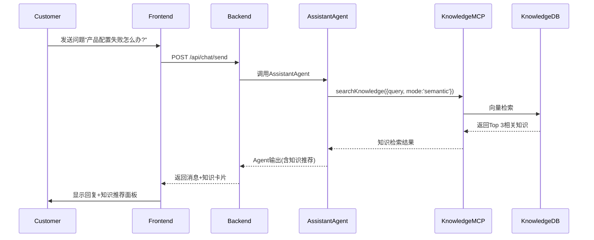
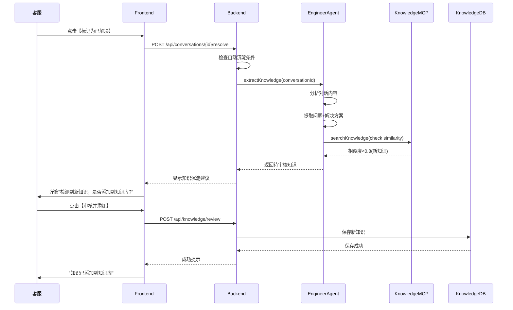
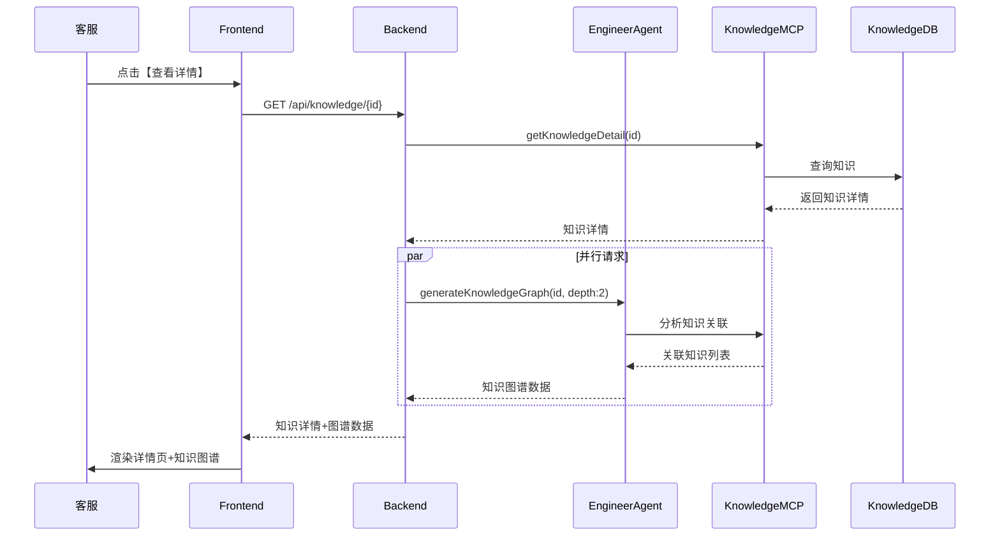

## 4.1 知识库模块

> **PRD格式**: 混合PRD（Agent能力 + 功能部分 + 人机协作）
> **优先级**: P0
> **所属版本**: v0.1 + v0.8（自动沉淀）+ v1.0（知识图谱）

### 4.1.1 第1部分：Agent能力部分

#### 1.1 Agent Profile

##### 1.1.1 身份定义

**Agent Name**: EngineerAgent / AssistantAgent (知识检索与沉淀子能力)

**Role**: 智能知识助手，负责在对话中实时检索知识、自动沉淀新知识、构建知识图谱并提供关联推荐

**本模块职责**:
- **语义检索**: 基于客户问题和对话上下文，从知识库中检索最相关的解决方案
- **知识沉淀**: 自动从成功对话中提取有价值的知识，补充到知识库
- **知识推荐**: 基于知识图谱和客户画像，推荐相关知识内容
- **知识关联**: 分析知识之间的关联关系，构建知识图谱

**Capabilities**:
- `searchKnowledge` (MCP): 多模式知识检索(关键词/语义/问答)
- `uploadDocument` (MCP): 文档上传与解析
- `getKnowledgeDetail` (MCP): 获取知识详情
- `extractKnowledge` (MCP, v0.8): 从对话中提取并沉淀新知识
- `generateKnowledgeGraph` (MCP, v1.0): 生成知识图谱关联

##### 1.1.2 能力边界

| 能做什么 | 不能做什么 |
|---------|-----------|
| ✅ 语义检索知识库(相关度>0.7) | ❌ 不发送未审核的高风险知识内容 |
| ✅ 自动提取对话中的新知识点 | ❌ 不自动删除或覆盖已有知识 |
| ✅ 推荐相关知识(最多5条) | ❌ 不推荐过时或低评分知识(<3.0分) |
| ✅ 标注知识来源和更新时间 | ❌ 不编造不存在的知识内容 |
| ✅ 识别知识缺失并建议补充 | ❌ 不代替人工审核知识质量 |

**知识引用规范**:
- 明确标注来源: `[来源: 知识库 - ${title} | 更新于 ${updatedAt}]`
- 标注相关度: `相关度: ${score * 100}%`
- 低置信度警告: 相关度<0.7时提示"建议人工确认"

---

#### 1.2 工具清单

##### 工具1: searchKnowledge

**功能描述**: 从知识库中检索与用户问题相关的知识内容，支持关键词、语义和问答三种检索模式

**输入参数**:
| 参数名 | 类型 | 必填 | 说明 | 约束 |
|-------|------|------|------|------|
| query | string | 是 | 搜索查询内容 | 长度1-500字符 |
| mode | string | 否 | 检索模式 | 'keyword' \| 'semantic' \| 'qa'，默认'keyword' |
| filters | object | 否 | 过滤条件 | - |
| filters.category | string | 否 | 知识分类 | - |
| filters.tags | string[] | 否 | 标签筛选 | - |
| filters.limit | number | 否 | 返回数量限制 | 1-20，默认5 |
| filters.topK | number | 否 | 向量检索Top-K | 1-10，默认5 |

**输出格式**:
```json
{
  "results": [
    {
      "id": "kb-001",
      "title": "产品配置问题解决方案",
      "content": "详细内容...",
      "category": "technical",
      "tags": ["配置", "故障排查"],
      "source": "manual",
      "score": 0.92,
      "metadata": {
        "viewCount": 156,
        "rating": 4.5
      },
      "createdAt": "2024-01-15T10:30:00Z",
      "updatedAt": "2024-12-20T15:45:00Z"
    }
  ],
  "total": 1,
  "mode": "semantic"
}
```

**调用方式**: MCP (Model Context Protocol)

**与UI的关联**:
- `results[].title` → 知识卡片标题
- `results[].content` → 知识内容预览(前200字符)
- `results[].score` → 相关度百分比 (×100%)
- `results[].tags` → 标签组件
- `results[].metadata.rating` → 星级评分组件

**检索模式说明**:
- **keyword**: 基于关键词匹配，适用于精确查询
- **semantic**: 基于向量语义检索，适用于模糊查询和理解用户意图
- **qa**: 问答模式，直接返回最佳答案而非知识条目列表

---

##### 工具2: uploadDocument

**功能描述**: 上传文档(PDF/Word/TXT)到知识库，自动解析并提取知识内容

**输入参数**:
| 参数名 | 类型 | 必填 | 说明 | 约束 |
|-------|------|------|------|------|
| title | string | 是 | 文档标题 | 长度1-200字符 |
| fileBase64 | string | 是 | 文件Base64编码 | 支持PDF/DOCX/TXT，<10MB |
| category | string | 否 | 知识分类 | - |
| companyEntity | string | 否 | 所属公司主体 | - |

**输出格式**:
```json
{
  "success": true,
  "knowledgeId": "kb-002",
  "title": "产品用户手册v2.0",
  "extractedCount": 12,
  "category": "manual",
  "message": "文档上传成功，已提取12条知识"
}
```

**调用方式**: MCP

**与UI的关联**:
- `success` → 上传成功提示
- `extractedCount` → "已提取X条知识"提示
- `knowledgeId` → 跳转到知识详情页链接

**处理流程**:
1. 解析文档内容(PDF→Text, DOCX→Markdown)
2. 分段处理(按章节/段落)
3. 提取关键信息(标题、正文、图表说明)
4. 自动分类和打标签
5. 写入知识库并建立索引

---

##### 工具3: getKnowledgeDetail

**功能描述**: 获取指定知识的完整详情，包括元数据和历史版本信息

**输入参数**:
| 参数名 | 类型 | 必填 | 说明 | 约束 |
|-------|------|------|------|------|
| knowledgeId | string | 是 | 知识ID | - |

**输出格式**:
```json
{
  "id": "kb-001",
  "title": "产品配置问题解决方案",
  "content": "完整内容...",
  "category": "technical",
  "tags": ["配置", "故障排查"],
  "source": "manual",
  "metadata": {
    "viewCount": 156,
    "rating": 4.5,
    "usageCount": 23,
    "lastUsedAt": "2024-12-28T10:00:00Z"
  },
  "createdAt": "2024-01-15T10:30:00Z",
  "updatedAt": "2024-12-20T15:45:00Z",
  "isArchived": false
}
```

**调用方式**: MCP

**与UI的关联**:
- `title` → 详情页标题
- `content` → Markdown渲染器
- `metadata.viewCount` → "已查看156次"
- `metadata.rating` → 星级评分显示
- `metadata.usageCount` → "已使用23次"

---

##### 工具4: extractKnowledge (v0.8 自动沉淀)

**功能描述**: 从成功解决的对话中自动提取有价值的知识，补充到知识库

**输入参数**:
| 参数名 | 类型 | 必填 | 说明 | 约束 |
|-------|------|------|------|------|
| conversationId | string | 是 | 对话ID | - |
| extractMode | string | 否 | 提取模式 | 'auto' \| 'manual'，默认'auto' |

**输出格式**:
```json
{
  "extracted": true,
  "knowledgeItems": [
    {
      "title": "客户提问的问题摘要",
      "content": "问题: ...\n解决方案: ...\n验证结果: ...",
      "category": "qa",
      "tags": ["自动提取", "客户问题"],
      "confidence": 0.88,
      "needReview": true
    }
  ],
  "count": 1
}
```

**调用方式**: MCP

**与UI的关联**:
- `knowledgeItems[].title` → 待审核知识卡片标题
- `knowledgeItems[].confidence` → 置信度进度条
- `needReview: true` → 显示"待人工审核"标签
- UI提供【批准】【编辑】【拒绝】三个操作按钮

**提取触发条件**:
- 对话状态为"已解决"(resolved)
- 对话轮次≥3轮
- 客户满意度≥4分
- 知识库中不存在类似知识(相似度<0.8)

**提取逻辑**:
1. 识别客户核心问题
2. 提取客服回复中的解决方案
3. 记录问题验证结果
4. 生成结构化知识条目
5. 标记为"待审核"状态

---

##### 工具5: generateKnowledgeGraph (v1.0 知识图谱)

**功能描述**: 分析知识之间的关联关系，生成知识图谱并推荐相关知识

**输入参数**:
| 参数名 | 类型 | 必填 | 说明 | 约束 |
|-------|------|------|------|------|
| knowledgeId | string | 是 | 中心知识ID | - |
| depth | number | 否 | 关联深度 | 1-3，默认2 |

**输出格式**:
```json
{
  "centerNode": {
    "id": "kb-001",
    "title": "产品配置问题解决方案"
  },
  "relatedNodes": [
    {
      "id": "kb-015",
      "title": "配置文件格式说明",
      "relation": "prerequisite",
      "weight": 0.92
    },
    {
      "id": "kb-023",
      "title": "常见配置错误排查",
      "relation": "related",
      "weight": 0.85
    }
  ],
  "graph": {
    "nodes": [...],
    "edges": [...]
  }
}
```

**调用方式**: MCP

**与UI的关联**:
- `centerNode` → 知识图谱中心节点
- `relatedNodes` → 关联知识推荐列表
- `graph` → D3.js/ECharts图谱可视化
- `relation` → 关系标签(前置知识/相关知识/后续扩展)

**关系类型**:
- **prerequisite**: 前置知识(需要先了解)
- **related**: 相关知识(同一主题)
- **follow-up**: 后续扩展(深入学习)
- **alternative**: 替代方案

---

#### 1.3 业务场景

##### 场景1: 客服对话中实时检索知识

**场景描述**: 客服在回复客户问题时，Agent自动检索知识库并推荐相关解决方案

**触发条件**:
- 客户发送新消息
- 消息类型为"问题咨询"
- AssistantAgent识别到明确的问题意图

**Agent处理流程**:


**Agent输出**:
```json
{
  "reply": "您好，关于产品配置失败的问题，我为您找到了以下解决方案：",
  "knowledgeRecommendations": [
    {
      "id": "kb-001",
      "title": "产品配置问题解决方案",
      "snippet": "常见原因包括配置文件格式错误、权限不足...",
      "score": 0.92,
      "source": "manual"
    },
    {
      "id": "kb-015",
      "title": "配置文件格式说明",
      "snippet": "配置文件应采用JSON格式，字段说明如下...",
      "score": 0.85,
      "source": "manual"
    }
  ],
  "confidence": 0.92,
  "needHumanReview": false
}
```

**UI展示**:

Frontend渲染为：

```
[AI助手回复]
您好，关于产品配置失败的问题，我为您找到了以下解决方案：

[知识推荐卡片 1]
━━━━━━━━━━━━━━━━━━━━━━━━━━━━━━━━━━
📘 产品配置问题解决方案              [相关度: 92%]
━━━━━━━━━━━━━━━━━━━━━━━━━━━━━━━━━━
常见原因包括配置文件格式错误、权限不足...
[查看详情] [引用到回复]
来源: 产品手册 | 更新于 2024-12-20

[知识推荐卡片 2]
━━━━━━━━━━━━━━━━━━━━━━━━━━━━━━━━━━
📘 配置文件格式说明                  [相关度: 85%]
━━━━━━━━━━━━━━━━━━━━━━━━━━━━━━━━━━
配置文件应采用JSON格式，字段说明如下...
[查看详情] [引用到回复]
来源: 产品手册 | 更新于 2024-11-10
```

客服可点击【引用到回复】将知识内容插入到回复框中，编辑后发送给客户。

---

##### 场景2: 对话结束后自动沉淀新知识

**场景描述**: 对话成功解决客户问题后，Agent自动提取对话中的新知识并建议添加到知识库

**触发条件**:
- 对话状态变更为"已解决"
- 客户满意度评分≥4分
- 对话轮次≥3轮
- 系统检测到该问题在知识库中相似度<0.8

**Agent处理流程**:


**Agent输出**:
```json
{
  "extracted": true,
  "knowledgeItems": [
    {
      "title": "Windows系统下产品无法启动的解决方案",
      "content": "**问题描述**:\n客户反馈产品在Windows 11系统下无法启动，提示\"缺少依赖库\"。\n\n**解决方案**:\n1. 安装Visual C++ 2019 Redistributable\n2. 以管理员权限运行产品\n3. 检查防火墙设置\n\n**验证结果**:\n客户按照方案操作后成功启动，问题解决。",
      "category": "technical",
      "tags": ["Windows", "启动失败", "依赖库"],
      "source": "conversation-conv-12345",
      "confidence": 0.88,
      "needReview": true,
      "extractedFrom": {
        "conversationId": "conv-12345",
        "customerId": "cust-456",
        "csrId": "csr-789",
        "resolvedAt": "2024-12-30T14:30:00Z"
      }
    }
  ],
  "count": 1
}
```

**UI展示**:

弹窗显示：

```
┌─────────────────────────────────────────────────┐
│ 🎯 检测到新知识，是否添加到知识库?               │
├─────────────────────────────────────────────────┤
│                                                  │
│ 📝 标题: Windows系统下产品无法启动的解决方案     │
│                                                  │
│ 🏷️ 分类: 技术支持                               │
│ 🏷️ 标签: Windows, 启动失败, 依赖库              │
│                                                  │
│ 📊 置信度: 88%                                   │
│ ⚠️  需要人工审核                                 │
│                                                  │
│ ┌─────────────────────────────────────────────┐ │
│ │ **问题描述**:                                │ │
│ │ 客户反馈产品在Windows 11系统下无法启动...    │ │
│ │                                              │ │
│ │ **解决方案**:                                │ │
│ │ 1. 安装Visual C++ 2019 Redistributable       │ │
│ │ 2. 以管理员权限运行产品                      │ │
│ │ 3. 检查防火墙设置                            │ │
│ │                                              │ │
│ │ **验证结果**:                                │ │
│ │ 客户按照方案操作后成功启动，问题解决。        │ │
│ └─────────────────────────────────────────────┘ │
│                                                  │
│ 来源对话: #conv-12345 | 客服: 张三               │
│ 解决时间: 2024-12-30 14:30                       │
│                                                  │
│         [✏️ 编辑] [✅ 批准添加] [❌ 拒绝]          │
└─────────────────────────────────────────────────┘
```

客服可以：
- 点击【编辑】修改内容后批准
- 点击【批准添加】直接添加到知识库
- 点击【拒绝】不添加此知识

---

##### 场景3: 知识图谱关联推荐 (v1.0)

**场景描述**: 客服查看某个知识详情时，系统自动展示知识图谱和相关知识推荐

**触发条件**:
- 客服点击知识卡片【查看详情】
- 或在知识库管理页面打开知识详情

**Agent处理流程**:


**Agent输出**:
```json
{
  "centerNode": {
    "id": "kb-001",
    "title": "产品配置问题解决方案",
    "category": "technical"
  },
  "relatedNodes": [
    {
      "id": "kb-015",
      "title": "配置文件格式说明",
      "relation": "prerequisite",
      "weight": 0.92,
      "description": "了解配置文件格式是解决配置问题的前提"
    },
    {
      "id": "kb-023",
      "title": "常见配置错误排查",
      "relation": "related",
      "weight": 0.85,
      "description": "相关的配置问题排查方法"
    },
    {
      "id": "kb-042",
      "title": "高级配置选项说明",
      "relation": "follow-up",
      "weight": 0.78,
      "description": "深入学习高级配置技巧"
    }
  ],
  "graph": {
    "nodes": [
      {"id": "kb-001", "label": "产品配置问题解决方案", "level": 0},
      {"id": "kb-015", "label": "配置文件格式说明", "level": 1},
      {"id": "kb-023", "label": "常见配置错误排查", "level": 1},
      {"id": "kb-042", "label": "高级配置选项说明", "level": 1}
    ],
    "edges": [
      {"source": "kb-015", "target": "kb-001", "type": "prerequisite"},
      {"source": "kb-001", "target": "kb-023", "type": "related"},
      {"source": "kb-001", "target": "kb-042", "type": "follow-up"}
    ]
  }
}
```

**UI展示**:

```
┌─────────────────────────────────────────────────────────────┐
│ 📘 产品配置问题解决方案                      [编辑] [删除]  │
├─────────────────────────────────────────────────────────────┤
│                                                              │
│ [知识内容Tab] [知识图谱Tab] [使用统计Tab]                    │
│                                                              │
│ ┌───────────────────────────────────────────────────────┐   │
│ │           知识图谱可视化 (D3.js力导向图)              │   │
│ │                                                        │   │
│ │         ┌─────────────┐                               │   │
│ │         │配置文件格式 │                               │   │
│ │         │   说明      │                               │   │
│ │         └──────┬──────┘                               │   │
│ │                │ prerequisite                          │   │
│ │                ↓                                       │   │
│ │         ┌─────────────┐      related                  │   │
│ │         │  产品配置   ├──────────────┐               │   │
│ │         │问题解决方案 │              │               │   │
│ │         └──────┬──────┘              │               │   │
│ │                │ follow-up           ↓               │   │
│ │                ↓              ┌─────────────┐        │   │
│ │         ┌─────────────┐       │常见配置错误 │        │   │
│ │         │高级配置选项 │       │   排查      │        │   │
│ │         │    说明     │       └─────────────┘        │   │
│ │         └─────────────┘                              │   │
│ └───────────────────────────────────────────────────────┘   │
│                                                              │
│ 📚 相关知识推荐:                                             │
│                                                              │
│ ┌─────────────────────────────────────────────────────┐     │
│ │ 🔵 前置知识 (需要先了解)                            │     │
│ │ • 配置文件格式说明 [相关度: 92%] [查看]             │     │
│ │   "了解配置文件格式是解决配置问题的前提"            │     │
│ └─────────────────────────────────────────────────────┘     │
│                                                              │
│ ┌─────────────────────────────────────────────────────┐     │
│ │ 🟢 相关知识 (同一主题)                              │     │
│ │ • 常见配置错误排查 [相关度: 85%] [查看]             │     │
│ │   "相关的配置问题排查方法"                          │     │
│ └─────────────────────────────────────────────────────┘     │
│                                                              │
│ ┌─────────────────────────────────────────────────────┐     │
│ │ 🟡 后续扩展 (深入学习)                              │     │
│ │ • 高级配置选项说明 [相关度: 78%] [查看]             │     │
│ │   "深入学习高级配置技巧"                            │     │
│ └─────────────────────────────────────────────────────┘     │
└─────────────────────────────────────────────────────────────┘
```

---

#### 1.4 非功能需求（Agent部分）

| 指标 | 目标值 | 测量方法 | 说明 |
|-----|--------|---------|------|
| **检索响应时间** | <2秒（P95） | Prometheus监控 | 从调用searchKnowledge到返回结果 |
| **检索准确率** | >85% | 人工抽检(Top 3命中率) | 每周抽检100个查询，检查Top 3是否包含正确答案 |
| **知识沉淀召回率** | >70% | 对话分析 | 成功对话中应被沉淀的知识的实际沉淀比例 |
| **知识沉淀精确率** | >80% | 人工审核通过率 | 自动沉淀的知识经人工审核后的批准比例 |
| **知识图谱生成时间** | <5秒 | Prometheus监控 | depth=2的图谱生成时间 |
| **可用性** | >99.9% | 降级策略保障 | 包含降级到关键词检索的情况 |
| **成本** | <¥5000/月 | LLM调用统计 | 向量检索+知识图谱的月度成本 |

**性能优化策略**:
- 向量索引缓存(Redis)，减少重复计算
- 知识图谱预计算(离线任务)，在线查询直接返回
- 语义检索Top-K限制≤10，避免过度计算

---

### 4.1.2 第2部分：功能部分

#### 2.1 功能需求

##### 2.1.1 用户故事

**US-4.1-01**: 作为客服人员，我希望在对话面板中看到实时推荐的知识内容，以便快速找到解决方案并回复客户

**US-4.1-02**: 作为客服人员，我希望能够将推荐的知识内容一键引用到回复框中，以便提高回复效率

**US-4.1-03**: 作为客服人员，我希望在对话结束后系统能自动提示我沉淀新知识，以便持续完善知识库

**US-4.1-04**: 作为知识管理员，我希望能够审核自动沉淀的知识，以便确保知识质量

**US-4.1-05**: 作为客服人员，我希望能够通过知识库管理页面浏览、搜索、编辑知识，以便维护知识库内容

**US-4.1-06**: 作为知识管理员，我希望能够上传文档并自动提取知识，以便快速扩充知识库

**US-4.1-07**: 作为客服人员，我希望查看知识时能看到相关知识推荐，以便发现更多解决方案

##### 2.1.2 功能列表

| 功能项 | 描述 | 优先级 | 依赖 | 版本 |
|-------|------|--------|------|------|
| 知识库列表 | 展示知识库所有知识条目，支持分页、筛选、排序 | P0 | 无 | v0.1 |
| 知识详情 | 查看单个知识的完整内容和元数据 | P0 | 无 | v0.1 |
| 知识搜索 | 支持关键词、语义、问答三种搜索模式 | P0 | 无 | v0.1 |
| 知识创建 | 手动创建新知识条目 | P0 | 无 | v0.1 |
| 知识编辑 | 编辑已有知识的标题、内容、分类、标签 | P0 | 知识详情 | v0.1 |
| 知识删除(归档) | 软删除知识(标记为已归档) | P1 | 无 | v0.1 |
| 知识推荐面板 | 对话中实时显示推荐知识 | P0 | 知识搜索 | v0.1 |
| 知识引用 | 一键将知识内容插入到回复框 | P0 | 知识推荐面板 | v0.1 |
| 文档上传 | 上传PDF/Word/TXT文档并自动解析 | P0 | 无 | v0.1 |
| 自动沉淀提示 | 对话结束后弹窗提示沉淀新知识 | P0 | 无 | v0.8 |
| 知识审核 | 审核自动沉淀的知识(批准/编辑/拒绝) | P0 | 自动沉淀提示 | v0.8 |
| 知识图谱可视化 | D3.js展示知识关联关系图谱 | P1 | 知识详情 | v1.0 |
| 相关知识推荐 | 查看知识时展示相关知识列表 | P0 | 知识图谱 | v1.0 |
| 知识评分 | 客服可对知识内容进行评分(1-5星) | P1 | 知识详情 | v1.0 |
| 使用统计 | 展示知识的查看次数、使用次数 | P1 | 知识详情 | v1.0 |

---

#### 2.2 UI设计

##### 2.2.1 页面布局

**布局1: 对话面板中的知识推荐侧边栏**

```
┌─────────────────────────────────────────────────────────────────┐
│ 客户对话 #12345                                     [关闭对话]   │
├──────────────────────────────────┬──────────────────────────────┤
│                                  │                              │
│  [对话消息区域]                  │  📚 知识推荐                 │
│                                  │  ┌────────────────────────┐  │
│  客户: 产品配置失败怎么办?       │  │ 🔍 [搜索知识库...]     │  │
│  13:45                           │  └────────────────────────┘  │
│                                  │                              │
│                                  │  💡 推荐知识 (基于当前对话) │
│  [知识推荐卡片会插入在这里]     │                              │
│                                  │  ┌────────────────────────┐  │
│                                  │  │📘 产品配置问题解决方案  │  │
│                                  │  │                        │  │
│  客服: [回复输入框]              │  │相关度: 92%             │  │
│  ┌────────────────────────────┐  │  │                        │  │
│  │                            │  │  │常见原因包括配置文件... │  │
│  │                            │  │  │                        │  │
│  │                            │  │  │[查看详情] [引用]       │  │
│  └────────────────────────────┘  │  └────────────────────────┘  │
│  [发送]                          │                              │
│                                  │  ┌────────────────────────┐  │
│                                  │  │📘 配置文件格式说明      │  │
│                                  │  │                        │  │
│                                  │  │相关度: 85%             │  │
│                                  │  │                        │  │
│                                  │  │配置文件应采用JSON...   │  │
│                                  │  │                        │  │
│                                  │  │[查看详情] [引用]       │  │
│                                  │  └────────────────────────┘  │
│                                  │                              │
│                                  │  📂 历史引用知识 (3)         │
│                                  │  • 产品安装指南              │
│                                  │  • 常见问题FAQ               │
│                                  │  • 联系技术支持              │
└──────────────────────────────────┴──────────────────────────────┘
```

**布局2: 知识库管理页面**

```
┌───────────────────────────────────────────────────────────────────┐
│ 📚 知识库管理                                 [+ 新建知识] [上传文档]│
├───────────────────────────────────────────────────────────────────┤
│                                                                    │
│ ┌─────────────────────────────────────────────────────────────┐  │
│ │ 🔍 [搜索知识库...]                    [🔽分类] [🔽标签]     │  │
│ └─────────────────────────────────────────────────────────────┘  │
│                                                                    │
│ ┌────────────────────────────────────────────────────────────┐   │
│ │ 标题                       分类      标签      更新时间    操作│
│ ├────────────────────────────────────────────────────────────┤   │
│ │ 📘 产品配置问题解决方案    技术支持  配置      2024-12-20  ... │
│ │    常见原因包括配置文件格式错误...                            │
│ │    👁️ 156次 | ⭐ 4.5 | 🔗 23次引用                            │
│ ├────────────────────────────────────────────────────────────┤   │
│ │ 📘 配置文件格式说明        产品手册  配置      2024-11-10  ... │
│ │    配置文件应采用JSON格式...                                  │
│ │    👁️ 89次 | ⭐ 4.2 | 🔗 15次引用                             │
│ ├────────────────────────────────────────────────────────────┤   │
│ │ 📘 Windows系统下产品无法启动  技术支持  Windows  2024-12-30 ... │
│ │    ⚠️ 待审核 (自动沉淀) | 置信度: 88%                         │
│ │    客户反馈产品在Windows 11系统下...                          │
│ │    [✏️ 编辑] [✅ 批准] [❌ 拒绝]                                │
│ └────────────────────────────────────────────────────────────┘   │
│                                                                    │
│ 第1-20条，共156条                               [<] [1] [2] [>]   │
└───────────────────────────────────────────────────────────────────┘
```

**布局3: 知识详情页(含知识图谱)**

```
┌─────────────────────────────────────────────────────────────────┐
│ 📘 产品配置问题解决方案                       [编辑] [删除]      │
├─────────────────────────────────────────────────────────────────┤
│                                                                  │
│ [知识内容] [知识图谱] [使用统计]  ← Tab导航                      │
│                                                                  │
│ ┌───────────────────────────────────────────────────────────┐   │
│ │ 📊 元信息                                                  │   │
│ │ • 分类: 技术支持                                           │   │
│ │ • 标签: #配置 #故障排查                                    │   │
│ │ • 来源: 产品手册                                           │   │
│ │ • 评分: ⭐⭐⭐⭐☆ (4.5分, 23人评价)                        │   │
│ │ • 查看: 156次 | 引用: 23次                                 │   │
│ │ • 创建: 2024-01-15 | 更新: 2024-12-20                      │   │
│ └───────────────────────────────────────────────────────────┘   │
│                                                                  │
│ ┌───────────────────────────────────────────────────────────┐   │
│ │ 📝 内容 (Markdown渲染)                                     │   │
│ │                                                            │   │
│ │ ## 问题描述                                                │   │
│ │ 客户反馈产品配置失败，提示"配置错误"。                     │   │
│ │                                                            │   │
│ │ ## 常见原因                                                │   │
│ │ 1. 配置文件格式错误                                        │   │
│ │ 2. 权限不足                                                │   │
│ │ 3. 路径配置错误                                            │   │
│ │                                                            │   │
│ │ ## 解决方案                                                │   │
│ │ 1. 检查配置文件格式...                                     │   │
│ │ 2. 确认运行权限...                                         │   │
│ │ 3. 验证路径设置...                                         │   │
│ └───────────────────────────────────────────────────────────┘   │
│                                                                  │
│ 💬 对这篇知识有帮助吗? [⭐⭐⭐⭐⭐] [提交反馈]                    │
└─────────────────────────────────────────────────────────────────┘
```

##### 2.2.2 组件说明

**组件1: 知识推荐卡片 (KnowledgeRecommendationCard)**

**位置**: 对话面板右侧知识推荐区域

**样式规范**:
| 属性 | 值 |
|-----|---|
| 背景色 | #f9f9f9 |
| 边框 | 1px solid #e0e0e0 |
| 圆角 | 8px |
| 内边距 | 12px |
| 间距 | 底部margin 12px |
| 宽度 | 100% (最大320px) |

**状态设计**:
| 状态 | 样式变化 | 触发条件 |
|-----|---------|---------|
| 默认 | 灰色背景，正常边框 | 初始状态 |
| 悬停(Hover) | 背景色变为#f0f0f0，添加阴影 | 鼠标悬停 |
| 高相关度 | 左侧绿色竖条(4px) | score≥0.9 |
| 中相关度 | 左侧橙色竖条(4px) | 0.7≤score<0.9 |
| 低相关度 | 左侧灰色竖条(4px) + 提示"建议人工确认" | score<0.7 |
| 已引用 | 右上角显示"✓已引用"徽章 | 该知识已被引用到回复中 |

**组件结构**:
```html
<div class="knowledge-card" :class="getScoreClass(score)">
  <div class="card-header">
    <span class="icon">📘</span>
    <span class="title">{{title}}</span>
  </div>
  <div class="score-badge">相关度: {{score * 100}}%</div>
  <div class="content-preview">{{snippet}}</div>
  <div class="metadata">
    <span>来源: {{source}}</span>
    <span>更新于 {{formatDate(updatedAt)}}</span>
  </div>
  <div class="actions">
    <button @click="viewDetail">查看详情</button>
    <button @click="insertToReply" class="primary">引用</button>
  </div>
</div>
```

**交互行为**:
- 点击【查看详情】: 在弹窗中展示完整知识内容
- 点击【引用】: 将知识内容插入到回复输入框，光标定位到内容末尾
- 点击卡片空白区域: 高亮显示该知识(边框变为蓝色)

---

**组件2: 知识沉淀审核弹窗 (KnowledgeReviewModal)**

**位置**: 对话标记为已解决后，居中弹窗

**样式规范**:
| 属性 | 值 |
|-----|---|
| 宽度 | 600px |
| 最大高度 | 80vh |
| 背景色 | #ffffff |
| 圆角 | 12px |
| 阴影 | 0 4px 16px rgba(0,0,0,0.15) |
| 遮罩层 | rgba(0,0,0,0.5) |

**状态设计**:
| 状态 | 样式变化 | 触发条件 |
|-----|---------|---------|
| 显示 | 从上方滑入动画(300ms) | extractKnowledge返回结果 |
| 编辑模式 | 内容区变为可编辑的Textarea | 点击【编辑】按钮 |
| 提交中 | 按钮显示Loading图标，禁用所有操作 | 点击【批准添加】 |
| 成功 | 显示绿色Toast提示"知识已添加" | 后端返回成功 |
| 失败 | 显示红色Toast提示错误信息 | 后端返回失败 |

**交互行为**:
- 点击【编辑】: 切换到编辑模式，标题和内容变为可编辑
- 点击【批准添加】: 提交知识到后端，成功后关闭弹窗
- 点击【拒绝】: 直接关闭弹窗，不保存知识
- 点击遮罩层: 提示"确定放弃沉淀知识吗?"，确认后关闭

---

**组件3: 知识图谱可视化 (KnowledgeGraphViz)**

**位置**: 知识详情页的"知识图谱"Tab

**技术选型**: D3.js 力导向图(Force-Directed Graph)

**样式规范**:
| 属性 | 值 |
|-----|---|
| 画布大小 | 800px × 600px |
| 节点大小 | 中心节点60px，其他节点40px |
| 节点颜色 | 中心节点#1890ff，关联节点#52c41a/#faad14/#f5222d (根据关系类型) |
| 边颜色 | #d9d9d9 |
| 边宽度 | 根据weight(1-3px) |
| 字体 | 12px sans-serif |

**交互行为**:
- 悬停节点: 显示完整标题和关系说明
- 点击节点: 跳转到该知识的详情页
- 拖拽节点: 调整节点位置(力导向重新计算)
- 缩放: 鼠标滚轮缩放画布(0.5x - 2x)

---

#### 2.3 接口定义

##### API 1: 搜索知识

**接口路径**: `/api/knowledge/search`

**请求方法**: GET

**查询参数**:
| 参数名 | 类型 | 必填 | 说明 |
|-------|------|------|------|
| query | string | 是 | 搜索查询内容 |
| mode | string | 否 | 检索模式(keyword/semantic/qa) |
| category | string | 否 | 分类筛选 |
| tags | string | 否 | 标签筛选(逗号分隔) |
| limit | number | 否 | 返回数量(默认5) |

**响应体**（成功）:
```json
{
  "success": true,
  "data": {
    "results": [
      {
        "id": "kb-001",
        "title": "产品配置问题解决方案",
        "content": "详细内容...",
        "snippet": "常见原因包括配置文件格式错误、权限不足...",
        "category": "technical",
        "tags": ["配置", "故障排查"],
        "source": "manual",
        "score": 0.92,
        "metadata": {
          "viewCount": 156,
          "rating": 4.5,
          "usageCount": 23
        },
        "createdAt": "2024-01-15T10:30:00Z",
        "updatedAt": "2024-12-20T15:45:00Z"
      }
    ],
    "total": 1,
    "mode": "semantic"
  }
}
```

**响应体字段说明**:
| 字段名 | 类型 | 说明 | 前端使用 |
|-------|------|------|---------|
| results[].id | string | 知识ID | 跳转详情页的链接参数 |
| results[].title | string | 知识标题 | 卡片标题 |
| results[].snippet | string | 内容摘要(前200字符) | 卡片内容预览 |
| results[].score | number | 相关度(0-1) | 显示为百分比，控制卡片边框颜色 |
| results[].metadata.rating | number | 用户评分(0-5) | 星级评分组件 |
| results[].metadata.viewCount | number | 查看次数 | "已查看X次" |
| results[].metadata.usageCount | number | 引用次数 | "已引用X次" |

---

##### API 2: 获取知识详情

**接口路径**: `/api/knowledge/:id`

**请求方法**: GET

**路径参数**:
| 参数名 | 类型 | 说明 |
|-------|------|------|
| id | string | 知识ID |

**响应体**（成功）:
```json
{
  "success": true,
  "data": {
    "id": "kb-001",
    "title": "产品配置问题解决方案",
    "content": "完整内容...",
    "category": "technical",
    "tags": ["配置", "故障排查"],
    "source": "manual",
    "metadata": {
      "viewCount": 156,
      "rating": 4.5,
      "usageCount": 23,
      "lastUsedAt": "2024-12-28T10:00:00Z"
    },
    "createdAt": "2024-01-15T10:30:00Z",
    "updatedAt": "2024-12-20T15:45:00Z",
    "isArchived": false
  }
}
```

**副作用**: 调用此接口会自动将该知识的viewCount +1

---

##### API 3: 创建知识

**接口路径**: `/api/knowledge`

**请求方法**: POST

**请求体**:
```json
{
  "title": "新知识标题",
  "content": "知识内容(Markdown格式)",
  "category": "technical",
  "tags": ["标签1", "标签2"],
  "source": "manual"
}
```

**响应体**（成功）:
```json
{
  "success": true,
  "data": {
    "id": "kb-new",
    "title": "新知识标题",
    "message": "知识创建成功"
  }
}
```

---

##### API 4: 上传文档

**接口路径**: `/api/knowledge/upload`

**请求方法**: POST

**Content-Type**: `multipart/form-data`

**请求体**:
```
title: "产品用户手册v2.0"
file: [File对象]
category: "manual"
```

**响应体**（成功）:
```json
{
  "success": true,
  "data": {
    "knowledgeId": "kb-002",
    "title": "产品用户手册v2.0",
    "extractedCount": 12,
    "message": "文档上传成功，已提取12条知识"
  }
}
```

**前端使用**: 显示"已提取X条知识"提示，并提供【查看提取结果】链接

---

##### API 5: 沉淀知识(自动提取)

**接口路径**: `/api/knowledge/extract`

**请求方法**: POST

**请求体**:
```json
{
  "conversationId": "conv-12345"
}
```

**响应体**（成功）:
```json
{
  "success": true,
  "data": {
    "extracted": true,
    "knowledgeItems": [
      {
        "title": "Windows系统下产品无法启动的解决方案",
        "content": "**问题描述**:...\n**解决方案**:...",
        "category": "technical",
        "tags": ["Windows", "启动失败"],
        "confidence": 0.88,
        "needReview": true
      }
    ],
    "count": 1
  }
}
```

**前端使用**: 打开知识审核弹窗，展示待审核知识

---

##### API 6: 审核沉淀知识

**接口路径**: `/api/knowledge/review`

**请求方法**: POST

**请求体**:
```json
{
  "action": "approve",
  "knowledge": {
    "title": "Windows系统下产品无法启动的解决方案",
    "content": "修改后的内容...",
    "category": "technical",
    "tags": ["Windows", "启动失败", "依赖库"]
  },
  "sourceConversationId": "conv-12345"
}
```

**action可选值**: `approve` | `reject`

**响应体**（成功）:
```json
{
  "success": true,
  "data": {
    "knowledgeId": "kb-new",
    "message": "知识已添加到知识库"
  }
}
```

---

##### API 7: 生成知识图谱

**接口路径**: `/api/knowledge/:id/graph`

**请求方法**: GET

**路径参数**:
| 参数名 | 类型 | 说明 |
|-------|------|------|
| id | string | 知识ID |

**查询参数**:
| 参数名 | 类型 | 必填 | 说明 |
|-------|------|------|------|
| depth | number | 否 | 关联深度(1-3，默认2) |

**响应体**（成功）:
```json
{
  "success": true,
  "data": {
    "centerNode": {
      "id": "kb-001",
      "title": "产品配置问题解决方案",
      "category": "technical"
    },
    "relatedNodes": [
      {
        "id": "kb-015",
        "title": "配置文件格式说明",
        "relation": "prerequisite",
        "weight": 0.92,
        "description": "了解配置文件格式是解决配置问题的前提"
      }
    ],
    "graph": {
      "nodes": [...],
      "edges": [...]
    }
  }
}
```

**前端使用**: 使用D3.js渲染知识图谱

---

#### 2.4 数据模型

##### 实体1: KnowledgeItem (知识条目)

**TypeScript接口定义**:
```typescript
interface KnowledgeItem {
  // 基础字段
  id: string;
  title: string;
  content: string;  // Markdown格式

  // 分类字段
  category: 'technical' | 'product' | 'business' | 'manual' | 'qa';
  tags: string[];
  source: 'manual' | 'conversation' | 'document' | 'api';

  // 元数据(Agent相关)
  metadata: {
    viewCount: number;        // 查看次数
    rating: number;           // 用户评分(0-5)
    usageCount: number;       // 引用次数
    lastUsedAt?: Date;        // 最后使用时间
    extractedFrom?: {         // 如果是自动沉淀的知识
      conversationId: string;
      customerId: string;
      csrId: string;
      resolvedAt: Date;
    };
  };

  // 状态字段
  isArchived: boolean;
  needReview: boolean;  // 是否需要人工审核
  confidence?: number;  // 自动沉淀的置信度(0-1)

  // 时间字段
  createdAt: Date;
  updatedAt: Date;
}
```

**字段分类**:
| 字段名 | 来源 | 说明 | 可编辑 |
|-------|------|------|--------|
| id | 系统生成 | 唯一标识 | ❌ |
| title | 用户输入/Agent生成 | 知识标题 | ✅ |
| content | 用户输入/Agent生成 | 知识内容(Markdown) | ✅ |
| category | 用户选择/Agent推断 | 知识分类 | ✅ |
| tags | 用户输入/Agent提取 | 标签数组 | ✅ |
| source | 系统记录 | 知识来源 | ❌ |
| metadata.viewCount | 系统统计 | 查看次数 | ❌ |
| metadata.rating | 用户评分 | 平均评分 | ❌ |
| metadata.usageCount | 系统统计 | 引用次数 | ❌ |
| needReview | Agent判断 | 是否需要审核 | ✅ |
| confidence | Agent计算 | 置信度 | ❌ |
| isArchived | 用户操作 | 是否已归档 | ✅ |

---

##### 实体2: KnowledgeCategory (知识分类)

**枚举定义**:
```typescript
enum KnowledgeCategory {
  TECHNICAL = 'technical',       // 技术支持类
  PRODUCT = 'product',           // 产品功能类
  BUSINESS = 'business',         // 业务流程类
  MANUAL = 'manual',             // 产品手册类
  QA = 'qa'                      // 问答类(自动沉淀)
}
```

**分类说明**:
| 分类 | 说明 | 典型来源 |
|-----|------|---------|
| technical | 技术支持类知识(故障排查、配置问题) | 手动创建、对话沉淀 |
| product | 产品功能介绍和使用说明 | 文档上传 |
| business | 业务流程和政策说明 | 手动创建 |
| manual | 产品用户手册 | 文档上传 |
| qa | 问答类知识(客户问题+解决方案) | 对话沉淀 |

---

##### 实体3: KnowledgeGraphNode (知识图谱节点)

**TypeScript接口定义**:
```typescript
interface KnowledgeGraphNode {
  id: string;               // 知识ID
  title: string;            // 知识标题
  category: KnowledgeCategory;
  level: number;            // 在图谱中的层级(0=中心节点)
}

interface KnowledgeGraphEdge {
  source: string;           // 源节点ID
  target: string;           // 目标节点ID
  type: RelationType;       // 关系类型
  weight: number;           // 关系权重(0-1)
}

enum RelationType {
  PREREQUISITE = 'prerequisite',  // 前置知识
  RELATED = 'related',            // 相关知识
  FOLLOW_UP = 'follow-up',        // 后续扩展
  ALTERNATIVE = 'alternative'     // 替代方案
}
```

---

### 4.1.3 第3部分：人机协作设计

#### 3.1 Agent输出 → UI展示

**数据流转**:
```
Agent (searchKnowledge/extractKnowledge/generateKnowledgeGraph)
  ↓
Backend API封装
  ↓
Frontend接收JSON
  ↓
UI组件渲染(知识卡片/审核弹窗/图谱可视化)
```

**字段映射表**:

##### 映射1: 知识检索结果 → 知识推荐卡片

| Agent输出字段 | UI元素 | 映射逻辑 | 示例 |
|-------------|--------|---------|------|
| results[].title | 卡片标题(`<span class="title">`) | 直接展示，超过30字符省略 | "产品配置问题解决..." |
| results[].snippet | 内容预览(`<div class="content-preview">`) | 显示前200字符 + "..." | "常见原因包括配置文件..." |
| results[].score | 相关度徽章 + 边框颜色 | score≥0.9绿色，0.7-0.9橙色，<0.7灰色 | "相关度: 92%" |
| results[].source | 来源标签(`<span class="source">`) | 映射为中文: manual→"产品手册" | "来源: 产品手册" |
| results[].updatedAt | 更新时间 | 格式化为"YYYY-MM-DD" | "更新于 2024-12-20" |
| results[].metadata.rating | 星级评分图标 | ⭐ × floor(rating) | ⭐⭐⭐⭐☆ (4.5分) |
| results[].id | 【查看详情】按钮的跳转链接 | `/knowledge/${id}` | - |

**组件渲染逻辑**:
```javascript
// 前端渲染代码示例
function renderKnowledgeCard(knowledge) {
  const scoreClass = knowledge.score >= 0.9 ? 'high-score'
                   : knowledge.score >= 0.7 ? 'medium-score'
                   : 'low-score';

  const sourceLabel = {
    'manual': '产品手册',
    'conversation': '对话沉淀',
    'document': '文档上传',
    'api': 'API导入'
  }[knowledge.source] || knowledge.source;

  return `
    <div class="knowledge-card ${scoreClass}">
      <div class="card-header">
        <span class="icon">📘</span>
        <span class="title">${truncate(knowledge.title, 30)}</span>
      </div>
      <div class="score-badge">相关度: ${(knowledge.score * 100).toFixed(0)}%</div>
      <div class="content-preview">${knowledge.snippet}</div>
      <div class="metadata">
        <span>来源: ${sourceLabel}</span>
        <span>更新于 ${formatDate(knowledge.updatedAt)}</span>
      </div>
      <div class="actions">
        <button onclick="viewDetail('${knowledge.id}')">查看详情</button>
        <button onclick="insertToReply('${knowledge.id}')" class="primary">引用</button>
      </div>
    </div>
  `;
}
```

---

##### 映射2: 知识沉淀结果 → 审核弹窗

| Agent输出字段 | UI元素 | 映射逻辑 | 示例 |
|-------------|--------|---------|------|
| knowledgeItems[].title | 弹窗标题输入框 | 初始值为Agent生成的标题，可编辑 | "Windows系统下产品无法启动的解决方案" |
| knowledgeItems[].content | 内容编辑区(Textarea) | Markdown格式，可编辑 | "**问题描述**:..." |
| knowledgeItems[].category | 分类下拉框 | 预选Agent推断的分类，可修改 | "技术支持" |
| knowledgeItems[].tags | 标签输入框 | 逗号分隔的标签数组 | "Windows, 启动失败, 依赖库" |
| knowledgeItems[].confidence | 置信度进度条 | 百分比进度条 | 88% (绿色) |
| needReview: true | "⚠️ 需要人工审核"警告标签 | 显示黄色警告图标 | - |
| extractedFrom.conversationId | 来源对话链接 | `/conversations/${conversationId}` | "#conv-12345" |

**弹窗交互逻辑**:
```javascript
// 审核弹窗交互示例
function showReviewModal(extractionResult) {
  const item = extractionResult.knowledgeItems[0];

  modal.show({
    title: item.title,  // 可编辑
    content: item.content,  // 可编辑
    category: item.category,
    tags: item.tags.join(', '),
    confidence: item.confidence,
    needReview: item.needReview,
    sourceConversation: item.extractedFrom?.conversationId,

    onApprove: async (editedData) => {
      await api.post('/api/knowledge/review', {
        action: 'approve',
        knowledge: editedData,
        sourceConversationId: item.extractedFrom.conversationId
      });
      toast.success('知识已添加到知识库');
      modal.close();
    },

    onReject: () => {
      if (confirm('确定放弃沉淀这条知识吗?')) {
        modal.close();
      }
    }
  });
}
```

---

##### 映射3: 知识图谱数据 → D3.js可视化

| Agent输出字段 | 图谱元素 | 映射逻辑 | 视觉效果 |
|-------------|---------|---------|---------|
| centerNode | 中心圆形节点 | level=0, radius=30px, fill=#1890ff | 蓝色大圆 |
| relatedNodes[] | 关联圆形节点 | level≥1, radius=20px, fill由relation决定 | 小圆，颜色区分关系类型 |
| graph.edges[].type | 连线颜色和标签 | prerequisite→绿色，related→橙色，follow-up→黄色 | 彩色连线 |
| graph.edges[].weight | 连线宽度 | width = 1 + weight * 2 (1-3px) | 权重越高越粗 |
| relatedNodes[].description | 悬停提示框(Tooltip) | 鼠标悬停显示关系说明 | "了解配置文件格式是解决配置问题的前提" |

**D3.js渲染逻辑**:
```javascript
// D3.js力导向图渲染示例
function renderKnowledgeGraph(graphData) {
  const svg = d3.select('#graph-container')
    .append('svg')
    .attr('width', 800)
    .attr('height', 600);

  const simulation = d3.forceSimulation(graphData.nodes)
    .force('link', d3.forceLink(graphData.edges).id(d => d.id))
    .force('charge', d3.forceManyBody().strength(-300))
    .force('center', d3.forceCenter(400, 300));

  // 绘制连线
  const links = svg.selectAll('line')
    .data(graphData.edges)
    .enter().append('line')
    .attr('stroke', d => getEdgeColor(d.type))
    .attr('stroke-width', d => 1 + d.weight * 2);

  // 绘制节点
  const nodes = svg.selectAll('circle')
    .data(graphData.nodes)
    .enter().append('circle')
    .attr('r', d => d.level === 0 ? 30 : 20)
    .attr('fill', d => getNodeColor(d))
    .on('click', d => window.location.href = `/knowledge/${d.id}`)
    .call(d3.drag());  // 支持拖拽

  simulation.on('tick', () => {
    links.attr('x1', d => d.source.x)
         .attr('y1', d => d.source.y)
         .attr('x2', d => d.target.x)
         .attr('y2', d => d.target.y);

    nodes.attr('cx', d => d.x)
         .attr('cy', d => d.y);
  });
}

function getEdgeColor(type) {
  return {
    'prerequisite': '#52c41a',  // 绿色
    'related': '#faad14',       // 橙色
    'follow-up': '#1890ff',     // 蓝色
    'alternative': '#f5222d'    // 红色
  }[type];
}
```

---

#### 3.2 UI操作 → Agent触发

**用户操作流程**:
```
用户在UI上操作(点击/输入/上传)
  ↓
Frontend收集参数
  ↓
调用Backend API
  ↓
Backend调用Agent (通过MCP)
  ↓
Agent执行分析/检索
  ↓
返回结果到Frontend
  ↓
UI更新显示
```

**操作类型与Agent行为**:

| 用户操作 | 触发的Agent行为 | API请求 | 预期结果 | 响应时间 |
|---------|---------------|---------|---------|---------|
| 客户发送新消息 | AssistantAgent自动调用searchKnowledge(semantic模式) | 后台自动触发 | 右侧面板显示推荐知识 | <2秒 |
| 点击知识卡片【引用】 | 记录知识使用事件(usageCount+1) | POST /api/knowledge/:id/use | 知识内容插入回复框 | <500ms |
| 点击【标记为已解决】 | EngineerAgent调用extractKnowledge | POST /api/knowledge/extract | 弹窗显示待审核知识 | <3秒 |
| 审核弹窗【批准添加】 | 保存知识到数据库 | POST /api/knowledge/review | 知识写入库，弹窗关闭 | <1秒 |
| 审核弹窗【拒绝】 | 记录拒绝事件(用于优化Agent) | POST /api/knowledge/reject-feedback | 弹窗关闭 | <500ms |
| 点击知识详情【查看】 | getKnowledgeDetail + generateKnowledgeGraph并行调用 | GET /api/knowledge/:id, GET /api/knowledge/:id/graph | 显示详情+图谱 | <5秒 |
| 上传文档 | 调用uploadDocument解析文档 | POST /api/knowledge/upload | 显示"已提取X条知识" | <10秒 |
| 手动搜索知识库 | searchKnowledge(mode根据查询内容自动选择) | GET /api/knowledge/search | 显示搜索结果列表 | <2秒 |

**事件记录示例**:

```typescript
// 用户反馈事件接口
interface KnowledgeFeedbackEvent {
  action: 'use' | 'approve' | 'reject' | 'modify' | 'rate';
  knowledgeId: string;
  userId: string;
  timestamp: Date;
  context?: {
    conversationId?: string;   // 如果在对话中引用
    originalContent?: string;  // 如果是修改
    modifiedContent?: string;  // 修改后的内容
    rating?: number;           // 如果是评分(1-5)
    rejectReason?: string;     // 拒绝原因
  };
}
```

**Agent学习循环**:
```
用户操作(引用/批准/拒绝/修改)
  ↓
记录反馈事件到数据库
  ↓
离线分析(每日/每周)
  ↓
优化Agent行为:
  - 调整知识检索算法(提升高评分知识的排名)
  - 优化知识沉淀触发条件(降低被拒绝比例)
  - 更新知识图谱关联权重(基于用户实际引用路径)
```

---

#### 3.3 人机协作边界

##### 3.3.1 Agent主导场景

**适用条件**:
- 知识检索相关度≥0.9(高置信度)
- 知识来源为"产品手册"或"官方文档"(可信度高)
- 知识最近被成功使用过(lastUsedAt < 7天)

**Agent行为**:
1. 自动检索知识并推荐到右侧面板(无需人工触发)
2. 在回复框旁边高亮显示"建议引用"提示
3. 自动记录知识查看和引用统计

**UI表现**:
- 知识卡片左侧显示绿色竖条(表示高相关度)
- 【引用】按钮高亮显示(primary样式)
- 右上角显示"✨推荐"徽章

**示例**:
```
[场景] 客户问: "如何配置产品?"
[Agent行为] 自动检索到"产品配置指南"(相关度96%)
[UI展示]
  ┌────────────────────────────┐
  │ ✨推荐                     │
  │ 📘 产品配置指南             │
  │ 相关度: 96%                │
  │ 来源: 产品手册             │
  │ [查看详情] [✨引用]         │  ← 引用按钮高亮
  └────────────────────────────┘
[客服操作] 点击【引用】一键插入回复
```

---

##### 3.3.2 人工主导场景

**适用条件**:
- 知识检索相关度<0.7(低置信度)
- 知识来源为"对话沉淀"且needReview=true(需要审核)
- 客户问题属于敏感类别(退款、投诉、法律咨询)

**Agent行为**:
1. 提供知识推荐，但不自动插入回复
2. 显示"建议人工确认"警告
3. 提供多个备选方案供人工选择

**UI表现**:
- 知识卡片左侧显示灰色竖条
- 卡片顶部显示"⚠️ 建议人工确认"黄色警告
- 【引用】按钮正常样式(不高亮)

**示例**:
```
[场景] 客户问: "我要退款，怎么操作?"
[Agent行为] 检索到"退款流程说明"(相关度65%)
[UI展示]
  ┌────────────────────────────┐
  │ ⚠️ 建议人工确认             │
  │ 📘 退款流程说明             │
  │ 相关度: 65%                │
  │ [查看详情] [引用]           │  ← 按钮不高亮
  └────────────────────────────┘
[客服操作] 先查看详情，确认无误后再引用
```

---

##### 3.3.3 协作模式

**适用条件**:
- 知识检索返回多个中等相关度结果(0.7-0.9)
- 知识沉淀需要人工补充和修正
- 知识图谱需要人工确认关联关系

**Agent行为**:
1. 提供多个候选方案(Top 3-5)
2. 标注每个方案的优缺点和适用场景
3. 允许人工组合、修改、补充

**UI表现**:
- 展示多个知识卡片，按相关度排序
- 每个卡片显示"适用场景"标签
- 支持多选引用，合并到回复框

**示例**:
```
[场景] 客户问: "产品启动慢怎么优化?"
[Agent行为] 检索到3个相关知识
[UI展示]
  ┌────────────────────────────┐
  │ 📘 产品性能优化指南         │
  │ 相关度: 85%                │
  │ 💡 适用于: 常规优化         │
  │ [□ 选择] [查看]             │
  └────────────────────────────┘

  ┌────────────────────────────┐
  │ 📘 启动缓慢的常见原因       │
  │ 相关度: 82%                │
  │ 💡 适用于: 故障排查         │
  │ [□ 选择] [查看]             │
  └────────────────────────────┘

  ┌────────────────────────────┐
  │ 📘 清理缓存加速启动         │
  │ 相关度: 78%                │
  │ 💡 适用于: 快速解决方案     │
  │ [□ 选择] [查看]             │
  └────────────────────────────┘

  [引用选中项 (0)]  ← 支持多选

[客服操作] 勾选第1和第3个知识，合并引用到回复框
```

---

#### 3.4 数据一致性保障

##### 3.4.1 前后端数据同步

**同步机制**:
```
Agent更新知识(新增/修改)
  ↓
Backend持久化到数据库
  ↓
WebSocket推送更新事件
  ↓
Frontend接收事件
  ↓
更新本地缓存
  ↓
UI自动刷新
```

**WebSocket事件定义**:
```typescript
// 知识更新事件
interface KnowledgeUpdateEvent {
  type: 'knowledge:created' | 'knowledge:updated' | 'knowledge:deleted';
  knowledgeId: string;
  data: KnowledgeItem;  // 最新数据
  timestamp: Date;
}

// 前端监听示例
websocket.on('knowledge:updated', (event) => {
  // 更新本地缓存
  knowledgeCache.set(event.knowledgeId, event.data);

  // 如果该知识正在显示，刷新UI
  if (currentKnowledgeId === event.knowledgeId) {
    refreshKnowledgeDetail(event.data);
  }

  // 提示用户
  toast.info('知识库已更新');
});
```

---

##### 3.4.2 冲突处理策略

| 冲突场景 | 处理策略 | UI表现 |
|---------|---------|--------|
| **用户修改知识时Agent重新沉淀** | 保存用户修改，Agent沉淀作为新版本 | 提示"检测到新版本，是否查看差异?" |
| **Agent检索超时(>5秒)** | 降级到关键词检索 | 显示"正在使用备用检索..." |
| **知识图谱生成失败** | 隐藏图谱Tab，仅显示列表式推荐 | 提示"图谱暂时不可用，已为您展示相关知识列表" |
| **多人同时编辑同一知识** | 后提交者看到冲突提示 | 弹窗显示"该知识已被其他用户修改，是否覆盖?" + 差异对比 |
| **知识引用时该知识被删除** | 显示错误提示，提供替代方案 | "该知识已被删除，为您推荐相似知识" + 替代列表 |
| **自动沉淀的知识已存在** | 检测到相似度>0.8，不重复沉淀 | 无操作(静默跳过) |

**乐观更新策略**:
```javascript
// 用户点击【引用】时的乐观更新示例
async function insertKnowledgeToReply(knowledgeId) {
  // 1. 立即更新UI(乐观更新)
  const knowledge = knowledgeCache.get(knowledgeId);
  replyBox.insert(knowledge.content);
  knowledgeCard.markAsUsed();  // UI标记为"已引用"

  try {
    // 2. 异步调用API
    await api.post(`/api/knowledge/${knowledgeId}/use`);
    // 成功，无需额外操作
  } catch (error) {
    // 3. 失败时回滚
    replyBox.undo();
    knowledgeCard.unmarkAsUsed();
    toast.error('引用失败，请重试');
  }
}
```

**数据缓存策略**:
- **L1缓存(浏览器内存)**: 当前对话相关的知识(有效期: 对话结束)
- **L2缓存(LocalStorage)**: 常用知识和知识图谱(有效期: 24小时)
- **L3缓存(后端Redis)**: 知识检索结果(有效期: 1小时)

**缓存失效规则**:
- 知识被修改/删除: 立即失效所有层级缓存
- 用户登出: 清除L1和L2缓存
- 知识评分变化: 仅失效L3缓存(不影响前端显示)

---

### 4.1.4 第4部分：验收标准

#### 4.1 Agent能力验收

| 验收项 | 验收标准 | 优先级 | 测试方法 |
|-------|---------|--------|---------|
| **语义检索准确性** | Top 3命中率≥85% | P0 | 抽检100个真实客户问题，人工判断Top 3是否包含正确答案 |
| **知识沉淀召回率** | 应沉淀的对话中≥70%被成功识别 | P0 | 人工标注100个已解决对话，统计Agent识别比例 |
| **知识沉淀精确率** | 自动沉淀的知识经人工审核后≥80%被批准 | P0 | 统计审核通过率 |
| **知识图谱关联准确性** | 关联关系准确率≥75% | P1 | 人工审核知识图谱，判断关系类型是否正确 |
| **检索响应时间** | P95<2秒 | P0 | Prometheus监控统计 |
| **知识沉淀响应时间** | P95<3秒 | P0 | Prometheus监控统计 |

##### 详细验收场景

**场景1: 语义检索准确性验证**

**输入**:
```
query: "产品配置失败怎么办?"
mode: "semantic"
```

**预期Agent输出**:
```json
{
  "results": [
    {
      "id": "kb-001",
      "title": "产品配置问题解决方案",
      "score": 0.92  // >=0.7
    },
    {
      "id": "kb-015",
      "title": "配置文件格式说明",
      "score": 0.85
    },
    {
      "id": "kb-023",
      "title": "常见配置错误排查",
      "score": 0.81
    }
  ]
}
```

**验收标准**:
- ✅ Top 3中至少有1个标题包含"配置"关键词
- ✅ 所有结果score≥0.7
- ✅ 响应时间<2秒

---

**场景2: 知识自动沉淀验证**

**前置条件**:
- 对话ID: conv-12345
- 对话状态: resolved
- 客户满意度: 5分
- 对话轮次: 5轮

**输入**:
```
conversationId: "conv-12345"
extractMode: "auto"
```

**预期Agent输出**:
```json
{
  "extracted": true,
  "knowledgeItems": [
    {
      "title": "Windows系统下产品无法启动的解决方案",
      "content": "包含问题描述+解决方案+验证结果",
      "category": "technical",
      "tags": ["Windows", "启动失败", "依赖库"],
      "confidence": 0.88,  // >=0.8
      "needReview": true
    }
  ],
  "count": 1
}
```

**验收标准**:
- ✅ title准确概括客户问题
- ✅ content包含"问题描述""解决方案""验证结果"三部分
- ✅ tags至少包含2个相关标签
- ✅ confidence≥0.8
- ✅ 响应时间<3秒

---

**场景3: 知识图谱生成验证**

**输入**:
```
knowledgeId: "kb-001"
depth: 2
```

**预期Agent输出**:
```json
{
  "centerNode": {
    "id": "kb-001",
    "title": "产品配置问题解决方案"
  },
  "relatedNodes": [
    {
      "id": "kb-015",
      "relation": "prerequisite",  // 前置知识
      "weight": 0.92
    }
  ],
  "graph": {
    "nodes": [...],  // >=3个节点
    "edges": [...]   // >=2条边
  }
}
```

**验收标准**:
- ✅ relatedNodes至少包含3个节点
- ✅ 每个节点的relation类型合理(人工判断)
- ✅ weight>0.7的关联关系经人工验证75%以上准确
- ✅ 响应时间<5秒

---

#### 4.2 功能验收

| 验收项 | 验收标准 | 优先级 | 测试方法 |
|-------|---------|--------|---------|
| **知识库列表加载** | 列表正确展示，分页正常 | P0 | UI测试 |
| **知识搜索功能** | 三种模式均可搜索，结果正确 | P0 | 功能测试 |
| **知识推荐卡片** | 实时显示，【引用】功能正常 | P0 | 集成测试 |
| **知识沉淀审核** | 弹窗正常显示，编辑/批准/拒绝功能正常 | P0 | 功能测试 |
| **文档上传解析** | PDF/DOCX/TXT格式正常解析 | P0 | 功能测试 |
| **知识图谱展示** | D3.js图谱正常渲染，交互流畅 | P1 | UI测试 |
| **知识评分功能** | 评分提交成功，平均分正确计算 | P1 | 功能测试 |

##### 详细验收场景

**场景1: 知识推荐与引用流程**

**前置条件**:
- 客服已登录，打开对话面板
- 客户发送消息: "产品配置失败怎么办?"

**操作步骤**:
1. 系统自动检索知识库
2. 右侧面板显示推荐知识卡片
3. 客服点击【引用】按钮
4. 知识内容插入回复框
5. 客服编辑后发送给客户

**预期结果**:
- ✅ 步骤1-2在2秒内完成
- ✅ 推荐卡片正确展示标题、相关度、来源
- ✅ 点击【引用】后内容正确插入回复框
- ✅ 卡片标记为"已引用"状态
- ✅ 知识的usageCount +1

---

**场景2: 知识沉淀完整流程**

**前置条件**:
- 对话已成功解决客户问题
- 客户满意度≥4分

**操作步骤**:
1. 客服点击【标记为已解决】
2. 系统调用extractKnowledge
3. 弹窗显示待审核知识
4. 客服点击【编辑】修改标题和内容
5. 客服点击【批准添加】
6. 弹窗关闭，提示"知识已添加"

**预期结果**:
- ✅ 步骤2-3在3秒内完成
- ✅ 弹窗正确展示标题、内容、分类、标签、置信度
- ✅ 编辑模式下标题和内容可修改
- ✅ 批准后知识成功写入数据库
- ✅ 知识库列表中可以查询到新知识

---

**场景3: 知识图谱查看流程**

**前置条件**:
- 知识库中存在至少10条相关知识

**操作步骤**:
1. 客服打开知识详情页
2. 点击"知识图谱"Tab
3. 系统生成并展示知识图谱
4. 客服拖拽节点调整位置
5. 客服点击关联节点跳转到该知识详情

**预期结果**:
- ✅ 步骤2-3在5秒内完成
- ✅ 图谱正确展示中心节点和关联节点
- ✅ 节点和边的颜色符合设计规范
- ✅ 拖拽节点流畅，无卡顿
- ✅ 点击节点正确跳转到详情页

---

#### 4.3 集成验收

**端到端场景: 对话中检索知识 → 引用 → 对话结束 → 沉淀新知识**

**测试目标**: 验证Agent→UI→用户操作→Agent的完整闭环

**操作步骤**:

1. **客户发起咨询**:
   - 客户: "Windows系统下产品无法启动，提示缺少依赖库"
   - 系统自动检索知识库
   - 右侧面板显示推荐知识(相关度85%)

2. **客服引用知识回复**:
   - 客服点击【引用】按钮
   - 编辑后发送: "请安装Visual C++ 2019 Redistributable，然后以管理员权限运行产品"

3. **客户反馈成功**:
   - 客户: "已解决，谢谢!"
   - 客服标记对话为"已解决"，满意度5分

4. **系统自动沉淀知识**:
   - EngineerAgent分析对话
   - 提取新知识: "Windows系统下产品无法启动的解决方案"
   - 弹窗提示客服审核

5. **客服审核并批准**:
   - 客服查看自动生成的知识
   - 略作修改补充细节
   - 点击【批准添加】

6. **知识写入库并可被检索**:
   - 知识成功保存到数据库
   - 下一个类似问题时可以被检索到

**验收标准**:
- ✅ 步骤1: 检索响应时间<2秒，推荐知识相关度≥0.7
- ✅ 步骤2: 引用功能正常，知识内容正确插入回复框
- ✅ 步骤4: 知识沉淀响应时间<3秒，提取的知识准确概括问题和方案
- ✅ 步骤5: 审核弹窗正常，编辑和批准功能正常
- ✅ 步骤6: 知识成功写入，且在知识库列表中可查询到
- ✅ 端到端总耗时<15秒(不含人工操作时间)
- ✅ 整个流程无报错，数据一致性良好

**性能指标**:
- 总步骤数: 6步
- 自动化步骤: 3步(检索、沉淀、保存)
- 人工操作步骤: 3步(引用、标记、审核)
- 端到端成功率: >95%(100次测试中至少95次成功)

---

**非功能需求验收**:

| 指标 | 目标值 | 实际测试 | 是否通过 |
|-----|--------|---------|---------|
| Agent检索响应时间(P95) | <2秒 | [待测试] | [ ] |
| UI渲染时间 | <500ms | [待测试] | [ ] |
| 知识沉淀响应时间(P95) | <3秒 | [待测试] | [ ] |
| 知识图谱生成时间 | <5秒 | [待测试] | [ ] |
| Agent可用性(含降级) | >99.9% | [待测试] | [ ] |
| 知识检索准确率 | >85% | [待测试] | [ ] |
| 知识沉淀精确率 | >80% | [待测试] | [ ] |
| 月度成本 | <¥5000 | [待测试] | [ ] |

---

**文档结束**

---

