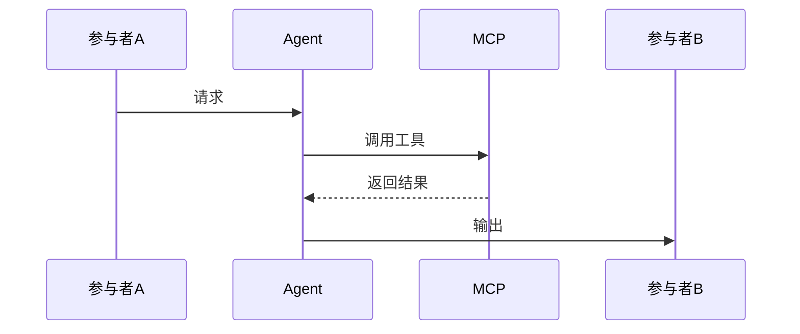

# Agent PRD模板

> **使用说明**: 本模板适用于涉及LLM/Agent的功能模块，遵循11章结构。
> **参考**: `docs/prd/5-guides/PRD_Writing_Guide.md` 第2章

---

## 文档信息

| 字段 | 说明 |
|------|------|
| **文档编号** | PRD-AGENT-[模块名]-[版本] |
| **Agent名称** | [Agent唯一标识，如AssistantAgent] |
| **核心价值** | [一句话价值主张] |
| **迭代目标** | [本次迭代具体目标] |
| **关联需求** | [用户故事ID，如US-3.1, US-3.6] |
| **状态** | [草稿/评审中/已批准] |
| **创建日期** | YYYY-MM-DD |
| **更新日期** | YYYY-MM-DD |
| **文档Owner** | [负责人姓名] |

---

## 1. Agent Profile

### 1.1 身份定义

- **Agent Name**: [Agent的唯一标识]
- **Role**: [一句话角色定位，如"情感分析 + 需求提取 + 回复生成"]
- **Personality**: [性格特征，如"友好、专业、简洁"]
- **Capabilities**: [核心能力列表]
  - [capability_1] (MCP/REST API)
  - [capability_2] (MCP/REST API)
  - [capability_3] (MCP/REST API)

### 1.2 能力边界

| 能做什么 | 不能做什么 |
|---------|-----------|
| ✅ [能力1，如"分析客户情感"] | ❌ [限制1，如"不回答产品功能问题"] |
| ✅ [能力2，如"生成回复建议"] | ❌ [限制2，如"不处理退款/赔偿"] |
| ✅ [能力3，如"提取需求关键词"] | ❌ [限制3，如"不自动发送未审核的回复"] |

### 1.3 响应风格

- **语气**: [如：友好、专业、简洁]
- **格式偏好**: [如：结构化JSON输出]
- **长度控制**: [如：回复建议控制在200字以内]
- **特殊要求**: [如：VIP客户使用敬语]

---

## 2. 提示词变更记录

### 2.1 变更历史

| 版本 | 变更内容 | 变更原因 | 日期 | 变更人 |
|-----|---------|---------|------|--------|
| v0.1 | 初始Prompt | 首次创建 | YYYY-MM-DD | [姓名] |
| v0.5 | [变更描述] | [原因] | YYYY-MM-DD | [姓名] |
| v0.8 | [变更描述] | [原因] | YYYY-MM-DD | [姓名] |

### 2.2 当前版本Prompt（完整）

```
[在此粘贴完整的Prompt文本]

示例：
你是专业的售后客服助手 [AgentName]。

**核心职责**:
1. [职责1]
2. [职责2]
3. [职责3]

**输出格式**（必须是JSON）:
```json
{
  "field1": "value",
  "field2": "value"
}
```

**示例**:
输入: [示例输入]
输出:
```json
{
  "field1": "example_value"
}
```

**边界**:
- [边界条件1]
- [边界条件2]
```

### 2.3 版本Prompt Diff（增量版本使用）

> 仅在增量PRD中填写，基线PRD跳过此节

```diff
[在此使用diff格式展示相对上一版本的变更]

示例：
核心职责:
1. 分析客户情感
+ 2. 识别消息渠道（飞书/企业微信/Web）
+ 3. 根据渠道调整回复格式
```

---

## 3. 工具清单

### 3.1 [工具名称1]

**功能描述**: [从用户视角描述工具的功能]

**分类**: [Query/Ingest/Review/Maintain/Insight]

**输入参数**:
| 参数名 | 类型 | 必填 | 说明 | 约束 | 默认值 |
|-------|------|------|------|------|--------|
| param1 | string | 是 | [参数说明] | [格式/长度限制] | - |
| param2 | boolean | 否 | [参数说明] | - | false |

**输出格式**:
```json
{
  "field1": "string",
  "field2": 0.85,
  "field3": ["array"]
}
```

**字段说明**:
| 字段名 | 类型 | 说明 | 取值范围 |
|-------|------|------|---------|
| field1 | string | [说明] | [枚举值或范围] |
| field2 | number | [说明] | 0-1 |
| field3 | array | [说明] | - |

**调用方式**: [MCP/REST API/内部方法]

**特性**:
- [智能行为1，如"自动识别VIP客户，提升优先级"]
- [智能行为2，如"置信度<0.7时推送人工审核"]
- [默认值推断，如"如果未指定语言，默认使用中文"]

**注意事项**:
- [边界条件1，如"历史消息最多分析最近10条"]
- [错误场景1，如"超时30秒自动降级到关键词匹配"]
- [与其他工具的协作，如"需要先调用getCustomerProfile获取客户等级"]

**调用示例**:
```json
// 请求
{
  "param1": "example_value",
  "param2": true
}

// 响应
{
  "field1": "result",
  "field2": 0.92
}
```

---

### 3.2 [工具名称2]

[按照3.1的格式填写]

---

### 3.3 [工具名称3]

[按照3.1的格式填写]

---

## 4. 沉淀Skills

> **说明**: 仅用于迭代版本（提炼上一版本已验证的功能）。如果是首次创建，可跳过此章节。

### 4.1 [skill_name_1]

**适用场景**: [描述此Skill适用的业务场景]

**触发条件**: [事件名称，如MessageSentEvent]

**标准流程**:
1. [步骤1]
2. [步骤2]
3. [步骤3]

**质量门禁**:
- [指标1，如"情感分析准确率>90%"]
- [指标2，如"响应时间<3秒"]

**回滚策略**:
- [条件1] → [降级行为1]
- [条件2] → [降级行为2]

**可观测性**:
- [监控指标1，如"记录每次调用的置信度分布"]
- [监控指标2，如"监控降级触发次数"]

---

### 4.2 [skill_name_2]

[按照4.1的格式填写]

---

## 5. 业务场景

### 5.1 场景1：[场景名称]

**场景描述**: [一句话描述]

**触发条件**: [具体的触发条件]

**前置条件**:
- [前置条件1]
- [前置条件2]

**处理流程**:


**对话示例**:
```
【用户】[用户输入]

【Agent思考过程】
1. 调用[工具名]()
   → 输出: {结果}

2. 判断: [条件] → [行为]

【Agent输出】
{
  "field1": "value",
  "field2": 0.92
}

【前端展示】
[UI展示效果描述]

【用户操作】
[用户的后续操作]
```

**预期输出**:
- [输出项1]
- [输出项2]

**异常分支**:
| 异常情况 | 处理方式 |
|---------|---------|
| [异常1，如"LLM超时"] | [处理方式1，如"降级到关键词匹配"] |
| [异常2，如"置信度<0.7"] | [处理方式2，如"推送人工审核"] |

**成功标准**:
- ✅ [标准1]
- ✅ [标准2]

---

### 5.2 场景2：[场景名称]

[按照5.1的格式填写]

---

### 5.3 场景3：[场景名称]

[按照5.1的格式填写]

---

## 6. 人机协作边界

### 6.1 Agent主导场景（高自动化）

**适用条件**:
- [条件1，如"简单咨询（常见问题）"]
- [条件2，如"情感分析置信度>0.9"]
- [条件3，如"非VIP客户"]

**Agent行为**:
1. [行为1]
2. [行为2]
3. [当前阶段]：需要人工审核
4. [未来阶段]：置信度>0.9自动发送（无需人工）

**自动化率目标**:
- 当前：[如"0%（全部人工审核）"]
- v0.5：[如"30%（部分自动）"]
- v0.8：[如"90%（高度自动）"]

---

### 6.2 人工主导场景（低自动化）

**适用条件**:
- [条件1，如"VIP客户"]
- [条件2，如"高风险客户（riskLevel=high）"]
- [条件3，如"负面情绪且分数<0.5"]

**Agent行为**:
1. [辅助行为1，如"提供情感分析结果"]
2. [辅助行为2，如"推荐相关知识库"]
3. [辅助行为3，如"展示历史案例"]
4. **永远需要人工确认，不自动发送**

**自动化率目标**:
- 所有版本：0%（刻意保持人工）

---

### 6.3 协作模式（Agent辅助，人工决策）

**适用条件**:
- [条件1，如"中等复杂度问题"]
- [条件2，如"置信度0.7-0.9"]

**Agent行为**:
1. [行为1，如"生成3+种回复方案"]
2. [行为2，如"标注每个方案的置信度"]
3. [行为3，如"人工选择或组合方案"]
4. [行为4，如"人工确认后发送"]

**决策流程**:
```
Agent生成建议 → 人工评估 → 人工选择/修改 → 确认发送
```

---

## 7. 非功能需求

### 7.1 性能要求

| 指标 | 目标值 | 测量方法 |
|-----|--------|---------|
| **响应时间** | <3秒（P95） | Prometheus监控LLM调用时长 |
| **首Token时间** | <1秒 | 测量LLM首个token返回时间 |
| **简单任务完成时间** | <5秒 | 端到端测量（输入→输出） |
| **复杂任务完成时间** | <30秒 | 多工具调用场景 |

### 7.2 质量指标

| 指标 | 目标值 | 测量方法 |
|-----|--------|---------|
| **任务完成率** | >95% | 成功输出/总调用次数 |
| **意图识别准确率** | >85% | 人工抽检100条/周，对比标注 |
| **情感分析准确率** | >90% | 同上 |
| **满意度** | >4.5/5 | 用户反馈评分 |

### 7.3 成本约束

| 指标 | 目标值 | 测量方法 |
|-----|--------|---------|
| **LLM调用成本** | <¥5000/月 | DeepSeek计费统计 |
| **Token消耗** | <100k tokens/天 | 监控每次调用的token数 |
| **工具调用次数** | <1000次/小时 | MCP调用统计 |

### 7.4 可用性

| 指标 | 目标值 | 说明 |
|-----|--------|------|
| **系统可用性** | >99.9% | 降级策略保障 |
| **降级触发率** | <5% | 降级到关键词匹配的比例 |
| **故障恢复时间** | <5分钟 | 从故障到恢复正常的时间 |

---

## 8. 验收场景

### 8.1 验收场景清单

| 场景ID | 场景描述 | 优先级 | 依赖 |
|--------|---------|--------|------|
| AC-01 | [场景1] | P0 | 无 |
| AC-02 | [场景2] | P0 | AC-01 |
| AC-03 | [场景3] | P1 | 无 |

---

### AC-01: [场景名称]

**场景描述**: [详细描述]

**输入**:
```
[输入示例]
```

**预期输出**:
```json
{
  "field1": "expected_value",
  "field2": 0.92
}
```

**验收标准**:
- ✅ [标准1，如"field1识别正确"]
- ✅ [标准2，如"field2>0.9"]
- ✅ [标准3，如"响应时间<3秒"]

**测试数据**:
| 输入 | 预期输出 | 实际结果 | 状态 |
|-----|---------|---------|------|
| [测试数据1] | [预期1] | [待测试] | ⏳ |
| [测试数据2] | [预期2] | [待测试] | ⏳ |

---

### AC-02: [场景名称]

[按照AC-01的格式填写]

---

### AC-03: [场景名称]

[按照AC-01的格式填写]

---

## 9. 降级策略

### 9.1 降级层级

```
主路径: LLM分析 ([模型名称])
  ↓ [触发条件，如"超时30秒/调用失败"]
降级1: [降级方案1，如"关键词匹配算法"]
  ↓ [触发条件，如"无匹配结果"]
降级2: [降级方案2，如"默认规则引擎"]
  ↓ [触发条件，如"规则无覆盖"]
降级3: [降级方案3，如"人工介入"]
```

### 9.2 [能力名称]降级策略

#### 主路径: LLM分析
- **触发条件**: 正常情况
- **行为**: [详细描述]
- **输出**: [输出格式]

#### 降级1: [降级方案名称]
- **触发条件**: [条件]
- **行为**: [详细描述]
- **输出**: [输出格式]
- **置信度**: [如0.5-0.7]

#### 降级2: [降级方案名称]
- **触发条件**: [条件]
- **行为**: [详细描述]
- **输出**: [输出格式]
- **置信度**: [如0.3-0.5]

#### 降级3: 人工介入
- **触发条件**: [条件]
- **行为**: [详细描述]

### 9.3 降级监控

| 监控指标 | 告警阈值 | 处理措施 |
|---------|---------|---------|
| 降级1触发率 | >10% | 优化LLM Prompt或增加超时时间 |
| 降级2触发率 | >5% | 扩充关键词库 |
| 降级3触发率 | >2% | 检查系统故障 |

---

## 10. 监控指标

### 10.1 核心指标

| 指标名称 | 指标定义 | 监控工具 | 告警阈值 |
|---------|---------|---------|---------|
| **LLM调用次数** | 每小时调用量 | Prometheus | >1000次/小时 |
| **LLM调用成功率** | 成功调用/总调用 | Prometheus | <95% |
| **平均响应时间** | P95响应时长 | Prometheus | >5秒 |
| **置信度分布** | 各置信度区间占比 | Grafana | <0.7占比>20% |
| **降级触发次数** | 降级到关键词匹配次数 | Prometheus | >100次/小时 |
| **Token消耗** | 每日总Token | Prometheus | >100k tokens/天 |
| **成本** | 每日LLM调用费用 | 自定义脚本 | >¥200/天 |

### 10.2 Prometheus指标定义

```promql
# LLM调用总次数
llm_calls_total{agent="[AgentName]", model="[模型名]"}

# LLM调用失败次数
llm_calls_failed{agent="[AgentName]", error_type="timeout"}

# LLM响应时间（直方图）
llm_response_duration_seconds{agent="[AgentName]"}

# 置信度分布
llm_confidence_score{agent="[AgentName]", bucket="0.9-1.0"}

# 降级触发次数
llm_fallback_triggered{agent="[AgentName]", fallback_level="1"}
```

### 10.3 Grafana仪表板

**面板1**: LLM调用量趋势（折线图）
- X轴：时间
- Y轴：调用次数
- 分组：成功/失败

**面板2**: 置信度分布（饼图）
- 区间：0-0.5 / 0.5-0.7 / 0.7-0.9 / 0.9-1.0

**面板3**: 响应时间P50/P95/P99（折线图）
- X轴：时间
- Y轴：响应时间（秒）

**面板4**: 降级触发次数（柱状图）
- X轴：时间
- Y轴：降级次数
- 分组：降级1/降级2/降级3

**面板5**: 每日成本（面积图）
- X轴：日期
- Y轴：成本（元）

---

## 11. 示例对话

### 11.1 示例1：[场景名称]

**对话背景**: [描述对话发生的背景]

```
【用户】[用户输入]

【Agent思考过程】
1. 调用[工具名]()
   → 输入: {参数}
   → 输出: {结果}

2. 调用[工具名]()
   → 输入: {参数}
   → 输出: {结果}

3. 判断: [条件] → [行为]

【Agent输出】
{
  "field1": "value",
  "field2": 0.92,
  "field3": "suggested action"
}

【前端展示】
[描述UI如何展示Agent的输出]

【用户操作】
[描述用户看到展示后的操作]
```

**关键决策点**:
- [决策点1，如"为什么选择方案A而不是方案B"]
- [决策点2，如"置信度0.92是如何计算的"]

---

### 11.2 示例2：[场景名称]

[按照11.1的格式填写]

---

### 11.3 示例3：[场景名称]

[按照11.1的格式填写]

---

## 附录A：术语表

| 术语 | 定义 |
|-----|------|
| [术语1] | [定义] |
| [术语2] | [定义] |

---

## 附录B：外围系统依赖

| 系统名称 | 依赖关系 | 接口 | 负责人 |
|---------|---------|------|--------|
| [系统1] | [依赖说明] | [API路径] | [负责人] |
| [系统2] | [依赖说明] | [API路径] | [负责人] |

---

## 附录C：待决策事项

| 事项ID | 事项描述 | 备选方案 | 决策人 | 状态 |
|--------|---------|---------|--------|------|
| Q-01 | [待决策问题] | [方案A / 方案B] | [姓名] | ⏳待决策 |
| Q-02 | [待决策问题] | [方案A / 方案B] | [姓名] | ✅已决策 |

---

## 附录D：变更历史

| 版本 | 日期 | 变更内容 | 变更人 | 审核人 |
|-----|------|---------|--------|--------|
| v1.0 | YYYY-MM-DD | 初始版本 | [姓名] | [姓名] |
| v1.1 | YYYY-MM-DD | [变更描述] | [姓名] | [姓名] |

---

**文档结束**

---

## 填写检查清单

在提交Agent PRD前，请确认以下内容已完整填写：

- [ ] 文档信息表完整（编号/名称/状态/日期/Owner）
- [ ] Agent Profile包含4个必填项（Name/Role/Personality/Capabilities）
- [ ] 提示词变更记录使用diff格式（增量版本）
- [ ] 工具清单至少3个，包含输入/输出/调用方式
- [ ] 业务场景至少3个（正常/异常/边界）
- [ ] 对话示例至少2个（简单/复杂场景）
- [ ] 人机协作边界明确（Agent主导/人工主导/协作）
- [ ] 非功能需求有具体数值目标
- [ ] 验收场景覆盖P0功能
- [ ] 降级策略至少2层
- [ ] 监控指标包含成本指标
- [ ] 示例对话包含完整的思考过程

---

## 参考资源

- **编写指南**: `docs/prd/5-guides/PRD_Writing_Guide.md`
- **格式参考**: `docs/prd/【格式参考】Integrated_Product_Requirements_Document_V2_MVP_Refined.md`
- **功能PRD模板**: `docs/prd/4-templates/Feature_PRD_Template.md`
- **混合PRD模板**: `docs/prd/4-templates/Hybrid_PRD_Template.md`
