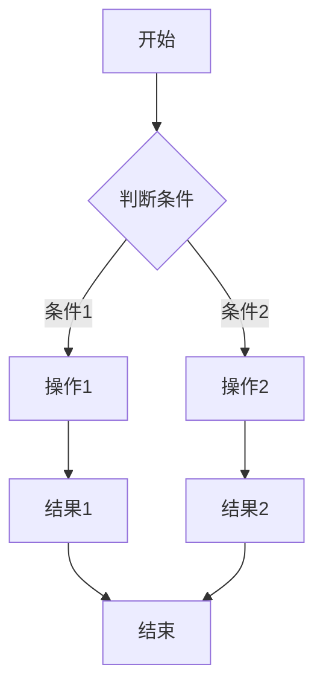
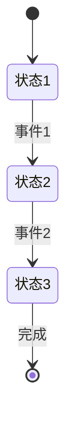
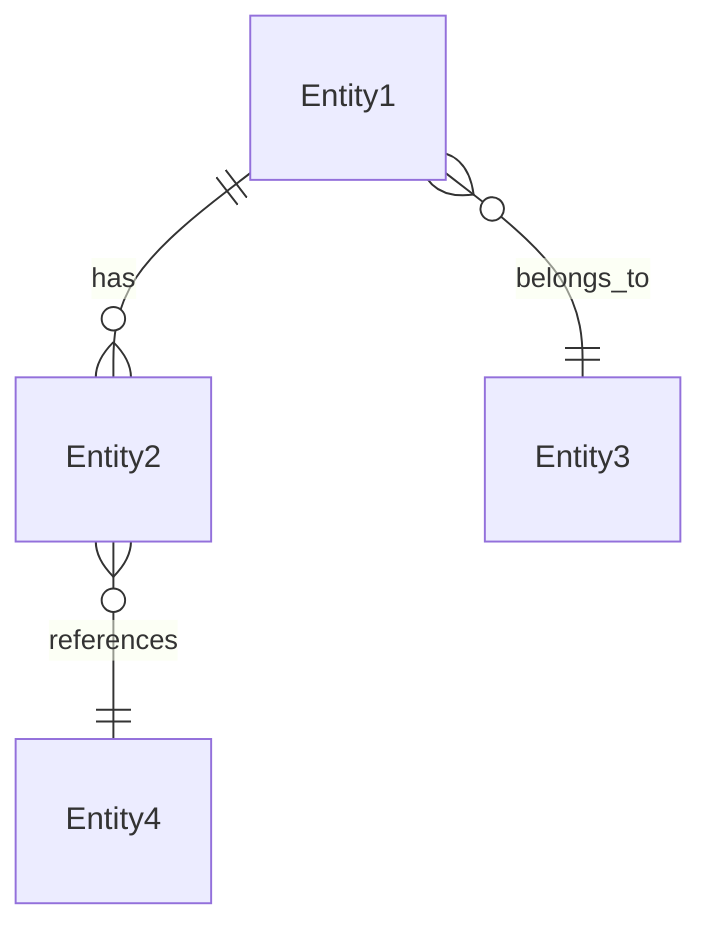

# 功能PRD模板

> **使用说明**: 本模板适用于传统功能模块（不涉及LLM/Agent），遵循8章结构。
> **参考**: `docs/prd/5-guides/PRD_Writing_Guide.md` 第3章

---

## 文档信息

| 字段 | 说明 |
|------|------|
| **文档编号** | PRD-FEATURE-[模块名]-[版本] |
| **功能名称** | [功能的完整名称] |
| **核心价值** | [一句话价值主张] |
| **迭代目标** | [本次迭代具体目标] |
| **关联需求** | [用户故事ID，如US-2.1, US-2.3] |
| **状态** | [草稿/评审中/已批准] |
| **创建日期** | YYYY-MM-DD |
| **更新日期** | YYYY-MM-DD |
| **文档Owner** | [负责人姓名] |

---

## 1. 功能概述

### 1.1 功能定位

[一句话描述功能的定位和核心目标]

### 1.2 目标用户

- **主要用户**: [用户角色1，如"一线客服"]
- **次要用户**: [用户角色2，如"售后经理"]

### 1.3 核心价值

**对用户的价值**:
- [价值点1，如"减少重复询问客户信息，提升效率"]
- [价值点2，如"通过健康度评分识别高风险客户"]

**对业务的价值**:
- [业务价值1，如"提升客户满意度"]
- [业务价值2，如"降低服务成本"]

### 1.4 优先级

- **优先级**: [P0/P1/P2]
- **RICE分数**: [分数，如85分]
  - Reach（影响用户数）: [如"100+客服"]
  - Impact（对用户价值）: [如"高"]
  - Confidence（成功把握）: [如"90%"]
  - Effort（开发成本）: [如"2周"]

---

## 2. 功能需求

### 2.1 用户故事

**US-01**: 作为[角色]，我希望[功能]，以便[价值]

**US-02**: 作为[角色]，我希望[功能]，以便[价值]

**US-03**: 作为[角色]，我希望[功能]，以便[价值]

### 2.2 功能列表

| 功能项 | 描述 | 优先级 | 依赖 | 工作量 |
|-------|------|--------|------|--------|
| [功能1] | [功能描述] | P0 | 无 | [如2天] |
| [功能2] | [功能描述] | P0 | 功能1 | [如3天] |
| [功能3] | [功能描述] | P1 | 无 | [如1天] |

### 2.3 详细规格说明

#### 功能1：[功能名称]

**功能描述**: [详细描述功能的目的和行为]

**字段定义**:
| 字段名 | 类型 | 必填 | 说明 | 示例 | 约束 |
|-------|------|------|------|------|------|
| field1 | string | 是 | [字段说明] | "example" | 长度1-50 |
| field2 | number | 否 | [字段说明] | 100 | >0 |
| field3 | boolean | 是 | [字段说明] | true | - |

**交互行为**:
1. [用户操作1] → [系统响应1]
2. [用户操作2] → [系统响应2]
3. [用户操作3] → [系统响应3]

**边界条件**:
- [条件1] → [处理方式]
- [条件2] → [处理方式]

**权限要求**:
- [角色1]：[权限级别，如"只读"]
- [角色2]：[权限级别，如"读写"]

---

#### 功能2：[功能名称]

[按照功能1的格式填写]

---

#### 功能3：[功能名称]

[按照功能1的格式填写]

---

## 3. UI设计

### 3.1 页面布局

#### 布局方案1：[布局名称]

**页面结构**:
```
[在此绘制ASCII布局图或引用Figma链接]

示例：
┌─────────────────────────────────────┐
│ 页面标题                              │
├─────────────────────────────────────┤
│ ┌─────────┐ ┌─────────────────────┐ │
│ │ 左侧栏  │ │ 主内容区             │ │
│ │         │ │                     │ │
│ │         │ │                     │ │
│ └─────────┘ └─────────────────────┘ │
└─────────────────────────────────────┘
```

**布局说明**:
- **左侧栏**: [说明，如"宽度250px，展示导航菜单"]
- **主内容区**: [说明，如"自适应宽度，展示核心内容"]

### 3.2 组件说明

#### 组件1：[组件名称]

**组件类型**: [如"卡片/表格/表单/按钮"]

**位置**: [页面中的位置]

**样式规范**:
| 属性 | 值 |
|-----|---|
| 宽度 | [如"100%"] |
| 高度 | [如"auto"] |
| 背景色 | [如"#ffffff"] |
| 边框 | [如"1px solid #e5e5e5"] |
| 圆角 | [如"4px"] |
| 内边距 | [如"16px"] |

**状态设计**:
| 状态 | 样式变化 | 触发条件 |
|-----|---------|---------|
| 默认 | [样式描述] | - |
| hover | [样式描述] | 鼠标悬停 |
| active | [样式描述] | 点击时 |
| disabled | [样式描述] | 不可用时 |

**交互行为**:
- [行为1，如"点击卡片展开详情"]
- [行为2，如"双击进入编辑模式"]

---

#### 组件2：[组件名称]

[按照组件1的格式填写]

---

### 3.3 样式规范

#### 颜色规范

| 用途 | 颜色值 | 示例 |
|-----|--------|------|
| 主色调 | #1890ff | 主按钮、链接 |
| 成功色 | #52c41a | 成功提示、健康状态 |
| 警告色 | #faad14 | 警告提示、中等风险 |
| 错误色 | #f5222d | 错误提示、高风险 |
| 文字主色 | #1a1a1a | 标题、正文 |
| 文字次色 | #666666 | 辅助文字 |
| 边框色 | #e5e5e5 | 分割线、卡片边框 |
| 背景色 | #f5f5f5 | 页面背景 |

#### 字体规范

| 类型 | 字体 | 大小 | 行高 | 粗细 |
|-----|------|------|------|------|
| 页面标题 | PingFang SC | 24px | 32px | 600 |
| 模块标题 | PingFang SC | 18px | 26px | 500 |
| 卡片标题 | PingFang SC | 16px | 24px | 500 |
| 正文 | PingFang SC | 14px | 22px | 400 |
| 辅助文字 | PingFang SC | 12px | 20px | 400 |

#### 间距规范

| 类型 | 值 |
|-----|---|
| 卡片间距 | 16px |
| 组件间距 | 12px |
| 内边距（小） | 8px |
| 内边距（中） | 12px |
| 内边距（大） | 16px |

### 3.4 响应式设计

| 断点 | 宽度范围 | 布局调整 |
|-----|---------|---------|
| Desktop | >1200px | 三栏布局 |
| Tablet | 768-1199px | 两栏布局，隐藏右侧栏 |
| Mobile | <768px | 单栏布局，顶部导航 |

---

## 4. 交互流程

### 4.1 主流程



**流程说明**:
1. [步骤1描述]
2. [步骤2描述]
3. [步骤3描述]

### 4.2 异常分支

#### 异常1：[异常名称]

- **触发条件**: [条件描述]
- **处理方式**: [处理步骤]
- **用户提示**: [提示文案]
- **恢复方式**: [如何恢复正常流程]

---

#### 异常2：[异常名称]

[按照异常1的格式填写]

---

### 4.3 状态机（如适用）



**状态说明**:
| 状态 | 描述 | 可执行操作 | 下一状态 |
|-----|------|-----------|---------|
| 状态1 | [描述] | [操作1, 操作2] | 状态2 |
| 状态2 | [描述] | [操作3, 操作4] | 状态3 |

---

## 5. 接口定义

### 5.1 [API名称1]

**接口路径**: `/api/[模块]/[资源]`

**请求方法**: [GET/POST/PUT/DELETE]

**权限要求**: [需要登录/角色要求]

**路径参数**:
| 参数名 | 类型 | 必填 | 说明 | 示例 |
|-------|------|------|------|------|
| param1 | string | 是 | [说明] | "value" |

**查询参数**:
| 参数名 | 类型 | 必填 | 说明 | 默认值 |
|-------|------|------|------|--------|
| param2 | number | 否 | [说明] | 10 |
| param3 | boolean | 否 | [说明] | false |

**请求体**（POST/PUT）:
```json
{
  "field1": "string",
  "field2": 100,
  "field3": true
}
```

**请求体字段说明**:
| 字段名 | 类型 | 必填 | 说明 | 约束 |
|-------|------|------|------|------|
| field1 | string | 是 | [说明] | 长度1-50 |
| field2 | number | 否 | [说明] | >0 |
| field3 | boolean | 是 | [说明] | - |

**请求示例**:
```bash
[HTTP方法] /api/[完整路径]?param2=20
Authorization: Bearer <token>
Content-Type: application/json

{
  "field1": "example",
  "field2": 100
}
```

**响应体**（成功）:
```json
{
  "success": true,
  "data": {
    "id": "123",
    "field1": "example",
    "createdAt": "2025-12-29T10:00:00Z"
  }
}
```

**响应体字段说明**:
| 字段名 | 类型 | 说明 |
|-------|------|------|
| success | boolean | 请求是否成功 |
| data | object | 返回数据 |
| data.id | string | 资源ID |

**响应体**（失败）:
```json
{
  "success": false,
  "error": {
    "code": "ERROR_CODE",
    "message": "错误描述"
  }
}
```

**错误码**:
| 错误码 | HTTP状态码 | 说明 | 处理建议 |
|-------|-----------|------|---------|
| INVALID_PARAM | 400 | 参数错误 | 检查请求参数 |
| UNAUTHORIZED | 401 | 未登录 | 重新登录 |
| FORBIDDEN | 403 | 权限不足 | 联系管理员 |
| NOT_FOUND | 404 | 资源不存在 | 检查资源ID |
| INTERNAL_ERROR | 500 | 服务器内部错误 | 联系技术支持 |

---

### 5.2 [API名称2]

[按照5.1的格式填写]

---

### 5.3 [API名称3]

[按照5.1的格式填写]

---

## 6. 数据模型

### 6.1 [实体名称1]

**实体描述**: [实体的业务含义]

**TypeScript接口定义**:
```typescript
interface Entity1 {
  id: string;                    // 主键，唯一标识
  field1: string;                // [字段说明]
  field2?: number;               // [字段说明]（可选）
  field3: 'enum1' | 'enum2';     // [字段说明]（枚举）
  nestedObject: {                // 嵌套对象
    subField1: string;
    subField2: number;
  };
  arrayField: Entity2[];         // 数组字段
  createdAt: Date;               // 创建时间
  updatedAt: Date;               // 更新时间
}
```

**字段说明**:
| 字段名 | 类型 | 必填 | 说明 | 约束 | 默认值 |
|-------|------|------|------|------|--------|
| id | string | 是 | 主键 | UUID格式 | - |
| field1 | string | 是 | [说明] | 长度1-100 | - |
| field2 | number | 否 | [说明] | >0 | 0 |
| field3 | enum | 是 | [说明] | enum1/enum2 | enum1 |

**关联关系**:
- [关系1，如"一对多关联Entity2"]
- [关系2，如"多对一关联Entity3"]

**索引设计**:
| 索引名称 | 字段 | 类型 | 说明 |
|---------|------|------|------|
| idx_field1 | field1 | B-tree | 加速查询 |
| idx_created_at | createdAt | B-tree | 按时间排序 |

---

### 6.2 [实体名称2]

[按照6.1的格式填写]

---

### 6.3 实体关系图（ERD）



**关系说明**:
| 关系 | 基数 | 说明 |
|-----|------|------|
| Entity1 → Entity2 | 一对多 | 一个Entity1可以有多个Entity2 |
| Entity1 → Entity3 | 多对一 | 多个Entity1属于一个Entity3 |

---

## 7. 验收标准

### 7.1 功能验收

| 验收项 | 验收标准 | 优先级 | 测试方法 |
|-------|---------|--------|---------|
| [功能1] | [标准描述] | P0 | [手动/自动化] |
| [功能2] | [标准描述] | P0 | [手动/自动化] |
| [功能3] | [标准描述] | P1 | [手动/自动化] |

**详细验收场景**:

#### 场景1：[验收场景名称]

**前置条件**:
- [条件1]
- [条件2]

**操作步骤**:
1. [步骤1]
2. [步骤2]
3. [步骤3]

**预期结果**:
- ✅ [结果1]
- ✅ [结果2]

**实际结果**: [待测试填写]

**状态**: ⏳待测试 / ✅通过 / ❌失败

---

### 7.2 性能验收

| 验收项 | 验收标准 | 测试方法 |
|-------|---------|---------|
| API响应时间 | <2秒（P95） | Apache Bench压测 |
| 前端首屏渲染 | <1秒 | Lighthouse测试 |
| 并发支持 | 100并发，响应时间<5秒 | JMeter压测 |
| 数据库查询 | <500ms | 慢查询日志 |

**性能测试场景**:

#### 场景1：[性能场景名称]

**测试目标**: [如"验证API在100并发下的响应时间"]

**测试工具**: [如"Apache Bench"]

**测试参数**:
- 并发数：[如100]
- 请求总数：[如10000]
- 持续时间：[如60秒]

**验收标准**:
- P50响应时间 < [如1秒]
- P95响应时间 < [如2秒]
- P99响应时间 < [如5秒]
- 错误率 < [如1%]

**测试结果**: [待测试填写]

---

### 7.3 安全验收

| 验收项 | 验收标准 | 测试方法 |
|-------|---------|---------|
| 数据传输加密 | HTTPS传输 | 抓包验证 |
| 数据存储加密 | 敏感字段AES-256加密 | 数据库查看 |
| 权限控制 | 基于RBAC，细粒度到字段级 | 权限矩阵测试 |
| SQL注入防护 | 所有输入参数化查询 | OWASP ZAP扫描 |
| XSS防护 | 所有输出转义 | XSS测试 |
| CSRF防护 | Token验证 | CSRF测试 |

**安全测试场景**:

#### 场景1：权限控制测试

**测试目标**: 验证不同角色的权限隔离

**测试步骤**:
1. 使用角色A登录
2. 尝试访问角色B的资源
3. 验证返回403 Forbidden

**预期结果**: ✅ 权限隔离有效

---

### 7.4 兼容性验收

| 验收项 | 验收标准 |
|-------|---------|
| 浏览器兼容 | Chrome/Firefox/Safari/Edge 最近2个版本 |
| 移动端兼容 | iOS 13+, Android 8+ |
| 屏幕分辨率 | 1920x1080 / 1366x768 / 375x667（移动端） |

---

## 8. 非功能需求

### 8.1 性能要求

| 指标 | 目标值 | 测量方法 |
|-----|--------|---------|
| API响应时间 | <2秒（P95） | Prometheus监控 |
| 前端渲染时间 | <1秒 | Lighthouse |
| 并发支持 | 100并发 | 压力测试 |
| 数据库查询 | <500ms | 慢查询日志 |
| 内存占用 | <500MB | 进程监控 |
| CPU占用 | <50% | 系统监控 |

### 8.2 可用性要求

| 指标 | 目标值 |
|-----|--------|
| 系统可用性 | >99% |
| 错误率 | <1% |
| 数据一致性 | 100% |
| 恢复时间目标（RTO） | <5分钟 |
| 恢复点目标（RPO） | <1小时 |

### 8.3 安全要求

**数据安全**:
- 数据传输：HTTPS加密
- 数据存储：敏感字段AES-256加密
- 数据备份：每日备份，保留30天

**访问控制**:
- 认证：JWT Token，过期时间24小时
- 授权：基于RBAC，细粒度到字段级
- 审计日志：记录所有写操作

**漏洞防护**:
- SQL注入：参数化查询
- XSS：输出转义
- CSRF：Token验证
- 文件上传：类型和大小限制

### 8.4 可扩展性要求

**横向扩展**:
- 支持多实例部署
- 无状态设计，session存储在Redis

**纵向扩展**:
- 支持自定义字段扩展
- 支持插件机制

**国际化**:
- 支持多语言（中/英/日）
- 支持时区转换
- 支持货币格式化

### 8.5 可维护性要求

**代码质量**:
- 单元测试覆盖率 >80%
- 集成测试覆盖核心流程
- 代码注释率 >30%

**文档完整性**:
- API文档（OpenAPI规范）
- 部署文档
- 运维手册

**监控完善**:
- 日志记录（分级：DEBUG/INFO/WARN/ERROR）
- 指标采集（Prometheus）
- 链路追踪（Jaeger）

---

## 附录A：术语表

| 术语 | 定义 |
|-----|------|
| [术语1] | [定义] |
| [术语2] | [定义] |

---

## 附录B：外围系统依赖

|---------|---------|------|--------|-----|
| [系统1] | [依赖说明] | [API路径] | [负责人] | [如99.9%] |
| [系统2] | [依赖说明] | [API路径] | [负责人] | [如99%] |

---

## 附录C：待决策事项

| 事项ID | 事项描述 | 备选方案 | 决策人 | 截止日期 | 状态 |
|--------|---------|---------|--------|---------|------|
| Q-01 | [待决策问题] | [方案A / 方案B] | [姓名] | YYYY-MM-DD | ⏳待决策 |
| Q-02 | [待决策问题] | [方案A / 方案B] | [姓名] | YYYY-MM-DD | ✅已决策 |

---

## 附录D：变更历史

| 版本 | 日期 | 变更内容 | 变更人 | 审核人 |
|-----|------|---------|--------|--------|
| v1.0 | YYYY-MM-DD | 初始版本 | [姓名] | [姓名] |
| v1.1 | YYYY-MM-DD | [变更描述] | [姓名] | [姓名] |

---

**文档结束**

---

## 填写检查清单

在提交功能PRD前，请确认以下内容已完整填写：

- [ ] 文档信息表完整（编号/名称/状态/日期/Owner）
- [ ] 功能概述包含用户故事（As a/I want/So that）
- [ ] 功能列表使用表格形式，包含优先级和依赖
- [ ] UI设计包含页面布局（ASCII图/Figma链接）
- [ ] 样式规范包含颜色/字体/间距
- [ ] 交互流程包含主流程和异常分支（流程图）
- [ ] 接口定义包含请求/响应/错误码
- [ ] 数据模型使用TypeScript接口定义
- [ ] 验收标准包含功能/性能/安全三个维度
- [ ] 非功能需求有具体数值目标

---

## 参考资源

- **编写指南**: `docs/prd/5-guides/PRD_Writing_Guide.md`
- **格式参考**: `docs/prd/【格式参考】Feature_product_requirements_document.md`
- **Agent PRD模板**: `docs/prd/4-templates/Agent_PRD_Template.md`
- **混合PRD模板**: `docs/prd/4-templates/Hybrid_PRD_Template.md`
