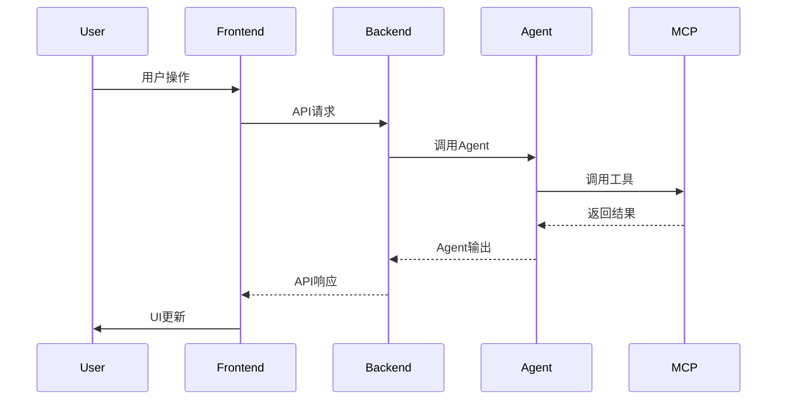
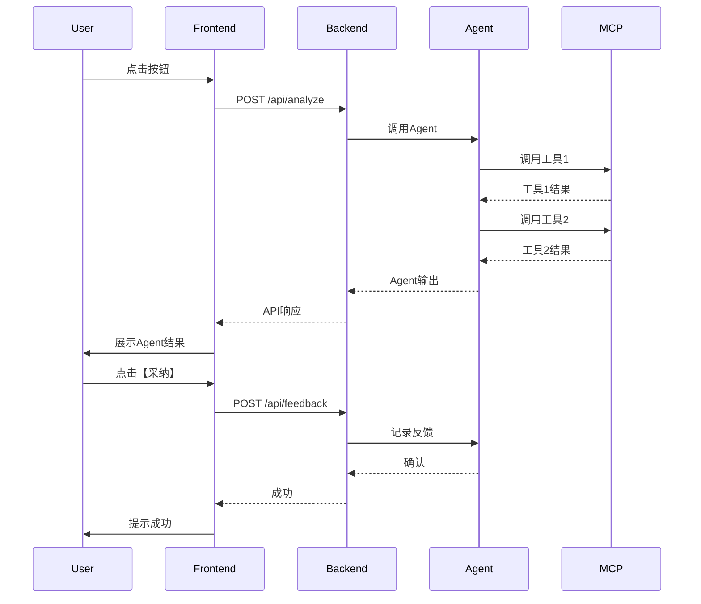

# 混合PRD模板

> **使用说明**: 本模板适用于同时涉及AI能力和UI交互的功能模块，结合Agent PRD和功能PRD。
> **参考**: `docs/prd/5-guides/PRD_Writing_Guide.md` 第4章

---

## 文档信息

| 字段 | 说明 |
|------|------|
| **文档编号** | PRD-HYBRID-[模块名]-[版本] |
| **功能名称** | [功能的完整名称] |
| **Agent名称** | [涉及的Agent名称] |
| **核心价值** | [一句话价值主张] |
| **迭代目标** | [本次迭代具体目标] |
| **关联需求** | [用户故事ID，如US-4.1, US-4.3] |
| **状态** | [草稿/评审中/已批准] |
| **创建日期** | YYYY-MM-DD |
| **更新日期** | YYYY-MM-DD |
| **文档Owner** | [负责人姓名] |

---

## 第1部分：Agent能力部分

> **说明**: 本部分采用Agent PRD格式，描述AI能力和智能行为

### 1.1 Agent Profile

#### 1.1.1 身份定义

- **Agent Name**: [Agent的唯一标识]
- **Role**: [一句话角色定位]
- **本模块职责**: [在本功能模块中的具体职责]
- **Capabilities**: [核心能力列表]
  - [capability_1] (MCP/REST API)
  - [capability_2] (MCP/REST API)

#### 1.1.2 能力边界

| 能做什么 | 不能做什么 |
|---------|-----------|
| ✅ [Agent能力1] | ❌ [限制1] |
| ✅ [Agent能力2] | ❌ [限制2] |

---

### 1.2 工具清单

#### 工具1：[工具名称]

**功能描述**: [从用户视角描述工具的功能]

**输入参数**:
| 参数名 | 类型 | 必填 | 说明 | 约束 |
|-------|------|------|------|------|
| param1 | string | 是 | [说明] | [约束] |
| param2 | boolean | 否 | [说明] | - |

**输出格式**:
```json
{
  "field1": "string",
  "field2": 0.85,
  "field3": ["array"]
}
```

**调用方式**: [MCP/REST API]

**与UI的关联**: [说明此工具的输出如何在UI中展示]
- `field1` → [UI元素1，如"卡片标题"]
- `field2` → [UI元素2，如"置信度百分比"]
- `field3` → [UI元素3，如"推荐列表"]

---

#### 工具2：[工具名称]

[按照工具1的格式填写]

---

### 1.3 业务场景

#### 场景1：[场景名称]

**场景描述**: [一句话描述]

**触发条件**: [具体的触发条件]

**Agent处理流程**:


**Agent输出**:
```json
{
  "field1": "value",
  "field2": 0.92
}
```

**UI展示**:
[描述Agent输出如何映射到UI元素]

---

#### 场景2：[场景名称]

[按照场景1的格式填写]

---

### 1.4 非功能需求（Agent部分）

| 指标 | 目标值 | 测量方法 |
|-----|--------|---------|
| **Agent响应时间** | <3秒（P95） | Prometheus监控 |
| **准确率** | >85% | 人工抽检 |
| **可用性** | >99.9% | 降级策略保障 |
| **成本** | <¥[金额]/月 | LLM调用统计 |

---

## 第2部分：功能部分

> **说明**: 本部分采用功能PRD格式，描述UI/UX和传统功能

### 2.1 功能需求

#### 2.1.1 用户故事

**US-01**: 作为[角色]，我希望[功能]，以便[价值]

**US-02**: 作为[角色]，我希望[功能]，以便[价值]

#### 2.1.2 功能列表

| 功能项 | 描述 | 优先级 | 依赖 |
|-------|------|--------|------|
| [功能1] | [描述] | P0 | 无 |
| [功能2] | [描述] | P0 | 功能1 |

---

### 2.2 UI设计

#### 2.2.1 页面布局

```
[在此绘制ASCII布局图]

示例：
┌─────────────────────────────────────┐
│ 功能标题                              │
├─────────────────────────────────────┤
│ ┌─────────────────────────────────┐ │
│ │ Agent输出展示区                  │ │
│ │                                 │ │
│ │ [Agent生成的内容]                │ │
│ │                                 │ │
│ │ 置信度: 92%                      │ │
│ │ [采纳] [修改] [拒绝]             │ │
│ └─────────────────────────────────┘ │
│                                      │
│ ┌─────────────────────────────────┐ │
│ │ 用户操作区                       │ │
│ │ [输入框/按钮/选项]               │ │
│ └─────────────────────────────────┘ │
└─────────────────────────────────────┘
```

#### 2.2.2 组件说明

**组件1：Agent输出展示卡片**

**位置**: [页面中的位置]

**样式规范**:
| 属性 | 值 |
|-----|---|
| 背景色 | #f5f5f5（Agent生成内容使用浅灰色背景区分） |
| 边框 | 1px solid #d9d9d9 |
| 圆角 | 8px |
| 内边距 | 16px |

**状态设计**:
| 状态 | 样式变化 | 触发条件 |
|-----|---------|---------|
| 加载中 | 显示骨架屏 | Agent处理中 |
| 成功 | 显示完整内容 | Agent返回结果 |
| 失败 | 显示错误提示 | Agent调用失败 |
| 低置信度 | 橙色边框 + 警告图标 | 置信度<0.7 |

**交互行为**:
- [行为1，如"点击【采纳】按钮，将Agent建议填入输入框"]
- [行为2，如"点击【修改】按钮，进入编辑模式"]

---

### 2.3 接口定义

#### API 1：触发Agent分析

**接口路径**: `/api/[模块]/analyze`

**请求方法**: POST

**请求体**:
```json
{
  "input": "用户输入或上下文",
  "options": {
    "option1": "value"
  }
}
```

**响应体**（成功）:
```json
{
  "success": true,
  "data": {
    "agentOutput": {
      "field1": "value",
      "field2": 0.92
    },
    "confidence": 0.92,
    "needHumanReview": false
  }
}
```

**响应体字段说明**:
| 字段名 | 类型 | 说明 | 前端使用 |
|-------|------|------|---------|
| agentOutput | object | Agent的输出结果 | 渲染到展示卡片 |
| confidence | number | 置信度（0-1） | 显示百分比 |
| needHumanReview | boolean | 是否需要人工审核 | 显示警告提示 |

---

### 2.4 数据模型

#### 实体1：[实体名称]

**TypeScript接口定义**:
```typescript
interface Entity {
  id: string;
  // Agent相关字段
  agentOutput: {
    field1: string;
    field2: number;
  };
  confidence: number;
  // 功能相关字段
  userInput: string;
  status: 'pending' | 'approved' | 'rejected';
  createdAt: Date;
  updatedAt: Date;
}
```

**字段分类**:
| 字段名 | 来源 | 说明 |
|-------|------|------|
| agentOutput | Agent生成 | Agent的输出结果 |
| confidence | Agent生成 | Agent的置信度 |
| userInput | 用户输入 | 用户的原始输入 |
| status | 用户操作 | 用户对Agent建议的操作 |

---

## 第3部分：人机协作设计

> **说明**: 本部分描述Agent和UI如何协同工作

### 3.1 Agent输出 → UI展示

**数据流转**:
```
Agent输出
  ↓
Backend API响应
  ↓
Frontend接收
  ↓
UI渲染
```

**字段映射表**:
| Agent输出字段 | UI元素 | 映射逻辑 |
|-------------|--------|---------|
| agentOutput.field1 | 卡片标题 | 直接展示 |
| agentOutput.field2 | 置信度进度条 | 转换为百分比（×100） |
| confidence | 警告提示 | <0.7显示"需人工审核" |
| needHumanReview | 操作按钮状态 | true时【采纳】按钮置灰 |

**示例**:
```javascript
// Agent输出
{
  "agentOutput": {
    "field1": "推荐方案A",
    "field2": 0.92
  },
  "confidence": 0.92,
  "needHumanReview": false
}

// UI渲染逻辑
<div class="agent-card">
  <h3>{agentOutput.field1}</h3>  <!-- 推荐方案A -->
  <div class="confidence-bar">
    <span>{confidence * 100}%</span>  <!-- 92% -->
  </div>
  <button :disabled="needHumanReview">采纳</button>  <!-- 可用 -->
</div>
```

---

### 3.2 UI操作 → Agent触发

**用户操作流程**:
```
用户操作（如点击按钮）
  ↓
Frontend发送API请求
  ↓
Backend调用Agent
  ↓
Agent执行分析
  ↓
返回结果到Frontend
  ↓
UI更新
```

**操作类型与Agent行为**:
| 用户操作 | 触发的Agent行为 | 预期结果 |
|---------|---------------|---------|
| 点击【刷新】 | 重新调用Agent分析 | 更新Agent输出 |
| 点击【采纳】 | 记录采纳事件 | 提升Agent学习数据 |
| 点击【拒绝】 | 记录拒绝事件 + 原因 | 用于Agent优化 |
| 修改Agent建议 | 记录修改diff | 分析用户修改模式 |

**事件记录**:
```typescript
interface UserFeedback {
  action: 'accept' | 'reject' | 'modify';
  agentOutputId: string;
  originalOutput: any;
  modifiedOutput?: any;  // 如果是modify
  rejectReason?: string;  // 如果是reject
  timestamp: Date;
}
```

---

### 3.3 人机协作边界

#### Agent主导场景
**适用条件**:
- [条件1]
- [条件2]

**Agent行为**:
1. [自动执行的行为1]
2. [自动执行的行为2]

**UI表现**:
- [UI表现1，如"自动填入输入框"]
- [UI表现2，如"显示【采纳】按钮高亮"]

---

#### 人工主导场景
**适用条件**:
- [条件1]
- [条件2]

**Agent行为**:
1. [辅助行为1]
2. [辅助行为2]

**UI表现**:
- [UI表现1，如"Agent建议折叠显示"]
- [UI表现2，如"强调自由输入框"]

---

#### 协作模式
**适用条件**:
- [条件1]
- [条件2]

**Agent行为**:
1. [提供多个建议]
2. [标注置信度]

**UI表现**:
- [UI表现1，如"展示多个选项卡"]
- [UI表现2，如"人工可选择或组合"]

---

### 3.4 数据一致性保障

**前后端数据同步**:
```
Agent更新
  ↓
Backend持久化
  ↓
WebSocket推送
  ↓
Frontend更新
```

**冲突处理**:
| 冲突场景 | 处理策略 |
|---------|---------|
| 用户修改时Agent重新分析 | 提示用户"Agent已更新建议，是否覆盖？" |
| Agent超时 | 显示"分析超时，请重试" |
| Agent返回错误 | 降级到手动输入，隐藏Agent建议 |

---

## 第4部分：验收标准

### 4.1 Agent能力验收

| 验收项 | 验收标准 | 优先级 |
|-------|---------|--------|
| [Agent能力1] | [标准] | P0 |
| [Agent能力2] | [标准] | P0 |

**详细验收场景**:

#### 场景1：[Agent场景名称]

**输入**:
```
[输入示例]
```

**预期Agent输出**:
```json
{
  "field1": "expected_value",
  "confidence": 0.92
}
```

**验收标准**:
- ✅ field1识别正确
- ✅ confidence>0.9
- ✅ 响应时间<3秒

---

### 4.2 功能验收

| 验收项 | 验收标准 | 优先级 |
|-------|---------|--------|
| [UI功能1] | [标准] | P0 |
| [UI功能2] | [标准] | P0 |

**详细验收场景**:

#### 场景1：[UI场景名称]

**前置条件**:
- [条件1]

**操作步骤**:
1. [步骤1]
2. [步骤2]

**预期结果**:
- ✅ UI正确展示Agent输出
- ✅ 按钮状态正确

---

### 4.3 集成验收

**端到端场景**:

#### 场景1：完整流程验收

**测试目标**: 验证Agent→UI→用户操作→Agent的完整闭环

**操作步骤**:
1. 用户触发Agent分析
2. Agent返回结果
3. UI展示Agent输出
4. 用户点击【采纳】
5. 数据保存
6. Agent学习用户反馈

**验收标准**:
- ✅ 每个环节数据传递正确
- ✅ 端到端耗时<10秒
- ✅ 用户反馈正确记录

---

## 第5部分：非功能需求

### 5.1 性能要求

| 指标 | 目标值 | 说明 |
|-----|--------|------|
| Agent响应时间 | <3秒（P95） | 从调用到返回结果 |
| UI渲染时间 | <500ms | Agent结果渲染到页面 |
| 端到端时间 | <5秒（P95） | 用户操作到UI更新 |

### 5.2 可用性要求

| 指标 | 目标值 |
|-----|--------|
| Agent可用性 | >99.9%（含降级） |
| 功能可用性 | >99% |
| 降级触发率 | <5% |

### 5.3 安全要求

- Agent输出需要内容安全审核（敏感词过滤）
- 用户反馈数据加密存储
- Agent学习数据脱敏处理

---

## 附录A：Agent与UI交互时序图



---

## 附录B：术语表

| 术语 | 定义 |
|-----|------|
| [术语1] | [定义] |
| [术语2] | [定义] |

---

## 附录C：待决策事项

| 事项ID | 事项描述 | 备选方案 | 决策人 | 状态 |
|--------|---------|---------|--------|------|
| Q-01 | [待决策问题] | [方案A / 方案B] | [姓名] | ⏳待决策 |

---

## 附录D：变更历史

| 版本 | 日期 | 变更内容 | 变更人 | 审核人 |
|-----|------|---------|--------|--------|
| v1.0 | YYYY-MM-DD | 初始版本 | [姓名] | [姓名] |

---

**文档结束**

---

## 填写检查清单

在提交混合PRD前，请确认以下内容已完整填写：

**Agent部分**:
- [ ] Agent Profile包含Agent Name和Role
- [ ] 工具清单至少2个，包含输入/输出
- [ ] 工具清单标注了"与UI的关联"
- [ ] 业务场景包含Agent处理流程和UI展示

**功能部分**:
- [ ] 功能需求包含用户故事
- [ ] UI设计包含页面布局
- [ ] 接口定义标注了"前端使用"
- [ ] 数据模型区分了"Agent字段"和"功能字段"

**人机协作部分**:
- [ ] 包含Agent输出→UI展示的字段映射表
- [ ] 包含UI操作→Agent触发的事件流程
- [ ] 明确了人机协作边界
- [ ] 包含数据一致性保障方案

**验收标准**:
- [ ] 同时包含Agent验收和功能验收
- [ ] 包含集成验收（端到端场景）

---

## 参考资源

- **编写指南**: `docs/prd/5-guides/PRD_Writing_Guide.md`
- **Agent PRD模板**: `docs/prd/4-templates/Agent_PRD_Template.md`
- **功能PRD模板**: `docs/prd/4-templates/Feature_PRD_Template.md`
