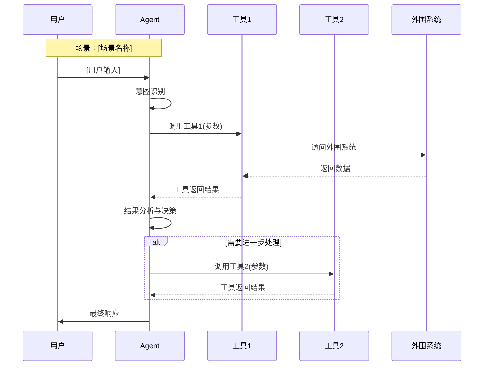

# Agent PRD 模板

> **设计原则**：围绕Agent行为构建，而非功能模块。工具是能力载体，场景是行为契约。

---

# [Agent名称] PRD - [迭代版本号]

## 文档信息

| 字段 | 内容 |
|------|------|
| 文档编号 | PRD-AGENT-[项目代号]-[版本] |
| Agent名称 | [名称] |
| 核心价值 | [一句话价值主张] |
| 迭代目标 | [本次迭代要达成的具体目标] |
| 关联需求 | [用户故事/需求编号] |
| 状态 | 草稿/评审中/已批准 |
| 更新日期 | YYYY-MM-DD |

### 基线引用

> 本PRD基于以下基线版本，仅描述增量变更。

| 基线文件 | 版本 | 路径 |
|---------|------|------|
| 系统提示词 | v[X.X] | `docs/agent-baseline/system-prompt.md` |
| 工具清单 | v[X.X] | `docs/agent-baseline/tools-catalog.md` |
| MCP服务器 | v[X.X] | `docs/agent-baseline/mcp-servers.md`（可选） |

---

## 一、Agent Profile

### 1.1 身份定义

**一句话描述**：[Agent是谁，服务谁，做什么]

**专业领域**：[Agent的专业领域]

**服务对象**：[目标用户群体]

### 1.2 能力边界

| 能做什么 | 不能做什么 |
|----------|------------|
| [能力1] | [限制1] |
| [能力2] | [限制2] |
| [能力3] | [限制3] |

### 1.3 响应风格

- **语气**：[专业/友好/简洁等]
- **格式偏好**：[是否使用列表、表格、代码块等]
- **长度控制**：[简短回复还是详细解释]

---

## 二、提示词变更（增量）

> 仅记录本次迭代相对于上个版本的变更。首版需要完整记录作为基线。

### 2.1 新增内容

```
[新增的提示词片段，标注位置]
```

### 2.2 修改内容

**修改位置**：[原提示词中的位置描述]

```diff
- [旧内容]
+ [新内容]
```

### 2.3 删除内容

```
[删除的提示词片段，说明原因]
```

### 2.4 变更原因

- [为什么要做这个变更]
- [期望解决什么问题]

---

## 三、工具清单

> 每个工具独立描述，采用YAML格式定义输入输出。

### 3.1 [工具名称1]

```yaml
名称: tool_name
描述: "语义化的意图描述，用用户视角表达"
分类: Query/Ingest/Review/Maintain/Insight  # 工具分类

输入:
  required_param:
    类型: string
    说明: 参数说明
    约束: 长度限制、格式要求等
  optional_param:
    类型: string[]
    说明: "[可选] 参数说明"
    默认值: []

输出:
  success:
    类型: bool
    说明: 操作是否成功
  data:
    类型: object
    说明: 返回数据
    结构:
      field1: type  # 字段说明
      field2: type  # 字段说明

封装:
  - "底层API调用1"
  - "底层API调用2（条件触发时）"

特性:
  - 智能行为说明（如自动降级、重试策略等）
  - 默认值和推断逻辑

注意事项:
  - 边界条件处理
  - 错误场景说明
  - 与其他工具的协作关系
```

### 3.2 [工具名称2]

```yaml
# 同上格式...
```

### 3.3 工具变更汇总（迭代用）

| 变更类型 | 工具名 | 变更说明 |
|---------|-------|---------|
| 新增 | [tool_name] | [简要说明] |
| 修改 | [tool_name] | [修改内容] |
| 废弃 | [tool_name] | [废弃原因] |

---

## 四、沉淀 Skills (标准化能力)

> 基于已验证的业务场景提炼的可复用标准链路,实现行为模式的标准化与自动化。

### 📋 Skills 生成说明

**生成依据**: 本章节内容提炼自上一版本中已验证并稳定运行的功能与工具调用链路。

**迭代策略**:

- **当前版本**: 本 PRD 中新增或优化的功能与工具,暂不沉淀为标准化能力,优先验证其可行性与稳定性。
- **下一版本**: 在后续版本评审时,针对本版本中已上线且运行稳定的功能,评估标准化沉淀的可能性与优先级。

**基本原则**:

1. **先验证,后抽象**: 确保每条标准链路均经过真实场景打磨,避免过早抽象导致的适配性问题。
2. **价值导向,非必须项**: 仅当标准化能够带来明确价值(如提升复用性、降低维护成本、增强一致性)时才生成 Skills。若功能场景简单、调用频次低或变化频繁,保持在"典型业务场景"章节即可,无需强行抽象。

---

### 4.1 Skill [序号]: [标准链路名称] (skill_identifier)

**适用场景**: [简要描述该 Skill 应用的业务场景]

**触发条件**: [明确定义何时启动该 Skill]

**标准流程**:

```yaml
skill_name: skill_identifier
description: "标准链路的语义化描述"
trigger: trigger_condition

steps:
  - step_id: S1
    name: 步骤名称
    tool: tool_name (可选,若涉及工具调用)
    input:
      - param1 (required/optional)
      - param2 (required/optional)
    constraints:
      - 约束条件1
      - 约束条件2
    output:
      - output_field1
      - output_field2

  - step_id: S2
    name: 决策步骤名称
    condition: decision_condition
    threshold: 0.XX (如有阈值)
    action:
      - if condition_met:
          trigger: next_action
      - else:
          proceed_to: alternative_step

  - step_id: S3
    name: 人机协作步骤
    trigger_condition: human_intervention_needed
    decision_options:
      - option_a: 行为描述
      - option_b: 行为描述
    default_behavior:
      - 超时或无响应时的默认处理逻辑

quality_gates:
  - 质量门禁1
  - 质量门禁2

rollback_strategy:
  - 步骤失败 → 回滚/降级策略描述

observability:
  - 关键指标监控点
  - 埋点说明
```

**人机协作边界** (如适用):

| 决策点 | 触发条件 | 自动化行为 | 人工行为 | 超时默认 |
|--------|----------|------------|----------|----------|
| [决策点名称] | [条件] | [Agent行为] | [需要人工做什么] | [超时处理] |

**决策阈值总览** (如适用):

| 阈值名称 | 数值 | 触发行为 |
|---------|------|----------|
| [阈值1] | [值] | [行为描述] |

---

### 4.2 Skill [序号]: [另一标准链路名称]

[同上格式...]

---

### 4.X Skills 设计原则

#### 4.X.1 标准化要素

所有 Skill 必须包含以下标准化要素:

1. **明确的触发条件** (Trigger): 何时启动该标准链路
2. **结构化的步骤定义** (Steps): 每步的输入、输出、约束
3. **决策树与阈值** (Decision Tree): 关键分支的判断逻辑
4. **人机协作边界** (Human-in-the-Loop): 哪些环节需人工介入
5. **质量门禁** (Quality Gates): 不满足条件时的阻断机制
6. **兜底策略** (Fallback): 异常情况下的保底行为
7. **可观测性埋点** (Observability): 关键指标的监控与日志

#### 4.X.2 复用性设计

- **子能力抽象**: 将高频复用的能力抽象为独立子单元
- **配置化管理**: 阈值参数化,支持动态调整
- **模板化处理**: 固定话术或流程支持模板配置

#### 4.X.3 灰度与演进

- **A/B 测试支持**: 关键参数支持对比测试
- **降级能力**: 核心服务异常时的降级策略
- **版本管理**: 标准链路支持版本标记与多版本共存

---

## 五、典型业务场景（核心章节）

> 通过完整的对话流程，定义Agent的行为契约。这是PRD最重要的部分。

### 场景1：[场景名称]

**场景描述**：[一句话描述这个场景]

**前置条件**：

- [条件1]
- [条件2]

**时序图**：



**对话示例**：

> 展示真实的多轮对话，体现用户的自然表达和Agent的响应风格。

```
用户: [用户的第一句话，自然语言，可能模糊或不完整]

Agent: [Agent的响应，体现响应风格、格式偏好、信息量]

用户: [用户的追问或补充信息]

Agent: [Agent的后续响应，体现上下文理解]

用户: [用户确认或提出新问题]

Agent: [Agent的最终响应或引导下一步]
```

**对话设计要点**：

- 用户输入要体现**真实表达习惯**（口语化、省略、歧义）
- Agent响应要体现**期望的响应风格**（语气、详略、格式）
- 包含**典型追问场景**（澄清、确认、深入）
- 如有工具调用，可在响应中自然体现结果，无需暴露调用细节

**异常分支**：

| 异常情况 | Agent行为 | 对用户的响应 |
|---------|----------|------------|
| [异常1] | [如何处理] | [响应话术] |
| [异常2] | [如何处理] | [响应话术] |

---

### 场景2：[场景名称]

[同上格式...]

---

## 六、人机协作边界

### 6.1 Agent可自主完成

| 场景 | 自主程度 | 说明 |
|------|---------|------|
| [场景1] | 完全自主 | [无需人工确认] |
| [场景2] | 高度自主 | [仅在异常时告知] |

### 6.2 需要人工确认

| 场景 | 触发条件 | 确认方式 | 默认行为 |
|------|---------|---------|---------|
| [场景1] | [什么时候需要确认] | [如何请求确认] | [用户不响应时的默认处理] |
| [场景2] | [什么时候需要确认] | [如何请求确认] | [用户不响应时的默认处理] |

---

## 七、非功能性要求

### 7.1 响应性能

| 指标 | 目标值 | 说明 |
|------|-------|------|
| 首Token时间 | < [X]ms | 用户感知的响应速度 |
| 简单任务完成 | < [X]s | 单工具调用场景 |
| 复杂任务完成 | < [X]s | 多工具调用场景 |

### 7.2 质量指标

| 指标 | 目标值 | 衡量方法 |
|------|-------|---------|
| 任务完成率 | > [X]% | [如何衡量] |
| 意图识别准确率 | > [X]% | [如何衡量] |
| 用户满意度 | > [X]分 | [如何衡量] |

### 7.3 成本约束

| 指标 | 目标值 |
|------|-------|
| 平均Token消耗 | < [X] tokens/会话 |
| 工具调用次数 | < [X] 次/任务 |
| 单次会话成本 | < [X]元 |

---

## 八、验收场景（简化版）

> 用于验收的关键场景，不是详细测试用例。

| 场景ID | 场景描述 | 期望行为 | 优先级 |
|--------|---------|---------|-------|
| AC-01 | [验收场景1] | [期望的Agent行为] | P0 |
| AC-02 | [验收场景2] | [期望的Agent行为] | P0 |
| AC-03 | [验收场景3] | [期望的Agent行为] | P1 |

---

## 九、UI交互设计（可选）

> 如果Agent有配套UI，在此描述。纯对话Agent可跳过此章节。

### 9.1 核心交互

[UI原型链接或截图]

**交互说明**：

- [交互1说明]
- [交互2说明]

### 9.2 状态展示

| 状态 | UI表现 | 用户操作 |
|------|-------|---------|
| [状态1] | [如何展示] | [可做什么] |
| [状态2] | [如何展示] | [可做什么] |

---

## 十、附录

### 10.1 术语表

| 术语 | 定义 |
|------|------|
| [术语1] | [定义] |
| [术语2] | [定义] |

### 10.2 外围系统依赖

| 系统 | 依赖方式 | 影响 |
|------|---------|------|
| [系统1] | [API/SDK/...] | [不可用时的影响] |
| [系统2] | [API/SDK/...] | [不可用时的影响] |

### 10.3 待决策事项

| 事项 | 选项 | 决策人 | 截止日期 |
|------|------|-------|---------|
| [事项1] | [选项A/B/C] | [谁来决策] | [日期] |

### 10.4 变更历史

| 版本 | 日期 | 变更内容 | 作者 |
|------|------|---------|------|
| v1.0 | YYYY-MM-DD | 初始版本 | [作者] |
| v1.1 | YYYY-MM-DD | [变更说明] | [作者] |

---

# 模板使用指南

## 0. 文件组织结构

```
docs/
├── agent-baseline/              # 全量基线（独立维护）
│   ├── system-prompt.md         # 完整系统提示词
│   ├── tools-catalog.md         # 全量工具清单
│   └── mcp-servers.md           # MCP服务器配置（可选）
│
├── prd/                         # PRD文档（按版本）
│   ├── PRD-AGENT-XXX-v1.0.md    # 首版PRD
│   ├── PRD-AGENT-XXX-v1.1.md    # 迭代PRD
│   └── ...
│
└── templates/                   # 模板（本目录）
    ├── agent-prd-template.md
    └── agent-baseline/
        ├── system-prompt.md
        ├── tools-catalog.md
        └── mcp-servers.md
```

**核心原则**：

- `agent-baseline/` 维护全量信息，AI生成PRD时参考
- `prd/` 存放各版本PRD，只记录增量变更
- 基线文件随PRD迭代同步更新，保持版本对应

## 1. 首版PRD vs 迭代PRD

| 章节 | 首版 | 迭代版 |
|------|------|-------|
| Agent Profile | 完整填写 | 仅当有变化时更新 |
| 提示词 | 完整记录（作为基线） | 仅记录增量变化 |
| 工具清单 | 完整列出所有工具 | 完整列出+标注变更 |
| 沉淀 Skills | 无（首版无历史可沉淀） | 提炼上一版本稳定功能 |
| 典型场景 | 核心场景（3-5个） | 新增/修改的场景 |
| 验收场景 | 完整列出 | 本次迭代相关的 |

## 2. 重点章节填写建议

**工具清单**：

- 用语义化命名（`ask_knowledge` 而非 `query_kb`）
- 输入输出要写清楚类型和约束
- "封装"说明底层调用，便于开发理解
- "注意事项"是给Agent的使用指南

**典型业务场景**：

- 这是PRD最核心的部分，要花最多精力
- 时序图展示宏观流程
- 对话示例展示Agent的"思考-行动-响应"过程
- 异常分支不能漏，这往往是开发容易忽略的

## 3. 与传统PRD的本质区别

| 维度 | 传统PRD | Agent PRD |
|------|--------|-----------|
| 核心 | 功能模块、页面流程 | 意图识别、工具调用、响应生成 |
| 交互定义 | UI原型、交互稿 | 对话示例、时序图 |
| 需求粒度 | 按功能点 | 按业务场景 |
| 边界定义 | 通过UI限制 | 通过提示词和工具限制 |
| 迭代方式 | 功能增删改 | 提示词调优、工具扩展、场景覆盖 |

---

**模板版本**: v1.0
**创建日期**: 2025-12-05
**作者**: Claude + 用户协作
