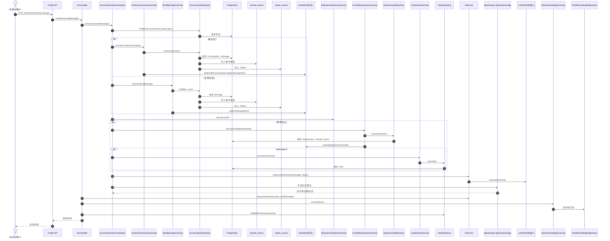

# IM 链路与时序图（代码对齐）

**版本**：v2.0（拆分版）  
**最后更新**：2026-02-05

## 接口前缀说明

- 业务通用接口：完整前缀 `/api/v1/api`（路由内自带 `/api`）
- IM/质量/客户画像接口：完整前缀 `/api/v1`
- 健康检查/监控/MCP/AgentScope 网关：不加 `/api/v1`（如 `/health`、`/metrics`、`/mcp`、`/agentscope/*`）

## 当前对话入口策略（2026-01-26）

1. 客服主动发送
- 入口：`/api/v1/api/conversations/:id/messages`
- 行为：仅落库与事件记录，不通过 Agent 生成回复

2. 外部 IM 入站消息
- 入口：`/api/v1/im/incoming-message`
- 行为：走 Agent 辅助链路（情绪/意图分析、知识推荐、回复建议等）

## IM 入站核心链路（时序图）

**说明**
- 入口：`/api/v1/im/incoming-message`
- 核心编排：`ImController` → `ConversationTaskCoordinator`
- 数据落库：`conversations/messages` + `domain_events` + `outbox_events`
- AI 联动：情绪分析、回复建议、知识检索

## IM 接口清单（以路由实现为准）

- 会话与消息
  - `GET /api/v1/im/conversations`
  - `GET /api/v1/im/conversations/stats`
  - `GET /api/v1/im/conversations/:id/messages`
  - `POST /api/v1/im/conversations/:id/messages`
  - `GET /api/v1/im/conversations/:id/problems`
  - `PATCH /api/v1/im/conversations/:id/status`
  - `PATCH /api/v1/im/conversations/:id/mode`

- 测试/联调
  - `POST /api/v1/im/wecom/mock/sync`

- AI 与情绪分析
  - `GET /api/v1/im/conversations/:id/ai-analysis`
  - `GET /api/v1/im/conversations/:id/sentiment`

- 质检接口
  - `GET /api/v1/quality/:conversationId`
  - `GET /api/v1/quality/:conversationId/reports`
  - `GET /api/v1/quality/reports`

- 客户画像
  - `GET /api/v1/profiles/:customerId`
  - `GET /api/v1/profiles/:customerId/interactions`

## 权限要求（最小集合）

- IM 读权限：`im.read`
- IM 写权限：`im.write`
- 客户画像权限：`customers.read`
- 质检权限：`tasks.read`
- AI 能力权限：`ai.use`
