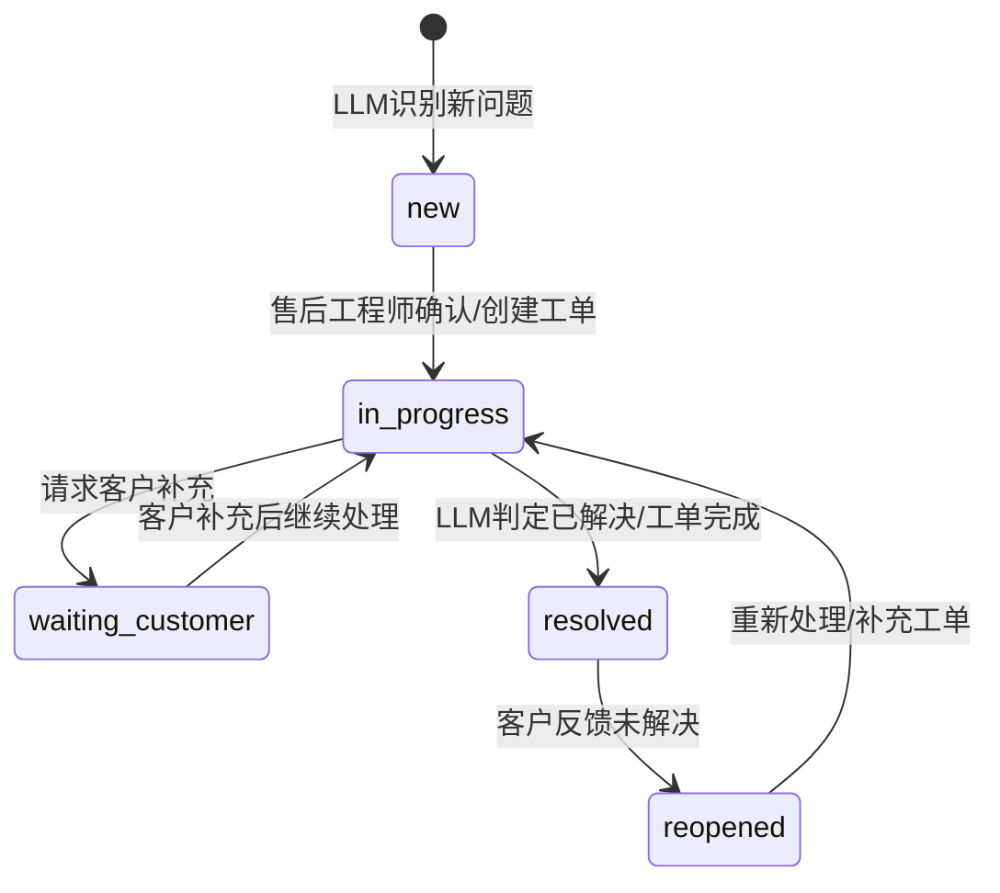

# 质检与复核（代码对齐）

**版本**：v2.0（拆分版）  
**最后更新**：2026-02-05

## IM 渠道本质特性

- IM 对话永久存在，不支持关闭操作
- 质检触发基于 **问题解决**（`ProblemResolvedEvent`），而非会话关闭
- 同一对话可并行多个问题，每个问题独立状态流转

## 问题 resolved 触发条件

**入口**：`ConversationTaskCoordinator.updateProblemLifecycle()`  
**判定方法**：`AiService.detectProblemResolution()`（LLM + 关键词兜底）

**触发逻辑（简化）**：
- 存在 `activeProblem` 且 `resolution.resolved === true` → 更新为 `resolved`
- 不存在 `activeProblem` 且存在 `latestResolved` 且 `resolution.reopened === true` → 更新为 `reopened`
- 无法判断（resolved/reopened 均为 false）→ 状态不变

**关键词兜底**：
- resolved：`问题.*解决|解决.*问题|已.*解决|感谢.*解决|已恢复|已修复`
- reopened：`没解决|未解决|还是.*问题|仍然.*(报错|错误|异常)|依旧.*(失败|无法)`

## 质检触发与落库

**触发入口（IM）**：
- `ProblemResolvedEventHandler` 触发 `/api/agents/inspect`
- 日志：`[ProblemResolvedEventHandler] Triggering quality inspection...`

**触发入口（非 IM）**：
- `ConversationTaskCoordinator.handleConversationClosed`
- 日志：`[ConversationTaskCoordinator] Triggering quality inspection for non-IM conversation...`

**落库位置**：
- `QualityReportRepository.save(...)` → `quality_reports`

**数据读取入口**：
- `GET /api/v1/quality/:conversationId`
- `GET /api/v1/quality/:conversationId/reports`
- `GET /api/v1/quality/reports`

**排查顺序**：
1. 是否产生 `ProblemResolvedEvent`
2. Handler 是否触发 `/api/agents/inspect`
3. AgentScope 是否返回 `success`
4. `quality_reports` 是否落库
5. 前端是否拉取到质检报告

## 实时推送与复核

**当前可用：SSE（ReviewRequest）**
- `GET /api/v1/im/reviews/stream`：SSE 订阅
- `GET /api/v1/im/reviews/pending`：查询待复核列表
- `POST /api/v1/im/reviews/submit`：人工复核回写

**当前不可用：WebSocket**
- `WebSocketService` 存在但未注册到 app（无 WS 推送）
- 结论：质检结果不通过 WS 推送，需前端主动拉取

## 前端质检面板刷新机制

- 数据来源：`GET /api/v1/quality/:conversationId`
- 触发时机：进入面板或切换会话时加载
- 刷新方式：无 WS 推送；页面内只在“打开/切换/手动操作”时请求
- 若无质检报告：后端回退到 AI 分析

## 问题状态机（IM 对话内）

